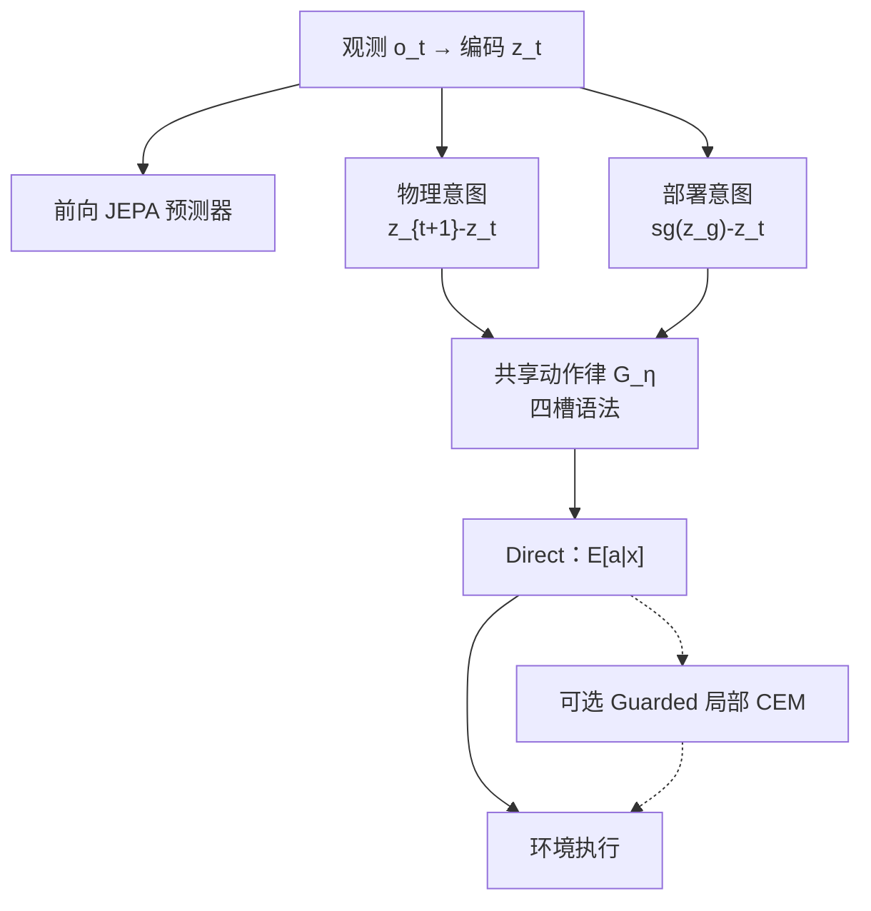

# INTACT（Search-Free Intent-to-Action World Model）

**INTACT**（*Isomorphic Intent-to-Action Learning for Search-Free World Models*，[arXiv:2607.26056](https://arxiv.org/abs/2607.26056)，[项目页](https://zju3dv.github.io/INTACT-JEPA/)，[规范仓](https://github.com/zju3dv/INTACT-JEPA)，[RoboParty 镜像](https://github.com/Roboparty/INTACT-JEPA)）由 **浙江大学（ZJU）** CAD&CG、**清华大学（Tsinghua）AIR**、InSpatio 与 **[机器人派对（RoboParty）](./roboparty.md) Lab**（[lab.roboparty.com](https://lab.roboparty.com/)）提出：把前向 latent 世界模型从「预测 + 测试时搜索反解动作」改成端到端 **意图→动作律** 接口。共享预测器在物理意图与部署意图上同构调用；**条件均值** 即零搜索策略，Direct 推理 **2.9–5.5 ms**（相对宽搜索 CEM 约 **300×**）。

## 一句话定义

**一种端到端 JEPA：用同一四槽语法与共享动作律预测器，把观测到的物理变化与停梯度目标位移都映射成可直接执行的动作分布，从而在部署时省去宽搜索 CEM。**

## 英文缩写速查

| 缩写 | 英文全称 | 简要说明 |
|------|----------|----------|
| INTACT | INtent-To-ACTion | 本文方法：意图到动作的同构学习 |
| JEPA | Joint-Embedding Predictive Architecture | 表征空间预测式世界模型族 |
| LeWM | Latent Embedding World Model | 官方四任务评测基座；学「动作→效果」的前向对照 |
| CEM | Cross-Entropy Method | 测试时动作序列搜索；本文要削弱的对象 |
| Direct | Conditional-mean controller | 无搜索策略：取动作律条件均值 |
| Guarded A | Local CEM around Direct | 可选小预算局部验证 |
| SIGReg | Signal / representation regularizer | 防表征坍塌的正则（文中设定） |

## 为什么重要

- **补上前向 WM 的另一半：** [LeWM](./paper-lewm.md) 类模型学会预测「动作会产生什么效果」；INTACT 进一步学「为了实现意图应执行什么动作」，闭合表征–控制不对称。
- **延迟可读：** Direct **毫秒级**（约 **2.9–5.5 ms**），相对上千候选 CEM（约秒级，叙事约 **300×**）更贴 [实时性边界](../concepts/embodied-fm-latency-generalization-tradeoff.md)。
- **与分解式 WM 互补：** [DWM Separating](./paper-dwm-separating-world-effects.md) 改训练期世界/动作效应；INTACT 改 **逆问题接口**（意图读出）。
- **多任务共享编码器：** 一四任务编码器仍提升每域，说明意图坐标可跨任务复用。
- **Lab 联署：** 与 [RoboParty Lab / Party OS](../overview/roboparty-lab-party-os-technology-map.md) 的 World Model 方向对齐；组织镜像便于从 [Roboparty](https://github.com/Roboparty) 导航。

## 核心信息

| 项 | 内容 |
|----|------|
| **机构** | 浙江大学（ZJU）；清华大学（Tsinghua）AIR；InSpatio；机器人派对（RoboParty）Lab |
| **评测** | 官方 LeWM 四任务 |
| **Direct 宏 SR** | 约 **95.33%**（一 epoch，零搜索） |
| **推理延迟** | **2.9–5.5 ms**（Direct；相对宽搜 CEM 约 **300×**） |
| **开源** | **部分开源**：规范仓 + RoboParty fork 文档已上；训练/权重 **Coming Soon** |

## 核心原理

### 方法栈

| 模块 | 作用 |
|------|------|
| 前向 JEPA | 保留可滚出的动力学/接触/视觉信息（「动作→效果」） |
| 物理意图调用 | \(m=z_{t+1}-z_t\)，梯度附着，接地可达变化 |
| 部署意图调用 | \(m=\mathrm{sg}(z_g)-z_t\)，目标停梯度（「意图→动作」） |
| 四槽语法 | \([z_t,\,m_t,\,z_t\odot m_t,\,A(a_{t-1})]\) 共享 \(G_\eta\) |
| Direct / Guarded | 条件均值策略；可选以 Direct 为中心的局部 CEM |

### 流程总览

关键直觉：两路意图 **不** 做端点匹配，而是强迫它们诱导 **同一专家动作律**；于是部署时只需给出目标位移意图，即可读出动作，而无需在动作空间撒网搜索。

## 源码运行时序图

**不适用（可运行训练/推理入口尚未发布）。** 截至 2026-07-30：规范仓 `zju3dv/INTACT-JEPA` 与镜像 `Roboparty/INTACT-JEPA` 提供方法/结果/复现文档与 MIT LICENSE，但 `docs/RELEASE.md` 将训练代码与 checkpoint 标为 Stage 2+ **Coming Soon**。仓库存在后应补：`train` → 编码/双意图 NLL → `Direct` 评测 →（可选）Guarded CEM 的 `sequenceDiagram`。

## 工程实践

| 项 | 建议 / 论文设定 |
|----|----------------|
| 单任务协议 | 一 epoch，bs 256，AdamW \(5\times10^{-4}\)；三 seed |
| 损失权重 | forward 1.0 / inverse 0.1 / goal 0.05（文中单任务表） |
| Direct | 默认部署：取条件均值，**零候选** |
| Guarded | 384 序列局部 CEM（相对 9000 约 **23.44×** 少） |
| 诊断 | predicted–expert action-family kNN 应与 Direct SR 同向（\(r\sim0.95\)） |
| 复现现状 | **等官方 Stage 2 代码**；规范仓锚定版本，RoboParty fork 仅作 Lab 导航 |

## 实验与评测

- **单任务 Direct：** 四任务 **85.78% / 100% / 97.67% / 97.89%**；宏约 **95.33%**。
- **Guarded：** 宏 **96.86%**，并相对纯 CEM **+16.00 pp**（采样更少）。
- **匹配审计（Cube）：** INTACT Direct **98.7%** vs LeWM CEM **67.0%**（**+31.7 pp**）。
- **共享编码器：** E5 Direct 宏 **89.39%**，逐任务优于联合训练 LeWM。
- **延迟：** Direct **2.9–5.5 ms** vs CEM \(300\times30\) 约 **1.48 s**（约 **300×**；项目叙事）。

## 结论

**INTACT 把世界模型的「逆问题」从测试时搜索改成训练期可学的意图–动作律同构接口；真影响指标是零搜索成功率与毫秒级延迟，而不是再堆 CEM 候选数。**

1. **真影响：共享四槽语法** — 物理与部署意图走同一 \(G_\eta\)，避免「只学 BC、丢前向」或「只学前向、部署靠搜」。
2. **真影响：Direct 条件均值** — 一 epoch 即达约 95% 宏 SR，延迟毫秒级（相对规划式控制约 **300×**）。
3. **真影响：Guarded 可选** — 小预算局部搜索锦上添花，而非主路径。
4. **次要代价：示范支撑上的动作商** — 分布外意图族无保证。
5. **部署读法：先看 Direct，再决定是否开 Guarded** — 带宽紧时默认关搜索。
6. **工程读法：代码 Coming Soon** — 当前适合理论/指标选型；完整复现等 Stage 2；镜像勿当独立实现。

## 与其他工作对比

| 对照 | 差异读法 |
|------|----------|
| LeWM + CEM | 前向「动作→效果」+ 宽搜索；INTACT 学意图读出 |
| 逆动力学 / 目标条件 BC | 缺物理意图接地或共享语法；INTACT 双调用耦合 |
| [V-JEPA 2](./paper-vjepa2.md) | 大规模视频 JEPA + latent 规划；INTACT 聚焦控制接口同构 |
| [DWM Separating](./paper-dwm-separating-world-effects.md) | 分解世界/动作效应；INTACT 分解「前向 vs 意图→动作」 |
| 视频–动作统一模型 | 偏生成式联合分布；INTACT 偏 latent 动作律 |

## 局限与风险

- **代码未就绪：** 文档仓 ≠ 可复现训练；数字以论文/RESULTS 审计为准。
- **多模态动作：** Direct 高斯均值可能抹平多峰动作律。
- **gauge / 流形：** 意图等价依赖任务流形与容差。
- **三 seed：** 扩展方差估计粗糙。
- **评测域：** 官方 LeWM 四任务；迁到真机双臂/人形需另证。

## 关联页面

- [LeJEPA](./paper-lejepa.md) / [LeWM](./paper-lewm.md) / [LpWM](./paper-lpwm.md) — 官方四任务评测基座与同一作者族的表征先验
- [DWM Separating World Effects](./paper-dwm-separating-world-effects.md) — LeWM 族训练期分解对照
- [V-JEPA 2](./paper-vjepa2.md) — JEPA 规划中间路线
- [RoboParty](./roboparty.md) — Lab 联署与组织镜像入口
- [RoboParty Lab / Party OS 技术地图](../overview/roboparty-lab-party-os-technology-map.md) — World Model 方向挂接
- [生成式世界模型](../methods/generative-world-models.md) — WM 方法入口
- [模型基强化学习](../methods/model-based-rl.md) — 规划/搜索传统
- [物理保真输出轴](../overview/world-model-physics-fidelity-outputs.md) — 策展阅读轴
- [World Action Models](../concepts/world-action-models.md) — 动作耦合 WM/WAM
- [具身大模型实时性↔泛化取舍](../concepts/embodied-fm-latency-generalization-tradeoff.md) — 毫秒级 Direct 的带宽含义
- [FB / BFM-Zero / INTACT / Mimic / VLA 任务空间表征对比](../comparisons/fb-bfm-zero-intact-mimic-vla-task-space.md) — Goal-Reach 子空间相对 FB 球与 Mimic 曲线的对照

## 参考来源

- [INTACT 论文摘录（arXiv:2607.26056）](../../sources/papers/intact_arxiv_2607_26056.md)
- [项目页归档](../../sources/sites/intact-jepa-github-io.md)
- [规范仓归档](../../sources/repos/intact-jepa.md)
- [RoboParty 镜像归档](../../sources/repos/roboparty-intact-jepa.md)
- [RoboParty Lab 门户](../../sources/sites/lab_roboparty_com.md)
- [arXiv:2607.26056](https://arxiv.org/abs/2607.26056)
- [GitHub: zju3dv/INTACT-JEPA](https://github.com/zju3dv/INTACT-JEPA)
- [GitHub: Roboparty/INTACT-JEPA](https://github.com/Roboparty/INTACT-JEPA)

## 推荐继续阅读

- 项目页与短片：<https://zju3dv.github.io/INTACT-JEPA/>
- RoboParty Lab：<https://lab.roboparty.com/>
- 仓内 [docs/METHOD.md](https://github.com/zju3dv/INTACT-JEPA/blob/main/docs/METHOD.md)
- LeWM / stable-worldmodel 生态与 CLEAR-LeWM 评测器（官方 README 引用）
