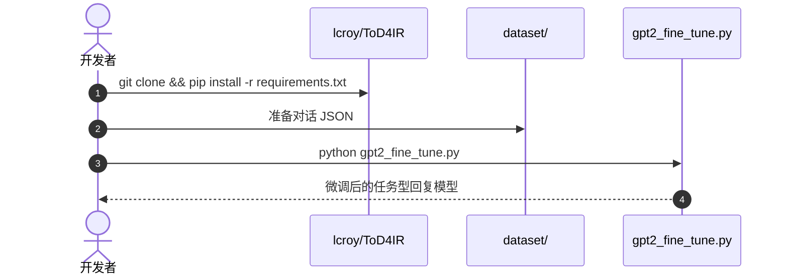

# IRWOZ 2.0：工业机器人对话数据集

**IRWOZ 2.0**（*A Large Language Model-driven Dialogue Dataset for Industrial Robot Conversations*，[arXiv:2609.04030](https://arxiv.org/abs/2609.04030)）由 **奥尔堡大学（Aalborg University）** Chen Li、Dimitrios Chrysostomou 提出：初版 IRWOZ 推动了工业人机交互（HRI）对话研究，但 dialogue states 与 utterances 噪声大，限制状态跟踪精度。2.0 用 **Mistral / Claude-3.5** 增强生成，再叠加质量优化、人工修正和自动错别字移除，扩展到 **4 个工业域、390 段对话**。

## 一句话定义

**工业机器人要听懂人，先要有低噪声、领域化、可复现的任务型对话数据。**

## 英文缩写速查

| 缩写 | 英文全称 | 简要说明 |
|------|----------|----------|
| IRWOZ | Industrial Robot Wizard-of-Oz | 工业机器人 Wizard-of-Oz 对话数据族 |
| HRI | Human-Robot Interaction | 人机交互 |
| DST | Dialogue State Tracking | 对话状态跟踪 |
| ToD4IR | Task-Oriented Dialogue for Industrial Robots | 2022 配套对话系统仓 |

### 数据集速查

| 维度 | 内容 |
|------|------|
| 规模 | 390 段对话；4 个工业域 |
| 模态 | 文本对话 + dialogue state 标注（非视觉/运动） |
| 许可证 | IEEE Dataport 发布；以平台页为准 |
| 重定向就绪度 | 不适用（语言槽位数据，无人体/机器人运动轨迹） |

## 为什么重要

- 纳入 [九篇盘点](../../sources/blogs/wechat_embodied_station_9_papers_open_source_2026-09-04.md) 的「开放数据」支线。
- 把工业 HRI 从「能聊」推进到「状态可训练」。
- 明确 BLEU-4 对照，避免只看对话条数。

## 方法

| 项 | 内容 |
|----|------|
| **机构** | 奥尔堡大学 |
| **规模** | 390 段；Assembly / Delivery / Position / Relocation |
| **生成** | Mistral / Claude-3.5 + 人工修正 |
| **开源** | **部分开源**：IEEE Dataport 数据 + 旧仓 `lcroy/ToD4IR` |

### 流程总览

## 评测

| 设置 | 指标 | 原始 IRWOZ | IRWOZ 2.0 |
|------|------|------------|-----------|
| GPT-2 基准 | BLEU-4 | 0.1651 | **0.5604** |

论文将数据集放在 IEEE Dataport；公众号另链 `lcroy/ToD4IR` 的 `dataset/` 目录。

## 结论

**工业对话系统的第一瓶颈往往是标注噪声，不是再换一个更大的解码器。**

1. **先修状态再堆模型** — BLEU-4 跳升主要来自数据清洗。
2. **四域覆盖** — Assembly/Delivery/Position/Relocation 比开放闲聊更接近产线。
3. **LLM 生成必须人工兜底** — 2.0 强调修正与错别字移除。
4. **旧仓 ≠ 新栈** — ToD4IR 最近推送停在 2022，勿当 2.0 官方训练框架。
5. **和失败检测互补** — 听懂指令之后仍要判执行成败，见 [FailBench](./paper-failbench.md)。

## 源码运行时序图

旧仓可跑 GPT-2 / GPT-Neo 微调，但服务的是 ToD4IR 而非 2.0 完整新栈：

IRWOZ 2.0 官方数据包以 IEEE Dataport 为准。

## 工程实践

| 项 | 建议 |
|----|------|
| 数据入口 | 论文 Dataport 链接优先于 2022 仓 |
| 指标 | 同时看 DST 精度与 BLEU，勿只报流畅度 |
| 部署 | 对话层与运动控制层分开，对照 [LLM 控制接口](../concepts/llm-robotics-control-interfaces.md) |

## 局限与风险

- **BLEU 不是任务成功** — 回复像人 ≠ 机器人做对。
- **域窄** — 四个工业意图，不能外推到家庭闲聊。
- **旧仓停更** — 依赖 GPT-2 / GPT-Neo 时代脚本。

## 与其他工作对比

| 对照 | 差异读法 |
|------|----------|
| 开放域对话数据 | 缺工业槽位与状态；IRWOZ 面向产线意图 |
| 纯 LLM 现场生成 | 无稳定 DST 监督；2.0 先把数据修干净 |
| [FailBench](./paper-failbench.md) | 评执行成败；本页评「听懂指令」的数据基础 |

## 关联页面

- [LLM 机器人控制接口](../concepts/llm-robotics-control-interfaces.md)
- [Manipulation](../tasks/manipulation.md)
- [开源可复现性 9 篇地图](../overview/open-source-reproducibility-9-papers-technology-map.md)

## 参考来源

- [irwoz_2_arxiv_2609_04030](../../sources/papers/irwoz_2_arxiv_2609_04030.md)
- [lcroy/ToD4IR](../../sources/repos/lcroy-tod4ir.md)
- [具身智能小站 2026-09-04 九篇盘点](../../sources/blogs/wechat_embodied_station_9_papers_open_source_2026-09-04.md)

## 推荐继续阅读

- [arXiv:2609.04030](https://arxiv.org/abs/2609.04030)
- [ToD4IR GitHub](https://github.com/lcroy/ToD4IR)
