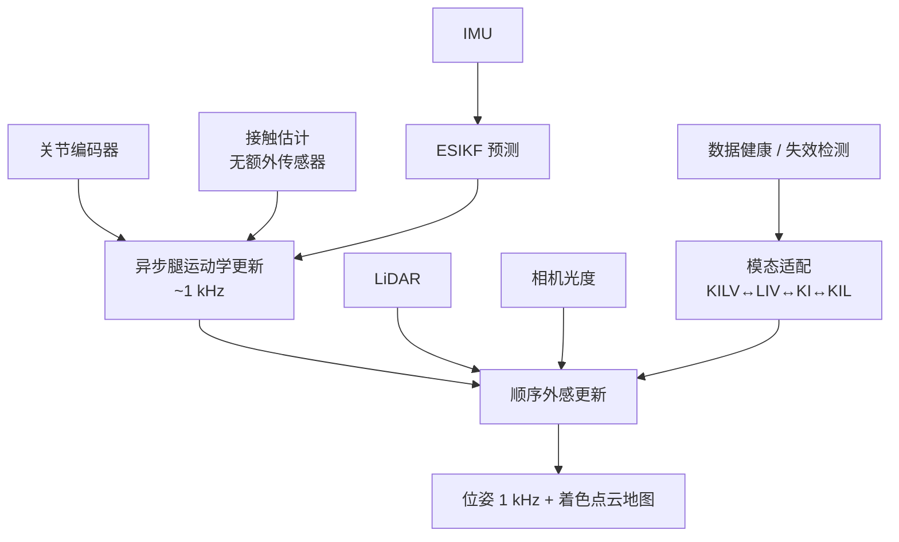

# KILVO：人形多传感器运动学–惯性–激光–视觉里程计

**KILVO**（*Kinematic-Inertial-LiDAR-Visual Odometry with Robust Multimodal Adaptation for Humanoid Robots*，[arXiv:2608.05647](https://arxiv.org/abs/2608.05647)，[GitHub](https://github.com/JixinGao/KILVO)）由 **哈尔滨工业大学机器人技术与系统全国重点实验室** 的 Jixin Gao、Fucheng Liu、Teng Zhang、Fusheng Zha（通讯）提出，发表于 **IEEE/ASME Transactions on Mechatronics**：在异步–顺序混合 **ESIKF** 中紧耦合关节编码器、IMU、LiDAR 与相机，配套无额外传感器的接触估计与模态失效自适应，面向人形冲击、退化与掉传感器场景。

## 一句话定义

**用「IMU 预测 + 腿运动学高率异步更新 + LiDAR→视觉顺序外感更新」的混合滤波器，在人形常见传感器失效时自动降级模态，仍尽量维持高精度、高频率定位与着色建图。**

## 英文缩写速查

| 缩写 | 英文全称 | 简要说明 |
|------|----------|----------|
| KILVO | Kinematic-Inertial-LiDAR-Visual Odometry | 本文多传感器里程计框架 |
| ESIKF | Error-State Iterated Kalman Filter | 误差状态迭代卡尔曼滤波后端 |
| LIO | LiDAR-Inertial Odometry | 激光–惯性里程计基线族 |
| ATE / RTE | Absolute / Relative Translation Error | 公共集轨迹误差指标 |
| GRF | Ground Reaction Force | 接触真值/对照常用地面反力 |
| IMU | Inertial Measurement Unit | 预测步惯性传感 |

## 为什么重要

- **人形特化：** 垂直运动链、低冗余接触与步态冲击放大噪声；轮式/通用 LIO 栈常缺腿运动学与接触。
- **失效是常态：** 碰撞、跌倒、强光/无纹理墙、点云退化——非弹性系统会整段崩。
- **接触不另挂硬件：** 复用运动学/惯性/地图线索，利于 G1 等无足底力传感器平台。
- **工程指标齐全：** 精度、时延、1 kHz 输出、模态消融与失效注入实验一并给出。
- **零偏不是出厂常数：** ESIKF 把 IMU 零偏当状态在线更新；量产「出厂体检」里这张单子的读法见 [闭环惯量标定](../concepts/humanoid-closed-loop-inertia-calibration.md)（公众号把 KILVO 写成零偏在线标定，主贡献仍是多传感器里程计）。

## 核心信息

| 项 | 内容 |
|----|------|
| **作者** | Jixin Gao、Fucheng Liu、Teng Zhang、Fusheng Zha（通讯） |
| **机构** | 哈尔滨工业大学（HIT）机器人技术与系统全国重点实验室 |
| **发表** | IEEE/ASME Transactions on Mechatronics（DOI: 10.1109/TMECH.2026.3721778） |
| **传感器** | 关节编码器、IMU、LiDAR、相机（标准人形配置） |
| **数据** | 公共 LIKO / HR²-KILO；自采 15 序列（含 Unitree G1 等） |
| **开源** | **代码待开放** — 仓 [JixinGao/KILVO](https://github.com/JixinGao/KILVO) 仅占位 README（复核日 2026-08-11） |

## 核心原理

### 方法栈

| 模块 | 机制 |
|------|------|
| 预测 | IMU 误差状态预测 |
| 异步更新 | 腿运动学多约束残差，高率（目标 **1 kHz**） |
| 顺序外感 | 先 LiDAR 点云配准几何先验，再视觉光度误差 |
| 接触估计 | 脚–地 patch / 速度线索等；无额外力传感；~0.02 ms |
| 模态适配 | 数据健康检查 → KILV / LIV / KI / KIL 等降级与恢复 |

### 流程总览

## 源码运行时序图

**不适用（官方可运行代码尚未发布）。** 截至 2026-08-11 复核：仓库 README 仍写「code and datasets would be available soon」，根目录无实现。发布后应补：rosbag/数据集回放 → ESIKF 异步–顺序更新 → 轨迹/地图输出的 `sequenceDiagram`。

## 工程实践

| 项 | 建议 / 论文设定 |
|----|----------------|
| 何时用 | 人形需 **腿运动学 + LIO/VIO** 且担心传感器中断/退化时 |
| 对照基线 | FAST-LIO2、FAST-LIVO2、LIO-SAM、LIKO、HR²-KILO、R3LIVE |
| 接触 | 优先复用估计器内部线索；勿只靠 GRF 阈值（软地/急停易失效） |
| 失效演练 | 注入丢编码/LiDAR/图像片段，检查是否平滑降级而非发散 |
| 复现现状 | **等代码与数据集**；先读 Table IV–VI 做选型 |

## 实验与评测

- **LIKO 公共集：** 平均 ATE RMSE **0.0151 m**（5 序中 3 序最优）；RTE 全序领先。
- **HR²-KILO 集：** Z 轴端到端多 **<1 cm**。
- **真机 15 序：** 端到端平移平均 **0.0145 m**（表内最佳均值）；robust 序列相对纯 LIO 大幅更稳。
- **接触：** 多数序列准确率 >95%，平均 FPR 3.67%；相对 HRC 接触模块约 **76%** 时延改善。
- **失效恢复：** 分段丢传感器后仍可完成任务（例：robust h02* 端到端约 0.0165 m）。
- **效率：** 完整处理约十余 ms；异步阶段支撑 **1 kHz** 输出。

## 结论

**KILVO 的工程价值在于「人形传感器全集 + 可降级紧耦合」：精度数字重要，但更关键的是冲击、退化与掉传感器时仍能给出可用高频状态。**

1. **真影响：异步–顺序混合** — 运动学高率与外感更新解耦，兼顾 1 kHz 与多传感紧耦合。
2. **真影响：模态自适应** — 失效不是「整系统挂掉」，而是降到 LIV/KI/KIL。
3. **真影响：内生接触** — 无足底力计平台也可约束腿运动学。
4. **次要代价：视觉对冲击敏感** — 曝光/模糊限制下，视觉贡献不稳定，需靠多源互补。
5. **部署读法：** 先看是否具备编码器+IMU+LiDAR(+相机)；缺一仍可跑降级模态。
6. **工程读法：代码占位** — 论文已接收，但复现入口未开；选型先对照 FAST-LIVO2/HR²-KILO。

## 与其他工作对比

| 对照 | 差异读法 |
|------|----------|
| [FAST-LIO](./fast-lio.md) / FAST-LIO2 | 强 LIO；缺腿运动学与人形接触；输出率受 LiDAR 帧率限 |
| LIKO / HR²-KILO | 同作者脉络的运动学–LIO；KILVO 补视觉顺序更新与更完整模态适配 |
| FAST-LIVO2 / R3LIVE | 强 LIVO；人形冲击与接触约束仍非一等公民 |
| 纯本体感 ESKF | 高率低算力，长时漂；KILVO 用外感压漂 |

## 局限与风险

- **代码与数据未开放：** 论文写 released，仓为 coming soon——以核查日仓内容为准。
- **标定与同步敏感：** 多传感器时间戳/外参误差会直接进紧耦合残差。
- **滑移与活动地砖：** 接触/运动学假设被破坏时，需依赖外感与适配逻辑兜底。
- **非回环 SLAM：** 主叙事是里程计式估计；长时全局一致仍可能需上层回环。

## 关联页面

- [里程计–激光融合定位](../methods/lidar-odometry-fusion.md) — 课程级融合母页
- [LiDAR SLAM / LIO / VIO 选型](../comparisons/lidar-slam-lio-vio-selection.md) — 开源实现选型
- [FAST-LIO](./fast-lio.md) — LIO 强基线
- [传感器融合](../concepts/sensor-fusion.md) — 概念层
- [EKF](../formalizations/ekf.md) — 滤波形式化
- [导航·SLAM 栈总览](../overview/navigation-slam-autonomy-stack.md) — 上层衔接
- [Unitree G1](./unitree-g1.md) — 文中数据采集平台之一
- [人形整机闭环惯量标定](../concepts/humanoid-closed-loop-inertia-calibration.md) — IMU 零偏作为在线状态，而不是一次性台架常数

## 参考来源

- [kilvo_arxiv_2608_05647.md](../../sources/papers/kilvo_arxiv_2608_05647.md) — 论文摘录与开源核查
- [kilvo.md](../../sources/repos/kilvo.md) — 官方仓占位核查
- [arXiv:2608.05647](https://arxiv.org/abs/2608.05647) — 原文
- [DOI:10.1109/TMECH.2026.3721778](https://doi.org/10.1109/TMECH.2026.3721778) — 期刊版本

## 推荐继续阅读

- [KILVO GitHub（占位）](https://github.com/JixinGao/KILVO)
- [KILVO PDF](https://arxiv.org/pdf/2608.05647)
- [FAST-LIO2 论文](https://github.com/hku-mars/FAST_LIO) — LIO 工程对照
