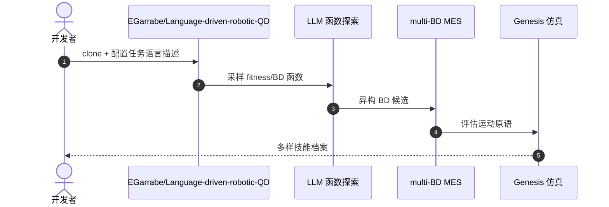

# Language-Driven Quality-Diversity（语言驱动 QD 技能档案）

**Language-Driven QD**（*Autonomously Acquiring Robot Manipulation Skills with Language-Driven Quality-Diversity*，[arXiv:2608.30983](https://arxiv.org/abs/2608.30983)，[代码](https://github.com/EGarrabe/Language-driven-robotic-QD)）提出：仅用 **自由形式自然语言任务描述**，自动探索 **适应度（fitness）** 与 **行为描述符（BD）** 函数空间，结合 **multi-BD MAP-Elites success（MES）** 生成 **多样运动原语档案**，弥补经典 QD 需专家手写度量、LLM 奖励塑形只出单解的两端缺口。

## 一句话定义

**部署要多样技能档案时，让语言描述任务，让 LLM 探索「什么叫成功、什么叫不同」，而不是手写 QD 度量或只训一个最优策略。**

## 英文缩写速查

| 缩写 | 英文全称 | 简要说明 |
|------|----------|----------|
| QD | Quality-Diversity | 同时优化质量与行为多样性，产出技能档案 |
| BD | Behavior Descriptor | 行为描述符，刻画解在行为空间的分布 |
| MES | MAP-Elites Success | multi-BD 版 MAP-Elites，利用异构 BD 样本 |
| LLM | Large Language Model | 用于自动采样 fitness/BD 函数空间 |

## 为什么重要

- 纳入 [具身智能小站 2026-09-01 七篇盘点](../../sources/blogs/wechat_embodied_station_7_papers_open_source_system_loop_2026-09-01.md) 的「语言 → 可调用技能库」支线。
- **零样本部署适应** 需要多样原语库，而非单点最优。
- Genesis 仿真 **四操作任务** 上优于推断或手写参数化的经典 QD。
- **已开源** 官方仓库。

## 核心信息

| 项 | 内容 |
|----|------|
| **作者** | Émiland Garrabé, Mahdi Khoramshahi, Stéphane Doncieux |
| **仿真** | Genesis |
| **任务数** | 4 个机器人操作任务 |
| **开源** | **已开源** [EGarrabe/Language-driven-robotic-QD](https://github.com/EGarrabe/Language-driven-robotic-QD) |

### 流程总览

## 评测

- 四操作任务上 **优于** 经典 QD（推断或手写 fitness/BD 参数化）。
- 档案多样性支持部署期约束适应，相对单解 LLM 奖励塑形更可部署。

## 结论

**语言应驱动 QD 的「度量设计空间」，而不只是单次奖励塑形。**

- 自由形式任务描述即可启动自主探索
- LLM 采样低维 fitness/BD 函数，无需专家手写度量
- multi-BD MES 利用异构行为描述符样本
- Genesis 四任务验证优于经典 QD 基线
- 官方代码可复现实验管线
- 与单解 LLM 奖励方法形成清晰分工

## 源码运行时序图

## 局限与风险

- **仿真依赖：** 实验基于 Genesis，真机迁移与 sim2real 未在本页展开。
- **LLM 稳定性：** 函数空间探索质量受 LLM 采样与 prompt 设计影响。
- **任务规模：** 当前验证为四操作任务，复杂长时程任务档案质量待观察。

## 与其他工作对比（索引级）

| 维度 | Language-Driven QD | 经典 QD（手写 fitness/BD） | LLM 奖励塑形 | 单目标 RL / 模仿学习 |
|------|-------------------|-------------------------|------------|-------------------|
| 度量从哪来 | **LLM 从任务语言采样 fitness/BD 函数** | 专家手工设计 | LLM 写奖励 | 人工奖励或示教 |
| 产物 | **多样运动原语档案** | 档案 | **单解策略** | 单解策略 |
| 启动成本 | 一段自由形式任务描述 | 领域专家介入 | 一段任务描述 | 数据或奖励工程 |
| 部署期适应 | 从档案里挑满足约束的解 | 同左，但档案受手写 BD 限制 | 需重训/重塑形 | 需重训 |
| 主要不确定性 | **LLM 采样与 prompt 稳定性** | 度量设计偏差 | 奖励错配 | 覆盖不足 |

- **两端缺口的中间态**：本文的定位正是补上「经典 QD 要专家、LLM 奖励塑形只出单解」之间的空档——把语言用在**度量设计空间**而不是奖励值上。
- **评测边界**：优于经典 QD 的结论来自 Genesis 仿真的四个操作任务，未含真机 sim2real（见「局限与风险」），与真机技能库工作的数字不可横比。

## 关联页面

- [Manipulation](../tasks/manipulation.md) — 操作任务上下文
- [模仿学习](../methods/imitation-learning.md) — 与技能库/原语学习相关
- [开源系统闭环 7 篇地图](../overview/open-source-system-loop-7-papers-technology-map.md)

## 推荐继续阅读

- [arXiv:2608.30983](https://arxiv.org/abs/2608.30983) — 原文
- [Language-driven-robotic-QD](https://github.com/EGarrabe/Language-driven-robotic-QD) — 官方代码

## 参考来源

- [language_driven_qd_arxiv_2608_30983.md](../../sources/papers/language_driven_qd_arxiv_2608_30983.md)
- [具身智能小站 2026-09-01 七篇盘点](../../sources/blogs/wechat_embodied_station_7_papers_open_source_system_loop_2026-09-01.md)
- [EGarrabe/Language-driven-robotic-QD](../../sources/repos/egarrabe-language-driven-robotic-qd.md)
