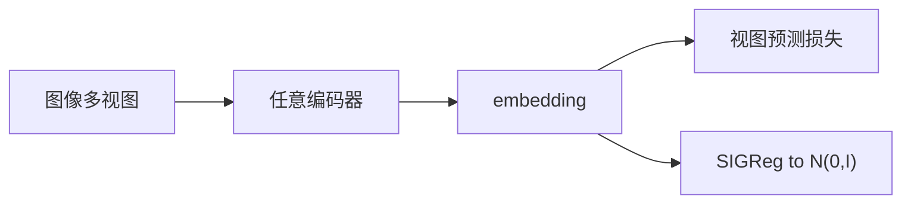
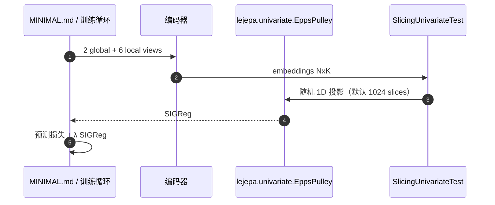

# LeJEPA（无启发式 JEPA · arXiv:2511.08544）

**LeJEPA**（*LeJEPA: Provable and Scalable Self-Supervised Learning Without the Heuristics*，[arXiv:2511.08544](https://arxiv.org/abs/2511.08544)；[代码](https://github.com/rbalestr-lab/lejepa)）由 **Randall Balestriero / Yann LeCun**（布朗大学、纽约大学、Meta-FAIR）提出：把 JEPA 的坍塌对策从 stop-gradient / teacher–student 换成可证明的分布约束。

## 一句话定义

> **embedding 应服从各向同性高斯；SIGReg 用随机投影检验把它钉住，预测损失只剩一个权衡超参。**

## 英文缩写速查

| 缩写 | 英文全称 | 简要说明 |
|------|----------|----------|
| LeJEPA | Latent-Euclidean JEPA | 本文：预测损失 + SIGReg |
| SIGReg | Sketched Isotropic Gaussian Regularizer | 随机 1D 投影上的正态性检验 |
| JEPA | Joint-Embedding Predictive Architecture | 在隐空间预测语义相关视图 |
| SSL | Self-Supervised Learning | 无标签预训练 |

## 为什么重要

- 后续 [LeWM](./paper-lewm.md) / [LeVJEPA](./paper-levjepa.md) / [WCM](./paper-wcm-world-critic-model.md) 都直接复用 SIGReg。
- 腾讯科技文把 LeVJEPA 写成「把 LeJEPA 拉到视频」——本页是那条链的图像配方节点。
- 训练损失与下游探针相关，可当无监督选模型信号。

## 核心信息

| 项 | 内容 |
|----|------|
| **机构** | 布朗大学；纽约大学；Meta-FAIR |
| **骨干** | ResNet / ViT / ConvNeXt / Swin 等 60+ 架构 |
| **目标** | 视图预测 + \(\lambda\) SIGReg |
| **主数字** | ViT-H/14 IN1K 冻结线性探针 **79%**；Galaxy10 域内预训练超过 DINOv2/v3 迁移 |
| **开源** | **已开源** CC BY-NC 4.0 |

## 核心原理（方法栈）

1. **公理：** 能预测相关视图，且 embedding 不退化。
2. **最优分布：** 各向同性高斯同时压低线性 / 非线性探针的偏差与方差。
3. **SIGReg：** 抽单位球面方向，在 1D 上做 Epps–Pulley 等特征函数检验；线性复杂度。

## 源码运行时序图

核心复现：把 `SlicingUnivariateTest` 插入已有 PyTorch 循环；完整 ImageNet 配方见仓库 `MINIMAL.md`。

## 实验与评测

- 10+ 数据集、60+ 架构；1.8B ViT-g 训练曲线稳定。
- 全量线性探针：ViT-L 平均 **79.48** vs I-JEPA ViT-H 78.50（100 vs 300 epoch）。
- Galaxy10：域内 LeJEPA 从 1-shot 到全监督均压过自然图像 DINOv2/v3 迁移。

## 工程实践

- 单超参 \(\lambda\)；AdamW lr \(5\times10^{-4}\)，ViT wd \(5\times10^{-2}\)。
- **许可证 NC**：商用需自写 SIGReg 或换许可。
- 这是**图像 SSL**，不是规划世界模型；接到控制请看 LeWM / LpWM。

## 局限与风险

- 主表是冻结探针，不是机器人闭环。
- CC BY-NC 挡住产品复用。
- 低本征维数据上强推各向同性高斯会难受（LeWM 的 Two-Room 反例）。

## 与其他工作对比

| 工作 | 关系 |
|------|------|
| I-JEPA / V-JEPA | EMA teacher + 掩码预测；本文卸掉不对称 |
| [LeWM](./paper-lewm.md) | 同一 SIGReg，加上动作条件预测器 |
| [LeVJEPA](./paper-levjepa.md) | 视频编码器配方 |
| [LpWM](./paper-lpwm.md) | 把高斯目标换成整流广义高斯 → 稀疏 |

## 结论

**总判：LeJEPA 把「防坍塌」从调参工艺收成一条可证明的分布约束；后续世界模型论文几乎都从这里分叉。**

1. 先确认你要的是图像 SSL 还是动作条件 WM。
2. 商用避开本仓，只借公式。
3. 探针 79% 不是控制成功率。
4. 接到视频用 LeVJEPA，接到规划用 LeWM，要稀疏用 LpWM。

## 关联页面

- [LeWM](./paper-lewm.md)
- [LeVJEPA](./paper-levjepa.md)
- [LpWM](./paper-lpwm.md)
- [WCM](./paper-wcm-world-critic-model.md)
- [生成式世界模型](../methods/generative-world-models.md)

## 参考来源

- [LeJEPA 论文归档](../../sources/papers/lejepa_arxiv_2511_08544.md)
- [rbalestr-lab/lejepa](../../sources/repos/lejepa.md)
- [腾讯科技访谈归档](../../sources/blogs/wechat_tencent_world_model_questions_2026-09-05.md)

## 推荐继续阅读

- [arXiv:2511.08544](https://arxiv.org/abs/2511.08544)
- [GitHub](https://github.com/rbalestr-lab/lejepa)
