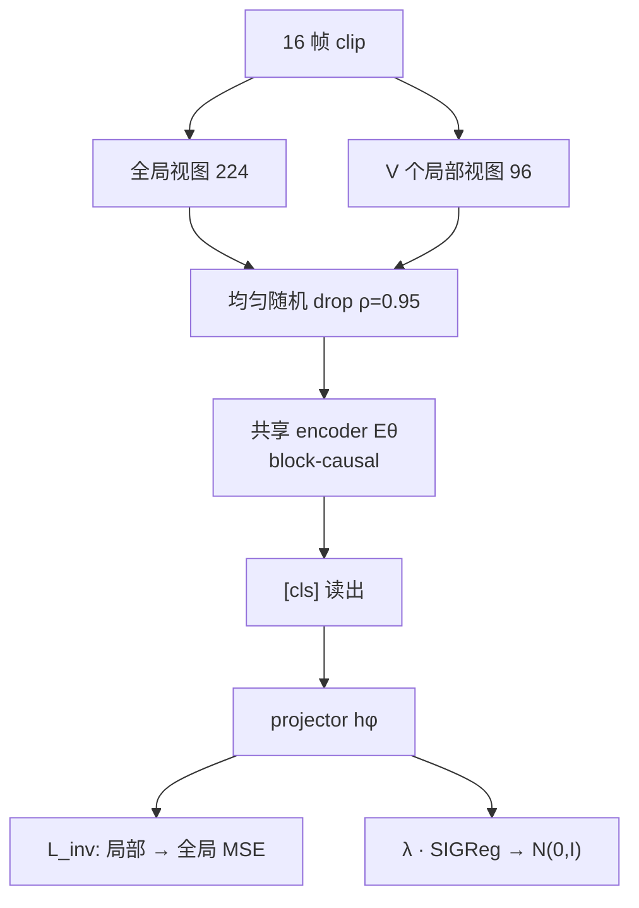
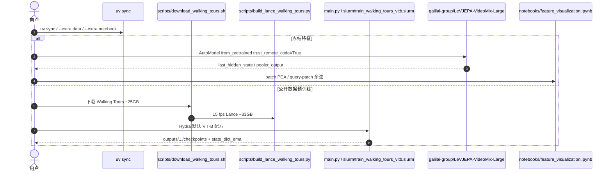

# LeVJEPA（无启发式视频预训练 · arXiv:2608.27395）

**LeVJEPA**（*LeVJEPA: Efficient & Scalable Video Pretraining without the Heuristics*，[arXiv:2608.27395](https://arxiv.org/abs/2608.27395)；[项目页](https://levjepa.github.io/)，[代码](https://github.com/MLO-lab/LeVJEPA)）由 **Lukas Kuhn / Lucas Maes / Giuseppe Serra / Quentin Le Lidec / Yann LeCun / Randall Balestriero / Florian Buettner** 提出：把图像侧 [LeJEPA](./paper-lejepa.md) 的 **坍塌无关目标**接到 V-JEPA 风格的视频 Transformer。可训练件只剩 **encoder + 小 projector**，目标只剩一个超参 \(\lambda=0.02\)。

## 一句话定义

**用全局–局部不变性 + SIGReg 训单个视频编码器：不要 EMA 目标网、predictor、stop-gradient 或像素解码器；随机丢掉绝大多数 token 既省算力又当增强，并让逐帧表征天然因果。**

## 英文缩写速查

| 缩写 | 英文全称 | 简要说明 |
|------|----------|----------|
| LeVJEPA | LeJEPA for Video | 本文方法：LeJEPA 目标的视频编码器 |
| LeJEPA | LeCun–Balestriero JEPA | 用 SIGReg 从分布上排除坍塌的图像 SSL 配方 |
| SIGReg | Sketched Isotropic Gaussian Regularizer | 随机方向上做正态性检验，把 embedding 拉向各向同性高斯 |
| V-JEPA 2 | Video JEPA 2 | 对照：EMA teacher + 掩码表征预测 |
| SSv2 / IN1K / K400 | Something-Something v2 / ImageNet-1K / Kinetics-400 | 运动 / 外观 / 动作识别冻结探针 |
| RoPE | Rotary Position Embedding | 本文用分解 3D-RoPE，两分辨率视图无需插值 |
| EMA | Exponential Moving Average | 仅作评测 checkpoint；**不进损失** |

## 为什么重要

- **视频预训练贵，贵在「防坍塌机械」：** [V-JEPA 2](./paper-vjepa2.md) 每步要跑完整 clip 的目标编码器 + 掩码 predictor；VideoMAE 还要像素解码器。LeVJEPA 主张这些件只为稳定学习存在，换成可证明的分布约束后可以整段卸掉。
- **算力门槛降到消费卡：** 单卡 RTX 5080（16 GB）上 ViT-Tiny + 8 条无标注 Walking Tours，12 小时冻结 IN1K 从 8.9% → 25.2%；同等 encoder 的 V-JEPA 配方在同卡 batch 28 就打满，本文 batch 128 仍 <8 GB。
- **因果表征是送的，不是后装的：** 分支不必不对称，于是可以把 attention 设成帧内双向、跨帧因果，冻结探针几乎不掉点。流式感知 / 自回归世界模型需要的「只看过去」变成编码器性质，而不必像 V-JEPA 2-AC 那样再训一个时间预测器。
- **视频相对图像预训练不再「只为运动买单」：** 同数据、同 FLOP 下对 DINOv2 帧级预训练，IN1K 只差 3.1 点，SSv2 接近翻倍（30.4 vs 16.9）。

## 核心信息

| 项 | 内容 |
|----|------|
| **机构** | 德国癌症研究中心（DKFZ）、法兰克福歌德大学、蒙特利尔学习算法研究所（Mila）、蒙特利尔大学、布朗大学、纽约大学、先进机器智能实验室（AMI Labs） |
| **骨干** | 视频 ViT（默认 ViT-B/16；缩放至 ViT-L/16）；`[cls]` 读出 + 两层 projector（\(d\to2048\to K=256\)） |
| **目标** | \(\mathcal L_{\mathrm{inv}}+\lambda\mathcal L_{\mathrm{SIGReg}}\)，\(\lambda=0.02\) 不调 |
| **默认配方** | 16 帧、\(\tau=1\)（逐帧 tokenize）、\(\rho=0.95\) 均匀 drop、\(V=4\) 局部视图、block-causal |
| **对照数据** | K710 的 **20%** 类平衡子集；有效 batch 3072；240 epoch（与基线同设定重训） |
| **缩放数据** | VideoMix：K710 + SSv2 + Walking Tours + PE Video（约 1.8M clips） |
| **开源** | **已开源**：训练仓 MIT；`module.py` 与 HF 权重 **CC BY-NC 4.0** |

## 流程总览

## 核心原理

### 方法：一个损失、两边反传

从视频采 16 帧，做 **1 个全局视图 + \(V\) 个局部视图**（空间裁剪 + 光度增强，**时间窗相同**）。同一 \(E_\theta\) 编码；可学习 `[cls]` 经 projector 得到 \(z_v\in\mathbb{R}^K\)。不变性项是局部对全局的 MSE，**目标 \(z_0\) 也反传**——单独最小化会塌成常数。SIGReg 把 batch embedding 投到 \(M=1024\) 个随机方向，用 Epps–Pulley 统计量惩罚偏离 \(\mathcal N(0,1)\)，由 Cramér–Wold 保证高维分布贴近各向同性高斯。坍塌（某方向方差为 0）离该分布最远。

Projector 必要：末层 LayerNorm 把 `[cls]` 钉在球面上，SIGReg 在 encoder 输出空间训不动；预训练结束后丢掉 projector，下游只用 encoder。

### Token dropping：观测集是自由变量

丢掉 \(\rho\) 比例的 patch 后，剩下的 token **就是编码器对该 clip 的全部观察**。这与 VideoMAE / V-JEPA 的掩码预测相反：那里随机掩码会让插值太容易，所以必须用 tube mask；这里什么都不补，tube 反而永久挡住大部分场景（IN1K 50.7 → 39.6）。IN1K 随 \(\rho\) 单调升到 0.95；SSv2 在短日程上高 \(\rho\) 会掉，加长训练可在同等总 FLOP 下挽回。

逐帧 tokenize（\(\tau=1\)）在匹配 token 预算下优于常规 \(\tau=2\) 时序聚合（IN1K 50.7 vs 47.4，SSv2 30.4 vs 28.8）。局部视图从 4 加到 10，IN1K 47.6 → 50.2，每个局部视图只多约 29 个被处理 token。

### 因果注意力与涌现的 dense 结构

Block-causal：patch 在帧内双向、跨帧只看过去；`[cls]` 看全部 token 但不被看。冻结探针 51.2 vs 双向 50.7。只监督 `[cls]` 时，patch PCA 仍能分开物体与背景——[V-JEPA 2](./paper-vjepa2.md) 没有可比结构，[V-JEPA 2.1](./paper-sa-2603-14482-v-jepa-2-1-unlocking-dense-features-in-video-sel.md) 靠显式 patch-level 损失才得到。

## 源码运行时序图

节点对齐 [`sources/repos/levjepa.md`](../../sources/repos/levjepa.md)。

- **最短路径：** HF 权重 + `trust_remote_code=True`；保持 `attn_mode=block_causal`，ImageNet normalize。
- **复现论文主表：** 需自备 K710 20% 子集与官方基线实现；仓内默认是 Walking Tours，不是 K710。

## 工程实践

| 项 | 实践要点 |
|----|----------|
| **开源状态** | **已开源**（截至 **2026-09-04**）：[MLO-lab/LeVJEPA](https://github.com/MLO-lab/LeVJEPA) · 主体 MIT；项目页与 HF 权重互链 |
| **许可证** | `module.py` 与 VideoMix-Large **CC BY-NC 4.0**（改编 Meta V-JEPA）；商用需换骨干或自训 |
| **推理输入** | `(B,C,T,H,W)`，16×224，~7.5 fps；单图沿 T 重复 16 次 |
| **默认训练** | `conf/config.yaml`：ViT-B/16、1 全局 + 10 局部、\(\rho=0.95\)、有效 batch 3072（16 GPU × 96 × accum 2） |
| **选型** | 要 **便宜的因果视频表征** 选本页；要 **已接机器人 latent MPC** 选 [V-JEPA 2-AC](./paper-vjepa2.md)；要 **像素可检视 rollout** 选 [IRASim](./paper-irasim.md) / Video-as-Simulation |

## 实验与评测

对照一律在 **同一 20% K710、同一官方实现、冻结 attentive probe**（K400 改为 mean-pool 线性探针，口径更弱）下重训。

| 设定 | 报告口径（以论文为准） |
|------|------------------------|
| Epoch-matched · ViT-S/B/L | 对 V-JEPA 2 准确率持平或更好，总预训算力 **5.6–20.8×** 更低；ViT-B：4.8 vs 36.4 ExaFLOP，相差 <1 点 |
| FLOP-matched · ViT-B | IN1K **61.0** / SSv2 40.4 / K400 **44.6**；相对 VideoMAEv2 IN1K **+7.6**，SSv2 落后 3.2 |
| vs DINOv2 同数据同 FLOP | IN1K 50.7 vs 53.8；SSv2 **30.4 vs 16.9** |
| 消费卡 | ViT-Tiny · 12 h · RTX 5080 · 8 条 Walking Tours ≈ 620k 帧 → IN1K 25.2% |
| VideoMix · ViT-L/16 · 100 epoch | 冻结 probe IN1K **69.5%**、SSv2 **55.0%**（HF 卡；项目页摘要曾写 67.5%） |

## 结论

**一旦拿掉防坍塌启发式，视频预训练可以既更简单又更便宜；因果逐帧表征是附赠，不是后装模块。**

1. **真影响指标是预测算力，不是「多一个 teacher」。** 同 epoch 下省 5.6–20.8× FLOP 仍能打平或超过 V-JEPA 2。
2. **Token drop 要当增强读。** \(\rho=0.95\) 同时降本和涨 IN1K；照搬 VideoMAE 的 tube mask 会伤表征。
3. **运动轴仍是短板。** 短日程高 drop 伤 SSv2；用省下的 FLOP 加长训练能挽回，但还没超过 VideoMAEv2 的运动探针。
4. **因果免费。** 要做流式 / 自回归 WM，优先用本文化的 encoder，而不是双向预训练后再拟合时间模型。
5. **密集结构可涌现。** 只监督 `[cls]` 也能出可用的 patch 语义；若任务是分割 / 跟踪，仍需另测，论文未做 dense probe。
6. **工程许可证分层。** 复现实验用 MIT 训练脚本即可；发产品权重要面对 CC BY-NC。
7. **本文不是规划 WM。** 没有动作条件、没有 MPC、没有真机；它提供更便宜的因果视觉状态，接规划仍要另训。

## 局限与风险

- **评测是冻结探针，不是控制闭环。** 不能直接当成 [V-JEPA 2-AC](./paper-vjepa2.md) 的替代品。
- **主表数据是 K710 的 20%。** 互联网规模行为未与 V-JEPA 2 的 VideoMix22M 对齐；§5.4 只表明「加数据仍涨」，不是饱和。
- **SSv2 对高 drop 敏感。** 运动对应稀疏采样时更容易丢；论文把「保运动的 drop 方案」列为未来工作。
- **Dense 任务未评。** patch 可视化 ≠ 分割 / 跟踪可用。
- **SIGReg × 超大 batch / 超大模型** 的稳定性未刻画。
- **许可证：** `module.py` 与公开权重非商用。

## 与其他工作对比

| 对比轴 | LeVJEPA | [V-JEPA 2](./paper-vjepa2.md) | VideoMAEv2 | [WCM](./paper-wcm-world-critic-model.md) |
|--------|---------|------------------------------|------------|------------------------------------------|
| **坍塌对策** | SIGReg（可证明） | EMA teacher + predictor | 像素重建，无坍塌问题 | SIGReg + 价值 / 预测头 |
| **监督对象** | 仅 clip `[cls]` | 掩码 token 的表征 L1 | 掩码像素 | 未来 latent + 价值 |
| **时间结构** | **预训练期** block-causal | 预训练双向；规划另训 AC | 双向 + tube mask | 因果 Transformer critic |
| **机器人 / 规划** | 无 | V-JEPA 2-AC + latent MPC | 无 | VLA RL critic，不做视觉预训练 |
| **开源** | MIT + 权重 NC | MIT 完整 | 官方实现 | 代码 MIT，权重部分 |

## 关联页面

- [LeJEPA](./paper-lejepa.md) — 图像侧 SIGReg 配方；本文接到视频编码器
- [LeWM](./paper-lewm.md) / [LpWM](./paper-lpwm.md) — 同一作者族的动作条件规划 WM
- [V-JEPA 2](./paper-vjepa2.md) — 同数据重训的主对照；AC 规划是本文没有的下一阶段
- [V-JEPA 2.1](./paper-sa-2603-14482-v-jepa-2-1-unlocking-dense-features-in-video-sel.md) — 用显式 dense loss 换 patch 结构；本文声称结构可涌现
- [WCM](./paper-wcm-world-critic-model.md) — 同一套 LeJEPA / SIGReg，落在 VLA critic
- [INTACT](./paper-intact.md) — JEPA 控制接口；本文只做表征
- [ODEWorld](./paper-odeworld.md) — 连续时间 latent 动力学对照
- [Generative World Models](../methods/generative-world-models.md) — 像素生成路线对照
- [Video-as-Simulation](../concepts/video-as-simulation.md) — 「视频当仿真器」与「视频当表征底物」的分工
- [世界模型物理保真：输出阅读轴](../overview/world-model-physics-fidelity-outputs.md) — 因果表征是 latent 中间路线的前置

## 参考来源

- [LeVJEPA 论文归档（arXiv:2608.27395）](../../sources/papers/levjepa_arxiv_2608_27395.md)
- [MLO-lab/LeVJEPA 代码索引](../../sources/repos/levjepa.md)
- [LeVJEPA 项目页归档](../../sources/sites/levjepa-github-io.md)
- [腾讯科技访谈归档](../../sources/blogs/wechat_tencent_world_model_questions_2026-09-05.md)

## 推荐继续阅读

- [arXiv:2608.27395](https://arxiv.org/abs/2608.27395)
- [项目页](https://levjepa.github.io/)
- [GitHub — MLO-lab/LeVJEPA](https://github.com/MLO-lab/LeVJEPA)
- [HF — LeVJEPA-VideoMix-Large](https://huggingface.co/galilai-group/LeVJEPA-VideoMix-Large)
- [LeJEPA（图像配方）](./paper-lejepa.md)
- [LeWM](./paper-lewm.md) / [LpWM](./paper-lpwm.md) — 同一 SIGReg 家族的规划 WM
