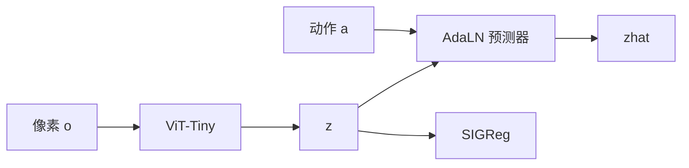
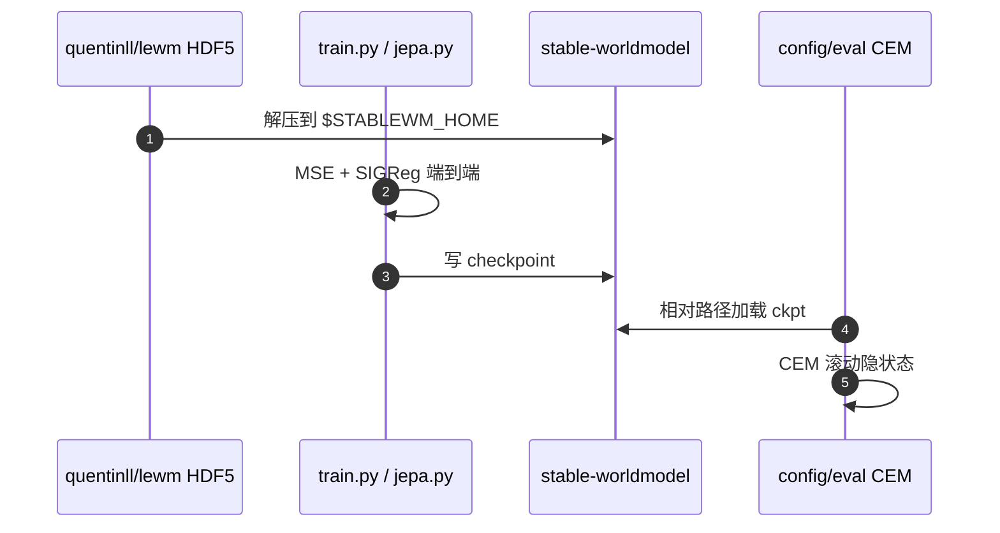

# LeWorldModel / LeWM（像素端到端 JEPA WM · arXiv:2603.19312）

**LeWorldModel（LeWM）**（*Stable End-to-End Joint-Embedding Predictive Architecture from Pixels*，[arXiv:2603.19312](https://arxiv.org/abs/2603.19312)；[项目页](https://le-wm.github.io/)；[代码](https://github.com/lucas-maes/le-wm)）把 [LeJEPA](./paper-lejepa.md) 的 SIGReg 接到**动作条件**隐动力学：从原始像素联合训编码器与预测器，测试时在隐空间做 CEM。

## 一句话定义

> **两项损失（下一 embedding MSE + SIGReg）从像素端到端训 15M JEPA，规划比冻结 foundation 编码器的 WM 快一个数量级。**

## 英文缩写速查

| 缩写 | 英文全称 | 简要说明 |
|------|----------|----------|
| LeWM | LeWorldModel | 本文动作条件 JEPA 世界模型 |
| SIGReg | Sketched Isotropic Gaussian Regularizer | 防坍塌；产出**稠密**高斯码 |
| CEM | Cross-Entropy Method | 测试时隐空间 MPC |
| PLDM | Planning with Latent Dynamics Models | 端到端对照（VICReg 多损失） |
| DINO-WM | DINO World Model | 冻结 DINOv2 + 规划对照 |

## 为什么重要

- 腾讯文里 LpWM 的「稠密对照」就是本页，不是口头基线。
- [INTACT](./paper-intact.md) 的官方四任务评测基座也是 LeWM 族。
- 证明：防坍塌不必冻结大视觉模型，也不必 6–7 项 VICReg 汤。

## 核心信息

| 项 | 内容 |
|----|------|
| **机构** | Mila / 蒙特利尔大学；纽约大学；Samsung SAIL；布朗大学 |
| **规模** | ~15M（ViT-Tiny 编码器 + 6 层 AdaLN 预测器） |
| **数据** | 离线、无奖励的观测–动作轨迹 |
| **规划** | CEM，典型 <1 s；相对 DINO-WM 至 **48×** |
| **开源** | **已开源** MIT；HF `quentinll/lewm` |

## 核心原理（方法栈）

\[
z_t=\mathrm{enc}(o_t),\quad \hat z_{t+1}=\mathrm{pred}(z_t,a_t)
\]

损失 = \(\|\hat z_{t+1}-z_{t+1}\|_2^2 + \lambda\,\mathrm{SIGReg}(z)\)。无 stop-gradient / EMA / 预训练冻结。测试时编码 \(z_0,z_g\)，CEM 最小化 \(\|\hat z_T-z_g\|_2\)。

## 源码运行时序图

`uv pip install stable-worldmodel[train,env]` 后 `python train.py data=pusht`。

## 实验与评测

- **速度：** 编码 token 约为 DINO-WM 的 1/200，规划至 48×。
- **PushT：** 相对 PLDM +18 pp；像素-only 超过带本体感觉的 DINO-WM。
- **OGBench-Cube：** DINO-WM 略好（3D 外观更难端到端）。
- **Two-Room：** LeWM 较差——低本征维 vs 高维高斯先验。
- VoE：传送显著抬高 surprise，变色不显著。

## 工程实践

- 单卡数小时；规划超参跟 DINO-WM：CEM 300 候选、horizon 5（frame skip 5）。
- 数据必须覆盖动态，不要求专家最优。
- 稠密码让浅预测器在 PushT 上失败——要降预测器容量请看 [LpWM](./paper-lpwm.md)。

## 局限与风险

- 仿真 2D/3D 操作，不是真机 VLA。
- SIGReg 在极简环境会过正则。
- 规划仍在测试时跑 CEM，不是 ActEffect 那种部署卸 WM。

## 与其他工作对比

| 工作 | 关系 |
|------|------|
| PLDM | 同为端到端；7 项损失不稳 |
| DINO-WM | 冻结大编码器；本页更小更快 |
| [LpWM](./paper-lpwm.md) | 同一梯子，稀疏目标 |
| [LeVJEPA](./paper-levjepa.md) | 无动作、无规划 |

## 结论

**总判：LeWM 证明像素 JEPA 可以两项损失跑稳，并把规划成本打到单卡实时附近；它交付的是稠密高斯几何，不是稀疏可解释因子。**

1. 复现从 HF 数据 + `train.py data=pusht` 起。
2. 比速度用规划墙钟，别只用成功率。
3. Two-Room 掉点是先验不匹配，不是实现 bug。
4. 要更浅的预测器或可读 support，换 LpWM。

## 关联页面

- [LeJEPA](./paper-lejepa.md)
- [LpWM](./paper-lpwm.md)
- [LeVJEPA](./paper-levjepa.md)
- [INTACT](./paper-intact.md)
- [潜空间想象](../concepts/latent-imagination.md)
- [生成式世界模型](../methods/generative-world-models.md)

## 参考来源

- [LeWM 论文归档](../../sources/papers/lewm_arxiv_2603_19312.md)
- [lucas-maes/le-wm](../../sources/repos/le-wm.md)
- [项目页归档](../../sources/sites/le-wm-github-io.md)
- [腾讯科技访谈归档](../../sources/blogs/wechat_tencent_world_model_questions_2026-09-05.md)

## 推荐继续阅读

- [arXiv:2603.19312](https://arxiv.org/abs/2603.19312)
- [项目页](https://le-wm.github.io/)
