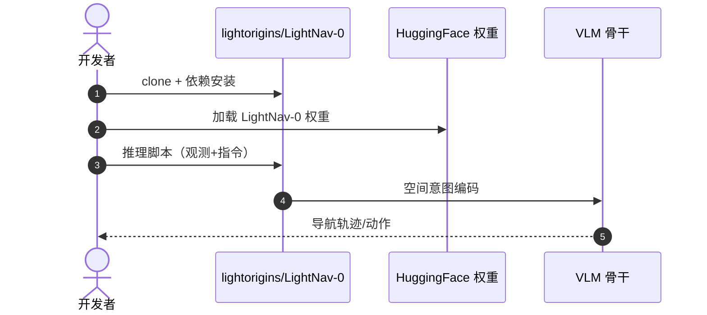

# LightNav-0：激发 VLM 空间智能的通用具身导航

**LightNav-0**（*Eliciting VLM Spatial Intelligence for Generalist Embodied Navigation*，[arXiv:2608.30935](https://arxiv.org/abs/2608.30935)，[项目页](https://www.lightorigins.com/en/blog/lightnav-0)，[代码](https://github.com/lightorigins/LightNav-0)）由 **光原点（Light Origins）** 提出：通过 **统一 token 接口** 对齐预训练 **VLM** 的空间智能——**dual-channel pointing** 表达任务、场景与本体无关的空间意图，**residual vector-quantized action tokenizer** 映射为精确轨迹。

## 一句话定义

**导航泛化的关键不是再接一堆任务头，而是用统一 token 把空间意图编码清楚，再让 VLM 直接出轨迹。**

## 英文缩写速查

| 缩写 | 英文全称 | 简要说明 |
|------|----------|----------|
| VLM | Vision-Language Model | 视觉-语言多模态模型 |
| RVQ | Residual Vector Quantization | 残差向量量化动作离散化 |
| SFT | Supervised Fine-Tuning | 监督微调 |
| RL | Reinforcement Learning | 强化学习后训练阶段 |

## 为什么重要

- 纳入 [2026-09-01 七篇盘点](../../sources/blogs/wechat_embodied_station_7_papers_open_source_system_loop_2026-09-01.md) 的「VLM 空间智能 → 导航」支线。
- 论文报告在 **10 个公开导航仿真** 设置上取得 **当时最优** 的单目成功率（2026-09 投稿口径，后续工作可能已刷新）。
- 真机展示 **人形 / 四足 / 轮式 / 空中** 跨本体 **零样本** 泛化。
- 训练语料 **2K+ 场景、4K+ 小时**；**已开源** 代码与 Hugging Face 权重。

## 核心信息

| 项 | 内容 |
|----|------|
| **机构** | 光原点（Light Origins） |
| **数据** | 2K+ 场景，4K+ 小时 |
| **任务** | 指令跟随、开放词汇目标导航、视觉跟踪 |
| **训练** | 视觉历史压缩、ER mid-training、SFT、RL |
| **开源** | **已开源** [lightorigins/LightNav-0](https://github.com/lightorigins/LightNav-0)；[HF 权重](https://huggingface.co/LightOriginsHQ/LightNav-0) |

### 流程总览

## 评测

| 设置 | 读法 |
|------|------|
| 10 个公开导航仿真 | 单目成功率为论文投稿时（2026-09）各设置最优 |
| 真机跨本体 | 未见场景语言指令自主导航 |

## 结论

**通用导航应统一空间意图编码，而不是为每个任务/本体堆专用头。**

- dual-channel pointing 解耦任务、场景与本体
- RVQ tokenizer 把空间意图映射为可执行轨迹
- 大规模仿真数据 + mid-training/SFT/RL 组合训练
- 10 个仿真基准上论文口径最优 + 真机跨本体零样本
- 代码与 HF 权重已发布，可复现推理管线
- 对 VLM 空间智能的「导航出口」有直接工程参考

## 源码运行时序图

## 局限与风险

- **仿真—真机差距：** 真机 demo 为精选场景，极端光照/动态障碍泛化待验证。
- **算力：** VLM 骨干推理延迟需结合部署平台评估。
- **数据引擎：** 大规模仿真数据生成细节以仓库 README 为准。

## 与其他工作对比（索引级）

| 维度 | LightNav-0 | 模块化导航栈（建图 + 规划） | 任务专用导航策略头 | 通用 VLA 直出动作 |
|------|-----------|------------------------|-----------------|-----------------|
| 空间意图表示 | **dual-channel pointing**，任务/场景/本体无关 | 显式地图坐标 | 各任务自定义 | 语言 + 视觉隐式 |
| 动作接口 | **RVQ token → 轨迹** | 规划器输出路径 | 各头自定义 | 连续动作或 token |
| 跨本体 | 人形/四足/轮式/空中零样本演示 | 需重配运动学与规划参数 | **基本不迁移** | 依训练本体分布 |
| 传感前提 | **单目** | 常需深度/激光 | 依任务 | 依模型 |
| 主要软肋 | VLM 骨干推理延迟 | 建图失效即全栈失效 | 任务数一多就爆头 | 空间精度 |

- **对比读法**：本文的增益声明是「统一 token 接口 + 大规模数据」，不是更强的 VLM 骨干；与模块化栈比较时要注意后者在已建图的结构化场景里仍有确定性优势。
- **数字的时效与口径**：10 个仿真设置上的最优成绩为 2026-09 投稿口径的单目设置，跨传感配置（RGB-D/LiDAR）或跨评测协议均不可横比。
- **真机结论是演示级**：跨本体零样本为精选场景 demo，极端光照与动态障碍未覆盖（见「局限与风险」）。

## 关联页面

- [视觉–语言导航（VLN）](../tasks/vision-language-navigation.md)
- [VLA](../methods/vla.md)
- [开源系统闭环 7 篇地图](../overview/open-source-system-loop-7-papers-technology-map.md)

## 推荐继续阅读

- [LightNav-0 项目页](https://www.lightorigins.com/en/blog/lightnav-0)
- [arXiv:2608.30935](https://arxiv.org/abs/2608.30935)

## 参考来源

- [lightnav0_arxiv_2608_30935.md](../../sources/papers/lightnav0_arxiv_2608_30935.md)
- [具身智能小站 2026-09-01 七篇盘点](../../sources/blogs/wechat_embodied_station_7_papers_open_source_system_loop_2026-09-01.md)
- [LightNav-0 项目页](../../sources/sites/lightnav-0.md)
- [lightorigins/LightNav-0](../../sources/repos/lightorigins-lightnav-0.md)
