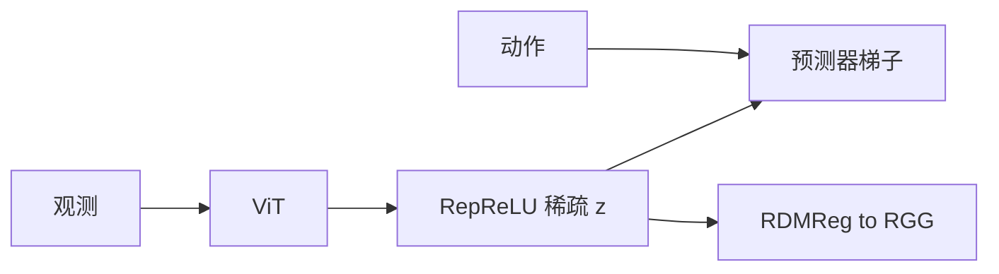
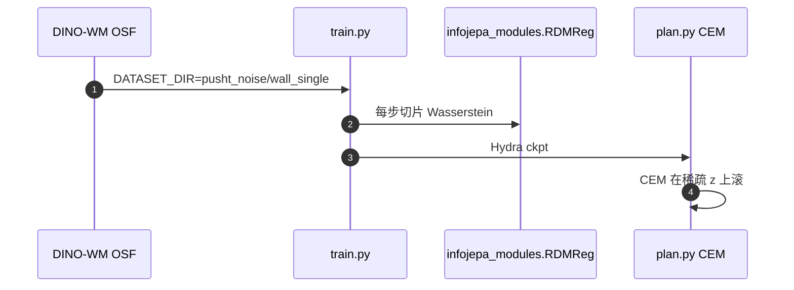

# LpWM（稀疏世界模型 · arXiv:2608.22764）

**LpWM / LpWorldModel**（*A Case for Sparse Representations in World Models*，[arXiv:2608.22764](https://arxiv.org/abs/2608.22764)；[代码](https://github.com/YilunKuang/lpworldmodel)）问：稠密各向同性高斯是不是对动力学最友好的几何。答案：在中等预测器容量上，**稀疏非负码**让动作条件转移更好学。

## 一句话定义

> **RDMReg 把隐变量拉成整流广义高斯（默认整流 Laplace），得到可精确为零的稀疏码，从而降低规划所需预测器复杂度。**

## 英文缩写速查

| 缩写 | 英文全称 | 简要说明 |
|------|----------|----------|
| LpWM | LpWorldModel | 本文稀疏 JEPA 世界模型 |
| RDMReg | Rectified Distribution Matching Regularization | 切片 Wasserstein 对齐整流目标 |
| LeWM | LeWorldModel | 稠密 SIGReg 对照 |
| CEM | Cross-Entropy Method | 测试时规划 |
| TJ | Temporal Jaccard | 可选时间先验，让 support 跟接触 |

## 为什么重要

- 腾讯文点名的 8 月 24 日 LeCun 团队论文就是本页。
- 把「世界模型内部该长什么样」从功能轴（渲染/模拟/规划）推进到**表征几何**。
- 经验上：同一编码器，只换正则与输出非线性，浅预测器就能规划。

## 核心信息

| 项 | 内容 |
|----|------|
| **机构** | 纽约大学 / AMI Labs；杜克大学；Mila；布朗大学 |
| **损失** | \(\|\hat z_{t+1}-z_{t+1}\|_2 + \lambda \mathrm{RDMReg}(z)\) |
| **默认目标** | \(\mu=0,\sigma=\sqrt{1/2},p=1\) → 整流 Laplace |
| **主数字** | PushT 相对 LeWM：MLP∘LTI **+24–57 pp**，MLP∘LTV **+36–45**，LTI **+11–23** |
| **开源** | **已开源** MIT |

## 核心原理（方法栈）

编码器 ViT + MLP → `RepReLU`（前向 ReLU、反向 GeLU）→ 精确零。预测器从 Deep-AdaLN 到 LTI(1) 一列梯子。Prop. 1：Lipschitz 受控系统在高维 one-hot 下可动作条件线性化；分布式稀疏是可学放松。

## 源码运行时序图

§3 用 `environment.yaml`；§4 Piecewise / Cube 走 `lpwm_swm/` 另一套依赖。

## 实验与评测

- **Wall：** LTI(1) 闭环已近 100%，疏密无差别。
- **PushT：** 两端饱和（线性全挂、Deep-AdaLN 打平）；中间容量稀疏大胜。相对 VICReg 稠密变体，连 Deep-AdaLN 也更好。
- **Piecewise：** 随机目标 84.7% vs LeWM 65.3%；support 解码分区 94–99%。
- **OGBench-Cube：** 无 TJ 时 support 跟末端（\(r\approx0.87\)）；加 TJ 后跟物块/接触。

## 工程实践

- 先复现 PushT 中等预测器，不要一上来 Deep-AdaLN——那里看不出稀疏红利。
- `µP` 做宽度缩放。
- 接触任务若要可读 support，显式加 Temporal Jaccard。

## 局限与风险

- 主结果在 2D 仿真；没有真机。
- 稀疏本身不保证 support 对齐「语义事件」。
- 高容量预测器吃掉优势。
- 仓不带预训练权重。

## 与其他工作对比

| 工作 | 关系 |
|------|------|
| [LeWM](./paper-lewm.md) | 同一梯子的稠密高斯对照 |
| [LeJEPA](./paper-lejepa.md) | SIGReg 的图像配方；本页换 RDMReg |
| VICReg-JEPA | 二阶矩不够指定分布 |
| [LeVJEPA](./paper-levjepa.md) | 视频表征，无动作规划 |

## 结论

**总判：LpWM 证明「内部几何」能换预测器容量；稀疏红利出现在中等模型，不是更大的 DiT。**

1. 选型时先标预测器档位，再比疏密。
2. Wall 不能当区分实验。
3. 接触任务默认加时间先验。
4. 与功能分类正交：本页改的是 Simulator 内部码，不是输出模态。

## 关联页面

- [LeWM](./paper-lewm.md)
- [LeJEPA](./paper-lejepa.md)
- [LeVJEPA](./paper-levjepa.md)
- [INTACT](./paper-intact.md)
- [生成式世界模型](../methods/generative-world-models.md)
- [潜空间想象](../concepts/latent-imagination.md)

## 参考来源

- [LpWM 论文归档](../../sources/papers/lpwm_arxiv_2608_22764.md)
- [YilunKuang/lpworldmodel](../../sources/repos/lpworldmodel.md)
- [腾讯科技访谈归档](../../sources/blogs/wechat_tencent_world_model_questions_2026-09-05.md)

## 推荐继续阅读

- [arXiv:2608.22764](https://arxiv.org/abs/2608.22764)
- [GitHub](https://github.com/YilunKuang/lpworldmodel)
