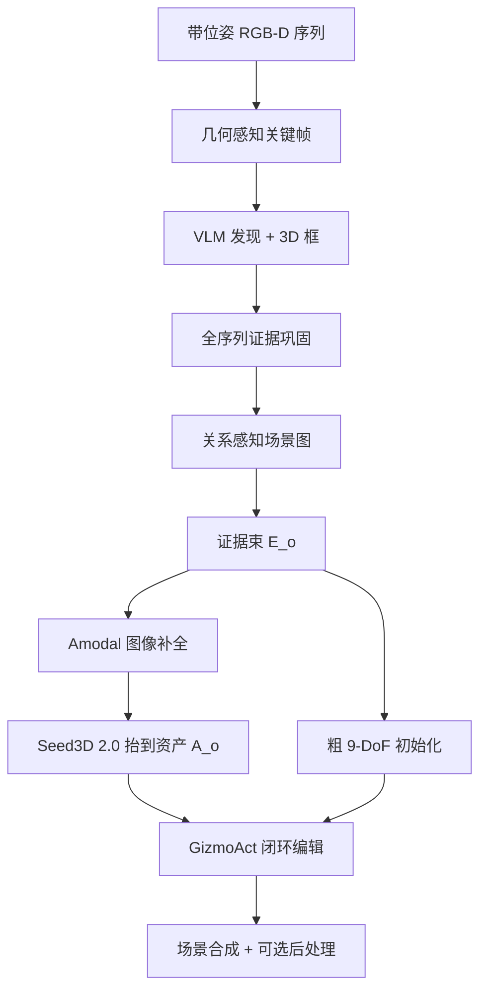

# Lucida：组合式 Real-to-Sim 场景建模

**Lucida**（*Parse, Generate, and Place for Composable Real-to-Sim Scene Modeling*，[arXiv:2608.30821](https://arxiv.org/abs/2608.30821)，2026-08-31；[项目页](https://lucida-r2s.github.io/)）由 **字节跳动 Seed（ByteDance Seed）**、**北京大学（PKU）** 与 **浙江大学（ZJU）** 提出：把带位姿的室内 RGB(-D) 写成**可分离、可编辑的物体资产 + 9-DoF 布置 + 场景图**，供机器人仿真与具身 AI 当「可单独搬动物体的仿真副本」用。核心不是再叠一层端到端重建，而是**保持 parse–generate–place 顺序、把精度要求后移到闭环放置**。

## 一句话定义

**解析只收集杂乱捕获里靠得住的多视角证据，生成做遮挡补全，放置用 VLM 操作 3D gizmo 直到渲染与观测对齐——精度在管线末端达成，而不是在第一步就要求精确几何。**

## 英文缩写速查

| 缩写 | 英文全称 | 简要说明 |
|------|----------|----------|
| R2S / Real2Sim | Real to Simulation | 从真实观测构造可编辑、可仿真的场景与资产 |
| GizmoAct | Gizmo-based Action Policy | 本文把放置写成多轮 GUI：VLM 发增量 gizmo 编辑并自学停止 |
| ADD-SB | Average Distance of Model Points, Symmetric Bidirectional | 双向最近邻表面距离；@0.05 表示低于物体直径 5% |
| 9-DoF | Nine Degrees of Freedom | 平移 + 旋转 + 各向异性尺度，本文放置状态 \(x_t=(p_t,R_t,s_t)\) |
| GRPO | Group Relative Policy Optimization | GizmoAct 在可执行环境上的在线 RL 算法 |

## 为什么重要

- **仿真要的是可动物体，不是整房光场：** NeRF / 3DGS 忠实复现房间，但单体不可拆；CAD 检索受库覆盖限制。Lucida 针对「每个实例都是完整 mesh、还能改位姿」这一仿真接口。
- **把杂乱捕获做不到的前提从上游拿走：** 精确掩码、无遮挡中心图、资产与观测几何一致——室内录像很少同时满足。精度后移，让前两步只做「够用的证据与完整资产」。
- **GizmoAct 是可复用的 grounding 抽象：** 同一 GUI 循环操作的是 3D 代理（资产 / 框 / 坐标系），而不是再回归一次绝对位姿；对生成资产与观测不一致、初始化很粗的情况更贴工程。

## 核心信息

| 项 | 内容 |
|----|------|
| **作者** | Minghan Qin、Yuang Wang、Xiuyu Yang、Yushi Long、Yujian Zhang、Ruihuan Wang、Kai Ye、Yangang Zhang（通讯）、Hang Li |
| **机构** | 字节跳动 Seed（ByteDance Seed）；北京大学（Peking University）；浙江大学（Zhejiang University） |
| **输入** | 带位姿室内 RGB(-D) 序列 |
| **输出** | 物体级可编辑资产 + 9-DoF 位姿 + 带空间关系的场景图 |
| **项目页** | <https://lucida-r2s.github.io/>（交互 PlayCanvas 场景 + 数字表） |
| **开源（截至 2026-09-04）** | **确认未开源** — 项目页仅 arXiv / Hugging Face papers；论文未承诺发代码；无实现仓 |

## 核心原理

### 方法栈（Parse → Generate → Place）

| 模块 | 机制 |
|------|------|
| Parse | 几何感知关键帧（共视 + 时间项）→ VLM 发现实例 + 3D 框 → 全序列证据巩固 → 关系感知细化（拆合并、补支撑）。节点带 \(\mathcal{E}_o=\) 多视角 / 掩码 / 部分点云 / 代表框 / 指称 |
| Generate | 选互补可靠视图 → Set-of-Mark + 编辑指令 → 孤立无遮挡物体图 → Seed3D 2.0 抬到 mesh；用代表框粗初始化 |
| GizmoAct | 渲染点云 + 资产叠加 + 黄框 + 局部 gizmo + 遮挡绿层；`update_pose` 在物体局部系做增量（平移/缩放以当前尺寸为单位），大旋转走 `switch_obs`/`permute_axis`，对齐后 `stop` |
| 后处理 | 支撑 / 碰撞 / 接触合理性与个体 grounding **分开**：agent 只管对齐，场景约束走规则或物理检查 |

### 流程总览

### GizmoAct 训练读点

- **SFT：** 合成专家轨迹（3D-FRONT+MesaTask、FoundationPose、CA-1M Objects）；故意用几何不一致资产 + 困难随机初值；DART 式错误注入只监督恢复动作。
- **RL：** 同一 GUI 环境上 GRPO；终态按广义 3D IoU 与测地旋转误差分档，两边都进 success 才给分，并对 `stop` 加奖励。对称物体不进 RL（奖励会惩罚等价朝向）。
- **与 render-and-compare 的差：** 后者从渲染–观测差回归更新、停止靠外部准则；GizmoAct **只看渲染** 同时预测下一步和何时停，且不回归绝对位姿 / 度量尺度。

## 源码运行时序图

**不适用（官方无可运行代码）。** 截至 2026-09-04：项目页资源行只有 arXiv 与 Hugging Face papers；论文未列 GitHub、未承诺发布。若后续开放，应补 `sources/repos/` 与「多视角解析 → amodal 生成 → GizmoAct 推理循环」的 `sequenceDiagram`。

## 工程实践

| 项 | 建议 |
|----|------|
| 适用场景 | 需要 **可单独编辑的室内物体资产 + 观测对齐布置**，而不是整房 3DGS 或 CAD 库检索 |
| 采集 | 带位姿多视角 RGB-D；解析依赖共视关键帧，均匀抽帧会掉检测与场景 F-Score |
| 放置预算 | 主实验最多 **12** 步；max-4-view 在 R2S-Object / CA-1M 上严格对齐最好 |
| 初始化 | 估计深度上 Boxer 粗框更好；精确几何（ADT）上 Any6D* / SAM 3D 更好。RL 训练分布应对齐测试初始化 |
| 复现边界 | **未开源**；R2S 为作者自建室内基准，公开数字只能作选型对照 |
| 勿误读 | 评测是 **检测 mAP / ADD-SB / 场景 Chamfer**，不是策略 Pearson、也不是真机操作成功率 |

## 实验与评测

- **场景级 3D 检测（Table 1）：** R2S-Scene `_all` mAP Boxer **0.351 → 0.592**（相对 +69%）；仅 keyframe 提示仍优于全帧提示的 Boxer。CA-1M 增益较小（0.171→0.180 / 0.373→0.390）。
- **物体位姿（Table 2，Boxer 初始化，≤12 步）：** R2S-Object max-4-view ADD-SB@0.05 **92.0%**（最强基线 RecGen 1-view 79.2%），3D IoU **0.719**。CA-1M @0.05 **83.4%**（57.8%→），IoU **0.607**。ADT 单视 ADD-SB 最低 **0.020**，max-4-view @0.05 **90.0%**。
- **初始化鲁棒（Table 3）：** 同一随机扰动策略可吃 Boxer / Any6D* / SAM 3D，不必重训；最优初始化仍取决于输入几何精度。
- **场景重建（Table 4，R2S-Scene）：** 场景 CD **0.010**、F-Score **0.924**（SAM 3D 0.022 / 0.794；SceneGen 0.428 / 0.351）；BBox IoU **0.495**；物体级归一化 F-Score **0.736**。
- **消融：** 解析三子步都必要，均匀关键帧掉得最多。GizmoAct 上 RL 相对 SFT 主要修大误差旋转（难例子集 45.19°→20.98°）。

## 结论

**组合式 Real-to-Sim 的真影响指标是「末段闭环能否吸收上游的遮挡、粗框和资产–观测 mismatch」，而不是第一步就交出精确实例几何。**

1. **精度后移是接口设计** — 解析交证据束、生成交完整资产、GizmoAct 交 9-DoF；前两步「大约对」即可。
2. **主场景读数** — R2S-Scene 场景 F-Score **0.924** vs SAM 3D **0.794**；检测 mAP 相对 Boxer **+69%**（0.351→0.592）。
3. **主位姿读数** — CA-1M ADD-SB@0.05 **57.8%→83.4%**；R2S-Object **79.2%→92.0%**。这是表面/框对齐，不是策略相关。
4. **GizmoAct 训练要对齐初始化分布** — Boxer 初值上用 Boxer 误差训 RL 全面更好；难例子上 RL 主要压旋转残差。
5. **漏检不可事后补** — 解析没找到的物体，生成和放置都救不回来。
6. **复现边界** — 截至入库日 **未开源**；R2S 基准不随项目页发布。

## 与其他工作对比

| 对照 | 差异读法 |
|------|----------|
| [SimFoundry](./paper-simfoundry-real2sim-scene-generation.md) | 视频孪生 + cousins + **策略 Pearson/MMRV**；Lucida 停在 **可编辑资产对齐**，没有策略评测或 sim-to-real 训练 |
| [Agentic Real2Sim](./paper-agentic-real2sim.md) | VLM **编排** DROID→MuJoCo **episode twin**（回放成功）；Lucida 的 VLM 是 **3D 编辑器里的放置策略**，单位是物体 9-DoF |
| [CRISP](../methods/crisp-real2sim.md) | 单目人–场景平面原语 + RL 物理闭环；Lucida 是室内 **物体级 mesh 布置**，不做人形接触动力学 |
| [R2S-EGO](./paper-r2s-ego.md) | 在**既有仿真**上补行为范围 ego 外观/碰撞（3DGS）；Lucida 从捕获**新造**可编辑物体场景 |
| SAM 3D / SceneGen / RecGen | 联合预测形状+位姿或单次前馈场景；Lucida 拆开生成与放置，用闭环吸收 mismatch |
| CAD 检索–对齐（Scan2CAD / ROCA 等） | 保真度受库覆盖限制；Lucida 走生成资产，不依赖 CAD 库 |

## 局限与风险

- **未开源：** 无法核对 GizmoAct 环境、专家轨迹或 R2S 标注；选型只能读论文协议。
- **漏检即终态：** 解析阶段错过的实例，后续模块没有回搜机制。
- **闭环只在 Place：** 作者自己把整管线 agentic 化列为未来工作；Parse/Generate 仍是开环。
- **几何对齐 ≠ 可仿真物理：** 后处理才管支撑/碰撞；论文主表是 Chamfer / IoU / ADD-SB，没有摩擦、关节或策略 rollout。
- **RL 排除对称物体：** 奖励用测地旋转误差，对称实例的朝向评分需另标。
- **页脚仍标 draft：** 项目页资源可能后续补代码，入库结论以 **2026-09-04 实际链接** 为准。

## 关联页面

- [Sim2Real](../concepts/sim2real.md) — Real2Sim 资产与迁移总图
- [CRISP](../methods/crisp-real2sim.md) — 单目人–场景平面原语 Real2Sim
- [SimFoundry](./paper-simfoundry-real2sim-scene-generation.md) — 视频孪生 + cousins + 策略评测
- [Agentic Real2Sim](./paper-agentic-real2sim.md) — VLM 编排 episode twin
- [R2S-EGO](./paper-r2s-ego.md) — 稀疏捕获双代理 ego 细化
- [Awesome-Real2Sim2Real](./awesome-real2sim2real.md) — 迁移闭环文献索引
- [Manipulation](../tasks/manipulation.md) — 操作仿真对可编辑资产的需求
- [仿真评测基础设施](../concepts/simulation-evaluation-infrastructure.md) — real-to-sim 评测口径（本文未走 Pearson）
- [Sim2Real 残差适配 vs Real2Sim vs 真机 RL](../comparisons/sim2real-vs-real2sim-fine-tuning.md) — 迁移路径选型

## 参考来源

- [lucida_r2s_arxiv_2608_30821.md](../../sources/papers/lucida_r2s_arxiv_2608_30821.md) — 论文摘录与开源核查
- [lucida-r2s-github-io.md](../../sources/sites/lucida-r2s-github-io.md) — 项目页结构与资源行
- [arXiv:2608.30821](https://arxiv.org/abs/2608.30821) — 原文（Submitted 2026-08-31）

## 推荐继续阅读

- [项目页](https://lucida-r2s.github.io/) — 管线图、GizmoAct 视频与交互场景
- [arXiv PDF](https://arxiv.org/pdf/2608.30821) — §2 方法与 Table 1–6
- [Hugging Face papers](https://huggingface.co/papers/2608.30821) — 论文条目（非权重仓）
- [Seed3D 2.0（arXiv:2605.13862）](https://arxiv.org/abs/2605.13862) — 文中图像→3D 抬升组件
- [Boxer（arXiv:2604.05212）](https://arxiv.org/abs/2604.05212) — 解析与初始化所用 3D 框提升
