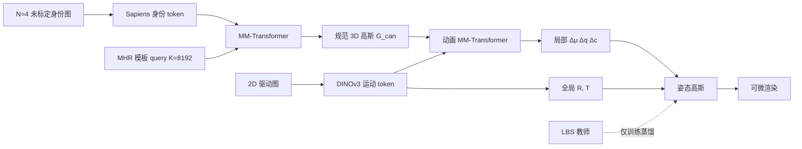

# LUNA：绕过蒙皮的通用 3D 人动画

**LUNA**（*Learning Universal 3D Human Animation Beyond Skinning*，[arXiv:2606.31981](https://arxiv.org/abs/2606.31981)，[项目页](https://penghtyx.github.io/LUNA/)）由 **香港科技大学** Peng Li、Yuan Liu、Wenhan Luo、Yike Guo 与 **Meta Codec Avatars Lab** Rawal Khirodkar、Junxuan Li、Yuan Dong、Chen Cao、Shunsuke Saito 提出（一作实习于 Meta），投 **ECCV 2026**。单目可动画数字人通常先拟合 SMPL/MHR，再用 [LBS](../concepts/smpl-x.md) 把规范体蒙到姿态空间；拟合误差和单目 3D 姿态噪声会变成衣服撕裂与时序抖动。LUNA 改成：**少数未标定身份图 → 规范 3D 高斯**，再用 Transformer 从 2D 驱动图直接回归形变。

## 一句话定义

**不用显式人体拟合，把 RGB / 2D 关键点 / 草图等 2D 信号前馈映射成可渲染的 3D 高斯形变；LBS 只当训练期软教师，不进推理解码器。**

## 英文缩写速查

| 缩写 | 英文全称 | 简要说明 |
|------|----------|----------|
| LUNA | Learning Universal 3D Human Animation Beyond Skinning | 本文框架：LBS-free 的隐式 2D 驱动 3D 动画 |
| LBS | Linear Blend Skinning | 骨骼权重混合蒙皮；本文推理不用，只作蒸馏教师 |
| 3DGS | 3D Gaussian Splatting | 规范/姿态空间的可微高斯表示 |
| LHM | Large Animatable Human Reconstruction Model | 身份编码器的前馈重建前作；本文扩成 MV-LHM |
| MHR | Momentum Human Rig | 训练用身体模板，只锚定 query token，不驱动动画 |
| MSJ | Mean Squared Jerk | 高斯轨迹三阶导；衡量高频抖动 |
| MAE | Mean Acceleration Error | 高斯轨迹二阶导；衡量整体运动稳定性 |

## 为什么重要

- **把「可动画」从参数体解耦：** 本库默认人体中间格式是 [SMPL-X](../concepts/smpl-x.md) + LBS。LUNA 证明外观动画可以不走这条硬约束，松衣、跨模态驱动时撕裂和 ID 漂移会轻很多。
- **隐式 2D 驱动 vs 单目 HMR：** [GVHMR](./gvhmr.md) 出重力对齐骨架再进重定向；LUNA 跳过 3D 姿态估计，用 DINOv3 运动 token 直接抬形变。时序指标（MSJ）比最强 LBS 前馈基线约 **4.5×**。
- **混合监督可复用：** LBS-free 并不等于「扔掉人体结构」。没有蒸馏，2D→3D 会扁平塌缩。标注少、野外视频多时，按 batch 比例上调 \(\lambda_{distill}\) 是可抄的配方。
- **机器人语境只在外观层：** 输出是 splat 渲染，不是关节指令。要控人形仍走 HMR → [GMR](../methods/motion-retargeting-gmr.md)。LUNA 适合对照「数字人外观」和「参考运动」两条链，不要当成新的重定向前端。

## 方法

| 项 | 内容 |
|----|------|
| **机构** | 香港科技大学、Meta Codec Avatars Lab |
| **输入** | \(N=4\) 张未标定多视角身份图 + 1 张 2D 驱动（RGB / 关键点 / 草图） |
| **身份** | Sapiens 图像 token + \(K=8192\) 模板 query；MM-Transformer → 规范高斯 |
| **动画** | DINOv3 运动 token → 全局 \(R,T\) + per-Gaussian \(\Delta\mu,\Delta q,\Delta c\) |
| **监督** | 光度 + LBS 蒸馏 + 旋转监督 + 2D 重投影；标注:无标注约 \(1:5\) |
| **开源** | **宣称将开源 / 截至 2026-09-05 项目页无仓库**（GitHub 按钮注释且 `href="#"`） |

### 流程总览

### 核心原理

1. **规范身份与驱动运动拆开。** 身份编码器只负责「这个人长什么样」；动画器只吃驱动图的运动布局。训练时身份与驱动同人，推理时可以换人、换草图、换骨架图。
2. **全局刚体与局部非刚拆开。** 大转体用连续三角函数回归 \(R\)，平移用训练集均值方差反归一化；局部残差只管衣服滑动等非刚。二者合成一个场时，大动作会漂、边界会毛。
3. **LBS 是软先验，不是驱动器。** 推理解码器不含蒙皮。教师只在有拟合标注的样本上提供 \(\hat\mu,\hat q,\hat c\)。去掉这项，深度塌成纸片。
4. **平移不直接用 3D 监督。** 深度轴误差会吞掉梯度；改监督投影后的高斯中心。旋转仍可直接监督。
5. **按标注比例重加权。** 无标注野外视频占多数时，光度梯度会淹没结构项。固定 \(1:5\) 并设 \(\lambda_{distill}=5\)，才能同时吃松衣细节和几何稳定。

## 源码运行时序图

**不适用。** 截至 2026-09-05，项目页 GitHub 按钮为注释占位（`href="#"`），无官方仓、权重或可辨识的 `train` / `eval` 入口。一作另有 [pengHTYX/PSHuman](https://github.com/pengHTYX/PSHuman)（单图人体重建，MIT），**不是** LUNA 实现。

## 工程实践

| 项 | 建议 |
|----|------|
| 复现入口 | **没有。** 先盯项目页 GitHub 按钮是否上线，再补 `sources/repos/` |
| 训练代价 | Stage 1：64×A100、30k iter、\(4\times10^{-4}\)；Stage 2：Dome、16×A100、\(1\times10^{-4}\) |
| 超参 | \(K=8192\)，\(C=1024\)，\(N=4\)，\(\lambda_q=\lambda_c=0.5\)；前 1k iter 只开 \(\mathcal{L}_R+\mathcal{L}_{proj}\) |
| 编码器分工 | 身份用 Sapiens（纹理/人体语义）；运动用 DINOv3（骨架图、草图更稳） |
| 数据 | Video35K / iPhone1K / Dome 专有或同源受限；Cloth10K 为 Video35K 条件生成派生集 |
| 误用 | 不要把 PSNR / MSJ 当成策略成功率；不要当 [GMR](../methods/motion-retargeting-gmr.md) 前端 |

## 实验与评测

对照含优化式 Vid2Avatar / ExAvatar，以及前馈 IDOL、LHM、UP2YOU、作者实现的 MV-LHM。光度用 PSNR / L1 / LPIPS；运动用高斯轨迹的 MAE 与 MSJ。

| 设定 | LUNA | 最强相关基线 | 读法 |
|------|------|----------------|------|
| Cloth10K PSNR ↑ | **22.072** | MV-LHM 20.124；ExAvatar 19.533 | 松衣非刚是主场 |
| Cloth10K LPIPS ↓ | **0.131** | UP2YOU 0.149；MV-LHM 0.158 | 观感优于 LBS 前馈 |
| NeuMan PSNR ↑ | 26.819 | MV-LHM 26.832；ExAvatar **31.270** | 紧身步行与前馈打平；优化式仍更高 |
| 跨身份 NeuMan PSNR ↑ | 26.800 | LHM++ 25.744；自驱动 26.819 | 驱动信号主要提供运动而非外观 |
| 归一化 2D 关键点误差 ↓ | **17.3%** | LHM / MV-LHM 26.7%；IDOL 28.7% | 隐式驱动比先估 3D 再蒙皮更准 |
| MSJ ↓ | **0.0032** | MV-LHM 0.0144 | 约 **4.5×**，主卖点是少抖 |
| MAE ↓ | **0.0225** | MV-LHM 0.0477 | 二阶平滑同样领先 |

消融（iPhone / Dome）：去掉结构蒸馏 PSNR 掉到 21.185 / 21.712；去掉全局旋转 23.102 / 23.294；去掉多视角微调 23.931 / 23.864；满配 **24.136 / 24.374**。跨身份评测用 Wan-Animate 把 10 张野外身份图做成 NeuMan 动作的驱动视频。

## 结论

**LUNA 真正拉开差距的是「去掉推理期 LBS + 单目 3D 姿态」，不是再堆一个更大的高斯重建器；LBS 仍必须留在训练期当软结构，否则 2D→3D 会塌。**

1. **主场在松衣与抖动，不在紧身步行 PSNR。** Cloth10K 与 MSJ/MAE 才是该信的表；NeuMan 与 MV-LHM 持平，优化式 ExAvatar 仍然更亮。
2. **跨身份数字接近自驱动**（26.800 vs 26.819）说明动画器在抽运动，不是拷外观。
3. **解耦是硬门槛：** 全局 \(R,T\) 与局部残差拆开；合成一个场会漂。平移用投影损失，不要直接回归深度。
4. **蒸馏权重要跟标注比例走。** \(1:5\) 配 \(\lambda_{distill}=5\) 是文中可复述配方。
5. **不是机器人关节指令。** 要跟踪/重定向仍走 [GVHMR](./gvhmr.md)；LUNA 只产可渲染 splat。
6. **现阶段不可复现。** 代码未上线，核心数据专有，64 卡预训练不是个人可抄的工程路径。

## 局限与风险

- **开源状态：** 项目页 GitHub 为注释占位；无权重、无数据卡。后续若发布，以项目页实际链接为准，不要凭论文口头承诺。
- **强遮挡。** 驱动视频被挡住时，2D 语义线索变差，偶发时序不稳。
- **极端姿态 / 体型差。** 运动与形状未显式解耦，跨身份在这些情况下仍会坏。
- **无显式时序模块。** 平滑主要来自去掉逐帧 3D 姿态噪声，不是序列模型。
- **数据伦理与可复现。** iPhone1K / Dome 为棚拍专有；Video35K 与 Sapiens 预训练同源。论文数字无法在公开集上完整复现。
- **误区：「LBS-free = 完全不需要人体模型。」** 身份 query 仍锚定 MHR 模板拓扑；LBS 教师仍在训练图里。
- **误区：「可替代 SMPL → 机器人。」** 本页输出不能当 [人形训练数据管线](../queries/humanoid-training-data-pipeline.md) 第 2 层输入。

## 与其他工作对比

| 对照 | 差异读法 |
|------|----------|
| [SMPL-X](../concepts/smpl-x.md) / LBS 前馈（LHM、IDOL） | 先拟合再蒙皮；LUNA 推理不蒙皮，只在训练蒸馏结构 |
| [GVHMR](./gvhmr.md) | 出世界对齐骨架，供重定向；LUNA 出外观高斯，两条链互补 |
| [4DAnyone](./paper-4danyone.md) | 单目视频 → 多视角 → 4DGS；几何仍绑 GVHMR。LUNA 是前馈动画，不是阵列补全 |
| [Face Anything](./paper-face-anything-4d-face-reconstruction.md) | 面部 4D 对应；LUNA 是全身着装动画 |
| [UMA](./paper-uma.md) | 多视角棚拍 + 骨骼驱动的超精细可驱动 avatar；LUNA 吃稀疏未标定图 + 隐式 2D 驱动 |
| HumanRAM / 2D 扩散动画 | 前者缺统一 3D 表示，后者缺多视角一致；LUNA 自称首个端到端隐式 2D 驱动的 3D 可动画模型 |

## 关联页面

- [SMPL-X](../concepts/smpl-x.md) — 本库默认 LBS 人体中间表征；本文是对照路线
- [GVHMR](./gvhmr.md) — 要关节仍走这里
- [4DAnyone](./paper-4danyone.md) — 另一路 3DGS 数字人（生成多视角再重建）
- [Face Anything](./paper-face-anything-4d-face-reconstruction.md) — 面部 4D 前馈
- [UMA](./paper-uma.md) — 棚拍超精细可驱动 avatar
- [人形训练数据管线](../queries/humanoid-training-data-pipeline.md) — 外观层 vs 参考运动层
- [2D→3D 语义提升 Gap](../concepts/2d-to-3d-semantic-lifting-gap.md) — 2D 信号抬 3D 时的深度塌缩与正则

## 参考来源

- [LUNA 论文摘录（arXiv:2606.31981）](../../sources/papers/luna_arxiv_2606_31981.md)
- [LUNA 项目页归档](../../sources/sites/luna-penghtyx-github-io.md)

## 推荐继续阅读

- 项目页视频：<https://penghtyx.github.io/LUNA/>
- arXiv 全文：<https://arxiv.org/abs/2606.31981>
- LHM（Qiu et al., ICCV 2025）— 身份编码器前作
- MHR（Ferguson et al., 2025）— 训练模板
- Sapiens / DINOv3 — 身份与运动编码器
