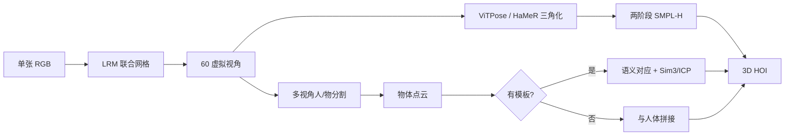
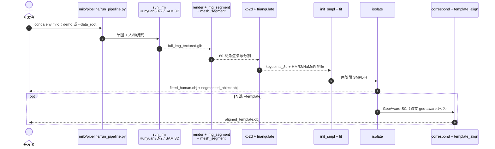

# MILO：大型重建模型解释人—物三维交互

**MILO**（*Reconstructing Humans and Objects in Interaction using Large Reconstruction Models*，[arXiv:2608.27407](https://arxiv.org/abs/2608.27407)，[项目页](https://ac5113.github.io/MILO)，[代码](https://github.com/ac5113/MILO)）由 **德州大学奥斯汀分校（UT Austin）** Agniv Chatterjee、Georgios Pavlakos 提出（ECCV 2026）：用 **大型重建模型（LRM）** 从单张 RGB 生成人—物联合网格，再分割并拟合 **SMPL-H** 与可选物体模板，把困难优化转为 **解释 LRM 几何**。

## 一句话定义

**LRM 的价值不仅是生成几何，更是提供保留人—物相对布局的交互脚手架；拟合只是在解释这团几何，而不是在二维歧义里硬搜接触。**

## 英文缩写速查

| 缩写 | 英文全称 | 简要说明 |
|------|----------|----------|
| MILO | Modeling Interactions using Large Reconstruction MOdels | 本文方法：解释 LRM 联合网格的单图 HOI |
| HOI | Human-Object Interaction | 人—物三维交互重建任务 |
| LRM | Large Reconstruction Model | 大规模图像到三维重建模型；默认 Hunyuan3D-2.0 |
| SMPL-H | SMPL with Hands | 带手部关节的参数化人体；本文拟合目标 |
| PA-CD | Procrustes-Aligned Chamfer Distance | 联合网格先刚体对齐后再分人/物/联合的 Chamfer（cm，↓） |
| HMR | Human Mesh Recovery | HMR2.0 提供相机系 SMPL 初值 |

## 为什么重要

- 单图 HOI 的旧默认是 **二维重投影 + 接触约束**。MILO 把先验来源换成 **联合 LRM 网格**，**无需 GT 接触** 即在 InterCap / HODome / IMHD 上压过 [PICO](./paper-notebook-pico-reconstructing-3d-people-in-contact-with-ob.md) 等基线。
- 项目页把贡献压成三句：**LRM 作脚手架 → 解释而非拟合 → 无接触仍 SOTA**。对机器人 teleop / 操作，产出是 **SMPL-H + 物体姿态/形状**，属于 [动作重定向管线](../concepts/motion-retargeting-pipeline.md) 的上游供给，不是策略本身。
- **已开源** [ac5113/MILO](https://github.com/ac5113/MILO)（MIT；SMPL-H / SAM 3 权重需各自注册）。2026-09-05 再核项目页与仓库入口仍互指。

## 核心信息

| 项 | 内容 |
|----|------|
| **机构** | 德州大学奥斯汀分校（UT Austin） |
| **会议** | ECCV 2026 |
| **输入** | 单张 RGB（RGBA 人+物联合掩码喂给 LRM） |
| **骨干 LRM** | Hunyuan3D-2.0（`--lrm hy3d`）；可换 SAM 3D Objects（`--lrm sam3d`） |
| **人体** | HMR2.0 + HaMeR 初始化 → 两阶段 SMPL-H 优化 |
| **开源** | **已开源** [ac5113/MILO](https://github.com/ac5113/MILO)（MIT；2026-09-05 再核） |

## 核心原理

输入是单张 RGB。Hunyuan3D-2.0 吐出 **一张人—物联合网格**。后续不再对原图做重投影拟合，而是 **解释这张网格**：

1. **60 虚拟视角渲染**（方位角每 30°，仰角 0 / ±30° / ±60°）。
2. **ViTPose + HaMeR** 在各视角检 2D 人体/手关键点，鲁棒三角化成 67 个 3D 点（置信度阈值 0.6，至少 3 视角）。
3. **两阶段 SMPL-H**：先 30 步只优化根朝向/平移/人体尺度（对齐 LRM 非公制尺度），再 60 步放开姿态与形状；Geman–McClure 鲁棒核 + VPoser / MANO / \(L_2\) 形状先验 + HMR 潜空间软锚定（\(\tau=2.5\)）+ 可见顶点单向 Chamfer（\(\lambda_{3D}=50\)）。
4. **多视角分割**抽出物体点云；无模板时直接与人体网格拼接。有 CAD 时用 GeoAware-SC 语义对应 + 加权 Sim(3) + ICP 对齐模板。

主贡献不在拟合器，而在 **联合脚手架**：人、物从同一张 LRM 网格里拆出来，相对布局已经被上游模型写死。

### 流程总览

## 源码运行时序图

官方仓 [ac5113/MILO](https://github.com/ac5113/MILO) 的入口是 `milo/pipeline/run_pipeline.py`；步骤模块对齐 `docs/PIPELINE.md`：

- **最短复现：** `git clone --recursive` → `bash scripts/install_milo.sh` → 按 `docs/DATA.md` 下权重 → `python milo/pipeline/run_pipeline.py --data_root demo --seq example --object trolley --object_prompt "a green trolleycase"`。
- **评测：** `milo/eval/prepare_dataset.py` 转 InterCap / HODome / IMHD 目录后，`scripts/eval_results.sh` 报 PA-CD（`icp` = LRM 点云；`template` = 对齐后的 CAD）。

## 工程实践

| 项 | 建议 |
|----|------|
| 环境 | 单环境 `milo`（Python 3.10 / PyTorch 2.6 / CUDA 12.6）。模板对齐的 `correspond` 另开 `geo-aware`，设 `MILO_CORRESPOND_ENV` |
| 默认 LRM | Hunyuan3D-2.0。SAM 3D Objects 需 HF 门控权重且官方写 **≥32 GB VRAM** |
| 掩码 | 图里多人/多物时 **自备** `image_human.png` / `image_object.png`；`auto_masks` 会并上所有检出实例 |
| 提示词 | `--object` 必须单词语（当文件名 key）；`--object_prompt` 用描述性短语（如 `"a green trolleycase"`） |
| 模板 | 细小物体（瓶/杯）才值得开 `--template`；大件或对称物可能翻面、联合误差变差 |
| 运行时 | RTX 6000 Ada 上核心管线 **344 s/图**，LRM 189 s + 渲染 89 s 是瓶颈；拟合本身约 32 s（PICO-fit 约 476 s） |
| 坐标系 | LRM 网格 **不在输入相机系**；要对齐原图还需额外刚体变换 |
| 许可 | 代码 MIT；SMPL-H / SMPL-X / VPoser / MANO 与 SAM 3 / SAM 3D 权重各自注册 |

## 实验与评测

指标一律是 **PA-CD（cm，↓）**：先对联合人+物做 Procrustes，再分别报人 / 物 / 联合。学习基线按 PICO 协议只用 BEHAVE 训练，属跨域评测。

| 数据集 | 设置 | PA-CD h | PA-CD o | PA-CD h+o | 对照读法 |
|--------|------|---------|---------|-----------|----------|
| InterCap | MILO 有模板 | 6.96 | **18.97** | **7.45** | 打过 PICO 7.43 / 21.85 / 10.33；无接触 |
| InterCap | MILO 无模板 | **6.85** | 20.74 | 9.36 | 人体略优于有模板；联合仍优于全部接触基线 |
| HODome | 有 / 无模板 | 9.50 / 9.71 | 12.97 / 13.75 | 6.68 / **6.38** | 无模板联合更好 |
| IMHD | 有 / 无模板 | 11.76 / **8.99** | 13.39 / **9.71** | 10.10 / **6.98** | 无模板全面更好；PICO 联合 13.24 |

其它必须带走的数字：

- **接触是几何推出来的，不是网络回归的。** 模板表面 5 mm 内的人体顶点当接触：InterCap 上 F1 **30.0** vs DECO RICH **9.37**，几何误差 39.6 cm vs 126.7 cm。
- **联合脚手架才是增益来源。** InterCap 无模板：EasyHOI 风格「只重建物体再重投影」无接触 37.21、加接触 12.08；SAM 3D 人/物分开再 MoGe 拼 15.89；MILO 9.36。
- **换 LRM 不换方法。** Hunyuan3D-2.0 联合 9.36；SAM 3D 联合 9.80；InstantMesh 10.84；oracle GT 网格 3.12——剩余误差主要卡在上游重建。
- **两阶段拟合都要。** 生 LRM 分割不做 SMPL-H：人体 30.58；只做根对齐 7.98；再放开姿态 6.85。
- **模板不是免费午餐。** 瓶 34.23→9.97、杯 42.91→18.64 明显受益；行李箱 17.46→21.79、椅 12.22→18.77、伞 17.88→26.76 会变差。对称物旋转误差常到 90°–120°。
- **野外。** PICO-db 只做定性：布局更自洽、穿透更少；该集无可靠 GT 模板。

## 结论

**单图 HOI 应优先解释 LRM 联合几何；模板与接触都是可选项，不是精度的前提。**

1. **先看联合 PA-CD，再看人/物分项。** InterCap 有模板联合 **7.45 cm** 是对 PICO 10.33 的主读数；无模板 9.36 仍赢全部接触基线。
2. **不要默认开模板。** HODome / IMHD 无模板联合更好（6.38 / 6.98）；大件与对称物对齐会翻面。
3. **增益来自联合脚手架，不是拟合器。** 人/物分开重建再拼（15.89）远差于同一张 LRM 网格（9.36）；oracle 网格 3.12 说明上限仍在 LRM。
4. **接触可从重建反推。** 5 mm 邻近规则 F1 30 vs DECO 9.37——先把人和物摆对，再谈接触监督。
5. **工程账：时间在 LRM，不在优化。** 核心 344 s/图，拟合约 32 s；模板语义对应再加约 376 s。
6. **输出不是机器人指令。** SMPL-H + 物体网格要再进 [重定向](../concepts/motion-retargeting-pipeline.md) 才可能上机；且 LRM 系 ≠ 相机系。

## 与其他工作对比

单图 HOI 的分歧点是「三维先验从哪来」：

| 路线 | 输入 | 三维先验 | 接触 | 相对 MILO |
|------|------|----------|------|-----------|
| **MILO** | 单张 RGB | **LRM 联合网格** | **不需要 GT** | — |
| [PICO](./paper-notebook-pico-reconstructing-3d-people-in-contact-with-ob.md) / CONTHO / PHOSA | 单张 RGB | 检索/已知 CAD + 参数人体 | 显式接触驱动优化 | 本文直接对照组；MILO 三套基准定量占优 |
| EasyHOI 风格 | 单张 RGB | **只重建物体** 再重投影 | 无接触则尺度/位置几乎无约束 | 联合 37.21→12.08（加接触）仍差于 9.36 |
| [ECHO](./paper-sa-2508-21556-echo-ego-centric-modeling-of-human-object-intera.md) | 头 + 腕稀疏追踪 | 三变量扩散 | 与姿态/物体运动联合恢复 | 传感形态不同：可穿戴/头显 vs 单目图像 |

- **同批次分工：** [CLAP 九篇地图](../overview/clap-cross-embodiment-vla-wm-9-papers-technology-map.md) 的「感知—执行接口」里，MILO 补 **三维交互几何**，[ViTaR](./paper-vitar.md) 补接触执行校准，[AlloEgo-VLM](./paper-alloego-vlm.md) 补参照系语义。

## 局限与风险

- **上限绑在 LRM。** 大物体残缺、截断、背景渗入、多物体粘连都会直接进脚手架；oracle 网格 3.12 vs 9.36 是这条边界的定量读法。
- **分割是第二故障源。** 多视角掩码一脏，接触带顶点就会标错；作者自己把点云分割精度写成后续瓶颈。
- **模板对齐怕对称与遮挡。** 语义对应只看到可见部分时，CAD 会贴到局部而不是整物。
- **单图、单人、单物。** 论文未来工作写明视频与多人/多物未覆盖。
- **复现门槛高。** 核心管线约 6 分钟/图；SAM 3 / SAM 3D / 人体模型均门控；这不是「clone 即可出数」的轻量 demo。
- **不是度量重建。** 第一阶段才估尺度；下游若当公制场景用，必须另做尺度标定。

## 关联页面

- [Manipulation](../tasks/manipulation.md) — 操作任务侧如何消费三维交互几何
- [动作重定向管线](../concepts/motion-retargeting-pipeline.md) — SMPL-H 输出进入机器人参考之前的必经阶段
- [PICO](./paper-notebook-pico-reconstructing-3d-people-in-contact-with-ob.md) — 接触驱动拟合的直接对照
- [ECHO](./paper-sa-2508-21556-echo-ego-centric-modeling-of-human-object-intera.md) — 头显稀疏追踪下的 HOI，传感形态不同
- [CLAP / 跨本体 9 篇技术地图](../overview/clap-cross-embodiment-vla-wm-9-papers-technology-map.md) — 同批次感知—执行接口分工

## 参考来源

- [milo_arxiv_2608_27407](../../sources/papers/milo_arxiv_2608_27407.md)
- [ac5113-milo 项目页](../../sources/sites/ac5113-milo.md)
- [ac5113-milo 仓库](../../sources/repos/ac5113-milo.md)
- [wechat_embodied_station_clap_9_papers_open_source_2026-08-31](../../sources/blogs/wechat_embodied_station_clap_9_papers_open_source_2026-08-31.md)

## 推荐继续阅读

- [arXiv:2608.27407](https://arxiv.org/abs/2608.27407)
- [MILO 项目页](https://ac5113.github.io/MILO)
- [ac5113/MILO](https://github.com/ac5113/MILO) — `docs/PIPELINE.md` / `docs/INSTALL.md`
