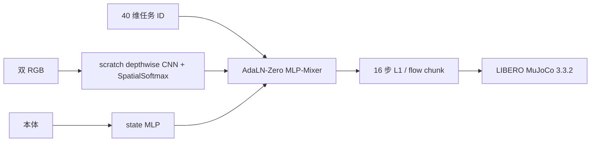
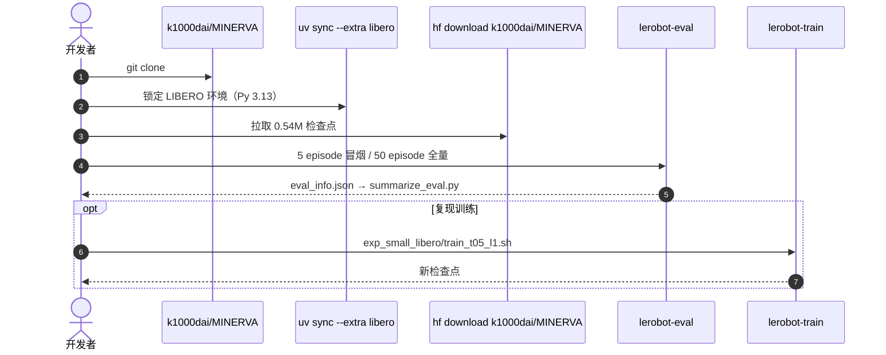

# MINERVA：LIBERO 需要多小的操作策略

**MINERVA**（*MINimal Efficient Robotic Vision-Action policy*，[arXiv:2609.03715](https://arxiv.org/abs/2609.03715)，[代码](https://github.com/k1000dai/MINERVA)）由 **东京大学** 松尾–岩泽研究室 Kohei Sendai、Tatsuya Matsushima、Yusuke Iwasawa 提出：十亿参数级 VLA 占据 LIBERO 榜，但基准真正需要的容量并不清楚。MINERVA 是一组刻意压小的 **task-ID 条件** 视觉运动策略，用来量这条 **闭集 40 任务** 的容量下限。官方 0.54M 模型用 **从头训练的 depthwise CNN + L1 action-chunk 头**，推理不使用语言编码器、预训练视觉骨干、VLM 或迭代生成采样；README 在同一台 RTX 5080 笔记本上给出 **CPU 5.1 ms/chunk**。

## 一句话定义

**开源小模型不是缩水版大 VLA，而是衡量「固定任务集最少要多少容量」的尺子；0.54M 已经能在 CPU 上出动作块。**

## 英文缩写速查

| 缩写 | 英文全称 | 简要说明 |
|------|----------|----------|
| MINERVA | MINimal Efficient Robotic Vision-Action | 本文小容量策略族 |
| LIBERO | Lifelong Robot Learning | 闭集操作基准（四 suite） |
| L1 | L1 regression | 直接回归 action chunk；headline 用这一头 |
| FM | Flow Matching | 对照用的 10 步 Euler 生成头 |
| AdaLN | Adaptive Layer Normalization | Mixer 动作头的条件归一化 |

## 为什么重要

- 纳入 [九篇盘点](../../sources/blogs/wechat_embodied_station_9_papers_open_source_2026-09-04.md) 的「边缘部署 / 容量下限」支线。
- 直接追问：LIBERO 高分是不是只是大模型在闭集上的过参数化。
- **已开源** 锁定环境与 2000-rollout 评测配方，数字可复核。
- **CPU 可跑**：0.54M L1 在官方测速机上 **5.1 ms/chunk / 0.03 GB**，相对 π₀.₅ CPU 约 **2500×** 更快；推理可以不配 GPU（渲染另说）。

## 方法

| 项 | 内容 |
|----|------|
| **机构** | 东京大学 松尾–岩泽研究室 |
| **输入** | 图像 + **任务 ID**（不是开放语言） |
| **容量** | 0.54M 为 headline；扫描至 ~10M |
| **结构** | 双 RGB → 共享 depthwise CNN + SpatialSoftmax；task-ID 嵌入；本体 MLP；16 步 AdaLN-Zero MLP-Mixer |
| **开源** | **已开源** Apache-2.0 + HF `k1000dai/MINERVA`（checkpoint pin `1b4fb174…`） |

### 流程总览

Headline 0.54M L1 还从公开 **2.75M teacher**（`t3C_2.75M`）做速度蒸馏；去掉蒸馏仍能训，但不是论文配方。

## 评测

论文：0.54M、四标准 suite、**2000** rollouts 平均 **95.1%**，仅比大约 **7700×** 参数的 LeRobot π₀.₅ 报告值低 **2.4** 个百分点。性能在约 **100 万** 参数附近饱和，低于 **25 万** 后崩塌。

README 同协议（每任务 50 episode、seed 1000、`mujoco==3.3.2`）给出单种子 headline：

| Policy | 参数 | Spatial | Object | Goal | Long | Average |
|--------|------|---------|--------|------|------|---------|
| MINERVA-0.5M (L1) | 0.54M | 96.8 | 99.6 | 97.4 | 89.2 | **95.75** |
| MINERVA-0.5M (flow) | 0.54M | 94.4 | 99.6 | 96.4 | 89.8 | 95.05 |
| MINERVA-10M (flow) | 9.66M | 98.4 | 99.0 | 98.4 | 94.0 | 97.45 |

其它发现：1M 三种子上 L1 与 flow 成功率不可分（95.97±0.80 vs 95.63±1.08），L1 前向更少；chunk 从 16 改成 8 或 32 三种子都掉分。**LIBERO-Plus** 扰动下成功率降至 **46–56%**。

推理成本（README，batch-1，RTX 5080 Laptop + 8 CPU 线程；只计策略出 chunk，不含仿真/相机）：

| Policy | 参数 | GPU ms/chunk | CPU ms/chunk | Peak VRAM |
|--------|------|--------------|--------------|-----------|
| **MINERVA-0.5M (L1)** | 0.54M | **2.2** | **5.1** | **0.03 GB** |
| MINERVA-0.5M (flow) | 0.54M | 8.2 | 8.9 | 0.03 GB |
| MINERVA-10M (flow) | 9.66M | 11.1 | 17.8 | 0.08 GB |
| SmolVLA | 450M | 118 | 1,010 | 0.97 GB |
| π₀.₅ | 4.14B | 196 | 12,781 | 9.36 GB |

## 结论

**标准 LIBERO 的「接近饱和」更多说明基准容量低，不能外推成开放指令 VLA 也只需要百万参数。**

1. **先读协议** — 2000 rollouts、hard reset、锁定渲染器；不要和少 episode 的 π₀.₅ 宣传值混比。
2. **容量曲线比单点分数重要** — ~1M 饱和、&lt;0.25M 崩塌。
3. **L1 够用，而且才是 CPU 故事** — 生成头不是闭集必需品；5.1 ms/chunk 来自单次前向，不是 10 步 flow。
4. **Plus 才暴露脆弱** — 46–56% 说明标准套件低估扰动。
5. **它不是通用 VLA** — README 写明不能执行未见指令；也未上过真机。
6. **锁渲染器** — Object 套件在 MuJoCo 3.3.5+ 可从 96%+ 掉到 0%（光照变了）。

## 源码运行时序图

全量 2000 rollouts 官方机器约 **55 分钟**；不要在 32 GB 主机上并发多份。

## 工程实践

| 项 | 建议 |
|----|------|
| 冒烟 | `uv run lerobot-eval ... --eval.n_episodes=5` |
| 全量 | `n_episodes=50`、`--seed=1000`、约 15 GB RAM |
| 训练 | `uv sync --extra libero --extra training` + `train_t05_l1.sh`（含 teacher 蒸馏） |
| CPU 推理 | GPU 可选；测速脚本 `exp_small_libero/benchmark_speed.py` |
| 误用 | 不要把它部署成开放语言家庭机器人；不要和 10-episode π₀.₅ 宣传值横比 |

## 局限与风险

- **闭集 task-ID** — 与语言条件 VLA 不是同一任务。
- **单种子 headline** — 95.75 是一个训练种子；论文另有种子带。
- **视觉从零训** — 光照扰动敏感，不能外推到预训练视觉骨干。

## 与其他工作对比

| 对照 | 差异读法 |
|------|----------|
| 十亿参数 VLA | 开放语言 + 预训练视觉；MINERVA 只量 LIBERO 闭集地板 |
| [Evo-1](./paper-evo1-lightweight-vla.md) | 0.77B 仍是 VLM+DiT；MINERVA 再小两个数量级且无语言 |
| [GIFT](./paper-gift-intermediate-feature-training.md) | GIFT 攻分布转移表征；MINERVA 攻容量下限 |
| [FWBC-VLA](./paper-fwbc-vla.md) | 真机接触 loco-manip；不是 LIBERO 容量尺子 |

## 关联页面

- [VLA](../methods/vla.md)
- [Manipulation](../tasks/manipulation.md)
- [开源可复现性 9 篇地图](../overview/open-source-reproducibility-9-papers-technology-map.md)
- [FWBC-VLA](./paper-fwbc-vla.md)

## 参考来源

- [minerva_libero_arxiv_2609_03715](../../sources/papers/minerva_libero_arxiv_2609_03715.md)
- [k1000dai/MINERVA](../../sources/repos/k1000dai-minerva.md)
- [具身智能小站 2026-09-04 九篇盘点](../../sources/blogs/wechat_embodied_station_9_papers_open_source_2026-09-04.md)

## 推荐继续阅读

- [arXiv:2609.03715](https://arxiv.org/abs/2609.03715)
- [MINERVA GitHub](https://github.com/k1000dai/MINERVA)
