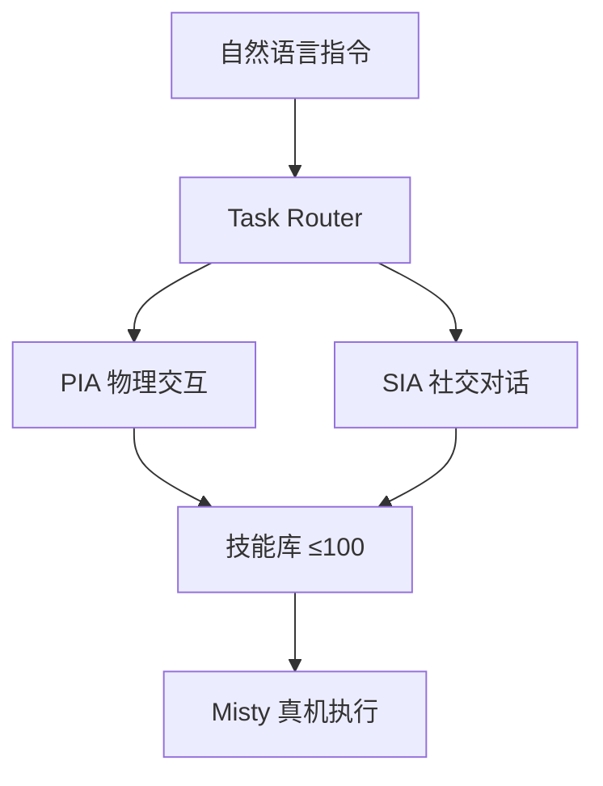
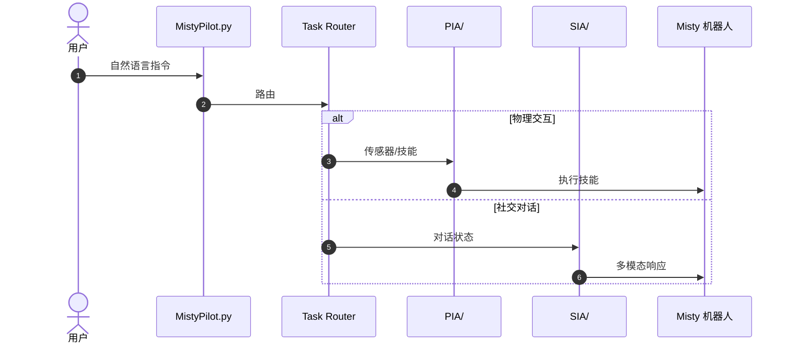

# MistyPilot：社交机器人的多智能体 LLM 技能编排

**MistyPilot**（*MistyPilot: Enabling Social-Robot Control through Multi-Agent LLM Skill Orchestration*，[arXiv:2608.15549](https://arxiv.org/abs/2608.15549)，[项目页](https://wangxiaoshawn.github.io/MistyPilot.html)，[代码](https://github.com/WangXiaoShawn/MistyPilot)）由 **纽约州立大学布法罗分校（SUNY Buffalo）** 提出：**Task Router** 将自然语言分派给 **PIA**（物理交互）或 **SIA**（社交对话），在 Misty 社交机器人上编排至多 **100 项技能**。

## 一句话定义

**社交机器人控制需要的不是单个万能代理，而是按交互类型分工的技能编排。**

## 英文缩写速查

| 缩写 | 英文全称 | 简要说明 |
|------|----------|----------|
| LLM | Large Language Model | 大语言模型路由与生成 |
| PIA | Physically Interactive Agent | 传感器触发与技能调用 |
| SIA | Social Interaction Agent | 对话状态与多模态响应 |
| HRI | Human-Robot Interaction | 人机交互场景 |

## 为什么重要

- 纳入 [2026-08-31 九篇盘点](../../sources/blogs/wechat_embodied_station_clap_9_papers_open_source_2026-08-31.md) 的「智能体编排」支线。
- 分离 **反应式物理交互** 与 **Stateful 社交对话**，避免单 agent 上下文混杂。
- Misty 真机五组件套件 + **12 人** 初步用户研究；扩展技能时方差低于单 agent 基线。

## 核心信息

| 项 | 内容 |
|----|------|
| **机构** | 纽约州立大学布法罗分校（SUNY Buffalo） |
| **平台** | Misty 社交机器人 |
| **架构** | Task Router → PIA / SIA |
| **开源** | **已开源** [WangXiaoShawn/MistyPilot](https://github.com/WangXiaoShawn/MistyPilot) |

### 流程总览

## 评测

- 五组件套件：路由、传感器—技能绑定、任务状态解析、结果复用、技能扩展。
- 真机执行传感器绑定与技能调用；用户研究报告可用性与交互质量积极。

## 与其他工作对比

「谁来编排技能」在本库里有三种答案，MistyPilot 选的是 **按交互类型分工的多 LLM agent**：

| 路线 | 编排器 | 状态维护 | 扩展方式 | 相对 MistyPilot |
|------|--------|----------|----------|-----------------|
| **MistyPilot** | **Task Router → PIA / SIA** | SIA 维护多轮对话状态；PIA 持久传感器—技能绑定 | 运行时注册技能，至多 100 项 | — |
| 单 agent LLM 基线 | 一个 agent 全包 | 反应式与 stateful 上下文**混在一起** | 加技能即加 prompt | 本文的直接对照组；扩展技能时 MistyPilot **方差更低** |
| [行为树 × VLA 编排](../concepts/behavior-tree-vla-orchestration.md) | **行为树**（显式结构） | BT 节点状态，可组合可恢复 | 改树结构 | 结构可审计、失败可回溯；MistyPilot 用语言路由换灵活性，代价是路由质量受底层 LLM 影响 |

- **抽象层级决定能力边界**：[LLM 机器人控制接口](../concepts/llm-robotics-control-interfaces.md) 的结论是「LLM 接在哪一层」比模型强弱更决定成败——MistyPilot 把 LLM 接在 **技能调用层**（而非直接控制层），这正是它能在真机稳定跑通的前提，读数字时应把访问级别当系统的一部分。
- **可迁移性的差距**：技能与传感器 API 绑定 Misty 平台，换本体需重写技能层；行为树路线的结构定义相对本体无关。
- **证据强度**：12 人用户研究属初步验证（见「局限与风险」），与同批次里有仿真/真机大规模评测的工作不在同一证据量级。

## 结论

**社交机器人应把物理技能与对话状态拆到专用 LLM agent，并由路由器统一编排。**

- PIA 持久传感器—技能绑定 + 运行时技能集成
- SIA 维护多轮任务状态并复用先前生成结果
- 组件级准确率高，扩展至 100 技能仍稳定
- 相对单 agent 基线方差更低
- 官方 Python 实现可直接在 Misty 上部署

## 源码运行时序图

## 局限与风险

- **平台绑定：** 技能与传感器 API 针对 Misty；迁移需重写技能层。
- **用户研究规模：** 12 人为初步研究，外部效度有限。
- **LLM 依赖：** 路由与生成质量受底层模型与延迟影响。

## 关联页面

- [VLA](../methods/vla.md)
- [CLAP / 跨本体 9 篇技术地图](../overview/clap-cross-embodiment-vla-wm-9-papers-technology-map.md)

## 参考来源

- [mistypilot_arxiv_2608_15549](../../sources/papers/mistypilot_arxiv_2608_15549.md)
- [wangxiaoshawn-mistypilot 项目页](../../sources/sites/wangxiaoshawn-mistypilot.md)
- [wangxiaoshawn-mistypilot 仓库](../../sources/repos/wangxiaoshawn-mistypilot.md)
- [wechat_embodied_station_clap_9_papers_open_source_2026-08-31](../../sources/blogs/wechat_embodied_station_clap_9_papers_open_source_2026-08-31.md)

## 推荐继续阅读

- [arXiv:2608.15549](https://arxiv.org/abs/2608.15549)
- [MistyPilot 仓库](https://github.com/WangXiaoShawn/MistyPilot)
