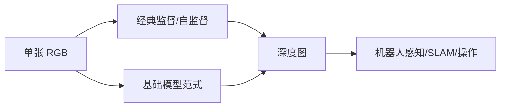
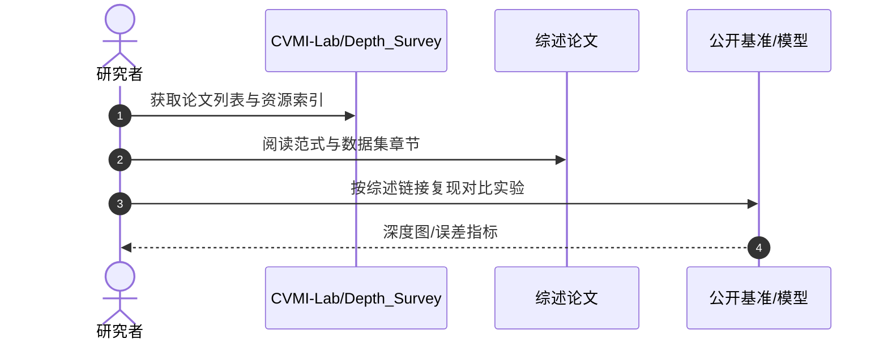

# 单目深度估计综述：进展与机遇

**Monocular Depth Estimation from a Single Image: Progress and Opportunities**（[arXiv:2609.01172](https://arxiv.org/abs/2609.01172)，[资源仓库](https://github.com/CVMI-Lab/Depth_Survey)）由 **香港大学（HKU）CVMI Lab** 撰写：系统梳理单目深度从早期学习方法到 **基础模型时代** 的演进、关键挑战、代表性数据集与下游应用。

## 一句话定义

**机器人空间智能的底座，仍离不开可靠、可评测且可部署的单目深度估计。**

## 英文缩写速查

| 缩写 | 英文全称 | 简要说明 |
|------|----------|----------|
| MDE | Monocular Depth Estimation | 单目深度估计 |
| SLAM | Simultaneous Localization and Mapping | 同步定位与建图 |
| FM | Foundation Model | 大规模预训练基础模型 |
| AR | Augmented Reality | 增强现实（重要下游之一） |

## 为什么重要

- 纳入 [2026-09-02 七篇盘点](../../sources/blogs/wechat_embodied_station_7_papers_contact_manipulation_2026-09-02.md) 的「几何感知底座」支线。
- 深度支撑 3D 重建、导航、操作与 Sim2Real 中的几何对齐。
- 基础模型时代方法分裂为 **判别式** 与 **生成式** 两大范式，选型需要统一坐标。
- **已开源** 综述配套资源仓库。

## 核心信息

| 项 | 内容 |
|----|------|
| **机构** | 香港大学（HKU）CVMI Lab |
| **范围** | 相对深度 vs metric depth；室内/室外/合成数据集 |
| **范式** | 经典 CNN/Transformer → FM 判别式与生成式 |
| **开源** | **已开源** [CVMI-Lab/Depth_Survey](https://github.com/CVMI-Lab/Depth_Survey) |

### 流程总览

## 评测

- 综述对比代表模型的定量与定性表现，并讨论视频深度延展。
- 数据出处：[ingest 摘录](../../sources/papers/monocular_depth_survey_arxiv_2609_01172.md)。

## 结论

**单目深度正在从「单任务网络」走向「可迁移基础模型」，但 metric 精度与域偏移仍是机器人部署门槛。**

- 相对深度与 metric depth 目标不同，评测不可混用
- 大规模预训练与合成数据是 FM 时代关键燃料
- 判别式与生成式范式在精度、速度与不确定性上各有权衡
- 视频深度与时序一致性是操作/导航场景的下一关
- 机器人感知应把深度模块纳入端到端系统验收
- 开源资源仓便于跟踪论文列表与基准链接

## 源码运行时序图

## 局限与风险

- **综述时效：** 基础模型迭代快，仓库需持续维护新工作。
- **机器人域：** 室内/室外摄影数据集与工业/操作场景存在域差。
- **metric 部署：** 相对深度模型直接用于抓取/碰撞检测需额外标定。

## 与其他工作对比（索引级）

| 维度 | 本综述覆盖的判别式 FM | 本综述覆盖的生成式（扩散）FM | RGB-D / 主动深度传感 |
|------|---------------------|--------------------------|--------------------|
| 输出 | 直接回归深度（相对或 metric） | 采样生成深度，可给多假设 | 硬件直接测距 |
| 速度 | 单次前向，利于机载 | 多步采样，通常更慢 | 传感器帧率 |
| 不确定性 | 需额外头/集成 | **采样方差天然可读** | 由材质/距离决定 |
| 尺度 | 相对深度需标定才 metric | 同上 | **天然 metric** |
| 典型软肋 | 域偏移下尺度漂移 | 时序一致性与延迟 | 反光/透明/远距失效 |

- **与 [ADM-BA](./paper-adm-ba.md) 的分工**：本综述回答「单帧深度从哪来、怎么选」，ADM-BA 回答「多视角深度怎么联合优化成一张可规划的图」；反光金属这类单目 FM 与主动深度都吃力的场景，正是 ADM-BA 用多假设分层网格接手的地方。
- **与 [PointDiT](./paper-pointdit.md) 的分工**：综述里的生成式 FM 多半还带着 VAE / 多步采样；PointDiT 把扩散直接放在原始点图上，单步就能出相机系 XYZ，BF1 高于 Depth Pro / MoGe-2，但输出是仿射不变、室外仍弱。
- **不要跨口径横比**：相对深度与 metric depth 目标不同（本页「结论」已列），综述内的排名不能直接搬到抓取/碰撞检测的验收指标上。
- 选型分层见 [Query：机器人视觉感知栈选型闭环](../queries/robot-perception-stack-selection-loop.md)。

## 关联页面

- [Manipulation](../tasks/manipulation.md)
- [VLA](../methods/vla.md)
- [Query：机器人视觉感知栈选型闭环](../queries/robot-perception-stack-selection-loop.md) — 本综述是①传感与标定层「不上 RGB-D 时深度从哪来」的选型底稿
- [ADM-BA](./paper-adm-ba.md) — 下游：多视角深度的联合优化与融合
- [PointDiT](./paper-pointdit.md) — 像素空间点图扩散：生成式但不走 VAE，已开源
- [接触丰富操作 7 篇地图](../overview/contact-rich-manipulation-7-papers-technology-map.md)

## 推荐继续阅读

- [arXiv:2609.01172](https://arxiv.org/abs/2609.01172)
- [CVMI-Lab/Depth_Survey](https://github.com/CVMI-Lab/Depth_Survey)

## 参考来源

- [monocular_depth_survey_arxiv_2609_01172](../../sources/papers/monocular_depth_survey_arxiv_2609_01172.md)
- [具身智能小站 2026-09-02 七篇盘点](../../sources/blogs/wechat_embodied_station_7_papers_contact_manipulation_2026-09-02.md)
- [cvmi-lab-depth-survey](../../sources/repos/cvmi-lab-depth-survey.md)
