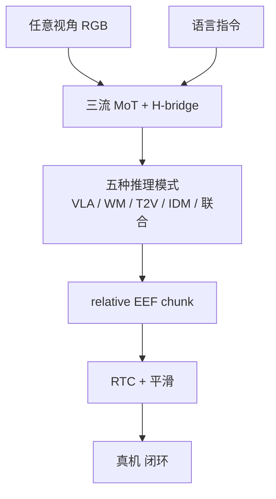

# Motubrain（世界动作模型 · arXiv:2604.27792）

**Motubrain**（*An Advanced World Action Model for Robot Control*，[arXiv:2604.27792](https://arxiv.org/abs/2604.27792)，[官网](https://www.motubrain.com/zh/)，[GitHub](https://github.com/shengshu-ai/Motubrain)）是 **生数科技** 与清华大学合作的 Joint WAM：在前作 [Motus](./paper-sa-2512-13030-motus-a-unified-latent-action-world-model.md) 的 UniDiffuser 统一 video–action 上，加上多视角、独立语言流、统一 relative EEF、Teacher-Forcing 自回归后训练与推理加速，宣称不靠额外 VLM 规划器 / 双系统 / 外部 memory 就能做长程双臂任务。

## 一句话定义

**别把感知、世界模型和动作头拆成三套网：用一个 MoT 同时学视频怎么变、指令是什么、手往哪动。**

## 英文缩写速查

| 缩写 | 英文全称 | 简要说明 |
|------|----------|----------|
| Motubrain | Motu Brain | 生数科技面向真机的 WAM 产品/报告 |
| WAM | World Action Model | 联合世界预测与动作生成 |
| MoT | Mixture-of-Transformers | 文本 / 视频 / 动作三流专家 |
| EEF | End-Effector | 相对末端增量，作跨本体统一动作 |
| IDM | Inverse Dynamics Model | Video-to-Action 推理，跳过完整视频生成 |
| RTC | Real-Time Chunking | 部署期异步动作块；对照见 [异步实证](./paper-wam-realtime-async.md) |

## 为什么重要

- **WAM 从论文范式走到产品栈：** Motus 验证「一次训练、五种推理模式」；Motubrain 补多视角、统一动作、闭环与加速，官网把它叫「从视觉推演到物理决策」。
- **仿真榜数字扎眼：** RoboTwin 2.0 Clean/Random **95.8 / 96.1**，README 称随机环境唯一超过 95。
- **适配叙事具体：** 50–100 条同本体轨迹迁到新人形；长程 >10 原子动作、左右手不同目标。
- **部署仍是第二篇论文：** 丝滑闭环的策略对照在 [2608.01880](./paper-wam-realtime-async.md)，不要和模型报告混成一篇。
- **今日不能复现：** 官方仓是 PDF + 图。

## 核心信息

| 字段 | 内容 |
|------|------|
| 作者 | Motubrain Team / Xiang, Bao, Liu, Tan, Bi, … / Jun Zhu |
| 机构 | 生数科技（Shengshu Technology）；清华大学 |
| 出处 | arXiv:2604.27792（2026-04，2026-07 更新） |
| 前作 | Motus（arXiv:2512.13030） |
| 动作 | relative EEF 统一表征 |
| 推理 | 完整联合 ~5 Hz；IDM / Video-to-Action ~11 Hz（项目页） |
| 开源（截至 2026-08-13） | **占位仓**：LICENSE（Modified MIT）+ `Motubrain.pdf` + README；**无脚本/权重** |

## 方法与核心结构

| 模块 | 作用 |
|------|------|
| **三流 MoT** | Text / Video / Action 分流通，中间层 **H-bridge** 做联合注意 |
| **多视角** | token 拼接 + view-dependent 3D RoPE offset，不绑死相机数 |
| **noisy condition** | 50% 对条件帧加高斯噪声，抗部署视觉扰动 |
| **预训练两段** | 先更视频支；再语言–条件视频–视频–动作全联合 |
| **后训练** | 非 AR 或 Teacher-Forcing AR + Diffusion，保动作连续 |
| **推理捷径** | 不生成完整未来视频，只更新 action 支（IDM） |

### 流程总览

## 源码运行时序图

**不适用**（截至 2026-08-13）：[`shengshu-ai/Motubrain`](https://github.com/shengshu-ai/Motubrain) **没有** 可辨识训练/推理入口。官网称前作 Motus 已开源，**不能**用来复现 Motubrain 报告数字。代码放出后应补：数据 → 两段预训练 → AR 后训练 → IDM/RTC 推理 的 `sequenceDiagram`。

## 工程实践

| 项 | 建议 / 官方叙事 |
|----|----------------|
| **何时跟** | 需要 Joint WAM 榜单坐标，或评估「无 VLM 规划器的长程双臂」主张 |
| **何时不跟** | 要可跑权重：今日没有；要异步切块细节：读 [2608.01880](./paper-wam-realtime-async.md) |
| **跨本体** | 官方口径 50–100 条同本体轨迹；动作用 relative EEF |
| **延迟** | 项目页 ~5 Hz 全联合、~11 Hz Video-to-Action；真机丝滑另做 RTC |
| **许可** | Modified MIT；超大规模商用须在 UI 展示 "MotuBrain" |
| **源码运行时序图** | **不适用**（原因见上节） |

## 实验与评测（官方 README / 项目页）

| 基准 | 数字 | 读法 |
|------|------|------|
| **RoboTwin 2.0 Clean / Random** | **95.8 / 96.1** | 高于 Motus 88.7/87.0、Fast-WAM 91.9/91.8、Being-H0.7 90.2/89.6 |
| **消融** | Non-AR 91.9/92.3；无预训练 91.5/91.3 | 预训练 + AR 都有贡献 |
| **WorldArena EWMScore** | 表 **63.77**（导语另写 64.87） | 运动质量项领先；图像美学低于 Veo/Wan |
| **CVPR 2026 RoboChallenge Table30v2** | 宣称第 3（2 台未测最优） | 真机限时赛，细节以赛事页为准 |
| **适配 / 长程** | 50–100 条；>10 原子动作 | 插花、倒水+拿面包、捞丸子重试等定性 |

数字以 README 表为准；完整设定见 PDF。

## 结论

**Motubrain 把 Motus 的统一 video–action 做成可讲的真机 WAM 产品叙事：仿真榜很高，但仓库今天还只是报告。**

1. **真影响：统一建模吃异构数据** — 纯视频、无指令轨迹、完整机器人数据走同一套五种模式。
2. **真影响：RoboTwin 随机环境 96.1** — 相对 π₀.₅ / Motus 的间隔够当选型锚点。
3. **真影响：部署是另一篇论文** — 5–11 Hz 只说明推理；chunk 怎么切看 [异步实证](./paper-wam-realtime-async.md)。
4. **次要代价：WorldArena 外观项不强** — 运动分高，图像质量/美学落后视频生成模型。
5. **工程读法：占位仓** — 可引数字、不可复现；Motus 开源 ≠ Motubrain 开源。

## 与其他工作对比

| 对照 | 差异读法 |
|------|----------|
| [Motus](./paper-sa-2512-13030-motus-a-unified-latent-action-world-model.md) | 范式前作（站内仍是 Awesome 索引级）；Motubrain 是规模与真机工程 |
| 传统 VLA（π₀ / π₀.₅） | 观察→动作映射；Motubrain 显式学世界演化再出动作 |
| [WAM 概念](../concepts/world-action-models.md) | 本页是生数线的产品级实例 |
| Fast-WAM / Being-H0.7 / LingBot-VA | RoboTwin 表内世界模型对照，均低于全文 Motubrain |
| [异步实证](./paper-wam-realtime-async.md) | 同一团队的部署层；模型页不重复六策略表 |

## 局限与风险

- **代码未落地：** 无法核对立项数字或接入真机。
- **EWMScore 两处不一致：** 导语 64.87 vs 表 63.77，引用用表。
- **真机主张偏定性：** 插花/双臂/重试是案例，不是公开协议榜。
- **商用许可附加条款：** 超大规模产品须展示品牌。

## 关联页面

- [Motus2](./paper-motus2.md) — 同族 GWM 三接口 + MBRL 自进化（灵巧双手）
- [WAM 实时异步部署](./paper-wam-realtime-async.md) — 同平台六策略实证
- [Motus（索引）](./paper-sa-2512-13030-motus-a-unified-latent-action-world-model.md) — 范式前作
- [World Action Models](../concepts/world-action-models.md)
- [VLA](../methods/vla.md) — 对照「只学观察–动作」
- [Action Chunking](../methods/action-chunking.md)
- [RoboTwin 2.0](./robotwin.md) — 主仿真榜
- [Manipulation](../tasks/manipulation.md)
- [WAM 动作后果分类 01](../overview/wm-action-consequence-category-01-wam-action-prediction.md)

## 参考来源

- [motubrain_arxiv_2604_27792.md](../../sources/papers/motubrain_arxiv_2604_27792.md)
- [官方仓归档（占位）](../../sources/repos/motubrain.md)
- [官网归档](../../sources/sites/motubrain-com.md)
- Motubrain Team — <https://arxiv.org/abs/2604.27792>
- 官网：<https://www.motubrain.com/zh/>
- 技术页：<https://www.genspi.com/zh/motubrain/>

## 推荐继续阅读

- Motus（前作）：<https://arxiv.org/abs/2512.13030> · 项目页 <https://motus-robotics.github.io/motus>
- 异步部署实证：<https://arxiv.org/abs/2608.01880>
- RoboTwin 2.0：<https://github.com/msc-robotwin/robotwin>
