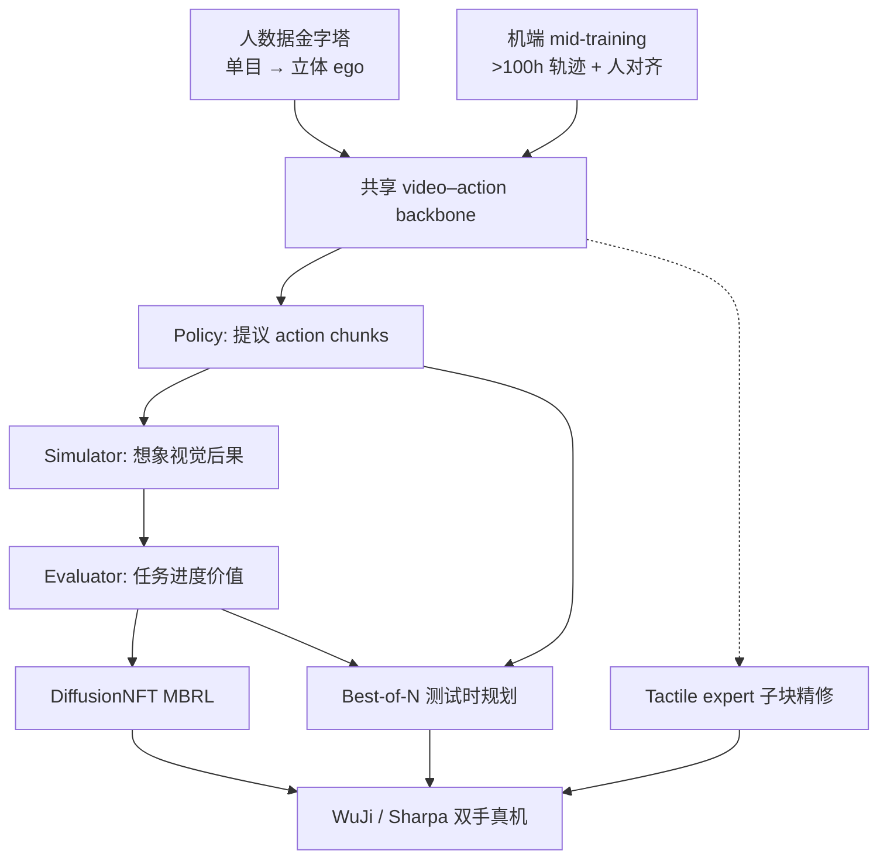
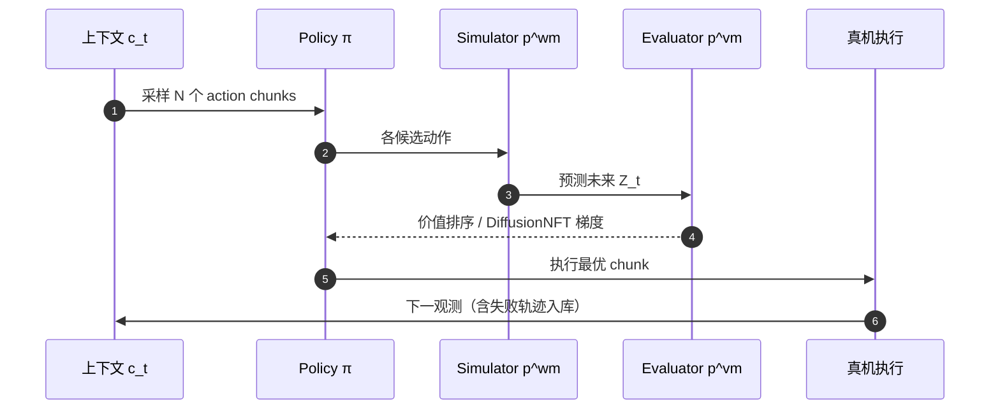

# Motus2（自进化通用世界模型 · arXiv:2608.30237）

**Motus2**（*A Self-Evolving General World Model for Dexterous Manipulation*，[arXiv:2608.30237](https://arxiv.org/abs/2608.30237)，[项目页](https://motus-robotics.github.io/motus2/)）在 [Motus](./paper-sa-2512-13030-motus-a-unified-latent-action-world-model.md) 的 UniDiffuser 式联合 video–action 上，把 **策略（WAM）**、**仿真器（动作条件世界模型）** 与 **评估器（价值模型）** 收进 **同一套共享参数**，并用 **DiffusionNFT** 与 **Best-of-N** 把「想象后果 → 打分 → 改策略」闭成环。数据侧沿 **~130K h 人数据金字塔**（单目 → 立体 ego）推进，再以 **>100 h** 机器人轨迹与人对齐做机端 mid-training；硬件覆盖 **WuJi / Sharpa** 双手与 **Tianji** 双臂，并配轻量 **tactile expert** 做接触精修。

## 一句话定义

**灵巧操作要自进化：别在仿真器外挂一个动作头——用同一 WAM 同时当策略、想象器和评委，再用失败轨迹教它「什么后果不好」。**

## 英文缩写速查

| 缩写 | 英文全称 | 简要说明 |
|------|----------|----------|
| GWM | General World Model | 统一感知–预测–行动–评估的通用世界模型框架 |
| WAM | World Action Model | 从观测与指令生成可执行动作块 |
| AC-WM | Action-Conditioned World Model | 给定动作块预测未来视觉状态（仿真接口） |
| MBRL | Model-Based Reinforcement Learning | 用学习到的模型改进策略 |
| NFT | Negative-aware Fine-Tuning | DiffusionNFT 中基于价值信号的扩散策略优化 |
| ego | Egocentric | 第一人称视角人/机交互数据 |

## 为什么重要

- **把 Motus 的「双接口 WAM」补成「三接口 GWM」：** 仅有未来预测不足以判断任务是否推进；价值模型 + MBRL 让失败与次优交互成为动力学与评估监督，而不只是噪声。
- **人数据金字塔有量化 scaling：** 立体 ego 子集 2K–20K 原始录制小时上，动作预测误差随数据量对数下降（项目页拟合 \(L=0.101-0.005\cdot\ln(D)\)）。
- **真机数字可读：** 匹配 SFT 协议下五任务宏平均 **84%**；在 Put Phone / Multi-Finger 上 **MBRL + Planning** 把宏平均从 **65%→75%**。
- **灵巧 + 触觉 + 记忆同页验证：** 非仅仿真榜——含 **Find Square / Press Button** 长程探测与 **撕纸 / 抽纸杯** 触觉任务。
- **今日不能复现：** 项目页与 `motus-robotics` 组织截至入库日 **无** 可运行代码仓。

## 核心信息

| 字段 | 内容 |
|------|------|
| 作者 | Hongzhe Bi, Zihao Zhou, Yihang Tang, Jingrui Pang, Shuhe Huang, … / Fan Bao, Jun Zhu |
| 机构 | GensPI（生数科技）；清华大学；北京航空航天大学；北京理工大学 |
| 出处 | arXiv:2608.30237（2026） |
| 前作 | Motus（arXiv:2512.13030） |
| 骨干初始化 | Wan 2.2-TI2V-5B（视频支路） |
| 机端数据 | mid-training **>100 h** 机器人轨迹 + 人对齐 |
| 开源（截至 2026-09-01） | **未开源** — 项目页未列 GitHub/权重；组织仅静态站仓 |

## 方法与核心结构

| 模块 | 作用 |
|------|------|
| **Policy（WAM）** | 从语言、本体感觉与视觉工作记忆提出 **action chunk** |
| **Simulator（AC-WM）** | 动作条件下预测未来视觉 latent（想象 rollouts） |
| **Evaluator（VM）** | 相对任务进度价值 \(Y\in[-1,1]\)；成功段正监督 + 失败/无关段负监督 |
| **Joint / action-first mask** | 预训练块内 video–action 双向；中后期动作不可读未来 video 与 value query |
| **DiffusionNFT** | 用 evaluator 分数更新 **动作通路**；video 与 value 组件在 MBRL 阶段冻结 |
| **Best-of-N** | 采样多候选 chunk → 想象未来 → 价值排序 → 执行最优支 |
| **Tactile expert** | backbone 去噪到中间态后，用近期触觉窗口逐 **子块** 精修；训练期辅未来力预测 |
| **Working memory** | 默认 **sliding window**；另评 global AR 与 Hybrid Memory |

### 流程总览

### 自进化闭环

## 源码运行时序图

**不适用**（截至 2026-09-01）：[`motus-robotics`](https://github.com/motus-robotics) 组织仅有 [`motus-robotics.github.io`](https://github.com/motus-robotics/motus-robotics.github.io) 静态站，**无** 可辨识训练 / 推理 / 部署入口。官方发布后应补：ego 预训练 → 机端 mid-training（三模式混合）→ SFT / MBRL / tactile expert → Best-of-N 部署 的 `sequenceDiagram`。

## 工程实践

| 项 | 建议 / 官方叙事 |
|----|----------------|
| **何时跟** | 需要 **GWM 三接口 + 灵巧双手真机** 坐标，或研究 **失败轨迹如何喂给 WM+VM** |
| **何时不跟** | 要可跑权重：今日没有；要纯仿真排行榜口径：本文主表是真机五任务 |
| **与 Motus / Motubrain 分界** | Motus 验证联合 WAM 范式（站内仍为索引级）；Motubrain 偏产品工程与 RoboTwin 榜；Motus2 强调 **价值闭环 + 人数据 scaling + 触觉/记忆** |
| **部署读法** | 默认 **sliding window** + **5 步** flow-matching 去噪；MBRL 想象用 4/8 步（动作/视频）；长程任务 global AR 优于 Hybrid Memory |
| **源码运行时序图** | **不适用**（原因见上节） |

## 实验与评测（官方）

### 主套件（真机，20 rollouts/任务，匹配 target-robot SFT）

| 任务 | Pretrain-SFT | Motus2 Midtrain-SFT |
|------|--------------|---------------------|
| Place Ball | 60% | **100%** |
| Multi-Finger | 35% | **70%** |
| Attach Eraser | 90% | **100%** |
| Screw Bulb | 55% | **90%** |
| Put Phone | 15% | **60%** |
| **宏平均** | **51%** | **84%** |

对照：WAN-SFT 与 \(\pi_{0.5}\) 在五任务上均为 **0%**（同协议）。

### MBRL 与 Planning（Put Phone + Multi-Finger）

| 变体 | Put Phone | Multi-Finger | 宏平均 |
|------|-----------|--------------|--------|
| Motus2 | 60% | 70% | 65.0% |
| + Planning | 65% | 70% | 67.5% |
| + MBRL | 65% | 80% | 72.5% |
| + MBRL + Planning | **70%** | **80%** | **75.0%** |

### 长程记忆探测（Find Square / Press Button）

| 设置 | Hybrid Memory | Global AR |
|------|---------------|-----------|
| 仿真宏平均 | 52% | **78%** |
| 真机宏平均 | 25% | **57.5%** |

### 触觉（Pull Out Paper Cup / Tear Paper）

| 变体 | 宏平均 |
|------|--------|
| w/o Tactile | 60.0% |
| w/ Tactile | **72.5%** |

## 局限与风险

- **未开源：** 截至 2026-09-01 无法复现训练与 MBRL 管线；数值以 PDF / 项目页为准。
- **评测以自有硬件与任务为主：** 与 RoboTwin / LIBERO 等同协议榜 **不可直接横比**；读作「灵巧双手 + 自进化闭环」证据，而非通用仿真 SOTA。
- **价值模型非校准成功率：** 输出为相对进度排序信号；失败轨迹可能出现「先升后降」形态，部署时需按任务设计阈值。
- **Global AR 记忆代价：** 仿真更好但 KV 随 episode 增长；默认部署仍用 bounded sliding window。

## 结论

**Motus2 把 Motus 的联合 WAM 推进成可自进化的 General World Model：真影响来自「三接口同参 + 失败轨迹进 WM/VM」与立体人数据 scaling，而非单独加一个 value head。**

1. **主读点：84% 五任务宏平均** — 相对 Pretrain-SFT **+33 pt**，说明机端 mid-training 与人先验组合有效。
2. **闭环增益：MBRL+Planning 75%** — 在 Put Phone / Multi-Finger 上 **+10 pt**（相对 65% 基线），规划与权重更新 **可叠加**。
3. **数据轴：~130K h 人金字塔 + >100 h 机端** — 立体 ego scaling 有对数律；与 [具身数据金字塔综述](./paper-data-pyramid-embodied-manipulation.md) 可对照阅读。
4. **触觉 +12.5 pt** — 接触丰富任务上轻量 expert 值得跟；与 [VT-WAM](./paper-vt-wam-visuotactile-contact-rich.md) 的「原生触觉 WAM」路线互补。
5. **工程边界：未开源** — 可引方法与 demo，不可当可复现基线；与 [FACT](./paper-fact.md)（失败感知因果训练 + 已开源）作失败数据利用对照。

## 与其他页面的关系

| 关系 | 页面 |
|------|------|
| 范式前作 | [Motus（索引）](./paper-sa-2512-13030-motus-a-unified-latent-action-world-model.md) |
| 同族产品工程 | [Motubrain](./paper-motubrain.md) |
| 概念 | [World Action Models](../concepts/world-action-models.md)、[Model-Based RL](../methods/model-based-rl.md) |
| 失败/价值对照 | [FACT](./paper-fact.md) |
| 数据视角 | [具身数据金字塔综述](./paper-data-pyramid-embodied-manipulation.md) |

## 参考来源

- [`sources/papers/motus2_arxiv_2608_30237.md`](../../sources/papers/motus2_arxiv_2608_30237.md) — 论文摘录
- [`sources/sites/motus2.md`](../../sources/sites/motus2.md) — 项目页与开源核查
- 论文：<https://arxiv.org/abs/2608.30237>
- 项目页：<https://motus-robotics.github.io/motus2/>

## 推荐继续阅读

- [Motus 原文](https://arxiv.org/abs/2512.13030) — UniDiffuser 式联合 WAM 前作
- [Motus2 项目页 Demo](https://motus-robotics.github.io/motus2/) — 多本体 / 能力标签真机视频
- [FACT（arXiv:2608.10232）](./paper-fact.md) — 另一套「失败轨迹 → 世界模型」开源实现对照
