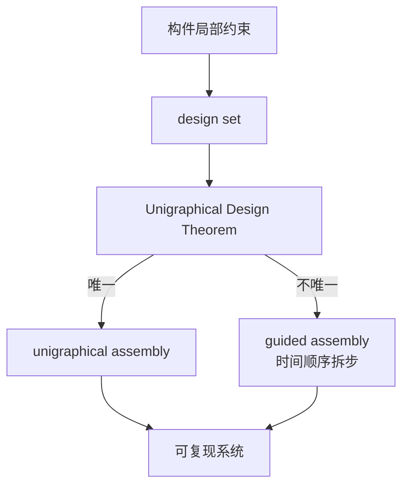
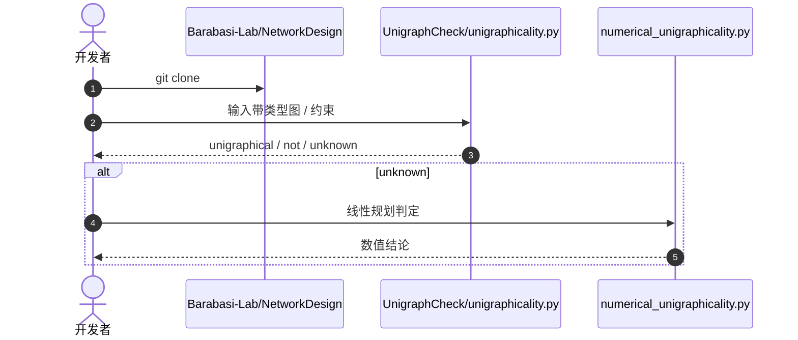

# 可复现网络的设计原则

**Design Principles for Reproducible Networks**（[arXiv:2609.03852](https://arxiv.org/abs/2609.03852)，[代码](https://github.com/Barabasi-Lab/NetworkDesign)）由 **中欧大学（CEU）** 与 **美国东北大学（Northeastern）** Barabási Lab 的 Jasper van der Kolk、Cory Glover、Albert-László Barabási 提出：蛋白复合体、电路与模块化机器人都只在「装配成精确拓扑」时才能工作，但网络科学长期生成的是 **ensemble** 而不是 **可复现的唯一结构**。本文将构件遵守的局部约束编码为 **design set**，并给出 **Unigraphical Design Theorem**：何时这些约束能保证装配成唯一结构（unigraphical assembly）；否则用时间顺序把构造拆成可唯一装配的步骤（**guided assembly**）。

## 一句话定义

**可复现可以写成硬件与形态设计的数学约束，而不只是实验记录里的附件。**

## 英文缩写速查

| 缩写 | 英文全称 | 简要说明 |
|------|----------|----------|
| UDT | Unigraphical Design Theorem | 判断 design set 是否保证唯一装配 |
| UA | Unigraphical Assembly | 约束已唯一确定结构 |
| GA | Guided Assembly | 用时间顺序拆成可唯一步骤 |
| CEU | Central European University | 第一作者单位 |

## 为什么重要

- 纳入 [九篇盘点](../../sources/blogs/wechat_embodied_station_9_papers_open_source_2026-09-04.md) 的「可复现设计」支线。
- 给模块化机器人、3D 打印组件和形态共设计一个可判定的装配唯一性语言。
- 配套 `UnigraphCheck` 可对带类型约束的图做判定。

## 方法

| 项 | 内容 |
|----|------|
| **机构** | 中欧大学、美国东北大学 Barabási Lab |
| **输入** | 带类型的构件约束 / 可选 binding matrix |
| **输出** | unigraphical / not unigraphical / unknown |
| **开源** | **已开源** `Barabasi-Lab/NetworkDesign`（无根 LICENSE） |

### 流程总览

## 评测

| 设置 | 结果（文内） |
|------|-------------|
| 可复现系统扫描 | **3618** 个（蛋白复合体、分子、机器人） |
| 物理验证 | 3D 打印组件实验 |
| 工具输出 | unigraphical / not / unknown（unknown 时走数值 LP） |

## 结论

**「能不能被精确复现」可以在装配前用约束定理判定，而不是等实物拼完再碰运气。**

1. **design set 是一等对象** — 先写局部约束，再谈生成网络。
2. **两条路径** — 约束已唯一，或用时间顺序制造唯一。
3. **unknown 不是失败** — 剪枝不够时改走数值方法。
4. **对机器人硬件有用** — 模块化本体和 3D 打印夹爪都能当 typed network。
5. **许可证缺失** — 仓内无 LICENSE，商用需另行确认。

## 源码运行时序图

## 工程实践

| 项 | 建议 |
|----|------|
| 入口 | `UnigraphCheck/README.md` + `unigraphicality.py` |
| 与开源人形对照 | [BRIDGE](./paper-bridge-humanoid.md) 谈形态共设计；本页谈装配唯一性 |
| 与夹爪对照 | [ARTiS](./paper-artis-gripper.md) 的 jamming/fin-ray 模块可当 typed blocks |

## 局限与风险

- **不是控制器论文** — 不给出步态或抓取策略。
- **无许可证** — 复现研究可用，产品化需法务确认。
- **unknown 比例** — 高特异度约束可能把问题推给数值求解。

## 与其他工作对比

| 对照 | 差异读法 |
|------|----------|
| 随机图 / 配置模型 | 生成 ensemble；本文要求唯一可复现实例 |
| [BRIDGE](./paper-bridge-humanoid.md) | 共设计形态与控制；本文判定装配是否唯一 |
| 传统 BOM / 装配手册 | 经验流程；本文给可判定定理 |

## 关联页面

- [Manipulation](../tasks/manipulation.md)
- [BRIDGE](./paper-bridge-humanoid.md)
- [开源可复现性 9 篇地图](../overview/open-source-reproducibility-9-papers-technology-map.md)

## 参考来源

- [network_design_arxiv_2609_03852](../../sources/papers/network_design_arxiv_2609_03852.md)
- [Barabasi-Lab/NetworkDesign](../../sources/repos/barabasi-networkdesign.md)
- [具身智能小站 2026-09-04 九篇盘点](../../sources/blogs/wechat_embodied_station_9_papers_open_source_2026-09-04.md)

## 推荐继续阅读

- [arXiv:2609.03852](https://arxiv.org/abs/2609.03852)
- [NetworkDesign GitHub](https://github.com/Barabasi-Lab/NetworkDesign)
