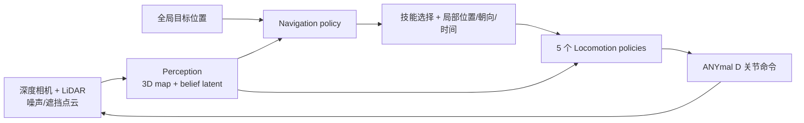

# ANYmal Parkour：分层技能库的四足敏捷导航

**ANYmal Parkour: Learning Agile Navigation for Quadrupedal Robots**（[arXiv:2306.14874](https://arxiv.org/abs/2306.14874)，Science Robotics 2024）由苏黎世联邦理工机器人系统实验室提出；平台是 ANYmal D，不是宇树机器人。

## 一句话定义

**用学习式 3D 场景重建提供 map + latent，用五个专项 locomotion 策略提供可执行技能，再让高层导航策略按场景选技能并发局部位置、朝向和到达时间命令。**

## 英文缩写速查

| 缩写 | 英文全称 | 简要说明 |
|------|----------|----------|
| RL | Reinforcement Learning | 低层技能与高层导航均在仿真训练 |
| LiDAR | Light Detection and Ranging | 与六个深度相机共同提供点云 |
| SEA | Series Elastic Actuator | ANYmal D 的 12 个串联弹性执行器 |
| ROS | Robot Operating System | 真机多节点部署与模块通信 |
| Sim2Real | Simulation to Real | 三个学习模块从仿真迁移到真机 |
| FoV | Field of View | 敏捷运动时感知遮挡的关键约束 |

## 为什么重要

- **不是单一“万能策略”：** 把攀、下、跳、钻、走分别训熟，再由高层组合，降低一个网络同时学所有接触模式的难度。
- **高层理解低层能力边界：** 同一目标会因箱体高度选择直上或绕行，不依赖硬编码技能切换。
- **感知输出面向控制：** 网络不仅补全地图，还提供 belief latent 给导航，处理遮挡、基座抖动和有限 FoV。
- **连续真机障碍：** 展示模块串接后的长程闭环，而非只在单障碍上报峰值动作。

## 核心信息

| 项 | 内容 |
|----|------|
| **机构** | 苏黎世联邦理工（ETH Zürich）机器人系统实验室 |
| **平台** | ANYmal D，约 55 kg，12 个 85 N·m SEA |
| **传感器** | 6 个 Intel RealSense 深度相机 + Velodyne Puck LiDAR |
| **技能** | rough walk、gap jump、climb up、climb down、crouch |
| **部署** | 感知异步运行于 Jetson Orin；navigation + locomotion 同步运行于机载节点 |
| **开源** | **部分开源**：仅 Zenodo 图表数据/绘图脚本；完整训练与部署代码未公开 |

## 流程总览

## 核心机制（方法栈）

### 1）学习式感知

感知模块从高度遮挡和带状态估计误差的点云重建周围 3D 几何；相较 elevation mapping，它能利用 learned prior 外推未直接观测区域。输出的显式 map 供低层落地，latent belief 供高层规划。

### 2）位置—时间条件低层技能

每个技能不是跟踪固定速度，而是接收局部目标位置、朝向和剩余时间。时间条件让策略可为跳跃加速、在窄平台急停，也允许高层用“更远目标 + 更短时间”调节紧迫度。

### 3）能力感知导航

外层 navigation policy 在内层技能执行闭环上训练；它选择技能及中间命令，因而从 rollout 中学到各技能的可达域。训练地形随机组合楼梯、斜面、箱体、缝隙和桌下空间。

## 源码运行时序图

**不适用。** Zenodo 资产只能重画 Fig. 3A/3B/4F；项目页未发布八个网络的训练、推理或 ROS 部署入口。

## 工程实践

| 层 | 实作重点 | 调试信号 |
|----|----------|----------|
| 感知 | 时间同步、外参、点云去噪、遮挡恢复 | map error、latent drift、端到端延迟 |
| 技能 | 单障碍难度课程，先各自达到稳定可达域 | success-vs-difficulty 曲线、峰值力矩 |
| 导航 | 在冻结/稳定技能库上训组合 | 技能切换频率、绕行率、到达时间 |
| 部署 | 感知异步，控制使用最新可用消息 | 消息年龄、推理 jitter、失联降级 |
| 安全 | 低摩擦、跌落、障碍移动恢复测试 | 摔倒恢复率、碰撞、温升 |

## 与其他工作对比

| 工作 | 控制结构 | 感知 | 技能组织 | 开源 |
|------|----------|------|----------|------|
| ANYmal Parkour | 感知 + 高层导航 + 五低层策略 | 六深度 + LiDAR 点云重建 | 显式选技 | 部分图表资产 |
| [Extreme Parkour](./extreme-parkour.md) | 单一深度 student | 前向单目深度 | 一个策略隐式切技 | 完整训练代码 |
| [Humanoid Parkour](./paper-notebook-humanoid-parkour-learning.md) | 单一 H1 全身策略 | 48×64 深度 | 一个策略覆盖十地形 | 未开源 |
| 经典 mapping + planning | 模块化几何规划 | elevation map | 手工 controller/switch | 易解释但敏捷性受限 |

## 实验与评测

- 真机连续障碍速度最高约 **2 m/s**，无需专家示范、离线轨迹或环境先验。
- 三个随机场景各做 1,000 次仿真 rollout；高层学习导航成功率约 **96.3%–98.2%**，人工放置中间目标的对照为 **60.9%–95.3%**。
- 跨沟训练范围最高约 **1 m**；真机展示 0.75 m 与 1.15 m 箱体下的直达/绕行动作选择。
- 系统能从箱体跌落后起身继续，并在低摩擦滑移、障碍执行中移动后重规划；但这些主要是演示而非规模化失败统计。

## 结论

**ANYmal Parkour 证明分层技能库能把“会过单障碍”升级为“知道何时用哪项技能”，而主要工程负担转移到多模块训练、感知时延和技能接口。**

1. **高层动作应表达低层可达目标** — 位置、朝向、时间比单纯速度更适合敏捷障碍。
2. **感知要同时服务地图和决策** — 显式重建与 belief latent 各有用途。
3. **分层结构提升可诊断性** — 可单独画每项技能的成功率—难度曲线。
4. **模块数量是现实代价** — 八个网络分别调参且互相依赖，迭代成本高。
5. **部分开放不等于可复现** — Zenodo 数据只能核验图表，不能训练或部署系统。

## 局限与风险

- 障碍类型与组合仍有限；扩展到坍塌建筑等开放世界需要新增技能与更广感知数据。
- 感知、五技能与导航共八个网络，模块更新会改变下游状态分布。
- 多相机 + LiDAR + Jetson Orin 的硬件成本和标定复杂度高于单目端到端方案。
- 论文没有公开完整代码、权重与机器人配置；复现实作只能依论文重建。

## 与其他页面的关系

- 平台：[ANYmal](./anymal.md)
- 路线入口：[感知越障纵深](../../roadmap/depth-perceptive-locomotion.md)
- 任务枢纽：[楼梯与障碍感知 locomotion](../tasks/stair-obstacle-perceptive-locomotion.md)
- 表示：[Terrain Latent Representation](../concepts/terrain-latent-representation.md)
- 对照：[Extreme Parkour](./extreme-parkour.md)、[Humanoid Parkour Learning](./paper-notebook-humanoid-parkour-learning.md)、[Agile Perceptive Traversal](./paper-agile-perceptive-traversal-sparse-3d.md)（部署期单策略 vs 本文技能库切换）

## 参考来源

- [论文与深读笔记归档](../../sources/papers/humanoid_pnb_anymal-parkour-robust-perceptive-locomotion.md)
- [官方项目页与开源核查](../../sources/sites/anymal-parkour.md)
- [Zenodo 图表数据与绘图脚本边界](../../sources/repos/anymal-parkour-plotting-artifact.md)
- 论文：<https://arxiv.org/abs/2306.14874>

## 推荐继续阅读

- [ANYmal Parkour 官方项目页](https://sites.google.com/leggedrobotics.com/agile-navigation)
- [机器人论文阅读笔记：ANYmal Parkour](https://imchong.github.io/Robot_Learning_Paper_Notebooks/papers/05_Locomotion/ANYmal_Parkour_Robust_Perceptive_Locomotion/ANYmal_Parkour_Robust_Perceptive_Locomotion.html)
