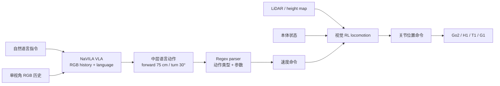
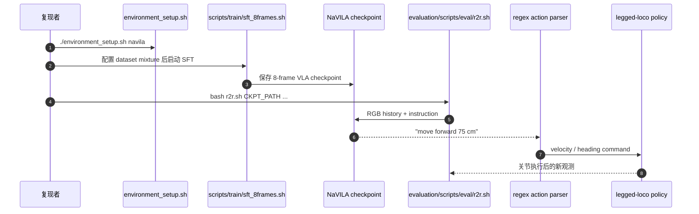

# NaVILA：腿式机器人视觉–语言–动作导航

**NaVILA**（*Legged Robot Vision-Language-Action Model for Navigation*，[arXiv:2412.04453](https://arxiv.org/abs/2412.04453)，RSS 2025）由 UC San Diego、USC 与 NVIDIA 提出：VLA 先把视觉与长语言指令翻译成“前进 75 cm / 右转 30°”等中层语言动作，再由视觉 RL locomotion policy 执行到关节。

## 一句话定义

**NaVILA 用语言作为高层 VLA 与低层腿式控制的窄腰接口：大模型负责语义与空间推理，实时 locomotion policy 负责避障、地形与本体动力学。**

## 英文缩写速查

| 缩写 | 英文全称 | 简要说明 |
|------|----------|----------|
| VLA | Vision-Language-Action | 将视觉和语言映射到中层导航动作的高层模型 |
| VLN | Vision-and-Language Navigation | 按自然语言在视觉环境中到达目标的任务 |
| VLN-CE | VLN in Continuous Environments | 连续空间版本的 R2R / RxR 导航基准 |
| SFT | Supervised Fine-Tuning | 用多源导航与 VQA 数据微调 VILA backbone |
| SR | Success Rate | 到达任务目标的比例 |
| SPL | Success weighted by Path Length | 同时衡量成功与路径效率 |

## 为什么重要

- **避开“LLM 直接吐关节”的错配：** VLM 擅长语言 token，不擅长高频连续关节；中层距离 / 角度命令更适合作为跨本体接口。
- **同一高层换不同腿：** Go2、H1、Booster T1 可复用 VLA，只替换低层 locomotion policy。
- **把真实人类视频引入 VLN：** 2k YouTube touring videos 处理成 20k trajectories，改善室外和未见场景泛化。
- **评测不再假设 teleport：** VLN-CE-Isaac 将关节动力学、碰撞和本体尺寸放进导航成功率。

## 核心信息

| 字段 | 内容 |
|------|------|
| 机构 | 加州大学圣地亚哥分校（UC San Diego）；南加州大学（USC）；英伟达（NVIDIA） |
| 发表 | Robotics: Science and Systems（RSS）2025 |
| 高层模型 | VILA 系视觉语言 backbone；单视角 RGB history → 中层语言动作 |
| 训练数据 | R2R-CE、RxR-CE、EnvDrop、ScanQA、通用 VQA、2k YouTube videos→20k trajectories |
| 低层 | Isaac Lab 单阶段视觉 RL；LiDAR / height map；训练吞吐 >60k FPS（RTX 4090） |
| 开源 | **已开源**：[AnjieCheng/NaVILA](https://github.com/AnjieCheng/NaVILA)（Apache-2.0）；HF checkpoint / annotations；[NaVILA-Bench](https://github.com/yang-zj1026/NaVILA-Bench) 与 [legged-loco](https://github.com/yang-zj1026/legged-loco) |

## 流程总览

## 核心机制（方法栈）

### 1. 中层语言动作

VLA 不生成离散固定步长或关节 token，而输出带空间量的文本动作。推理时正则表达式解析动作类型、距离和角度；论文实验中所有输出都能被 parser 匹配。该接口保留语言模型的生成习惯，同时让下游按机器人能力转换成速度。

### 2. 多源 SFT 数据混合

- **真实视频：** 2k YouTube touring videos 经 entropy sampling 得到 20k clips；MASt3R 估相机轨迹，VLM caption + LLM rewrite 生成指令。
- **仿真导航：** R2R-CE / RxR-CE shortest-path action；合并最多 3 个连续 25 cm 动作以产生多样距离标签。
- **辅助任务：** EnvDrop trajectory summarization、ScanQA 与通用 VQA，避免只记动作 token 而损失通用空间理解。
- 从 VILA stage-2 checkpoint 起步，vision encoder、connector、LLM 全部解冻训练 1 epoch。

### 3. 单阶段视觉 locomotion

Go2 的 15 Hz LiDAR 点云构建 2.5D height map；policy 同时读取 proprioception 和中层 velocity command，直接输出 12 个腿部关节目标。与先训 privileged teacher 再蒸馏不同，NaVILA 在 Isaac Lab 中单阶段 RL，利用 ray casting 直接探索避障策略。

### 4. VLN-CE-Isaac

从 R2R val-unseen 1839 条轨迹筛出 1077 条 mesh 质量较高且可通行路线，在 Isaac Sim 中放入 Go2 / H1，评估 VLA 与真实低层控制组合。它显式暴露机器人宽度、关节响应和窄缝不可通过等 Habitat 简化。

## 与其他工作对比

| 方法 | 指令 / 目标 | 高低层接口 | 局部避障 | 恢复 |
|------|-------------|------------|----------|------|
| NaVid | 自然语言 | VLA 离散中层动作 | 依赖连续环境执行 | 无显式 recovery |
| [DA-Nav](./paper-da-nav.md) | 商业导航方向 | 图像网格轨迹 | trajectory controller | ReDA + recovery CoT |
| [NavDP](./paper-notebook-navdp-learning-sim-to-real-navigation-diffusion.md) | Point / Image / NoGoal | 连续局部轨迹 | diffusion + critic | 每周期重选轨迹 |
| **NaVILA** | **长自然语言** | **参数化语言动作→velocity** | **视觉 RL locomotion** | 闭环重新出命令，无专门偏离监督 |

## 工程实践与开源状态

| 项 | 官方入口 / 注意点 |
|----|-------------------|
| 环境 | `./environment_setup.sh navila && conda activate navila` |
| 训练 | 修改 `llava/data/datasets_mixture.py` 路径，运行 `scripts/train/sft_8frames.sh` |
| 标准评测 | `evaluation/scripts/eval/r2r.sh CKPT_PATH ...`，再用 `evaluation/scripts/eval_jsons.py` 汇总 |
| 数据边界 | YouTube 原视频因版权不发布，只提供 video IDs 与 annotations；EnvDrop 也只提供 annotations |
| 兼容性 | VLN-CE 依赖旧 Habitat 0.1.7、特定 FlashAttention / Transformers / WebDataset，README 要求源码构建和 hotfix |
| 开源 | 训练、评测、模型、标注已发布；低层与 Isaac benchmark 分属补充仓库，完整真机链仍需硬件与机器人接口 |

## 源码运行时序图

标准仓库可直接验证高层 R2R-CE；端到端腿式链需额外接 `legged-loco` 或 `NaVILA-Bench`，不能把高层 benchmark 通过误写成真机复现完成。

## 实验与评测

- **R2R-CE val-unseen：** 单视角 RGB 的 NaVILA NE 5.22、OS 62.5%、SR **54.0%**、SPL **49.0%**；NaVid SR 37%。
- **RxR-CE：** SR **49.3%**、SPL 44.0%；仅 R2R 训练后零样本 RxR SR **34.3%**，高于 NaVid 23.8%。
- **VLN-CE-Isaac：** Go2 Vision SR **50.2%** vs Blind 36.2%；H1 Vision **45.3%** vs Blind 24.4%。
- **低层控制：** NaVILA linear / angular velocity error 0.066 / 0.113，collision rate **0.81**；ROA 为 0.161 / 0.152 / 3.09。
- **真机：** 25 instructions × 3 repeats；Go2 workspace simple / complex SR 1.00 / 0.80，home 1.00 / 0.67，outdoor 1.00 / 0.83；Booster T1 workspace 0.93 / 0.67、outdoor simple 0.89。
- **人类视频消融：** 不用 touring videos 时室外 Go2 SR 降为 0，说明真实视频是跨域泛化的关键而非装饰数据。

## 结论

**NaVILA 证明参数化语言动作是 VLA 与腿式控制之间有效的跨本体接口；性能来自数据混合、视觉低层和物理 benchmark 的共同作用，而非仅靠更大 VLM。**

1. **中层接口是系统核心** — 让高层推理低频运行，低层实时避障。
2. **真实视频显著影响室外泛化** — 去掉后真机 outdoor SR 崩溃。
3. **物理评测揭示 Habitat 乐观偏差** — H1 尺寸与执行误差使 SR 低于 Go2。
4. **vision locomotion 不是可选附件** — 对 Go2 / H1 分别带来约 14 / 21 个百分点 SR。
5. **开源链完整但环境重** — 数据版权、旧 Habitat 和多仓库组合仍是主要复现成本。

## 局限与风险

- 图像 VLA 计算量大，高层动作频率有限；动态障碍中的快速局部响应依赖低层策略。
- 文本 parser 是硬接口；超出动作语法、单位歧义或幻觉数值需要额外校验。
- 论文失败案例指向有限 spatial understanding；扩大真实仿真数据仍是必要工作。
- YouTube 视频只有 IDs / annotations，源视频删除或地区版权会破坏数据可重复性。
- 与 [DA-Nav](./paper-da-nav.md) 的后续评测表明 NaVILA 缺少专门偏离恢复监督；城市长程 CSR 不宜从室内 SR 外推。
- [Arcadia](./paper-arcadia.md) 把本页当主要导航基线，并批评 YouTube 外源轨迹与目标人形错位；其 Table 1 的 NaVILA 分数是 **Isaac 协议复现**（VLN-CE-Isaac SR 45.1%），不要和本页 Habitat R2R-CE 54% 横比。
- [Green for Go](./paper-green-for-go-vla-nav-grounding.md) 走另一条路：不重训 VLA，只用绿/红可通行 overlay 喂冻结 OmniVLA；那是开环航点正则，不能替代本页的腿式闭环 SR。
- [CrossTracer](./paper-crosstracer.md) 把 OmniVLA 改成像素轨迹提案，再用本体残差打 NaviTrace / 轮腿真机；窄腰是 8 个航点而不是本页的语言命令，且截至入库日无代码。
- [HumanoidVLN](./paper-humanoidvln.md) 把本页策略当 **零样本被测对象**（离散动作 + PD 跟踪）：G1 SR 28.19%，H1 SR 21.97% 且 FR **70.95%**——说明 VLN-CE-Isaac 的 H1 分数不能外推到「可通行筛选 + 摔倒即终止」协议。

## 与其他页面的关系

- [视觉–语言导航](../tasks/vision-language-navigation.md) — NaVILA 是腿式连续 VLN 的代表实现
- [导航纵深路线 Stage 4](../../roadmap/depth-navigation.md) — “语言→中层命令→locomotion”的分层锚点
- [VLA](../methods/vla.md) — 语言动作接口对“统一低层 action token”的替代设计
- [DA-Nav](./paper-da-nav.md) — 城市尺度方向指令与显式 recovery 对照
- [Arcadia](./paper-arcadia.md) — 生命周期闭环对照：自采数据 + 反馈写回；部分开源
- [Green for Go](./paper-green-for-go-vla-nav-grounding.md) — 冻结导航 VLA 的推理时可通行 overlay（对照；未开源）
- [CrossTracer](./paper-crosstracer.md) — 像素轨迹残差跨本体导航（NaviTrace；待核实开源）
- [HumanoidVLN](./paper-humanoidvln.md) — 人形物理 VLN 基准上的零样本被测对象（待开源）
- [NavDP](./paper-notebook-navdp-learning-sim-to-real-navigation-diffusion.md) — 可充当更快局部 trajectory system-1

## 参考来源

- [Paper Notebooks 原始归档](../../sources/papers/humanoid_pnb_navila-legged-robot-vision-language-action-model.md)
- [NaVILA 官方项目页核查](../../sources/sites/navila.md)
- [AnjieCheng/NaVILA 仓库归档](../../sources/repos/navila.md)
- 论文：<https://arxiv.org/abs/2412.04453>

## 推荐继续阅读

- [NaVILA 深读笔记](https://imchong.github.io/Robot_Learning_Paper_Notebooks/papers/08_Navigation/NaVILA_Legged_Robot_Vision-Language-Action_Model_for_Navigation/NaVILA_Legged_Robot_Vision-Language-Action_Model_for_Navigation.html)
- [RSS 2025 论文页](https://www.roboticsproceedings.org/rss21/p018.html)
