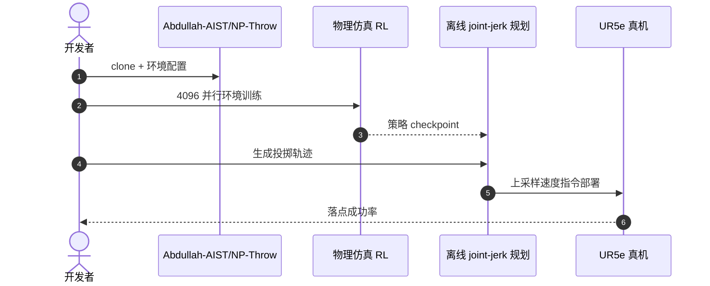

# NP-Throw：强化学习视角的非抓取投掷

**NP-Throw**（*Non-Prehensile Throwing: A Reinforcement Learning Perspective*，[arXiv:2609.00771](https://arxiv.org/abs/2609.00771)，IROS 2026，[项目页](https://abdullah-aist.github.io/NP-Throw/)，[代码](https://github.com/Abdullah-AIST/NP-Throw)）由 **日本产业技术综合研究所（AIST）** 与 **早稻田大学（Waseda University）** 提出：用 **强化学习** 直接优化关节空间轨迹，额外利用 **滑动与滚动** 接触模式，无需解析接触模型或低维轨迹参数化。

## 一句话定义

**非抓取操作打开的不是一个技能，而是一类超越传统 pick-and-place 的可达空间。**

## 英文缩写速查

| 缩写 | 英文全称 | 简要说明 |
|------|----------|----------|
| RL | Reinforcement Learning | 强化学习 |
| MDP | Markov Decision Process | 本文关节状态动力系统建模 |
| Sim2Real | Simulation to Reality | 仿真训练零样本真机部署 |
| YCB | Yale-CMU-Berkeley Object Set | 仿真泛化评测物体集 |

## 为什么重要

- 纳入 [2026-09-02 七篇盘点](../../sources/blogs/wechat_embodied_station_7_papers_contact_manipulation_2026-09-02.md) 的「非抓取操作」支线。
- 大、重、可变形物体难以抓取投掷，**非抓取（托盘）** 模式更自然。
- 传统模型法依赖简化接触与 SQP，易陷局部极小且表达受限。
- 仿真 **99%** 成功率，UR5e **零样本** 真机 **97%**（五物体九目标位）。
- **已开源** 训练与部署代码。

## 核心信息

| 项 | 内容 |
|----|------|
| **机构** | 日本产业技术综合研究所（AIST）；早稻田大学（Waseda University） |
| **平台** | UR5e（末端 ~5 m/s） |
| **物体** | 最重 790 g；最大 20×20×28 cm |
| **目标** | 最远 350 cm 水平 / 180 cm 高度 |
| **开源** | **已开源** [Abdullah-AIST/NP-Throw](https://github.com/Abdullah-AIST/NP-Throw) |

### 流程总览

## 评测

| 设置 | 结果 |
|------|------|
| 仿真 in-distribution | ~99% 成功率 |
| 仿真未见 YCB 物体 | 有效泛化 |
| 真机零样本（5 物体×9 目标） | 平均 97% |
| 摩擦敏感性 | 对动态摩擦高度敏感（滑动释放机制） |

## 结论

**混合接触动力学适合用 RL 隐式学习，而非手写模式切换与低维参数化。**

- 关节 jerk 动作空间避免解析接触模型
- 滑动/滚动模式由策略自行发现
- minimum-jerk 系统辨识缩小动力学差距
- 不确定性感知训练缓解物体模型误差
- 真机近物理极限速度仍保持高成功率
- 开源代码覆盖仿真训练与 UR5e 部署

## 源码运行时序图

## 局限与风险

- **平面假设：** 方法聚焦平面投掷，三维目标需扩展 formulation。
- **摩擦标定：** 对动态摩擦敏感，物体/台面材质变化需重训或域随机化加强。
- **安全：** 近 5 m/s 末端速度部署需严格工位围栏与急停策略。

## 与其他工作对比（索引级）

| 维度 | NP-Throw | 解析接触模型 + SQP 优化 | 抓取式投掷（TossingBot 一类） |
|------|----------|----------------------|--------------------------|
| 接触模式 | **滑动/滚动由策略自行发现** | 需事先假定并写死模式 | 抓稳后释放，接触被回避 |
| 动作空间 | 关节 jerk，全维轨迹 | 低维轨迹参数化 | 抓取位姿 + 释放速度 |
| 可投物体 | 大/重/难抓（最重 790 g，最大 20×20×28 cm） | 受模型简化限制 | **必须可抓** |
| 优化风险 | RL 采样成本 | **易陷局部极小** | 抓取失败即任务失败 |
| 真机迁移 | 零样本 97%（5 物体×9 目标） | 依模型精度 | 依抓取鲁棒性 |
| 敏感项 | **动态摩擦**（滑动释放机制） | 接触参数辨识 | 抓取几何 |

- **可比性边界**：99%/97% 的数字限于平面投掷、UR5e 与本文物体集；换台面材质或走三维目标 formulation 都要重测（见「局限与风险」）。
- **与抓取式投掷不是同一问题**：本文的价值主张是把「不可抓物体」纳入可投空间，而不是在可抓物体上刷更高落点精度。
- **对模型法的取代是有条件的**：RL 省掉了解析接触建模，代价换成了摩擦标定与域随机化；台面/物体材质稳定的产线上，模型法仍有可解释与可验证优势。

## 关联页面

- [Reinforcement Learning](../methods/reinforcement-learning.md)
- [Manipulation](../tasks/manipulation.md)
- [接触丰富操作 7 篇地图](../overview/contact-rich-manipulation-7-papers-technology-map.md)

## 推荐继续阅读

- [NP-Throw 项目页](https://abdullah-aist.github.io/NP-Throw/)
- [arXiv:2609.00771](https://arxiv.org/abs/2609.00771)

## 参考来源

- [np_throw_arxiv_2609_00771](../../sources/papers/np_throw_arxiv_2609_00771.md)
- [具身智能小站 2026-09-02 七篇盘点](../../sources/blogs/wechat_embodied_station_7_papers_contact_manipulation_2026-09-02.md)
- [NP-Throw 项目页](../../sources/sites/np-throw.md)
- [Abdullah-AIST/NP-Throw](../../sources/repos/abdullah-aist-np-throw.md)
