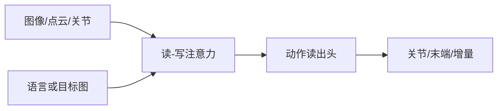
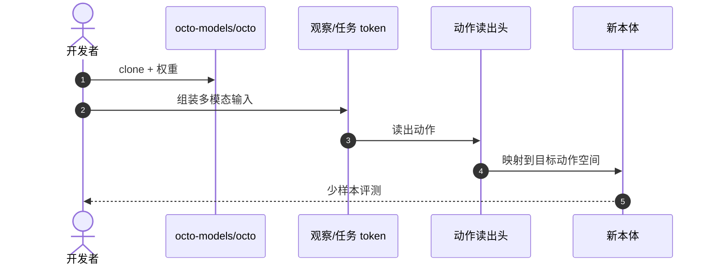

# Octo：灵活输入的开源通才操作策略

**Octo**（*Octo: An Open-Source Generalist Robot Policy*，[arXiv:2405.12213](https://arxiv.org/abs/2405.12213)，[项目页](https://octo-models.github.io/)，[代码](https://github.com/octo-models/octo)）由 **伯克利 / 斯坦福 / 谷歌** 提出：把任意观察（图像、点云、关节）与语言/目标图像统一成 token，用独立 **读出头** 适配新相机与动作空间。方法综述见 [octo-model](../methods/octo-model.md)；**`arxiv` 只挂在本页**。

## 一句话定义

**通才策略的关键是输入/动作接口可插拔，不是先把参数堆到 7B。**

## 英文缩写速查

| 缩写 | 英文全称 | 简要说明 |
|------|----------|----------|
| OXE | Open X-Embodiment | 跨本体预训练数据 |
| VLA | Vision-Language-Action | 可含语言条件的通才策略 |
| GC | Goal Conditioning | 目标图像条件 |
| DoF | Degrees of Freedom | 读出头要适配的动作维 |

## 为什么重要

- 纳入 [VLA/WM 阅读路线](../../sources/blogs/wechat_embodied_ai_lab_vla_wm_reading_roadmap_2026-09-02.md) 的架构灵活性支线。
- ~**27M** 参数即可工作，与 [OpenVLA 7B](./paper-openvla.md) 形成对照。
- 读出头是迁移主接口：新相机、新动作空间不必重训整网。
- **已开源** 代码与项目页权重。

## 核心信息

| 项 | 内容 |
|----|------|
| **机构** | 加州大学伯克利分校；斯坦福大学；谷歌 |
| **数据** | Open X-Embodiment 等混合轨迹 |
| **结构** | Transformer + 独立动作读出头 |
| **条件** | 语言和/或目标图像 |
| **开源** | **已开源** [octo-models/octo](https://github.com/octo-models/octo) |

### 流程总览

## 评测

- 强调少样本适配新机器人与新观测。
- 与 RT / OpenVLA 对照时，看的是 **接口灵活性** 而非单榜第一。
- 数字以 [原文](https://arxiv.org/abs/2405.12213) 为准。

## 结论

**新本体、新相机时先试 Octo 读出头微调；不要默认必须上 7B VLA。**

- 统一 token 序列比固定输入槽更重要
- 目标图像条件对「要到什么状态」类任务很有用
- 多机器人联合训练的代价是数据格式统一
- 通才操作 ≠ 人形全身控制
- 方法细节与选型叙事仍可读 [octo-model](../methods/octo-model.md)

## 源码运行时序图

## 局限与风险

- **负迁移：** 混合域权重不当会伤单本体。
- **层级：** 不替代低层 WBC / locomotion。
- **时效：** 检查点以官方仓为准。

## 与其他工作对比

| 工作 | 相对本页 |
|------|----------|
| [OpenVLA](./paper-openvla.md) | 更大 VLM，动作 token 固定 |
| [RT-1](./paper-rt-1.md) | 更早的固定视觉–动作接口 |
| [Open X-Embodiment](./paper-open-x-embodiment.md) | 数据层 |

## 关联页面

- [Octo 方法页](../methods/octo-model.md)
- [OpenVLA](./paper-openvla.md)
- [Open X-Embodiment](./paper-open-x-embodiment.md)
- [VLA/WM 14 篇路线](../overview/vla-wm-reading-roadmap-14-papers-technology-map.md)

## 推荐继续阅读

- [项目页](https://octo-models.github.io/)
- [arXiv:2405.12213](https://arxiv.org/abs/2405.12213)

## 参考来源

- [octo_arxiv_2405_12213](../../sources/papers/octo_arxiv_2405_12213.md)
- [具身智能研究室 VLA/WM 阅读路线](../../sources/blogs/wechat_embodied_ai_lab_vla_wm_reading_roadmap_2026-09-02.md)
- [octo-models](../../sources/repos/octo-models.md)
