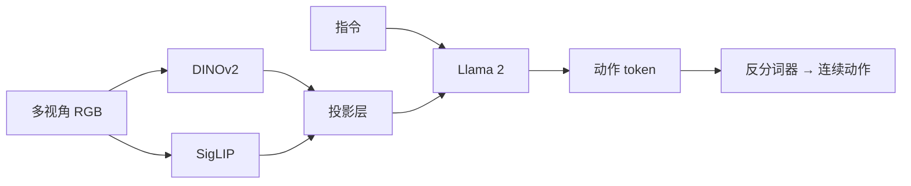
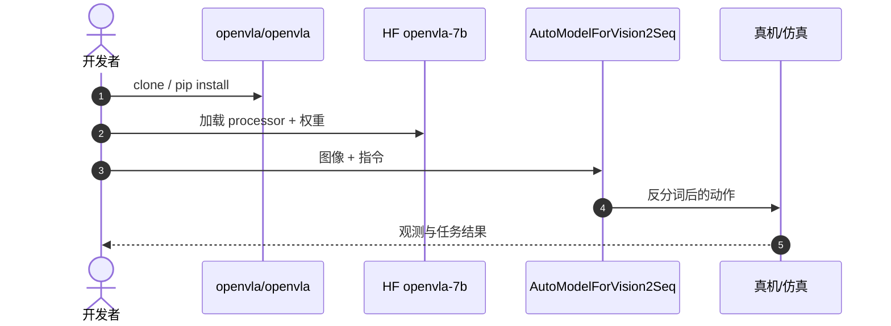

# OpenVLA：可复现的开源视觉–语言–动作模型

**OpenVLA**（*OpenVLA: An Open-Source Vision-Language-Action Model*，[arXiv:2406.09246](https://arxiv.org/abs/2406.09246)，[项目页](https://openvla.github.io/)，[代码](https://github.com/openvla/openvla)）由 **斯坦福 / 伯克利 / MPI** 提出：7B 参数、在 Open X-Embodiment 上预训练的开源 VLA，性能接近更大的闭源 [RT-2-X](./paper-rt-2.md) 量级，训练成本约 **$30k** 量级（文内口径）。

## 一句话定义

**用公开数据和 7B 权重，把 RT-2 的动作 token 路线变成社区可微调的默认 VLA。**

## 英文缩写速查

| 缩写 | 英文全称 | 简要说明 |
|------|----------|----------|
| VLA | Vision-Language-Action | 视觉-语言-动作策略 |
| OXE | Open X-Embodiment | 跨本体预训练数据 |
| LoRA | Low-Rank Adaptation | 低成本微调 |
| OFT | OpenVLA Fine-Tuning 变体 | 常用开源微调配方 |

## 为什么重要

- 纳入 [VLA/WM 阅读路线](../../sources/blogs/wechat_embodied_ai_lab_vla_wm_reading_roadmap_2026-09-02.md) 的开源主线。
- 软件实体见 [openvla](./openvla.md)；**本页是论文 canonical 节点**（`arxiv` 只出现一次）。
- DINOv2 管几何、SigLIP 管语言对齐，成为后续 VLA 视觉塔的常见配方。
- **已开源** 训练、推理与 HF 权重。

## 核心信息

| 项 | 内容 |
|----|------|
| **机构** | 斯坦福大学；加州大学伯克利分校；马克斯·普朗克研究所 |
| **视觉** | DINOv2 + SigLIP 双塔 |
| **语言** | Llama 2 7B |
| **动作** | 7 维各 256 bin 自回归 token |
| **数据** | OXE ~970k 轨迹 + 内部数据 |
| **开源** | **已开源** [openvla/openvla](https://github.com/openvla/openvla) |

### 流程总览

## 评测

- 文内口径（**2024 年原文发表时**）：开源 7B 相对当时闭源 SOTA 基线（RT-2-X 量级）约 **85%+** 相对水平；此为**发表时快照**，随后续 VLA 迭代会变，横比前请回 [VLA SOTA Leaderboard](./vla-sota-leaderboard.md) 与原文核评测协议。
- 目标机器人 **5k–10k** 步微调即可适配。
- 基准细节以 [原文](https://arxiv.org/abs/2406.09246) 与仓库 README 为准。

## 结论

**要跑通 VLA，优先 OpenVLA 权重与 LoRA/OFT，而不是等待闭源 RT-2 训练配方。**

- 双塔视觉把几何与语义拆开，比单 CLIP 塔更适合操作
- 动作 token 让 LLM 主干无需改输出头类型
- 预训练后微调是部署默认路径，不是可选
- 7B 仍有延迟税，高频控制要看 [π₀](./paper-pi0.md) 或轻量适配
- 软件栈细节（LeRobot、OFT）读 [openvla 实体](./openvla.md)

## 源码运行时序图

## 局限与风险

- **默认操作空间：** 不是导航/全身 WBC。
- **算力：** 全参微调门槛高，实用路径是 LoRA/OFT。
- **安全：** 零样本工业部署仍需围栏与标定。

## 与其他工作对比

| 工作 | 相对本页 |
|------|----------|
| [RT-2](./paper-rt-2.md) | 范式源头，闭源更大模型 |
| [Octo](./paper-octo.md) | 更轻、读出头更灵活 |
| [π₀](./paper-pi0.md) | 流匹配连续动作，非自回归 bin |

## 关联页面

- [OpenVLA 软件实体](./openvla.md)
- [RT-2](./paper-rt-2.md)
- [Octo](./paper-octo.md)
- [VLA](../methods/vla.md)
- [VLA SOTA Leaderboard](./vla-sota-leaderboard.md) — 社区多基准摘录榜，核对本页发表时相对位次是否已被后续工作刷新
- [VLA/WM 14 篇路线](../overview/vla-wm-reading-roadmap-14-papers-technology-map.md)

## 推荐继续阅读

- [项目页](https://openvla.github.io/)
- [arXiv:2406.09246](https://arxiv.org/abs/2406.09246)

## 参考来源

- [openvla_arxiv_2406_09246](../../sources/papers/openvla_arxiv_2406_09246.md)
- [具身智能研究室 VLA/WM 阅读路线](../../sources/blogs/wechat_embodied_ai_lab_vla_wm_reading_roadmap_2026-09-02.md)
- [openvla 仓库归档](../../sources/repos/openvla.md)
