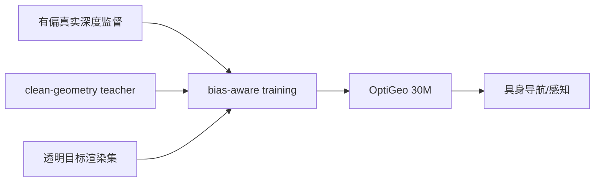
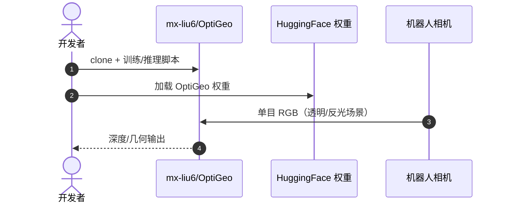

# OptiGeo：光学挑战场景的高效单目几何感知

**OptiGeo**（*Efficient Monocular Geometry for Embodied Perception in Optically Challenging Scenes*，[arXiv:2608.29881](https://arxiv.org/abs/2608.29881)，[项目页](https://mx-liu6.github.io/OptiGeo-web/)，[代码](https://github.com/mx-liu6/OptiGeo)）将透明、反光、镜面场景中的深度失真重定义为 **sensor-induced supervision bias**，用 **bias-aware training**（clean-geometry teacher + residual-trimmed alignment）修复有偏监督，并以 **透明目标渲染** 作紧凑干净几何来源。

## 一句话定义

**真实机器人几何感知必须正面处理传感器偏差，而不是靠更大模型硬扛透明玻璃。**

## 英文缩写速查

| 缩写 | 英文全称 | 简要说明 |
|------|----------|----------|
| MDE | Monocular Depth Estimation | 单目深度估计 |
| HF | Hugging Face | 模型权重托管平台 |
| teacher | Clean-geometry Teacher | 提供无偏几何监督的教师模型 |

## 为什么重要

- 纳入 [2026-09-01 七篇盘点](../../sources/blogs/wechat_embodied_station_7_papers_open_source_system_loop_2026-09-01.md) 的「感知长尾」支线。
- **30M 参数** 在透明场景 benchmark 上超过 **300M** 单目模型与 **十亿级** 多视角 baseline。
- 真机 **导航案例** 验证实用性。
- **已开源** 代码与 Hugging Face 权重。

## 核心信息

| 项 | 内容 |
|----|------|
| **机构** | 香港大学（HKU）等 |
| **参数量** | ~30M |
| **训练数据** | 小规模 targeted rendering set（透明几何） |
| **开源** | **已开源** [mx-liu6/OptiGeo](https://github.com/mx-liu6/OptiGeo)；[HF 权重](https://huggingface.co/mxliu-hku/OptiGeo) |

### 流程总览

## 评测

| 对比 | 读法 |
|------|------|
| 更大单目 MDE（300M） | 透明场景 benchmark 上 OptiGeo 更优 |
| 十亿级多视角 baseline | 仍被 30M OptiGeo 超过 |
| 真机导航 | 项目页展示光学挑战场景案例 |

## 结论

**光学挑战场景的几何感知关键是修监督偏差，而不是无限堆参数。**

- 将失败模式定位为 sensor-induced supervision bias
- bias-aware training + residual-trimmed alignment
- 透明渲染作紧凑干净几何来源
- 小模型超大规模基线
- 真机导航案例验证部署价值
- 代码与 HF 权重已发布

## 源码运行时序图

## 局限与风险

- **场景覆盖：** 主要针对光学挑战子集，通用开放域未必全面领先。
- **渲染域差距：** targeted rendering 与真实材质差异需持续扩充。
- **下游耦合：** 深度质量到导航/操作成功的链路依赖全栈。

## 与其他工作对比（索引级）

| 维度 | OptiGeo（~30M） | 更大单目 MDE（~300M） | 十亿级多视角基线 | RGB-D / 主动深度 |
|------|----------------|---------------------|----------------|-----------------|
| 破局假设 | **监督本身有偏**，先修监督 | 更大模型/更多数据能压住长尾 | 多视角几何约束能兜底 | 直接测距 |
| 透明/镜面 | 论文报告在该子集上领先前两者 | 跟随有偏 GT 一起错 | 视角一致性也被镜面破坏 | **物理上失效**（穿透/反射） |
| 参数量 | 30M，利于机载 | 10× | 30×+ | N/A |
| 数据来源 | 小规模透明目标渲染 + clean teacher | 大规模真实采集 | 大规模多视角 | 传感器 |
| 未声称 | **通用开放域全面领先** | — | — | — |

- **与 [单目深度综述](./paper-monocular-depth-estimation-survey.md) 的关系**：综述给出 MDE 的范式坐标系，OptiGeo 是其中「数据/监督侧」而非「架构侧」的一条改进路线——它的增益来自去偏，不是换 backbone，因此不能与综述里靠规模取胜的模型按同一条 scaling 曲线读。
- **评测口径限定**：领先结论限于透明/反光/镜面 benchmark 子集（本页「局限与风险」已注明），搬到通用开放域需重新评测。
- 在感知栈中的位置见 [Query：机器人视觉感知栈选型闭环](../queries/robot-perception-stack-selection-loop.md)。

## 关联页面

- [视觉–语言导航（VLN）](../tasks/vision-language-navigation.md)
- [Manipulation](../tasks/manipulation.md)
- [Query：机器人视觉感知栈选型闭环](../queries/robot-perception-stack-selection-loop.md) — OptiGeo 补的是①传感与标定层「深度图在光学长尾上不可信」这一格
- [单目深度综述](./paper-monocular-depth-estimation-survey.md) — MDE 范式全景，本文是其去偏支线
- [LightNav-0](./paper-lightnav-0.md) — 同批次导航栈对照

## 推荐继续阅读

- [OptiGeo 项目页](https://mx-liu6.github.io/OptiGeo-web/)
- [arXiv:2608.29881](https://arxiv.org/abs/2608.29881)

## 参考来源

- [optigeo_arxiv_2608_29881.md](../../sources/papers/optigeo_arxiv_2608_29881.md)
- [具身智能小站 2026-09-01 七篇盘点](../../sources/blogs/wechat_embodied_station_7_papers_open_source_system_loop_2026-09-01.md)
- [OptiGeo 项目页](../../sources/sites/optigeo.md)
- [mx-liu6/OptiGeo](../../sources/repos/mx-liu6-optigeo.md)
