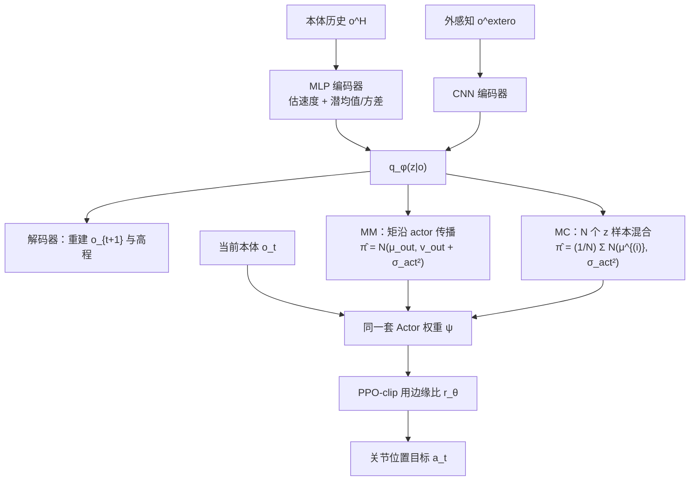
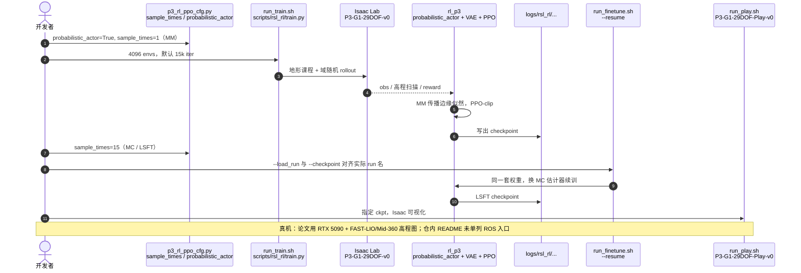

# P³：稳定 VAE 策略学习的概率传播

**P³**（*Probabilistic Policy Propagation for Stable VAE-Based Robot Learning*，[arXiv:2607.25541](https://arxiv.org/abs/2607.25541)，[代码](https://github.com/ylyem9x/P3_Open)）由 **上海交通大学 / 同济大学 / 浙江大学 / 上海创智学院** 提出：不改 VAE 感知架构，只把 PPO 的概率比与 KL 从「单个潜样本的条件策略」改成「对潜分布边缘化后的动作分布」，用 **矩匹配（MM）** 做低噪声主训，再用短程 **蒙特卡洛 LSFT** 补回对角近似丢掉的协方差。

## 一句话定义

**VAE 潜变量是分布不是点；PPO 必须比较边缘策略，而不是拿一次 $z$ 采样去 clip。**

## 英文缩写速查

| 缩写 | 英文全称 | 简要说明 |
|------|----------|----------|
| P³ / P3 | Probabilistic Policy Propagation | 本文：把 VAE 潜分布传播进 PPO 边缘似然 |
| VAE | Variational Autoencoder | 本体历史 + 外感知 → 随机潜变量 $z$ |
| PPO | Proximal Policy Optimization | clip 概率比的 on-policy 更新；本文修的是比的估计对象 |
| MM | Moment Matching | 对角一/二阶矩沿 actor 层解析传播，确定性边缘近似 |
| MC | Monte Carlo | $N$ 个 $z$ 样本的高斯混合平均，逼近真边缘 |
| LSFT | Latent Sample Fine-Tuning | MM 平台后再切 MC 的短程校准 |
| $D_{\mathrm{eff}}$ | Data Efficiency | 同等策略下概率比仍落在 clip 区间内的样本比例 |
| G1 | Unitree G1 Humanoid | 29-DoF 真机平台；踏石 / 楼梯 / 缺口评测 |

## 为什么重要

- **修的是已大规模使用的栈，不是新感知故事：** [DreamWaQ](../methods/dreamwaq.md)、[PIE](../methods/pie-perceptive-locomotion.md) 与后续人形感知内部模型都把 VAE 潜变量喂给 PPO actor。经验上「VAE-PPO 难训、晚收敛、渐近差」，本文给出可检验的原因：单样本似然把分量高斯当成边缘策略。
- **数字可读：** 同等策略诊断下单样本只保住 **64.6%** 样本不被错误 clip；MM 到 **100%**；完整 $P^{3}$ 比最强 MC-only（$N{=}50$）少 **>20%** 收敛步，MuJoCo 与 G1 真机都是最好一档。
- **工程可跑：** 官方仓在 [Isaac Lab](./isaac-lab.md) + 定制 `rl_p3` 上给出 MM 主训 / LSFT / play 脚本，适合作为「VAE-PPO 优化补丁」试验台，而不是再造一套地形编码器。

## 核心信息

| 项 | 内容 |
|----|------|
| **机构** | 上海交通大学；同济大学；浙江大学；上海创智学院 |
| **状态** | arXiv 预印本（2026-07-28 提交） |
| **平台** | Unitree G1，29 DoF；策略 50 Hz；仿真 200 Hz |
| **栈** | Isaac Sim 5.1.0 + Isaac Lab v2.3.0 + RSL-RL；4096 并行环境 |
| **感知** | 本体历史 MLP + 外感知 CNN（高程扫描）；VAE 重建下一本体与外感知 |
| **真机** | 笔记本 RTX 5090 推理；FAST-LIO + Livox Mid-360 → 机器人中心高程图 |
| **开源** | **已开源**：训练 / LSFT / Isaac 回放齐全；无 LICENSE 元数据；权重需自训。真机 ROS 入口未在 README 单列 |

## 流程总览

默认日程：**MM 主训到课程平台 → 切 MC（论文 $N{=}15$）做 LSFT**。两估计器共享 encoder/actor，只换 $\widehat{\pi}(a|o)$ 的计算方式。

## 核心原理

有效控制策略是对潜空间的边缘：

$$
\pi_\theta(a_t\mid o_t)=\int p_\psi(a_t\mid z_t)\,q_\phi(z_t\mid o_t)\,dz_t.
$$

每个 $z$ 只诱导一个较窄的动作高斯；边缘把这些分量叠成更宽的分布。用单个 $z$ 去算 $r_\theta=\pi(a|o)/\pi_{\mathrm{old}}(a|o)$ 会：

1. **系统性扭曲 log-ratio** → KL 相对高样本参考大约高估 3 倍，有益动作被误 clip、越界更新却罚不到。
2. **给 surrogate 梯度加 $\mathrm{Noise}_{latent}\propto A^2 d_a \sigma_{\mathrm{vae}}^2\|\mathbf{J}_\psi\|_F^2/(N\sigma_{\mathrm{act}}^4)$** → 人形高 $d_a$ 更严重；Adam 在 $\sigma_{\mathrm{act}}$ 变小时把有效学习率压死。

**MM** 把 $(\boldsymbol{\mu}_z,\boldsymbol{\sigma}_z^2)$ 经 $\mathbf{v}_{out}=(\mathbf{W}\circ\mathbf{W})\mathbf{v}_{in}$ 与 ELU 的解析矩传到动作空间，条件于观测是确定性的，从根上消掉有限样本比抖动。代价是对角协方差，动作维之间的相关会被低估。

**MC** 用 $N$ 个并行 $z$ 样本混合，随 $N$ 逼近真边缘并保留相关结构，但时间和显存随 $N$ 涨（附录：$N{=}50$ 策略学习约 31.9 GB / 1.22 s/epoch，MM 约 15.1 GB / 0.96 s/epoch；墙钟仍由环境交互主导）。

**LSFT** 的工程读法：先用 MM 拿到强均值策略，再让 actor 在 $q_\phi$ 的支撑上「见过」非线性变换后的不确定性——这比全程 $N{=}50$ 便宜，也比停在 MM 更耐 sim2real 潜漂移。

## 源码运行时序图

官方仓 [ylyem9x/P3_Open](https://github.com/ylyem9x/P3_Open) 提供 Isaac Lab 训练、LSFT 与回放入口（归档见 [sources/repos/p3-open.md](../../sources/repos/p3-open.md)）：

- **最短复现路径：** 装 Isaac Sim 5.1.0 / Lab v2.3.0 → `bash run_train.sh` → 改 `sample_times` 并修正 `run_finetune.sh` 的 `--load_run` / `--checkpoint` → `bash run_play.sh`。
- **论文 vs 脚本：** 正文是 **7k MM + 1k LSFT**；shell 默认 **15k 主训**，微调脚本硬编码 `P3_NoLSFT/model_14000.pt`，play 指向 `P3_LSFT/model_16000.pt`。按自己的 run 目录改路径，不要假设预置权重存在。

## 工程实践

| 项 | 建议 |
|----|------|
| 何时用 P³ | 已有 **VAE 编码器 + PPO actor**（DreamWaQ / PIE / 感知内部模型类）且训练不稳、课程上不去、晚期 $\sigma_{act}$ 塌不下去 |
| 何时不必上 | 确定性 AE / 无随机 $z$ 的 MLP actor；问题不在 clip 比估计 |
| 默认配方 | `probabilistic_actor=True`，先 `sample_times=1`（MM），平台后再 `sample_times=15` 短微调 |
| 网络（论文 Table 4） | Actor/Critic $[512,256,128]$ ELU；本体 VAE latent **10**；外感知 CNN latent **100**；$\beta{=}0.1$ |
| PPO | $\gamma{=}0.99$，$\lambda{=}0.95$，5 epoch，4 minibatch，$\varepsilon{=}0.2$，熵 0.01；**按 KL 自适应学习率**（目标 KL 0.02） |
| 诊断 | 同等策略下测 $D_{\mathrm{eff}}$；单样本若远低于 90%，优先修似然估计而不是再加奖励项 |
| 部署 | 训练用边缘似然；推理仍是一次前向出关节目标。真机另接高程图与 FAST-LIO，不要假设开源仓已含该桥 |

## 实验与评测

**数据效率（同等策略诊断，Table 1）**

| 估计器 | $D_{\mathrm{eff}}\uparrow$ |
|--------|----------------------------|
| MC $N{=}1$（VAE 基线） | 64.6% |
| MC $N{=}5$ / $15$ / $50$ | 79.3% / 89.8% / 96.5% |
| MM（$P^{3}$-MM） | **100.0%** |

**MuJoCo 迁移（Table 2）与真机 10 trial（Table 3）**

| 方法 | MuJoCo Reward / Lifetime | 踏石 / 楼梯 / 缺口 |
|------|--------------------------|-------------------|
| VAE | 16.2 / 15.4 | 6 / 7 / 7 |
| AE | 17.9 / 18.0 | 4 / 7 / 7 |
| MC-only $N{=}50$ | 18.2 / 19.4 | 8 / 7 / 9 |
| $P^{3}$-MM | 18.9 / 19.7 | 7 / 7 / 9 |
| **$P^{3}$（MM+LSFT）** | **20.1 / 20.0** | **8 / 9 / 10** |

课程主指标是训练群体达到的地形难度；成功停止要求平台且终态难度 ≥4.5。$P^{3}$ 约 8k epoch 达标；MC-only $N{=}50$ 约 10k；单样本 VAE 与 $N{=}5$ 在 15k 内不收敛。

## 结论

**真影响指标的是「PPO 有没有在比较边缘策略」；多采几个 $z$ 能缓解，但 MM+短 LSFT 比全程大 $N$ 更划算，对角 MM 单独上真机还不够。**

1. **先修似然再堆感知：** $D_{\mathrm{eff}}$ 从 64.6% 到 100% 来自估计器，不是新 CNN。VAE 训练不稳时优先查 clip 比是否用了单样本 $z$。
2. **MM 负责收敛，LSFT 负责迁移：** $P^{3}$-MM 已在 MuJoCo 超过 $N{=}50$ MC-only；楼梯真机 7→9、缺口 9→10 来自 LSFT，说明对角矩低估的方差在 sim2real 上是真代价。
3. **不要用全程 $N{=}50$ 当默认：** 显存约翻倍，收敛还慢于 MM+LSFT；论文把 $N{\ge}50$ 标成「准但贵」。
4. **人形 $d_a$ 放大噪声：** 公式里 $\mathrm{Noise}_{latent}\propto d_a/\sigma_{act}^4$；G1 29 维比四足更容易在探索方差下降时训崩。
5. **复现对齐脚本不是对齐论文 epoch：** 仓内 15k/硬编码 ckpt 名与正文 7k+1k 不一致；以 `p3_rl_ppo_cfg.py` 与实际 log 目录为准。
6. **开源边界：** 可复现 Isaac 训练与回放；真机 LiDAR 高程桥与权重不在 README 主路径里。

## 与其他工作对比

| 维度 | P³ | [DreamWaQ](../methods/dreamwaq.md) / [PIE](../methods/pie-perceptive-locomotion.md) | [PHP](./paper-hrl-stack-22-perceptive_humanoid_parkour.md) / [LightLP](./paper-light-loco-parkour.md) |
|------|----|------------------------------|-------------------------------|
| 主贡献 | **优化：** 边缘策略似然 | **表征：** 隐式地形 / 显式+隐式估计 | **技能：** 跑酷参考合成与蒸馏 |
| 感知 | 沿用简易 VAE+CNN 高程 | CENet / 多头估计器 | 深度 + 技能库 / 多专家 |
| PPO | 改 $r_\theta$ 的定义域 | 标准单样本（或等价） | DAgger+PPO 等 |
| 适用 | 已有 VAE-PPO 要稳住 | 从零做盲走/感知编码器 | 要跨技能长程障碍课 |

基线里确定性 **AE** 在 MuJoCo 已优于随机单样本 VAE（17.9 vs 16.2），说明「随机潜变量的鲁棒性」若配错 PPO 估计，会被优化噪声吃掉；$P^{3}$ 是把随机性留住、把估计做对，而不是退回确定性自编码器。

## 局限与风险

- **对角 MM 不是无偏边缘：** 动作维相关会被丢掉；停在 $P^{3}$-MM 的真机楼梯弱于完整日程。
- **架构刻意简化：** 主基线是「最简 VAE」，用来隔离优化效应；不声称超过 PIM / PIE 的感知上限。
- **预印本 + 许可不明：** 截至入库日无 venue；GitHub 无 LICENSE 元数据，商用前需自行确认。
- **脚本与论文日程不一致：** 直接跑 `run_finetune.sh` 会因 `--load_run` 对不上而失败。
- **真机样本小：** 每地形 10 trial；高程图漂移仍是失败源，LSFT 不能替代标定与地图质量。

## 关联页面

- [PPO](../methods/ppo.md) — clip 目标；本文指出随机潜空间下 $r_\theta$ 估错会让 clip 失效
- [DreamWaQ](../methods/dreamwaq.md) — VAE 式本体历史估计 + 单阶段 PPO 的谱系源头
- [PIE](../methods/pie-perceptive-locomotion.md) — 外感知进入 VAE 重建的感知一阶段对照
- [地形 Latent 表征](../concepts/terrain-latent-representation.md) — Encoder 输出是分布时，下游 PPO 必须边缘化
- [楼梯与障碍 Locomotion](../tasks/stair-obstacle-perceptive-locomotion.md) — 踏石 / 楼梯 / 缺口任务挂接
- [Isaac Lab](./isaac-lab.md) / [Unitree G1](./unitree-g1.md) — 训练栈与真机平台
- [WM-LOCO](./paper-wm-loco.md) — 同为 G1 踏石/楼梯/沟，改的是世界模型特征而不是 PPO 边缘似然

## 参考来源

- [P³ 论文摘录（arXiv:2607.25541）](../../sources/papers/p3_arxiv_2607_25541.md)
- [P3_Open 仓库归档](../../sources/repos/p3-open.md)

## 推荐继续阅读

- Yan et al., *$P^{3}$: Probabilistic Policy Propagation for Stable VAE-Based Robot Learning* — <https://arxiv.org/abs/2607.25541>
- 官方代码 — <https://github.com/ylyem9x/P3_Open>
- Nahrendra et al., *DreamWaQ*（ICRA 2023）— VAE 潜变量 + PPO 盲走基线
- Schulman et al., *Proximal Policy Optimization Algorithms* — <https://arxiv.org/abs/1707.06347>
