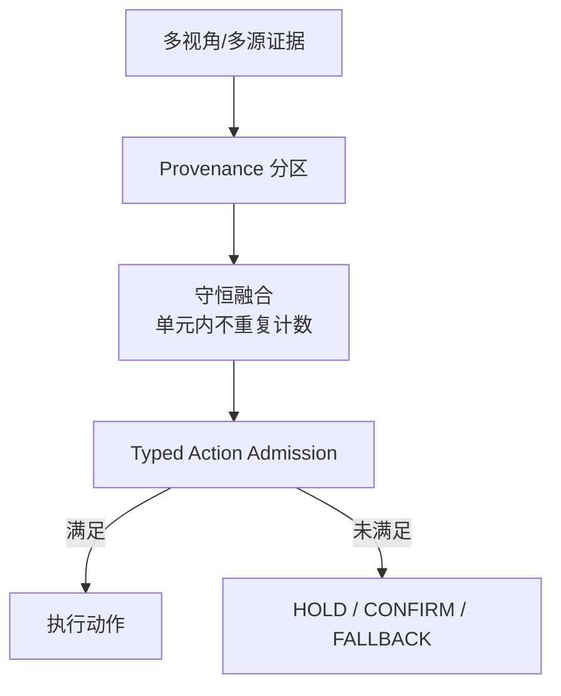
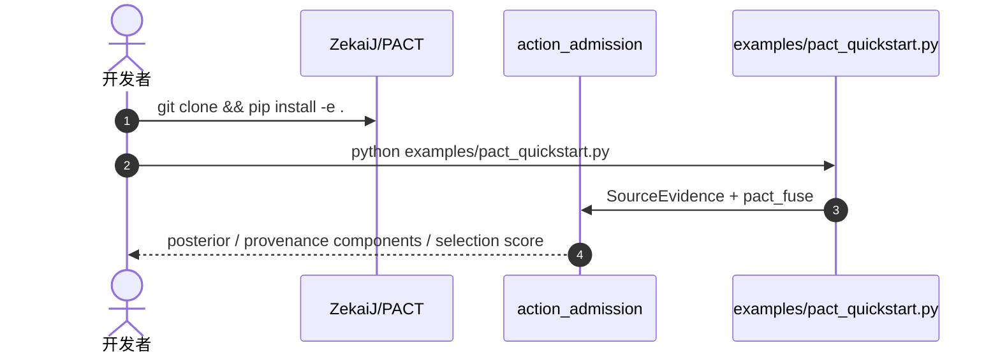

# PACT：溯源守恒的多视角融合与动作准入

**PACT**（*Provenance-Conserving Multi-View Fusion for Typed Action Admission in Human-Robot Collaboration*，[arXiv:2609.01662](https://arxiv.org/abs/2609.01662)，[代码](https://github.com/ZekaiJ/PACT)）将 **evidence countability** 视为 **provenance-conserving fusion** 与 **typed action admission** 中的关系变量：给定 **provenance partition** 后，保留单元内共享的 coordinatewise support，只在不同可计数单元间累积证据；未满足 release conditions 时映射为 **HOLD**、**CONFIRM** 或 **FALLBACK**。

## 一句话定义

**多模型同意不是安全背书——只有来源可独立计数时，一致才算佐证。**

## 英文缩写速查

| 缩写 | 英文全称 | 简要说明 |
|------|----------|----------|
| PACT | Provenance-Aware Corroboration for Typed admission | 本文框架（仓库命名） |
| HRC | Human-Robot Collaboration | 人机协作 |
| ncsAURC | Normalized Cost-Sensitive AURC | 论文报告的风险敏感指标 |
| VLM | Vision-Language Model | 离线 HRC 实验用 Qwen3-VL-32B |

## 为什么重要

- 纳入 [八篇盘点](../../sources/blogs/wechat_embodied_station_8_papers_open_source_2026-09-03.md) 的「部署期证据融合」支线。
- 对同一观测反复推理会放大一致性，却 **不增加新证据**。
- 离线 HRC：**60** episodes 准入 **47/57** reference-consistent candidates，未见 reference-inconsistent admission。
- **已开源** 完整实现与复现实验脚本。

## 核心信息

| 项 | 内容 |
|----|------|
| **作者** | Zekai Jin、Hanrong Zhang、Yihong Tang 等 |
| **评测** | 48 场景簇 **31,200** 次评估；ncsAURC **0.0861** |
| **开源** | **已开源** [ZekaiJ/PACT](https://github.com/ZekaiJ/PACT) |

### 流程总览

## 评测

| 设置 | 结果（文内） |
|------|-------------|
| 48 场景簇合成评估 | ncsAURC **0.0861** |
| 离线 HRC + Qwen3-VL-32B | 57 个 reference-consistent 候选中准入 **47** |
| reference-inconsistent | **0** 次误准入 |

## 结论

**具身系统动作准入前，必须区分「计算重复」与「证据独立来源」。**

1. **Provenance 是状态变量** — 不是后处理启发式。
2. **守恒融合** — 防止重复推理膨胀证据预算。
3. **Typed admission** — HOLD/CONFIRM/FALLBACK 可审计。
4. **HRC 实证** — 高一致候选多数可安全准入。
5. **可复现** — `pip install -e .` + quickstart 可跑通。

## 源码运行时序图

## 工程实践

| 项 | 建议 |
|----|------|
| 快速验证 | `python examples/pact_quickstart.py` |
| API | `SourceEvidence`、`pact_fuse`、`pact_registered_components` |
| 与 VLM 集成 | 离线 HRC 实验用 camera-grouped provenance |

## 局限与风险

- **离线 HRC 规模有限** — 60 episodes；真机长期统计待扩展。
- **Provenance 设计** — 需任务相关分区（如按相机组）。
- **非端到端策略** — 管准入层，不替代底层操纵策略。

## 与其他工作对比

| 对照 | 差异读法 |
|------|----------|
| 多数投票融合 | 不区分证据来源；PACT 守恒计数 |
| 纯 VLA 置信度阈值 | 忽略重复推理产生的伪一致 |
| [Physics-Consistent HRC Benchmark](./paper-physics-consistent-hrc-benchmark.md) | 基准评物理接触；PACT 评 **证据融合与准入** |

## 关联页面

- [Manipulation](../tasks/manipulation.md)
- [VLA](../methods/vla.md)
- [Physics-Consistent HRC Benchmark](./paper-physics-consistent-hrc-benchmark.md)

## 参考来源

- [pact_hrc_action_admission_arxiv_2609_01662](../../sources/papers/pact_hrc_action_admission_arxiv_2609_01662.md)
- [ZekaiJ/PACT](../../sources/repos/zekaij-pact.md)
- [具身智能小站 2026-09-03 八篇盘点](../../sources/blogs/wechat_embodied_station_8_papers_open_source_2026-09-03.md)

## 推荐继续阅读

- [arXiv:2609.01662](https://arxiv.org/abs/2609.01662)
- [PACT GitHub](https://github.com/ZekaiJ/PACT)
