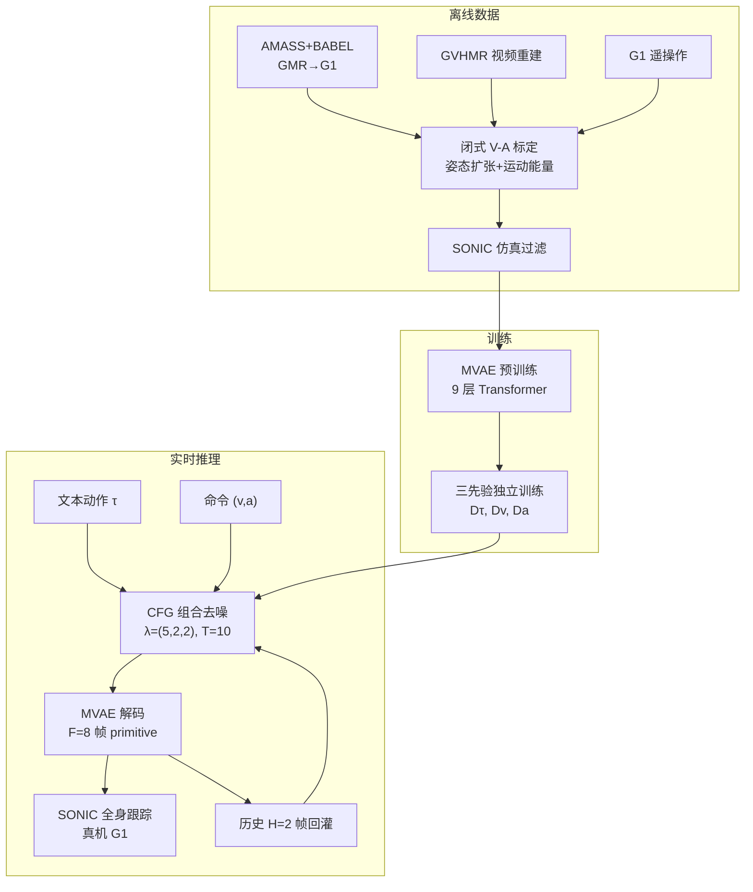

# PAMoR

**PAMoR**（*Parameterized Affective Motion Generation in Real Time for Humanoid Robots*，[arXiv:2608.28213](https://arxiv.org/abs/2608.28213)）由 **伦敦大学学院（UCL）** 计算机科学系 **Yan Pan、Lingfan Bao、Tianhu Peng、Chengxu Zhou** 提出：把社交人形运动中的 **情感** 从「参考片段 / 情感词」升级为 **可测量、可命令的效价–唤醒（V-A）坐标**，并在 **Unitree G1** 上以 **可组合潜扩散** 实时生成全身运动，使 **做什么**（文本）与 **怎么感受**（连续 V-A）可独立编辑。

## 一句话定义

**在机器人自身运动学上闭式算出 V-A 标签训练三个独立扩散先验，推理时组合文本动作与连续情感标量，在 G1 上实时 rollout 可被人读懂的情感全身运动。**

## 英文缩写速查

| 缩写 | 英文全称 | 简要说明 |
|------|----------|----------|
| PAMoR | Parameterized Affective Motion Generation in Real Time | 本文框架：参数化情感人形运动实时生成 |
| V-A | Valence–Arousal | Russell 情感环模型两轴：效价（正负）与唤醒（激活程度） |
| MVAE | Motion Variational Autoencoder | 9 层 Transformer 运动 VAE，压缩历史+未来窗口为 128 维潜 token |
| CFG | Classifier-Free Guidance | 条件/无条件预测差分作为引导方向；本文用于三先验组合 |
| G1 | Unitree G1 Humanoid | 29-DoF 宇树人形真机平台 |
| HRI | Human-Robot Interaction | 人机交互；本文强调运动作为情感传达通道 |

## 为什么重要

- **情感条件可解释：** 相对 SMooDi 式「参考片段即风格」或 TextOp 式「情感 prompt」，V-A 是心理学连续平面上的 **可复现标量**，且本文从 **姿态扩张 + 运动能量** 自动标定训练集，无需人工情感标注。
- **动作与情感解耦：** 单网络联合 \((\tau,v,a)\) 会 entangle（Action Acc. 跌至 **0.478**）；**可组合扩散** 在保持 R@1 **~0.79** 的同时让 V-A 调制风格（Action Acc. **0.748**）。
- **机器人原生空间：** 直接在 G1 特征空间生成并自回归 rollout，避免 avatar→retarget 改写承载情感的速度与姿态；单 primitive **78 ms**（RTX 5090，10 步去噪）。
- **社交 HRI 证据：** 12 名被试、840 次试次：命令情感 Top-1 **0.384**、Top-3 **0.845**，接近 Emilya 人体表演 **0.44**；TextOp 加情感词 Top-1 仅达 chance **0.125**。

## 核心信息

| 项 | 内容 |
|----|------|
| **机构** | 伦敦大学学院（University College London）计算机科学系 |
| **作者** | Yan Pan, Lingfan Bao, Tianhu Peng, Chengxu Zhou |
| **venue** | arXiv 预印本（arXiv:2608.28213） |
| **平台** | Unitree G1（29-DoF）；低层 **SONIC** 全身运动跟踪 |
| **基线** | [TextOp](./paper-loco-manip-161-022-textop.md)、ECHO、SMooDi（风格参考） |
| **开源** | **未开源**（2026-09-01：arXiv 为唯一官方入口，无 Code/GitHub/权重链接） |

## 核心原理

每帧运动特征 \(\mathbf{x}_t \in \mathbb{R}^{69}\) 含根姿态、足接触、关节角与差分等。给定文本动作 \(\tau\)、目标 V-A \((v,a)\in[-1,1]^2\) 与长度 \(H{=}2\) 的历史，生成下一段 \(F{=}8\) 帧 primitive 并自回归接成长序列。

**V-A 标定（无标注）：**

- **效价：** 臂展三角形周长 + 根高度 + 躯干俯仰，等权 z-score 后 winsorize 至 \([-1,1]\)。
- **唤醒：** 关键点速度幅值与加速度幅值均值，同样处理。

**可组合潜扩散：** 冻结 MVAE 编码潜空间；三个 Transformer 去噪先验 \(D_\tau, D_v, D_a\) 分别学习文本、效价、唤醒如何塑形运动；每步用 classifier-free 组合求干净潜 \(\hat{\mathbf{z}}_0\)，再解码为 primitive。文本定 **动作身份**，V-A 定 **表演风格**。

### 流程总览

## 源码运行时序图

**不适用** — 截至 2026-09-01 官方未发布可运行代码仓库或权重；复现入口以论文方法描述与 arXiv 为准。若后续开源，应按 README 训练/推理脚本补绘 `sequenceDiagram`。

## 工程实践

| 项 | 建议 |
|----|------|
| 数据混合 | AMASS 动作覆盖广但风格不均；需补 **视频重建 + 遥操作** 以丰富同一动作的多风格样本 |
| 仿真过滤 | 用 **SONIC** 回放剔除不可跟踪或失稳片段，避免训练集含不可执行情感姿态 |
| 组合权重 | 默认 \((\lambda_\tau,\lambda_v,\lambda_a)=(5,2,2)\)；增大 \(\lambda_v,\lambda_a\) 可能牺牲动作保真（见单先验消融） |
| 实时预算 | 10 步去噪 × 三先验 ≈ **78 ms/primitive**（400 ms 运动）；交互应用需与跟踪器延迟一并预算 |
| 执行闭环 | 生成器与 **WBC/跟踪器分层**；跟踪误差会使真机 V-A 偏离命令 — 论文讨论列为首要后续（感知闭环） |
| 社交部署 | 拳击/踢腿等「先天攻击性」动作上命令正效价更难；选型时需知 **动作 affordance** 会调制可读情感 |
| 开源状态 | **未开源** — 工程复现暂以 [TextOp](./paper-loco-manip-161-022-textop.md) 等已开源 G1 文本运动栈 + 本文 V-A 标定/组合思路对照实现 |

## 实验与评测

**文本–运动质量（与 TextOp/ECHO 同协议）：** FID **0.379**、R@1 **0.792**、MultiModality **0.882** — 与纯文本基线 **持平或更优**，说明 V-A 条件未牺牲动作质量。

**V-A 可控性：** 七×七 V-A 网格；测得与命令秩相关 **0.95**；轴间交叉相关 **<0.06**。

**感知研究（7 动作 × 8 Russell 情感，G1 视频）：**

| 方法 | Top-1 ↑ | Top-3 ↑ | \(\kappa_w\) ↑ | 自然度 ↑ |
|------|---------|---------|----------------|----------|
| TextOp + 情感 prompt | 0.125 | 0.423 | 0.060 | 3.40 |
| SMooDi 风格参考 | 0.202 | 0.417 | 0.209 | 3.25 |
| **PAMoR（V-A 命令）** | **0.384** | **0.845** | **0.688** | **4.05** |

Chance：Top-1 **0.125**，Top-3 **0.375**。

## 结论

**PAMoR 的价值在于把「机器人身体语言的情感」变成可测量、可命令的 V-A 连续量，并用可组合扩散保住动作身份——这是社交人形运动从演示走向可控产品的关键一步。**

- 真正起作用的是 **运动学闭式 V-A 标定 + 三先验组合**：前者免去昂贵情感标注并让条件可验证；后者避免联合 conditioning 把「挥手」变成「悲伤的挥手」时动作本身被扭曲（Action Acc. **0.478→0.748**）。
- **文本对齐不降价：** FID/R@1 与 TextOp/ECHO 同级，MultiModality 更高 — 情感是可加的 **风格维度**，不是牺牲动作的旁路。
- **人读懂：** Top-1 **0.384** 接近 Emilya 人体 **0.44**；误读多为环模型上 **相邻情感**，符合连续 V-A 命令的语义。
- **适用边界：** 跟踪器无情感反馈、V-A 权重为等权约定、**未开源**；与 [HIAER](./paper-notebook-hierarchical-intention-aware-expressive-motion-g.md)（场景 VLM 推断意图）互补 — 本文解决 **生成器侧连续情感条件**，HIAER 解决 **场景驱动的意图推断**。
- **读法：** 若做 **公共讲解 / 服务人形**，优先评估 V-A 滑条是否比情感词 prompt 更稳；若已有 TextOp 栈，可把 PAMoR 视为 **情感调制层** 的设计参考，而非即插即用模块（尚无官方权重）。

## 与其他工作对比

| 维度 | PAMoR | [TextOp](./paper-loco-manip-161-022-textop.md) + 情感 prompt | SMooDi 式风格参考 | [HIAER](./paper-notebook-hierarchical-intention-aware-expressive-motion-g.md) |
|------|-------|--------------------------------------------------|-----------------|-------------------------------------------------------------------|
| 情感条件形式 | **连续 V-A 标量**（可复现、可插值） | 情感词进文本 prompt | 参考片段即风格 | 场景 VLM 推断意图 |
| 情感标注成本 | **零人工标注**（运动学闭式标定） | 无（但不可控） | 需风格片段库 | 依赖场景理解 |
| 动作/风格解耦 | 三先验 CFG 组合，Action Acc. **0.748** | 无解耦 | 风格片段绑定动作 | 上游模块，不管生成解耦 |
| 感知 Top-1 | **0.384**（人体表演 0.44） | 0.125（= chance） | 0.202 | 未在本协议内 |
| 与本文关系 | — | 主要基线，也是可复现的开源替身 | 风格路线基线 | **互补**：它给意图，本文给条件化生成 |

- **这些数字同协议可比**：TextOp / SMooDi / PAMoR 三行取自本页「感知研究」的同一批 7 动作 × 8 情感、12 被试 840 试次；跨论文引用时须连协议一起搬。
- **HIAER 不是竞品**：一个解决「场景里此刻该表达什么」，一个解决「给定 V-A 怎么生成得出来」，串起来才是完整社交栈。
- **工程可得性相反**：PAMoR 未开源，TextOp 栈已开源——短期落地更现实的路径是「TextOp 栈 + 本文 V-A 标定与组合思路」，见「工程实践」末行。

## 局限与风险

- **未开源：** 截至 2026-09-01 无官方代码/权重；复现成本高，需自建 MVAE + 三先验 + G1 数据管线。
- **执行漂移：** 生成器与 SONIC 跟踪分层，真机 executed V-A 可能偏离命令；论文明确 **闭环情感保持** 为开放问题。
- **V-A 权重：** 姿态三 cue 等权是约定，非数据驱动最优；跨平台迁移需重标定 winsorize 分位。
- **动作偏置：** 攻击性动作（拳/踢）削弱正效价可读性 — 社交脚本需考虑动作–情感 affordance。
- **相对 HIAER：** 本文 **不** 从场景视觉推断 V-A；高层意图需外接 VLM/规则，再映射为 \((v,a)\) 命令。

## 关联页面

- [Loco-Manipulation（任务）](../tasks/loco-manipulation.md) — 人形全身运动与语言/情感控制语境
- [TextOp（论文实体）](./paper-loco-manip-161-022-textop.md) — 实时文本驱动 G1 运动主要基线
- [Diffusion Motion Generation（方法）](../methods/diffusion-motion-generation.md) — 扩散/潜空间运动生成总览
- [HIAER（同实验室表达运动）](./paper-notebook-hierarchical-intention-aware-expressive-motion-g.md) — 场景意图感知路线（arXiv:2506.01563）
- [E-SDS（UCL 同组人形 RL）](./paper-e-sds-environment-aware-humanoid-locomotion-rl.md) — Chengxu Zhou 组另一 G1 工作线
- [Unitree G1（硬件实体）](./unitree-g1.md) — 29-DoF 真机平台

## 参考来源

- [PAMoR 论文摘录（arXiv:2608.28213）](../../sources/papers/pamor_arxiv_2608_28213.md)
- [PAMoR arXiv 官方入口](../../sources/sites/pamor-arxiv.md)

## 推荐继续阅读

- PAMoR 论文 HTML（图表与用户研究协议）：<https://arxiv.org/html/2608.28213>
- TextOp 项目页（文本驱动 G1 实时运动基线）：<https://text-op.github.io/>
- HIAER 预印本（同实验室层次意图表达运动）：<https://arxiv.org/abs/2506.01563>
