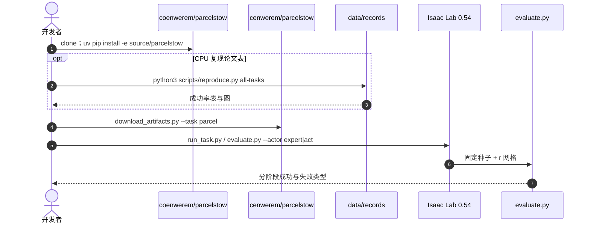

# ParcelStow：模仿学习是否保留时间鲁棒性？

**ParcelStow**（*Does Imitation Learning Preserve Temporal Robustness in Dexterous Manipulation?*，[arXiv:2609.01453](https://arxiv.org/abs/2609.01453)，[代码](https://github.com/coenwerem/parcelstow)，[HF](https://huggingface.co/datasets/cenwerem/parcelstow)）由 **马里兰大学学院公园分校（University of Maryland）** 提出：在 **Unitree G1**（固定骨盆 + 右臂 + L6 五指，16 关节）接触丰富的包裹获取–重定向–插入任务上，用同一初始条件与同一时速因子 \(r\) 比较 **脚本专家** 与 **ACT**。

## 一句话定义

**标称成功率相同，不代表模仿策略继承了专家跨执行速度的时间鲁棒性。**

## 英文缩写速查

| 缩写 | 英文全称 | 简要说明 |
|------|----------|----------|
| ACT | Action Chunking with Transformers | 论文主学习器；HF `act_stow.pt` 为 ACT-A |
| IL | Imitation Learning | 模仿学习 |
| DP | Diffusion Policy | 包裹插入另有 checkpoint，不是主对照 |
| G1 | Unitree G1 Humanoid | 本基准本体；L6 = 腰 + 右臂 + 五指 |
| HF | Hugging Face | 示范、权重与视频托管 |

## 为什么重要

- 现有 IL 鲁棒性评测多看场景 / 物体 / 指令，**执行速度**常被漏掉；产线节拍一变，「实验室 100%」可能直接掉到 50% 带。
- 这是 **G1 灵巧手** 上的受控专家–学习器对照，不是桌面机械臂。
- **已开源** Isaac Lab 评测台 + HF 示范/权重；`reproduce.py` 可在 CPU 上重算论文表。

## 核心信息

| 项 | 内容 |
|----|------|
| **机构** | 马里兰大学学院公园分校（University of Maryland） |
| **平台** | Unitree G1，16 维绝对关节位置，50 Hz（物理 200 Hz） |
| **观测** | 147 维状态（含 `task_phase` 与 `task_rate=r`），无视觉 |
| **物体** | 80×55×40 mm、0.120 kg 刚性包裹 |
| **开源** | **已开源（Apache-2.0）**：[GitHub](https://github.com/coenwerem/parcelstow) + [HF](https://huggingface.co/datasets/cenwerem/parcelstow)；**无真机** |

### 流程总览

## 核心原理

时速因子 \(r\) **只缩放获取之后**的操作段（抬升→重定向→传递→插入→释放），获取段时长固定，从而把评测轴钉在「同一几何操作走得更快」，而不是整回合一起快进。几何路径是相位 \((k,f)\) 的函数；\(r\) 只改相位时钟。

成功谓词是物理的（插入深度、释放、静置、终态姿态 <10°），**不读** force-closure 裕度。force-closure 只作诊断：414 次无闭包的获取在全部策略与速度下 **零完成**。

## 评测

论文 v1 / `v1.0.0` 只报包裹插入（100 episode / 速度）：

| 速度 | 专家 | ACT-A |
|------|------|-------|
| \(r=1\)（标称） | 100% | 100% |
| \(r=2\)（示范上限） | 84% | 53% |

- 两枚不同初始化 ACT 从标称到 \(r=2\) 分别掉 **34 / 48** pt，专家掉 **16** pt。
- \(r=2\) 时 ACT 47 次失败中 **35 次插入错位**。
- 相对运动交接后：ACT 获取都能在空中走完重定向，但全任务只有 **64%**（专家获取后 **95%**）。

`main` 另有两任务，**不是**论文主对照（标称就未对齐）：

| 任务 | \(r=1\) 专家 / ACT | 额外 |
|------|-------------------|------|
| 直立放置 | 92 / 39 | \(r=1.75\)：90 / 74 |
| 键控插销（3 mm 间隙） | 93 / 75 | \(r\ge 1.5\) 时 ACT 获取 **0/100** |

## 结论

**模仿学习评测必须带时间轴，否则会把「标称 100%」误读成部署稳定性。**

1. **30+ pt 落差藏在高速段** — 同一任务、同一初始条件，只改 \(r\)。
2. **插入是 ACT 的时间敏感瓶颈** — 空中传递还能做，入口对准先垮。
3. **无 force-closure 的获取从不完成任务** — 时间鲁棒性讨论的前提是抓稳。
4. **只测了一种 IL 架构的主对照** — DP/DAgger 有包裹插入权重，但不能外推 VLA。
5. **直立 / 插销是开发数字** — 标称未对齐，勿与 v1 主表横比。
6. **部署读法** — 目标节拍范围做速度扫频，而不是只报 \(r=1\)。

## 源码运行时序图

仿真需要 Isaac Sim 5.1 + GPU；数值复现不需要。

## 工程实践

| 项 | 做法 |
|----|------|
| 装扩展 | `uv pip install -p <isaaclab-venv>/bin/python -e source/parcelstow` |
| 拉权重 | `python scripts/download_artifacts.py --task parcel`（或 `upright` / `peg` / `--paper`） |
| 统一接口 | 147-D 观测、16-D 归一化关节位置；`--task` 选任务，不把任务 ID 拼进观测 |
| 自定义策略 | `evaluate.py --actor examples.custom_policy:HoldPosturePolicy` |

## 局限与风险

- **无真机 / 无视觉** — 结论停在 Isaac Lab 状态观测。
- **专家是脚本不是遥操作** — 与人类示范分布可能不同。
- **任务族仍窄** — 论文主文只有包裹插入；另外两任务标称未匹配。

## 与其他工作对比

| 维度 | ParcelStow | [SpeedTuning](./paper-speedtuning.md) | 常见 IL 鲁棒性评测 |
|------|------------|--------------------------------------|-------------------|
| 问题 | 学习器**有没有继承**专家的时间鲁棒性 | 冻结策略上**另学**执行倍率 | 场景 / 物体 / 指令 |
| 速度轴 | 评测协议的自变量 \(r\) | 策略输出的控制维 | 通常不测 |
| 平台 | G1 L6 仿真 | 桌面操作 + 仿真仓 | 各异 |
| 主数字 | \(r=2\)：专家 84% / ACT 53% | 接触关键帧减速、安全段加速 | — |

- **不是在否定 [ACT](./paper-act.md)**：\(r=1\) 两边都是 100%；缺的是评测协议的时间轴。
- **不能外推**到 [Facet-0](./paper-facet-0.md) 这类含力后果建模的方法。

## 关联页面

- [Imitation Learning](../methods/imitation-learning.md)
- [Action Chunking](../methods/action-chunking.md)
- [Unitree G1](./unitree-g1.md)
- [SpeedTuning](./paper-speedtuning.md)
- [ACT](./paper-act.md)
- [接触丰富操作 7 篇地图](../overview/contact-rich-manipulation-7-papers-technology-map.md)
- [Facet-0](./paper-facet-0.md)

## 推荐继续阅读

- [arXiv:2609.01453](https://arxiv.org/abs/2609.01453)
- [coenwerem/parcelstow](https://github.com/coenwerem/parcelstow)
- [HF cenwerem/parcelstow](https://huggingface.co/datasets/cenwerem/parcelstow)

## 参考来源

- [parcelstow_arxiv_2609_01453](../../sources/papers/parcelstow_arxiv_2609_01453.md)
- [coenwerem/parcelstow](../../sources/repos/coenwerem-parcelstow.md)
- [cenwerem-parcelstow 数据集](../../sources/datasets/cenwerem-parcelstow.md)
- [具身智能小站 2026-09-02 七篇盘点](../../sources/blogs/wechat_embodied_station_7_papers_contact_manipulation_2026-09-02.md)
