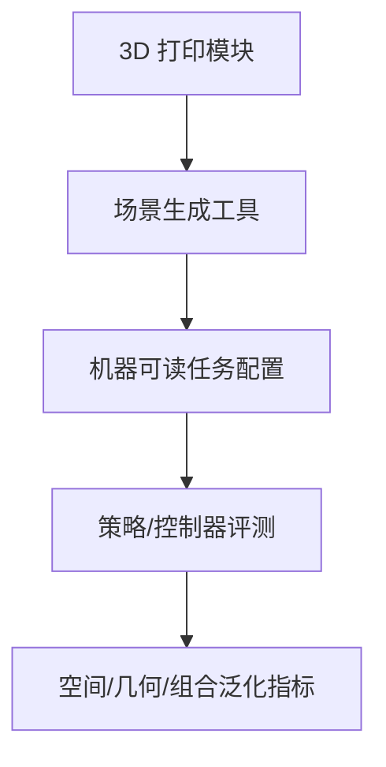

# Peg-in-Bench：高精度插入模块化基准

**Peg-in-Bench**（*A Modular Benchmark for High-Precision Robotic Insertion*，[arXiv:2609.00906](https://arxiv.org/abs/2609.00906)）由 **日本产业技术综合研究所（AIST）** 提出：一套 **完全可 3D 打印** 的模块化组件，可组合多种 peg 几何、公差等级与底座结构，系统化评测 **高精度插入** 的泛化能力。

## 一句话定义

**高精度操作要进步，先得有可复制、可变化、成本可控的物理基准。**

## 英文缩写速查

| 缩写 | 英文全称 | 简要说明 |
|------|----------|----------|
| PiH | Peg-in-Hole | 插孔装配经典任务 |
| STL | STereoLithography | 3D 打印网格文件格式 |
| DR | Domain Randomization | 可通过布局/朝向变化模拟的任务域随机化 |
| FMB | Functional Manipulation Benchmark | 相关功能操作基准（对比参照） |

## 为什么重要

- 纳入 [2026-09-02 七篇盘点](../../sources/blogs/wechat_embodied_station_7_papers_contact_manipulation_2026-09-02.md) 的「硬件基准」支线。
- 既有 peg-in-hole 评测多依赖 **固定配置**，难以衡量跨布局/几何/公差的鲁棒性。
- 提供场景生成工具、标准化任务配置与机器可读任务描述。
- **开源状态待核实**：论文声明 [aistairc/peg-in-bench](https://github.com/aistairc/peg-in-bench)，截至 2026-09-02 **404**。

## 核心信息

| 项 | 内容 |
|----|------|
| **机构** | 日本产业技术综合研究所（AIST） |
| **硬件** | 模块化 3D 打印 peg、底座、多级公差 |
| **泛化轴** | 空间（位置/朝向）、几何（peg 形状/公差）、任务组合 |
| **开源** | **待核实**（论文声明 GitHub + STL；截至入库日不可下载） |

### 流程总览

## 评测

- 相对固定 PiH 基准，强调 **任务级泛化** 而非单实例成功率。
- 兼容从经典柔顺控制到现代学习方法的评测需求。
- 数据出处：[ingest 摘录](../../sources/papers/peg_in_bench_arxiv_2609_00906.md)。

## 结论

**插入技能的泛化应通过可重构物理基准测量，而非单一固定孔位。**

- 模块化设计降低实验室搭建成本
- 三级公差与多 peg 几何覆盖精度梯度
- 场景生成器支持大规模可复现任务实例
- 空间/几何/任务组合三维泛化定义清晰
- 与 Facet-0 等精密装配模型形成「算法—硬件」互补
- 复现前需跟进官方仓库发布 STL 与生成工具

## 源码运行时序图

源码运行时序图 | **不适用**（截至 2026-09-02 论文声明仓库不可达，无官方可运行代码入口）。

## 局限与风险

- **仓库未发布：** STL 与场景生成工具暂无法获取，硬件复现受阻。
- **打印精度：** 3D 打印公差会引入额外变量，需记录材料与工艺。
- **与仿真差距：** 物理基准结果向仿真迁移需单独建模接触与公差。

## 与其他工作对比（索引级）

| 维度 | Peg-in-Bench | 固定配置 PiH 台架（含 NIST Assembly Task Board） | 仿真侧操作基准 |
|------|--------------|---------------------------------------------|----------------|
| 载体 | **物理**，全 3D 打印模块 | 物理，固定板/固定孔位 | 纯仿真 |
| 可重构性 | **peg 几何 × 公差等级 × 底座组合** | 基本不可重构，换任务=换板 | 改配置即可，但接触物理是模型 |
| 评的是什么 | **跨布局/几何/组合的泛化** | 单实例成功率与循环时间 | 策略在给定接触模型下的成功率 |
| 复现成本 | 打印耗材级（工具发布后） | 采购/加工整板 | 算力 |
| 主要噪声源 | **打印公差、材料与工艺** | 装夹与标定 | 接触建模与 sim2real gap |

- **与 [Facet-0](./paper-facet-0.md) 是「硬件—算法」互补**：Facet-0 给精密装配的策略侧方案，Peg-in-Bench 给可重构的评测底座；两者数字不构成横比。
- **不要与仿真成功率横比**：本页 tags 含 `benchmark`，但物理台架的公差、打印工艺与装夹条件是结果的一部分，跨基准比较须先对齐这些条件，见 [Query：具身大模型评测基准选型闭环](../queries/embodied-eval-benchmark-selection-loop.md)。
- **可比性前提未满足**：截至 2026-09-02 官方 STL 与场景生成工具不可下载，任何第三方复现结果暂时都无法声称与论文同配置。

## 关联页面

- [Manipulation](../tasks/manipulation.md)
- [Facet-0](./paper-facet-0.md)
- [Query：具身大模型评测基准选型闭环](../queries/embodied-eval-benchmark-selection-loop.md) — 物理插入台架落在「真机、任务级泛化」一格，与仿真 VLA 榜单分开读
- [接触丰富操作 7 篇地图](../overview/contact-rich-manipulation-7-papers-technology-map.md)

## 推荐继续阅读

- [arXiv:2609.00906](https://arxiv.org/abs/2609.00906)
- [NIST Assembly Task Board](https://www.nist.gov/el/intelligent-systems-division-73500/robotic-grasping-and-manipulation-assembly/assembly-task-boards)（对比参照）

## 参考来源

- [peg_in_bench_arxiv_2609_00906](../../sources/papers/peg_in_bench_arxiv_2609_00906.md)
- [具身智能小站 2026-09-02 七篇盘点](../../sources/blogs/wechat_embodied_station_7_papers_contact_manipulation_2026-09-02.md)
