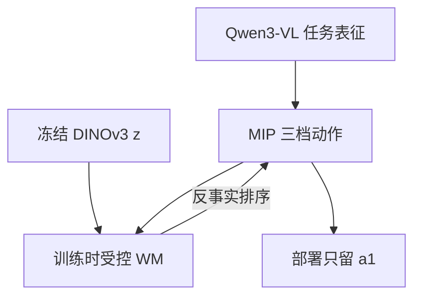

# Phi-WM 1.0 ActEffect（训练时后果反馈）

**ActEffect**（报告 *Phi-WM 1.0 ActEffect: From Predictive Foresight to Consequence Feedback in Robot Learning*，[PDF](https://www.sunrisingai.com/upload/202608/e597763b7e870a6ec5951d487b4b3e7f.pdf)）是光象科技（SunRisingAI Lab）联合清华大学李升波课题组发布的第一代「物理原生」世界模型配方：世界模型只在**训练**里当反馈器。

## 一句话定义

> **先提案、再在冻结 DINO 隐空间比较「这个动作会把世界带去哪」，用反事实排序改进提案；上线只留策略一次前向。**

## 英文缩写速查

| 缩写 | 英文全称 | 简要说明 |
|------|----------|----------|
| ActEffect | Action–Effect | 本报告方法名；Phi-WM 1.0 的第一代落地 |
| Phi | Physics-native Intelligence | 光象路线：状态解耦 + 时序因果 + 定律约束 |
| MIP | Minimal Iterative Policy | 两段回归，暴露完整粗/精动作 |
| WAM | World-Action Model | 文内对照：多数把未来当预见而非反馈 |
| VLA | Vision-Language-Action | 任务条件动作主干 |

## 为什么重要

- 腾讯访谈的国内主样本：不跟 Atlas 比像素，而跟 VLA/WAM 比**因果接口**。
- 把「理解动作后果」写成可消融损失，而不是再做一个部署时模拟器。
- 与 LeCun 族正交：那边改隐几何与规划器容量，这边改 WM 在训练闭环里的岗位。

## 核心信息

| 项 | 内容 |
|----|------|
| **机构** | 光象科技（SunRisingAI Lab）；清华大学（访谈） |
| **骨干** | Qwen3-VL 4B + DiT 动作头；冻结 DINOv3；4×768 WM |
| **提案** | \(\{a_{\mathrm{ff}}, a_0, a_1\}\) 共享当前状态 |
| **主数字** | LIBERO **98.8%**；LIBERO-PLUS **80.3%**；RoboCasa-GR1 **67.5%**（4.6B） |
| **开源** | **确认未开源**（公司页与 PDF 无仓） |
| **源码运行时序图** | **不适用**（无可运行官方代码） |

## 核心原理（方法栈）

报告把联合分布拆成预见 vs 反馈：

\[
p(o_{t+1},a_t\mid o_t,l)=
\begin{cases}
p(o_{t+1}\mid o_t,l)\,\pi(a_t\mid o_{t:t+1},l) & \text{Foresight}\\
\pi(a_t\mid o_t,l)\,p(o_{t+1}\mid o_t,a_t) & \text{Feedback}
\end{cases}
\]

受控转移 \(p(z_{t+1:t+H}\mid z_t,a_t)\) **不再吃语言**：语言只决定选哪一档动作。反事实排序让后一档提案的预测未来更接近示范未来。

## 实验与评测

| 基准 | ActEffect | 读法 |
|------|-----------|------|
| LIBERO 四套平均 | **98.8** | Table 1；高于 π0.5 2.3B 的 96.9 |
| LIBERO-PLUS 七扰动 | **80.3** | 布局/背景/噪声等；对预见式 Fast-WAM 优势大 |
| RoboCasa-GR1 | **67.5** | 人形双臂 |

消融（LIBERO）：去掉后果损失 98.8→97.0；WM 改在 VLM 空间 98.8→97.3。

## 工程实践

- 访谈补充：仿真反事实应占数据「绝对大头」；单工位真机后训练常见十余到几十小时，一般 <100 h。
- 部署目标是工业节拍，所以必须卸 WM。
- 没有代码：数字只能当报告声明，不能当可复现基线。

## 局限与风险

- **确认未开源**，无法核对 LIBERO 评测脚本与种子。
- PDF 署名只有 SunRisingAI Lab，与访谈「清华联合」不对齐。
- 仿真三基准 ≠ 产线 Phi-Bot X1；X1「部署收尾」是产品叙事。
- 反事实来自 WM 自己的预测，WM 错则排序偏。

## 与其他工作对比

| 工作 | 关系 |
|------|------|
| 多数 WAM / Fast-WAM | 未来当预见或表征；本页当训练反馈 |
| [LeWM](./paper-lewm.md) / [LpWM](./paper-lpwm.md) | 测试时 CEM；本页测试时无 WM |
| [Atlas](./atlas-world-model.md) | 3D 生成/重建产品；不是策略反馈 |
| 标准 VLA | 只拟合示范动作 |

## 结论

**总判：ActEffect 的可迁移想法是「WM 的岗位」——训练反馈器而不是部署模拟器；数字在未开源前只能当宣传上限。**

1. 写系统时先选 Foresight 还是 Feedback 因子分解。
2. 后果空间不要和指令语义绑在同一套 token 上。
3. 没有仓就不要把 98.8% 写进选型表的可复现列。
4. 和 LeCun 稀疏码合读：一个改几何，一个改闭环接口。

## 关联页面

- [World-Action Models](../concepts/world-action-models.md)
- [VLA](../methods/vla.md)
- [生成式世界模型](../methods/generative-world-models.md)
- [LpWM](./paper-lpwm.md)
- [Atlas](./atlas-world-model.md)
- [训练闭环分类](../overview/robot-world-models-training-loop-taxonomy.md)

## 参考来源

- [ActEffect 技术报告归档](../../sources/papers/phi_wm_acteffect_techreport.md)
- [光象科技站点归档](../../sources/sites/sunrisingai.md)
- [腾讯科技访谈归档](../../sources/blogs/wechat_tencent_world_model_questions_2026-09-05.md)

## 推荐继续阅读

- [技术报告 PDF](https://www.sunrisingai.com/upload/202608/e597763b7e870a6ec5951d487b4b3e7f.pdf)
- [腾讯科技原文](https://mp.weixin.qq.com/s/2DEpiexjwh5O6bBJDXk3LA)
