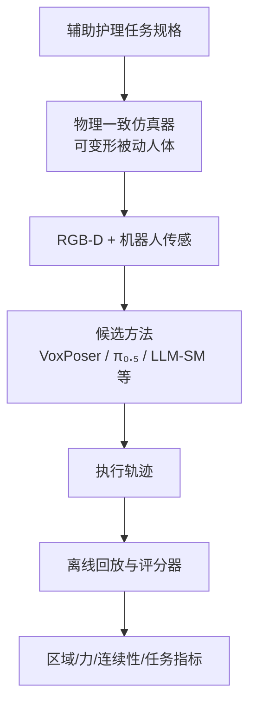

# Physics-Consistent HRC Benchmark：接触丰富辅助护理评测

**Physics-Consistent Benchmark for Contact-Rich Human-Robot Interaction in Assistive Care**（[arXiv:2609.02402](https://arxiv.org/abs/2609.02402)，[预览仓](https://anonymous.4open.science/r/Physics-Consistent-Benchmark_4_HRC-8DBF/)）提出面向 **辅助洗浴** 等 **接触丰富人机协作** 的物理一致基准：结合 **可变形、被动响应人体**、任务成功之外的 **physics-aware scores**，以及 **冻结 vision-only / scorer-only** 评估协议。

## 一句话定义

**接触型 HRC 不能只看完成任务，还要看接触是否物理有效、力是否安全、区域是否正确。**

## 英文缩写速查

| 缩写 | 英文全称 | 简要说明 |
|------|----------|----------|
| HRC | Human-Robot Collaboration | 人机协作 |
| HRI | Human-Robot Interaction | 人机交互 |
| LLM-SM | LLM-augmented State Machine | 论文最强脚本化基线之一 |
| Pi0.5 | π₀.₅ | 视觉-语言-动作策略对照 |

## 为什么重要

- 纳入 [八篇盘点](../../sources/blogs/wechat_embodied_station_8_papers_open_source_2026-09-03.md) 的「接触安全评测」支线。
- 名义任务成功率经 **正确区域 + 力安全** 筛查后 **大幅下降**（72.9%→56.4%），暴露视觉规划方法的隐藏风险。
- **泄漏自由接口**：方法仅见 RGB-D 与机器人传感，评分可用完整仿真状态。
- Franka impedance push 在护理人偶上校准 **force-indentation**，建立物理有效性。

## 核心信息

| 项 | 内容 |
|----|------|
| **实例任务** | 辅助洗浴：Touch / Scrub / Push |
| **协议** | 冻结 T1–T7；每方法 **140** 次运行 |
| **开源** | **部分/待发布** — 预览 README + appendix；`benchmark/` Coming soon |

### 流程总览

## 评测

| 方法 | 名义任务成功 | 经区域+力安全筛查后（文内） |
|------|-------------|---------------------------|
| LLM-augmented state machine | **72.9%** | **56.4%** |
| VoxPoser | 27.9% | 接触更轻更稳，完成率更低 |
| Zero-shot π₀.₅ | **0.7%** | 严重 OOD 部署失败 |

## 结论

**辅助护理 HRC 需要把物理响应、力安全与任务成功绑在同一基准里评测。**

1. **高名义成功率不等于可部署** — 筛查可砍掉约三分之一「看起来成功」的 rollout。
2. **轻接触 ≠ 高任务完成** — VoxPoser 稳定但完成率低，选型要看优先级。
3. **零样本 VLA 极脆弱** — π₀.₅ 0.7% 警示直接迁移风险。
4. **shell-bone 耦合模型** — 附录给出可变形人体与刚性骨架耦合动力学。
5. **代码待发布** — 当前仅预览仓与附录，完整 benchmark 实现 Coming soon。

## 源码运行时序图

**不适用** — `benchmark/` 实现截至 **2026-09-03** 未发布。

## 局限与风险

- **匿名预览阶段** — 机构与最终发布 URL 可能变化。
- **单域实例** — 以辅助洗浴为主；其他护理任务泛化待扩展。
- **仿真-真机差距** — 人偶校准不能完全代表真人软组织响应。

## 与其他工作对比

| 对照 | 差异读法 |
|------|----------|
| 纯任务级成功率基准 | 忽略力安全与区域正确性 |
| [PACT](./paper-pact-hrc-action-admission.md) | PACT 管 **证据融合与动作准入**；本基准管 **物理接触评测** |
| 操作仿真基准 | 无被动可变形人体与护理接触语义 |

## 关联页面

- [Manipulation](../tasks/manipulation.md)
- [Humanoid Locomotion](../tasks/humanoid-locomotion.md)
- [PACT](./paper-pact-hrc-action-admission.md)
- [具身大模型评测基准选型闭环](../queries/embodied-eval-benchmark-selection-loop.md) — 本页属其 ③ 策略任务成功率评测层的接触安全切面：与 [SoftVTBench](./paper-softvtbench.md) 同类，主张名义成功率须经区域+力安全筛查后再读（72.9%→56.4%），双向回链

## 参考来源

- [physics_consistent_hrc_benchmark_arxiv_2609_02402](../../sources/papers/physics_consistent_hrc_benchmark_arxiv_2609_02402.md)
- [physics-consistent-hrc-benchmark 预览仓](../../sources/sites/physics-consistent-hrc-benchmark.md)
- [具身智能小站 2026-09-03 八篇盘点](../../sources/blogs/wechat_embodied_station_8_papers_open_source_2026-09-03.md)

## 推荐继续阅读

- [arXiv:2609.02402](https://arxiv.org/abs/2609.02402)
- [匿名预览仓](https://anonymous.4open.science/r/Physics-Consistent-Benchmark_4_HRC-8DBF/)
