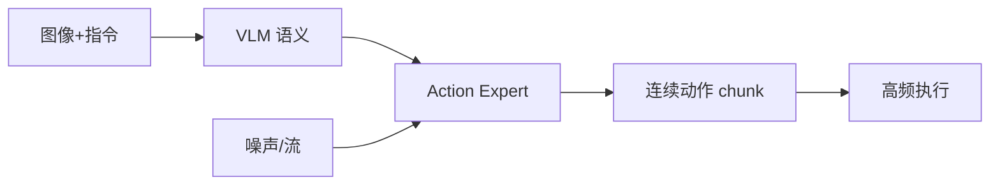
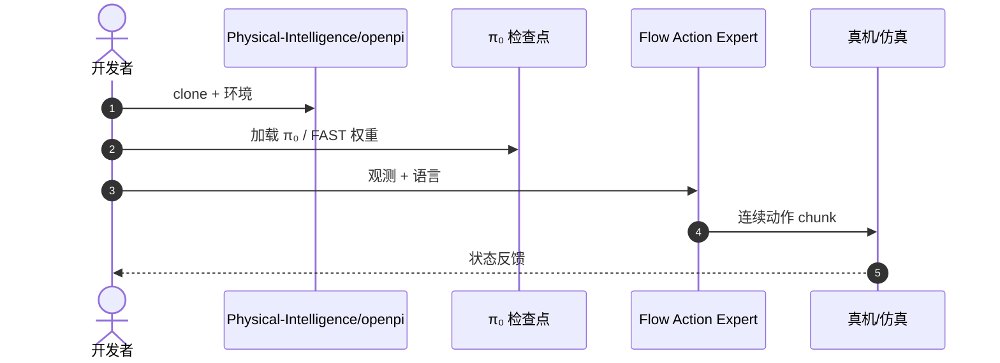

# π₀：流匹配动作专家的通用 VLA

**π₀**（*π0: A Vision-Language-Action Flow Model for General Robot Control*，[arXiv:2410.24164](https://arxiv.org/abs/2410.24164)，[代码](https://github.com/Physical-Intelligence/openpi)）由 **Physical Intelligence** 提出：预训练 VLM 负责语义，**Action Expert** 用 **Flow Matching** 生成连续动作，面向叠衣服、装袋等精细操作与约 **50 Hz** 控制。

## 一句话定义

**语义骨干冻结或缓更新，动作用流匹配生成——比多步扩散更快，比动作 token 更连续。**

## 英文缩写速查

| 缩写 | 英文全称 | 简要说明 |
|------|----------|----------|
| FM | Flow Matching | 连续时间生成式动作头 |
| VLM | Vision-Language Model | 语义骨干（PaliGemma 类） |
| VLA | Vision-Language-Action | 本工作的模型类别 |
| DP | Diffusion Policy | 多步去噪对照，见 [论文](./paper-diffusion-policy.md) |

## 为什么重要

- 纳入 [VLA/WM 阅读路线](../../sources/blogs/wechat_embodied_ai_lab_vla_wm_reading_roadmap_2026-09-02.md) 的动作头进阶。
- 方法页 [π₀-policy](../methods/π0-policy.md) 讲模型族；**本页是 π₀ 论文 canonical 节点**。
- 后续 [π₀.7](../methods/pi07-policy.md) 仍用流匹配动作头。
- **已开源** 入口是 **openpi**；公众号写的 `physical-intelligence/pi0` **仓库不存在**。

## 核心信息

| 项 | 内容 |
|----|------|
| **机构** | 物理智能（Physical Intelligence） |
| **骨干** | 预训练 VLM（PaliGemma 类） |
| **动作** | Flow Matching Action Expert |
| **频率** | 约 50 Hz 控制 |
| **开源** | **已开源** [Physical-Intelligence/openpi](https://github.com/Physical-Intelligence/openpi) |

### 流程总览

## 评测

- 文内强调精细操作（折叠、装袋）与混合数据（操作 + 导航 + 移动操作）。
- 相对扩散策略：更少前向步数。
- 数字以 [原文](https://arxiv.org/abs/2410.24164) 与 openpi 文档为准。

## 结论

**高频精细操作优先流匹配动作头；复现入口记 openpi，不要去找不存在的 pi0 仓。**

- Action Expert 把「会看会说」和「会动手」拆开训练
- 流匹配相对 DDPM 更适合控制频率
- 混合数据是通才的前提，不是单任务 trick
- 后继 π₀.₅ / π₀.₇ 改的是提示与数据，不是丢掉 flow
- 部署要对齐动作归一化、字段映射和推理频率（见 openpi 归档）

## 源码运行时序图

## 局限与风险

- **仓名：** 不要按公众号 `pi0` 去 clone。
- **算力：** 通才权重与微调配置仍重。
- **与 token VLA：** 生态工具（OFT 等）不一定即插即用。

## 与其他工作对比

| 工作 | 相对本页 |
|------|----------|
| [Diffusion Policy](./paper-diffusion-policy.md) | 多步去噪动作头，无大规模 VLM |
| [OpenVLA](./paper-openvla.md) | 自回归离散 token |
| [π₀.7 方法页](../methods/pi07-policy.md) | 同族后继，多模态提示 |

## 关联页面

- [π₀ 方法页](../methods/π0-policy.md)
- [π₀.7](../methods/pi07-policy.md)
- [Diffusion Policy](./paper-diffusion-policy.md)
- [OpenVLA](./paper-openvla.md)
- [VLA/WM 14 篇路线](../overview/vla-wm-reading-roadmap-14-papers-technology-map.md)
- [DexHoldem](./paper-dexholdem.md) — 真机扑克榜上 π₀ 与 π₀.₅ 并列最高 SPSR

## 推荐继续阅读

- [arXiv:2410.24164](https://arxiv.org/abs/2410.24164)
- [Physical-Intelligence/openpi](https://github.com/Physical-Intelligence/openpi)

## 参考来源

- [pi0_arxiv_2410_24164](../../sources/papers/pi0_arxiv_2410_24164.md)
- [具身智能研究室 VLA/WM 阅读路线](../../sources/blogs/wechat_embodied_ai_lab_vla_wm_reading_roadmap_2026-09-02.md)
- [openpi 仓库归档](../../sources/repos/openpi.md)
