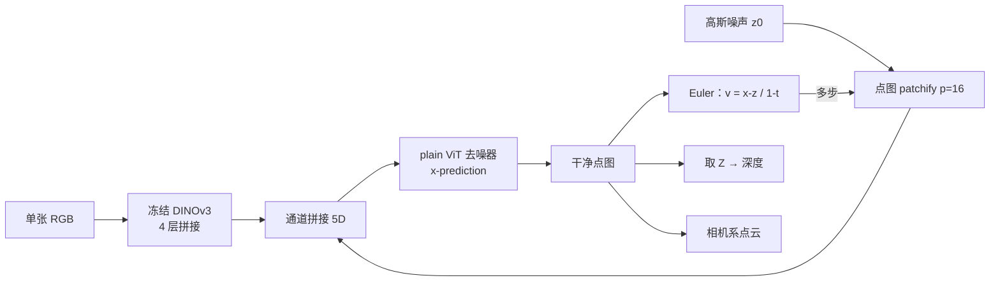
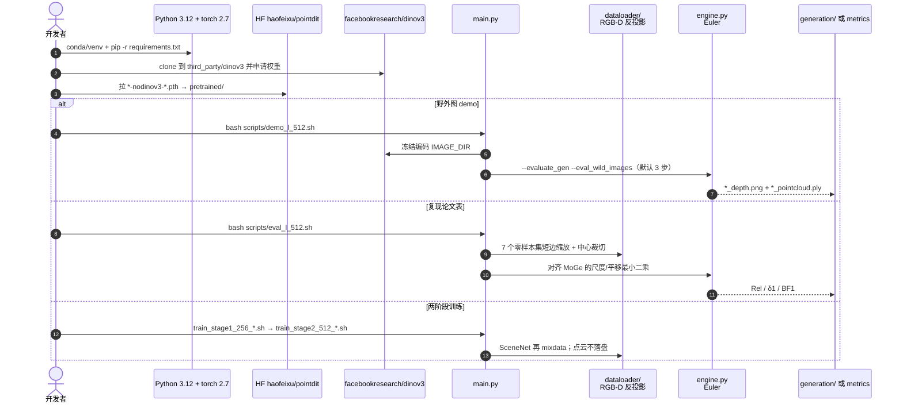

# PointDiT：像素空间扩散估单目点图

**PointDiT**（*PointDiT: Pixel-Space Diffusion for Monocular Geometry Estimation*，[arXiv:2607.02515](https://arxiv.org/abs/2607.02515)，[项目页](https://haofeixu.github.io/pointdit/)，[代码](https://github.com/google-research/pointdit)）由 **谷歌（Google）**、**苏黎世联邦理工（ETH Zürich）**、**图宾根大学 / 图宾根 AI 中心**、**微软（Microsoft）**、**可扩展自主智能（KE:SAI）** 与 **慕尼黑工业大学（TUM）** 提出：用 **plain ViT** 直接在原始 \(H{\times}W{\times}3\) 点图上做 flow matching，条件来自冻结 [DINOv3](https://github.com/facebookresearch/dinov3)。无点图 VAE、无混合卷积头、无一堆几何正则损失。ICML 2026。

## 一句话定义

**单张 RGB 加高斯噪声，一步就能出相机系稠密点图；多走几步只是把细杆和玻璃边界再削尖。**

## 英文缩写速查

| 缩写 | 英文全称 | 简要说明 |
|------|----------|----------|
| PointDiT | Point Diffusion Transformer | 本文：像素空间点图扩散 Transformer |
| DiT / ViT | Diffusion Transformer / Vision Transformer | 去噪骨干是普通 ViT，不是 U-Net |
| DINOv3 | Distillation with No Labels v3 | 冻结图像条件；权重门控、不随 checkpoint |
| FM | Flow Matching | \(z_t=tx+(1-t)\epsilon\)；推理 Euler 积分 |
| BF1 | Boundary F1 | 边界锐度；本文主打的「没被抹平」指标 |
| VAE / LDM | Variational Autoencoder / Latent Diffusion Model | 本文明确不做：GeometryCrafter 那条损失细节的路 |
| Rel / \(\delta_1\) | Relative error / accuracy threshold 1.25 | 点图与深度两套：Rel\(_p\)/\(\delta^p_1\)、Rel\(_d\)/\(\delta^d_1\) |

## 为什么重要

- **选型坐标变了。** 单目几何不再只能在「MoGe 式回归」和「GeometryCrafter 式潜扩散」之间挑；第三条是 **数据空间扩散**，而且可以 **单步前馈**。
- **机器人真正吃的是点图，不是深度图。** 点图直接在相机系给 XYZ，不需要先估内参再反投影——和 [2D→3D 提升 Gap](../concepts/2d-to-3d-semantic-lifting-gap.md) 的「尺度从哪来」对得上，但仍是 **仿射不变**，不是 metric。
- **代码能跑。** [google-research/pointdit](https://github.com/google-research/pointdit) + [HF 权重](https://huggingface.co/haofeixu/pointdit)；最短路径 `scripts/demo_l_512.sh`。
- **受控实验把「生成式」从口号拆开。** 同数据同网，只把噪声/timestep 换成零，BF1 从 13.92 掉到 10.90——增益来自目标，不是更大的骨干。

## 核心信息

| 项 | 内容 |
|----|------|
| **机构** | 谷歌（Google）；苏黎世联邦理工（ETH Zürich）；图宾根大学（University of Tübingen）；微软（Microsoft）；可扩展自主智能（KE:SAI）；慕尼黑工业大学（TUM） |
| **作者** | Haofei Xu、Rundi Wu、Philipp Henzler、Nikolai Kalischek、Michael Oechsle、Fabian Manhardt、Marc Pollefeys、Andreas Geiger、Federico Tombari、Michael Niemeyer |
| **出处** | ICML 2026；arXiv:2607.02515（2026-07-02） |
| **输出** | 仿射不变点图 \(x\in\mathbb{R}^{H\times W\times 3}\)（相机系 XYZ）；深度取 \(z\) 分量 |
| **规模** | PointDiT-B / L / H（223 / 771 / 1,807 M）；DINOv3 按规格配 ViT-B/L/H+ |
| **训练数据** | 纯合成。Stage-1 SceneNet-RGBD ~5.36 M @256；Stage-2 十一源混合 ~6.22 M @512 |
| **开源** | **已开源**：[google-research/pointdit](https://github.com/google-research/pointdit)（Apache-2.0）；权重 [haofeixu/pointdit](https://huggingface.co/haofeixu/pointdit) |

## 核心原理

### 输入 / 机制 / 输出

给定 RGB \(c\)，学习条件分布 \(p(x\mid c)\)。线性插值路径 \(z_t=tx+(1-t)\epsilon\)，\(\epsilon\sim\mathcal{N}(0,I)\)。网络 \(F_\theta(z_t,t,c)\) **直接预测干净点图**（x-prediction），再反解速度 \(\hat v=( \hat x-z_t)/(1-t)\)（分母下限 \(\delta{=}0.05\)）。损失以速度 MSE 为主，天空像素权 0.01，另加 \(\lambda{=}0.1\) 的相对点损失（误差除以 \(\|x_i\|_2\)）。

点图先减质心、除以到质心的均距，使数据尺度与标准正态噪声可比；预测因此是 **仿射不变** 的。天空不进归一化统计，归一化后再投到半径 3 的虚球（对应噪声 \(3\sigma\)）；推理丢掉范数 \(>2.9\) 的点。

### 架构：对齐的两类 token

1. **点图 patch：** \(z_t\) 切 \(p{=}16\) 的 XYZ patch，线性投到 \(D\) 维，得 \(T_z\in\mathbb{R}^{N\times D}\)。
2. **图像条件：** 冻结 DINOv3 取 **4 个均匀间隔中间层**（DPT 选层，但不做卷积融合），通道拼接得 \(T_c\in\mathbb{R}^{N\times 4D}\)。
3. **融合：** \(\mathrm{Concat}(T_c,T_z)\) → 线性压回 \(D\) → Transformer 堆 → 线性头反 patch 成 \(H{\times}W{\times}3\)。

训练 timestep 用 logit-normal（\(\mu{=}-0.8,\sigma{=}0.8\)），并以 \(p_{\mathrm{zero}}{=}0.1\) 强制 \(t{=}0\)，避免推理从纯噪声起步时的 train–test 缺口。

### 流程总览

## 源码运行时序图

官方仓 [google-research/pointdit](https://github.com/google-research/pointdit) 入口见 [sources/repos/pointdit.md](../../sources/repos/pointdit.md)：

- **最短路径：** 装依赖 → 申请 DINOv3 → 下一份 L-512 checkpoint → `IMAGE_DIR=你的图` 跑 `scripts/demo_l_512.sh`。无需相机内参。
- **复现论文表：** 按 `DATASETS.md` 备 7 个评测集，跑对应 `eval_{b,l,h}_{256,512}.sh`（脚本头注释写应对数字）。
- **找不到 encoder 会直接退出**，不会拿随机 DINOv3 凑推理。

## 工程实践

| 项 | 建议读法 |
|----|----------|
| 何时用 | 只要 RGB、要稠密相机系点图、在意细结构/透明物；能接受仿射对齐或后标定 |
| 何时不用 | 要开箱 metric（抓取/碰撞直接用毫米）；室外驾驶主场景；机载算力吃不下 0.8–1.8 B + DINOv3 |
| 步数 | 先 **1 步**（H 型 72 ms）看 Rel/\(\delta_1\)；要边界再 2–4 步。BF1 涨、整体误差几乎不动 |
| 初始化 | 全零与随机噪声几乎一样；确定性采样可当回归器用 |
| 分辨率 | 训练钉 256 / 512。demo 默认把整图按接近 \(32{\times}32\) token 的分辨率推理再缩放回去；`--eval_depth_resize_height 512` 才走论文的短边+中心裁 |
| 天空 | 推理丢掉 \(\|p\|>2.9\) 的点，勿当有效几何 |
| 对齐 | 评测跟 MoGe：最小二乘求尺度+平移。部署若要 metric，另做一次标定，不要把 Rel 当毫米误差 |
| 依赖税 | DINOv3 门控；合成数据准备见 `DATASETS.md`。点云从不写盘 |

## 实验与评测

零样本 7 集（DIODE、KITTI、NYUv2、ETH3D、HAMMER、iBims-1、Booster），3,444 张，512²，短边缩放后中心裁切。下表为论文 Table 1 口径。

| 方法 | Rel\(_p\)↓ | \(\delta^p_1\)↑ | Rel\(_d\)↓ | \(\delta^d_1\)↑ | BF1↑ | 参数 (M) | 时间 (ms) |
|------|------------|-----------------|------------|-----------------|------|----------|-----------|
| GeometryCrafter | 5.45 | 96.75 | 3.52 | 97.84 | 4.64 | 1,937 | 1,178 |
| PPD | 5.54 | 96.59 | 3.88 | 97.78 | 9.28 | 804 | 402 |
| Depth Pro | 5.71 | 96.71 | 3.84 | 97.63 | 9.41 | 952 | 68 |
| UniDepthV2 | 4.45 | 97.35 | 2.86 | 98.52 | 6.94 | 354 | 26 |
| DA3 | 4.77 | 96.63 | 3.22 | 97.81 | 6.33 | 1,356 | 82 |
| MoGe | **4.21** | 97.45 | 3.10 | 98.01 | 5.61 | 314 | 34 |
| MoGe-2 | 4.53 | 97.46 | 2.90 | 98.45 | 7.40 | 326 | 24 |
| PointDiT-L（4 步） | 4.85 | 97.55 | 3.09 | 98.25 | **10.50** | 771 | 131 |
| PointDiT-H（1 步） | 4.45 | 97.93 | 2.81 | 98.51 | 9.79 | 1,807 | **72** |
| PointDiT-H（4 步） | 4.40 | **98.02** | **2.75** | **98.54** | 10.49 | 1,807 | 204 |

读法：

- **真影响指标是 BF1 与深度 Rel。** H 型把边界从 Depth Pro 的 9.41 推到 ~10.5，并把 Rel\(_d\) 做到全表最好；MoGe 仍略赢点图 Rel\(_p\)（4.21 vs 4.40）。
- **室外例外。** KITTI / DIODE / ETH3D 上落后 MoGe、UniDepthV2——作者归到合成室外混合不够，不是公式本身。
- **HAMMER / 透明物。** 点图、深度、边界三项都领先；Booster 上 H 型 BF1 **28.66**（Depth Pro 25.91）。
- **消融（L，SceneNet 256，单步）：** x-pred 必须；DINOv3 四层 BF1 13.47 vs 末层 7.24 vs 线性 9.68；MoGe-2 / DA3 特征更能抬 Rel，但 BF1 仍不如 DINOv3。

## 结论

**PointDiT 证明：单目点图不必上 VAE 或混合回归头；像素空间 x-prediction + 冻结 DINOv3 就能在边界和透明物上压过更重的潜扩散，并且单步已经能当前馈估几何器。**

1. **先看 BF1 和 Rel\(_d\)，不要只看 Rel\(_p\)。** MoGe 点图误差仍略低；本文赢在锐度和深度精度。
2. **部署默认 1 步。** 再加步几乎只买边界，H 型 1 步 72 ms vs GeometryCrafter 1.2 s。
3. **输出是仿射点图。** 抓取/碰撞要另做尺度标定；天空点要滤掉。
4. **室外驾驶先别换 MoGe。** KITTI 线仍是回归基线的主场。
5. **x-prediction 不是实现细节。** 换成 v-prediction 会直接崩；logit-normal 必须掺 10% 的 \(t{=}0\)。
6. **选型：** 要开箱可跑的 RGB→点图且在意细结构 → PointDiT；要 metric / 室外稳 → MoGe-2 / UniDepthV2；要多流动作模型里的点图先验 → [Flex-π](./paper-flex-pi.md)（走的是冻结视频 VAE，不是这条像素空间路）。

## 局限与风险

- **不是 metric。** 归一化吃掉绝对尺度与平移；评测靠最小二乘对齐。
- **分辨率钉死。** 256 / 512；混合分辨率是论文自己标的后续。
- **室外数据缺口** 会直接反映到 KITTI / DIODE / ETH3D。
- **DINOv3 门控** 挡住「clone 就能出图」；缺权重时官方脚本会硬失败。
- **只出几何。** 外观、多视图、相机条件都还是展望；当前输出也不是关节指令或占据栅格。
- **许可叠加：** 本体 Apache-2.0；DINOv3 走上游条款。仓声明不是 Google 官方产品。

## 与其他工作对比

| 工作 | 关系 |
|------|------|
| MoGe / MoGe-2 | 确定性回归 + 混合头 + 多损失；点图 Rel 仍略强，边界和透明物弱。PointDiT 受控实验把「换生成目标」从「换骨干」里拆出来 |
| GeometryCrafter | 视频潜扩散；VAE 先损细节，1 步也要 ~1.2 s。PointDiT 去掉 tokenizer，单步 72 ms |
| PPD | 同属像素空间扩散，但做深度、用 v-prediction；点图指标需借 MoGe-2 估内参，全面落后 |
| Depth Anything 3 / UniDepthV2 | 强回归 / metric 基线；室外仍更稳。DINOv3 换成它们的特征能再降 Rel，但 BF1 下降 |
| [单目深度综述](./paper-monocular-depth-estimation-survey.md) | 综述的判别 vs 生成坐标；本文是「生成式、但去掉 VAE、输出点图」的具体点 |
| [Flex-π](./paper-flex-pi.md) | 也吃 3D pointmap，但借用冻结 Wan VAE；本文证明点图可以不经过 VAE |
| [ADM-BA](./paper-adm-ba.md) | 多视角深度怎么融成可规划图；本文停在单帧点图 |
| [KineBench](./paper-kinebench.md) | 评测栈里用 MoGeV2 抽深度；若换 PointDiT 要先补尺度对齐 |

## 关联页面

- [单目深度估计综述](./paper-monocular-depth-estimation-survey.md)
- [2D→3D 语义提升 Gap](../concepts/2d-to-3d-semantic-lifting-gap.md)
- [机器人视觉感知栈选型闭环](../queries/robot-perception-stack-selection-loop.md)
- [Flex-π](./paper-flex-pi.md)
- [ADM-BA](./paper-adm-ba.md)
- [KineBench](./paper-kinebench.md)
- [视觉骨干](../concepts/vision-backbones.md)
- [具身感知六种空间表征](../concepts/embodied-perception-six-spatial-representations.md)

## 参考来源

- [论文归档](../../sources/papers/pointdit_arxiv_2607_02515.md)
- [仓库归档](../../sources/repos/pointdit.md)
- [项目页归档](../../sources/sites/pointdit-github-io.md)

## 推荐继续阅读

- 项目页 3D 对照与受控实验：<https://haofeixu.github.io/pointdit/>
- 论文 HTML（公式、分数据集表、消融）：<https://arxiv.org/html/2607.02515>
- 官方仓与脚本：<https://github.com/google-research/pointdit>
- 权重：<https://huggingface.co/haofeixu/pointdit>
