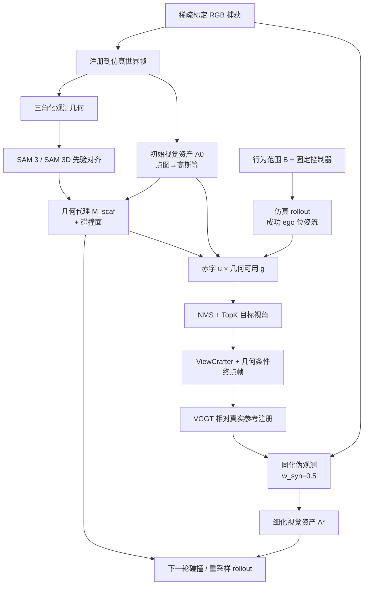

# R2S-EGO：稀疏捕获 Real-to-Sim 的双代理 Ego 细化

**R2S-EGO**（*Dual-Proxy Refinement for Sparse-Capture Real-to-Sim*，[arXiv:2608.06827](https://arxiv.org/abs/2608.06827)，2026-08-07）由 **小鹏机器人（XPENG Robotics）** 与 **香港理工大学（PolyU）** 提出：在**不新增真实观测、不改机器人动力学与控制栈**的前提下，针对稀疏 RGB 捕获与行为范围内机器人相机之间的 **capture–consumption support gap**，用 **robot proxy + geometry proxy** 做固定预算的 ego 视角生成，并把注册伪观测同化进既有仿真视觉资产，同时刷新碰撞几何。

## 一句话定义

**用「行为可执行的机器人相机查询」+「捕获锚定的几何条件」生成并同化稀疏未见的 ego 观测，专门补机器人真正会走到的视角，而不是做全局 novel-view 补全。**

## 英文缩写速查

| 缩写 | 英文全称 | 简要说明 |
|------|----------|----------|
| R2S / Real2Sim | Real to Simulation | 从真实观测构造/细化可训练仿真场景 |
| R2S-EGO | Real-to-Sim Ego-view Dual-Proxy Refinement | 本文双代理稀疏捕获场景细化框架 |
| 3DGS | 3D Gaussian Splatting | 本文视觉资产后端表示 |
| NKSR | Neural Kernel Surface Reconstruction | 无物体先验区域的几何补全 |
| VGGT | Visual Geometry Grounded Transformer | 生成帧相对真实参考的位姿/内参估计 |
| PSNR | Peak Signal-to-Noise Ratio | 冻结 G1 ego 视角外观主指标之一 |

## 为什么重要

- **稀疏采集是工程常态：** 每环境稠密多视角成本高；人类便捷轨迹与机器人挂载相机的可见面经常错位——通用重建/生成补全不等于「策略训练时用得到的 ego 支持」。
- **把生成约束到 R2S 接口：** 生成图既要行为可执行，又要以捕获锚定结构为条件；否则伪观测会把错误布局/遮挡写进仿真。
- **下游读得动：** 同一碰撞网格与 [SONIC](../methods/sonic-motion-tracking.md) 栈下，仅换视觉资产即可拉开真机坐姿成功率（相对 [GaussGym](./paper-notebook-gaussgym-an-open-source-real-to-sim-framework-fo.md)）。

## 核心信息

| 项 | 内容 |
|----|------|
| **作者** | Shuai Fang、Xin Deng、Yuchen Kang、Zhenjiang Li、Jie Chen（通讯） |
| **机构** | 小鹏机器人（XPENG Robotics）；香港理工大学（The Hong Kong Polytechnic University） |
| **平台** | Unitree G1 头摄 ego；Replica 三场景（office_2 / office_3 / room_0）外观；真机坐姿 |
| **输入** | 稀疏标定 RGB（主协议 **6** 视角）+ 既有仿真场景（视觉资产 \(\mathcal{A}^{0}\)+ 动力学/控制固定） |
| **输出** | 细化视觉资产 \(\mathcal{A}^{*}\) + 轮间刷新的融合几何/碰撞面 |
| **开源（截至 2026-08-11）** | **确认未开源** — arXiv/PDF 无项目页与代码链接；公开检索无仓 |

## 核心原理

### 方法栈（双代理）

| 模块 | 机制 |
|------|------|
| Geometry proxy | 三角化碎片 + SAM 3→SAM 3D 先验对齐（变换跨轮固定）+ 非先验区 NKSR；渲染结构条件；兼作碰撞面并每轮刷新 |
| Robot proxy | 固定行为控制器 rollout（每轮 12 次成功）→ 挂载相机位姿流；\(s=u\cdot g\)（资产赤字 × 几何可用）→ 时间 NMS + TopK |
| Ego 生成 | ViewCrafter：真实参考 + 相对运动 + 几何条件序列（\(N_f=25\)，留终点帧）；VGGT 注册相对真实参考 |
| 资产更新 | 真实捕获权重 1.0、合成 0.5 联合优化 3DGS；\(L=3\)、每轮 \(K=12\)、共 15k 优化步 |

### 流程总览

## 源码运行时序图

**不适用（官方无可运行代码）。** 截至 2026-08-11：arXiv 摘要与 PDF 未列项目页 / GitHub；公开检索无 `R2S-EGO` 实现仓。若后续开放，应补 `sources/repos/` 与「稀疏捕获 → 双代理轮次 → 3DGS 更新 → 策略训练」的 `sequenceDiagram`。

## 工程实践

| 项 | 建议 |
|----|------|
| 适用场景 | 已有仿真动力学/控制，只需 **稀疏真实图** 把 **行为相关 ego 外观 + 碰撞面** 补到可训策略 |
| 采集策略 | 优先保证捕获可锚定结构；把预算花在 **机器人会走到的赤字视角**，而非均匀全球补全 |
| 权重与锚点 | 合成观测降权（文中 0.5），真实捕获保持坐标/外观锚——避免生成漂移拖走配准 |
| 与基线对照 | 外观与真机协议下主对照 [GaussGym](./paper-notebook-gaussgym-an-open-source-real-to-sim-framework-fo.md)；通用生成–重建反馈（如 GenFusion）≠ 端到端 R2S |
| 复现边界 | **未开源**；只能读协议数字（Replica GT、固定 48 视角、配对种子坐姿）做选型判断 |
| 关键超参（Table I） | \(L=3\)，每轮 12 成功 rollout / \(K=12\)，\(N_f=25\)，alpha/几何有效阈值 0.8，3DGS 5k×3 |

## 实验与评测

- **冻结 G1 ego 外观（Table II，48 视角 × 3 Replica，六输入）：** R2S-EGO **19.062** dB PSNR / **0.757** SSIM / **0.273** LPIPS；GaussGym **14.226** / 0.567 / 0.628；Vanilla 3DGS、Difix3D+、GenFusion 均明显更低。
- **真实图像采集效率（office_2）：** R2S-EGO@6 ≈ **19.674** dB；GaussGym / Difix3D+ / Vanilla 在嵌套预算至 **45** 视角仍未达到该水平（GaussGym@45≈13.458）。
- **消融（Table III）：** 去掉 ego 视频生成掉到 13.417；去掉 robot-proxy 分配或 SAM 3D  grounding 分别约 16.2 / 16.4；预算匹配的一次性细化 17.508 vs 完整迭代 19.062。
- **真机坐姿（Table IV，5 配对策略种子，同 SONIC 蒸馏设定）：** 仿真成功率接近（87.2% vs 97.6%），**Real-G1 10.0%±10.5% vs 82.5%±6.8%**（池化 4/40 vs 33/40）；五种子方向一致。

## 结论

**稀疏 Real-to-Sim 的关键不是「再堆真实视角或再跑一轮通用生成–重建」，而是把合成观测严格限制在行为可执行、结构可锚定的 ego 赤字上。**

1. **主外观读数** — 六视角下 19.062 dB PSNR，相对最强报告 R2S 基线 GaussGym（14.226）约 **+4.8 dB**。
2. **采集效率叙事** — 在 office_2 协议上，基线即使到 45 真实视角仍追不上 R2S-EGO@6（外观指标，非几何等价证明）。
3. **双代理都必要** — 去分配 / 去 SAM 3D / 去迭代均掉点；去 ego 视频几乎退回稀疏初始化。
4. **下游迁移** — 控制与碰撞对齐后，仅换视觉资产即可把真机坐姿成功率从约 10% 拉到约 82.5%（五种子一致）。
5. **边界** — 先验几何是假说、未独立验碰撞精度；行为范围由声明控制器定义；硬件仅为坐姿 PoC；**代码未开放**。

## 与其他工作对比

| 对照 | 差异读法 |
|------|----------|
| [GaussGym](./paper-notebook-gaussgym-an-open-source-real-to-sim-framework-fo.md) | 开源像素 locomotion real-to-sim 框架；本文以其为外观与真机主基线，贡献在 **行为范围预算化细化** 而非新仿真器 |
| [CRISP](../methods/crisp-real2sim.md) | 单目人–场景平面原语 + RL 物理闭环；偏运动/接触资产。R2S-EGO 偏 **既有场景的稀疏多视角视觉+碰撞细化** |
| [Agentic Real2Sim](./paper-agentic-real2sim.md) / [SimFoundry](./paper-simfoundry-real2sim-scene-generation.md) | episode / 操作孪生与 cousins；评测多为回放或策略相关。R2S-EGO 评 **冻结 ego 渲染 + 同栈策略迁移** |
| [Lucida](./paper-lucida-r2s.md) | 从捕获 **新造** 可编辑物体场景 + GizmoAct 放置；R2S-EGO 在 **既有仿真** 上补行为范围 ego 外观/碰撞 |
| GenFusion 等视觉更新 | 生成–重建闭环提升 novel view；本文额外要求 **机器人可执行查询 + 捕获锚定结构 + 仿真碰撞接口** |
| [FixAnything](./paper-fixanything.md) / Difix3D+ 等 post-hoc 增强 | 表 II 将 Difix3D+ 作外观基线；FixAnything 走 **整段视频时序一致** 的跨表示清理，非行为范围 ego 查询 |

## 局限与风险

- **未开源：** 无法复现管线或核对实现细节；选型只能依赖论文协议。
- **几何假说：** SAM 3D 补全区与碰撞精度未单独量化；勿把 PSNR 增益直接读成物理几何正确。
- **行为范围固定：** robot proxy 来自声明控制器而非学得策略占据分布；换技能需重声明 \(\mathcal{B}\)。
- **伪观测漂移：** 多轮同化可能传播生成外观/结构误差；依赖真实锚点与降权。
- **硬件窄：** 真机仅坐姿、椅子类型与位姿变化；操作/手交互未覆盖。

## 关联页面

- [Sim2Real](../concepts/sim2real.md) — Real2Sim 资产与迁移总图
- [GaussGym（Paper Notebooks 占位）](./paper-notebook-gaussgym-an-open-source-real-to-sim-framework-fo.md) — 主对照 real-to-sim 基线（arXiv:2510.15352）
- [CRISP](../methods/crisp-real2sim.md) — 单目人–场景 Real2Sim
- [Agentic Real2Sim](./paper-agentic-real2sim.md) — VLM 编排 episode twin
- [SimFoundry](./paper-simfoundry-real2sim-scene-generation.md) — 视频孪生 + cousins + 策略评测
- [Lucida](./paper-lucida-r2s.md) — 室内多视角 → 可编辑物体资产 + GizmoAct（几何对齐）
- [Awesome-Real2Sim2Real](./awesome-real2sim2real.md) — 迁移闭环文献索引
- [SONIC](../methods/sonic-motion-tracking.md) — 文中下游坐姿蒸馏所用运动/WBC 栈
- [Unitree G1](./unitree-g1.md) — 实验平台
- [Sim2Real 残差适配 vs Real2Sim vs 真机 RL](../comparisons/sim2real-vs-real2sim-fine-tuning.md) — 迁移路径选型

## 参考来源

- [r2s_ego_arxiv_2608_06827.md](../../sources/papers/r2s_ego_arxiv_2608_06827.md) — 论文摘录与开源核查
- [arXiv:2608.06827](https://arxiv.org/abs/2608.06827) — 原文（Submitted 2026-08-07）

## 推荐继续阅读

- [arXiv PDF](https://arxiv.org/pdf/2608.06827) — 方法、Algorithm 1 与 Table II–IV
- [GaussGym（arXiv:2510.15352）](https://arxiv.org/abs/2510.15352) — 文中主 R2S 基线
- [ViewCrafter](https://arxiv.org/abs/2409.02048) — 相机控制 novel-view 生成组件先例
- [FixAnything](./paper-fixanything.md) — Wan2.1 LoRA 跨表示渲染清理；推理已开源（arXiv:2608.23549）
- [Awesome-Real2Sim2Real](https://github.com/sun254667/Awesome-Real2Sim2Real) — 闭环文献策展
