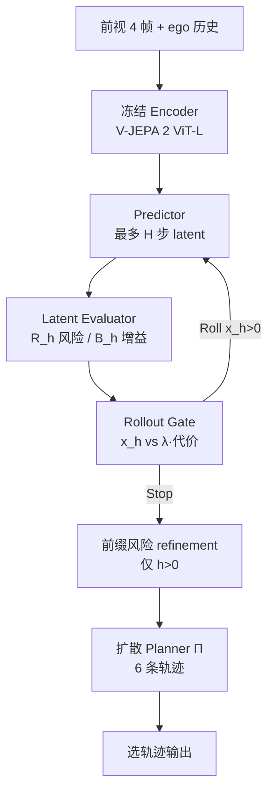

# RISE：驾驶 WAM 的自适应想象调度

**RISE**（*Refining Imagination through SElective Rollout*；论文 *RISE: Adaptive Imagination for World Action Models*，[arXiv:2608.20430](https://arxiv.org/abs/2608.20430)，[项目页](https://cowarobot-ai.github.io/RISE/)，[代码](https://github.com/COOWAI/RISE)）由 **酷哇科技（COWARobot）/ 上海交通大学 / 河海大学** 提出：把 World Action Model 的测试时想象从「全局固定深度」改成逐步 **Roll/Stop**。配套反事实集 [CounterDrive](https://huggingface.co/datasets/COWARobot/CounterDrive)。

> **同名警告：** 本页不是 OpenDriveLab 的 [RISE：组合式世界模型里的自提升策略](./paper-sa-2602-11075-rise-self-improving-robot-policy-with-compositio.md)（arXiv:2602.11075，RSS 2026，操作想象 RL）。两篇缩写相同、问题不同。

## 一句话定义

**按当前 latent 前缀估计「再想象一步能涨多少规划分」，用代价门槛决定停或继续，而不是给所有驾驶场景同一想象预算。**

## 英文缩写速查

| 缩写 | 英文全称 | 简要说明 |
|------|----------|----------|
| RISE | Refining Imagination through SElective Rollout | 本文可插拔 Scheduler：逐步 Roll/Stop |
| WAM | World Action Model | Encoder–Predictor–Planner；未来表征参与出轨迹 |
| FPG | Future Planning Gain | 相对当前前缀停止，继续 rollout 的规划分增量 |
| PDMS / EPDMS | Predictive / Extended PDMS | NAVSIM v1 / v2 综合规划分 |
| NAVSIM | NAVSIM 规划基准 | 开环驾驶规划主场 |
| V-JEPA | Video Joint-Embedding Predictive Architecture | 冻结视觉编码器（V-JEPA 2 ViT-L） |
| WAIM | World–Action Interactive Model | 前作 DAWN 的范式名；Scheduler 可外挂其上 |

## 为什么重要

- **固定 horizon 是错的全局超参：** 1248 个 NAVSIM 场景在 \(h=0\) 最好，加深会掉分；密集交互则要 \(h=3/4\)。平均步数低 ≠ 规划差，关键是把步数花在有增益的场景。
- **把算力决策写成可学习门：** 不是随机停、也不是「latent 收敛就停」，而是用规划分定义的 FPG 对代价 \(\lambda(c_{j}-c_{h})\)。
- **事实日志不够训风险：** CounterDrive 用反事实补事故起始与因果类；无它时风险排序接近随机。
- **可插拔：** 接到 DAWN 不改其 Predictor/Planner 仍涨 PDMS，说明 Scheduler 不是绑死某一骨干。

## 核心信息

| 项 | 内容 |
|----|------|
| **机构** | 酷哇科技（COWARobot Co. Ltd）；上海交通大学；河海大学 |
| **骨干** | 冻结 V-JEPA 2 ViT-L + 自车运动条件 Predictor + 扩散 Planner |
| **最大深度** | \(H_{\mathrm{NAVSIM}}=4\)，\(H_{\mathrm{nuScenes}}=3\)（两帧 tubelet） |
| **训练** | 8×A100，bfloat16，每卡 batch 4；三阶段（Predictor/\(\Pi_0\) → Evaluator/\(\Pi_1\) → Gate） |
| **数据** | NAVSIM / nuScenes 事实日志 + CounterDrive（NAVSIM 5013/1000，nuScenes 2432/511） |
| **开源** | **部分开源：** [COOWAI/RISE](https://github.com/COOWAI/RISE) MIT 代码+配置；[CounterDrive](https://huggingface.co/datasets/COWARobot/CounterDrive) 已上 HF（CC-BY-NC-ND-4.0）；**权重未发** |

## 流程总览



## 核心原理

### 问题改写

标准 WAM 对每个场景滚满 \(H\) 再规划：

\[
p(z_{1:H},\tau\mid c)=p(z_{1:H}\mid c)\,p(\tau\mid c,z_{1:H}).
\]

RISE 让有效深度 \(K(c;\lambda)\) 随场景变：前缀 \(\hat Z_h=\hat z_{1:h}\)（\(\hat Z_0=\emptyset\)）上做

\[
d_h=\mathcal S(\hat Z_h;c,\lambda),\quad
K=\min\bigl(\{h\mid d_h=\mathrm{Stop}\}\cup\{H\}\bigr).
\]

\(K=0\) 即直接从观测规划；\(K=H\) 退回满 rollout。

### Scheduler

**Latent Evaluator** 吃观测 latent 与当前前缀，预测：

- Risk Profile \(R_h=[r_1,\ldots,r_h]\)：各前缀深度的轨迹风险；
- Gain Profile \(B_h=[b_{h\to h+1},\ldots,b_{h\to H}]\)：相对「现在停」的规划分增量。

**Rollout Gate** 把池化 token、填零后的 \(\bar R_h,\bar B_h\)、归一化深度、累计代价 \(c_h=h\) 与下一步增量送进小 MLP，输出 \(x_h\)。\(x_h>0\) 且未到 \(H\) 则再预测一步，否则（\(h>0\) 时）对前缀做两步风险梯度 refinement 后交给 Planner。

### 三阶段监督

| 阶段 | 学什么 | 关键监督 |
|------|--------|----------|
| I | Predictor + 变前缀 \(\Pi_0\) | 真实+接受的 CF 序列上 latent L1；真实轨迹上扩散规划损失；\(h\) 均匀采样 |
| II | Evaluator + 引导 \(\Pi_1\) | 真实：几何风险回归；CF 配对：事故起始之后的风险排序 + 局部校准；再在 refinement 前缀上训 \(\Pi_1\)，用全深度规划分差当 \(B_h^*\) |
| III | Gate | 冻结其余；\(g_h^*=\max_j[(q_j-q_h)-\lambda(c_j-c_h)]\)，\(y_h^*=\mathbb I[g_h^*>0]\) 的 BCE |

CounterDrive **不**给可靠他车几何，故反事实侧不用标量 \(\mathcal E_{\mathrm{risk}}\) 当回归目标，只用核实后的「更危险」排序。

### CounterDrive

选定源关键帧 + 场景/事故描述，Wan 2.7 生成 10 s / 1080p，2 Hz 抽 20 帧；OpenVO 回 ego 轨迹。标注员核验运动一致性、事故起始、畸变与因果类（正常 / 非自车 / 自车）。过滤后规模见上表。**不是**对完整 NAVSIM 训练集约一对一覆盖。

## 源码运行时序图

官方仓公开的是 **手动七段链**，不是一键 DAG。节点对齐 `docs/reproduction.md` 与 `configs/train/navsim/cvoi_manual_full/`。

```mermaid
sequenceDiagram
  autonumber
  actor Op as 维护者
  participant App as app.main
  participant Pred as train_latent_predictor
  participant P0 as train_predictor_rollout_planner
  participant TQ as generate_navsim_cf_trajectory_quality.py
  participant Off as train_cvoi_offline
  participant Ora as run_cvoi_manual_oracle.py
  participant EPD as run_cvoi_direct_epdms.py

  Op->>App: 01_predictor_lewm_pure.yaml
  App->>Pred: 独立 Predictor 复现（不喂给 P0）
  Op->>App: 02_p0_uniform.yaml
  App->>P0: 变前缀 Π0
  Op->>Op: 人工拷 handoff/p0_selected.pt
  Op->>TQ: 生成 CF trajectory-quality sidecar
  Op->>App: 03_field_full.yaml
  App->>Off: Field → handoff/field.pt
  Op->>App: 04_calibration_full.yaml
  App->>Off: Calibration → calibration.pt
  Op->>App: 05_p1_full.yaml
  App->>P0: 引导 Π1
  Op->>Op: 人工拷 handoff/p1_selected.pt
  Op->>App: 06_stop_full.yaml
  App->>Off: Stop → stop.pt
  Op->>Ora: build-manifest + score H0–H4 + aggregate
  Ora-->>Op: handoff/oracle_full.sqlite3
  Op->>App: 07_gate_full.yaml
  App->>Off: Gate → gate.pt
  Op->>EPD: full_controller.yaml → NavTest EPDMS
```

关键复现路径：先 `pip install -e .` 跑无数据 pytest 与 `--help`；真训练必须自备 NAVSIM/NuPlan/metric-cache、自填 `/path/to/`、自训或自备 encoder/world-model checkpoint。HF 上的 CounterDrive tar 需再整理成 README 所要的 pkl / pose overlay / annotations 布局。**仓库不发布权重，本图不能当成「下载 ckpt 即可评分」。**

## 工程实践

| 项 | 内容 |
|----|------|
| 环境 | Python ≥3.11；可编辑安装；训练需 CUDA + 官方 YAML 声明的外部输入 |
| 默认代价 | \(c_h=h\)，\(\lambda=0.005\)（扫描 \(\{0,0.001,0.005,0.01,0.05\}\)） |
| Planner 推理 | 20 步 DPM-Solver++，\(K=6\) 模态 |
| 引导 | 两步梯度，步长 0.05，token 范数帽 0.25；引导后 detach |
| 评测入口 | NavTest Full-controller EPDMS（在线选 H0–H4，CLI 无强制 horizon） |
| 开源状态 | 代码+配置 **已开源**；CounterDrive **已发布**；权重 **未发**；README 对论文/数据的表述滞后于项目页 |

冷启动只证明软件结构：`python3 -c "import app.vjepa_cowa_world_model; import src"` 与 `tests/test_cvoi_manual_full_configs.py`。

## 实验与评测

感知无关设定下与 DrivingGPT、LAW、World4Drive、Epona、DriveVLA-W0、PWM、DreamerAD、DriveLaW、Drive-JEPA、DAWN、EponaV2、DriveFuture、Latent-WAM 等对照（表 1–3）。

| 基准 | RISE | 最强对照读法 |
|------|------|----------------|
| NAVSIM v1 PDMS | **91.5** | DriveFuture 90.7；EP 98.3（+2.9）、TTC 98.6（+1.9）相对此前最优 |
| NAVSIM v2 EPDMS | **90.8** | DriveFuture 89.9；九项中七项第一或并列 |
| nuScenes Avg. L2 / 碰撞率 | **0.31 m / 0.10** | 相对 DAWN 0.33 / 0.11 |

组件消融（同骨干）：无 Scheduler/无 CF 为 88.9/89.7；只 CF 89.8/90.5；只 Scheduler 90.4/91.2；两者 **90.8/91.5**。

调度消融：Random Stop 平均 2.03 步、264 ms、EPDMS 89.5；Latent Margin 2.98 步、309 ms、89.7；**Scheduler 2.40 步、287 ms、90.8**。

安全评测（反事实测试集）：无 CounterDrive 时 AUC 0.49–0.52、事故 Acc 0.51；有则 AUC **0.93–0.96**、Acc **0.96**。

迁移：Scheduler 接到 DAWN，PDMS **89.1→90.3**（EP +2.7、TTC +2.3），碰撞项仍为 100。

## 结论

**驾驶 WAM 的测试时想象应按「规划增益是否还付得起下一步」逐步停，而不是把 horizon 写成一条全局配置；CounterDrive 主要抬的是风险可分性，Scheduler 主要抬的是把步数用在对的场景。**

1. **真影响指标**看 NAVSIM PDMS/EPDMS 与「平均 rollout × 延迟」，不要只报满 \(H\) 的开环 L2。
2. 固定深度会伤害 \(h^*=0\) 的简单路段；密集交互才吃深想象——这是 Scheduler 存在的经验理由。
3. Random Stop / latent 收敛停都便宜或更贵，但规划分明显低于 FPG 门控。
4. CounterDrive 对事故排序是从随机到 >0.9 AUC；对主规划分是加分项，不是 Scheduler 的替代。
5. 接到 DAWN 仍涨分，选型时把它当 **plug-in 计算调度**，不必绑死酷哇自己的 Encoder–Predictor–Planner。
6. 复现预算：代码可跑结构检查；完整数字需要自训权重 + NAVSIM 全家桶 + 自行解包 HF tar。
7. 论文局限写明：目前只验证驾驶，CF 未覆盖全训练集。

## 与其他工作对比

| 维度 | 本页 RISE（酷哇） | [OpenDriveLab RISE](./paper-sa-2602-11075-rise-self-improving-robot-policy-with-compositio.md) | [X-Foresight](./paper-x-foresight.md) | [Latent-WAM](./paper-sa-2603-24581-latent-wam-latent-world-action-modeling-for-end.md) |
|------|-------------------|----------------------------------------------------------------------|----------------------------------------|--------------------------------------------------------------------------------|
| 问题 | 测试时想象预算 | 组合 WM 里做想象 RL 再上真机操作 | 驾驶 VLA 联合世界因果与动作 | 端到端驾驶的潜空间 WAM（本库索引级） |
| 想象 | 逐步 Roll/Stop | 想象环境里更新策略 | chunk-wise 自回归未来 camera token | 固定想象策略（RISE 文中对照） |
| 域 | NAVSIM / nuScenes | 操作 / 真机 | 车端大规模数据 | 驾驶规划 |
| 开源 | 代码+数据，无权重 | 已开源 `OpenDriveLab/RISE` | 未开源 | 以清单/原文为准 |

相对 [World Action Planner](./paper-world-action-planner.md)：WAP 用 VLM+搜索在动作条件 WM 里规划操作；本页是 **驾驶轨迹 WAM 的推理调度**，不引入外部 VLM。

相对 [V-JEPA 2](./paper-vjepa2.md)：共用冻结视频 JEPA 编码器思路；RISE 把 AC 预测接到驾驶 Planner，并用 FPG 停 rollout，而不是 latent MPC 抓放。

## 局限与风险

- **域：** 实验只在自动驾驶；迁移到操作/人形仍是开放问题。
- **数据覆盖：** CounterDrive 因生成与审核成本，未对 NAVSIM 训练集一一配对。
- **复现：** 无官方权重；HF 卡片几乎空、文件名 `ConterDrive-*.tar` 与论文拼写不一致；GitHub README 对「数据/论文未发布」已过时。
- **部署：** 仓库声明未做安全关键实车验证，禁止直接当实车控制器。
- **许可：** CounterDrive 为 CC-BY-NC-ND-4.0，工业复用需另谈。

## 关联页面

- [World Action Models](../concepts/world-action-models.md) — Cascaded「先想象再规划」上的可停调度
- [Latent Imagination](../concepts/latent-imagination.md) — 潜空间展开；本页把展开步数做成代价敏感策略
- [生成式世界模型](../methods/generative-world-models.md) — 驾驶视频/潜空间 WM 方法页
- [Model-Based RL](../methods/model-based-rl.md) — 想象用于训练 vs 本页想象用于测试时规划
- [V-JEPA 2](./paper-vjepa2.md) — 冻结编码器
- [X-Foresight](./paper-x-foresight.md) — 驾驶域 Joint 世界–动作对照
- [Latent-WAM](./paper-sa-2603-24581-latent-wam-latent-world-action-modeling-for-end.md) — NAVSIM v2 表中的固定想象基线（索引级）
- [OpenDriveLab RISE](./paper-sa-2602-11075-rise-self-improving-robot-policy-with-compositio.md) — **同名不同文**
- [端到端自动驾驶十大算法技术地图](../overview/e2e-autonomous-driving-top10-algorithms.md) — 驾驶 E2E 阅读坐标（本页不在原十篇名单内）

## 参考来源

- [RISE 论文摘录（arXiv:2608.20430）](../../sources/papers/rise_adaptive_imagination_arxiv_2608_20430.md)
- [项目页归档](../../sources/sites/cowarobot-ai-github-io-rise.md)
- [COOWAI/RISE 仓库归档](../../sources/repos/coowai-rise.md)
- [CounterDrive 数据集归档](../../sources/datasets/counterdrive.md)

## 推荐继续阅读

- 项目页：<https://cowarobot-ai.github.io/RISE/>
- 论文：<https://arxiv.org/abs/2608.20430>
- 复现指南：<https://github.com/COOWAI/RISE/blob/main/docs/reproduction.md>
- CounterDrive：<https://huggingface.co/datasets/COWARobot/CounterDrive>
