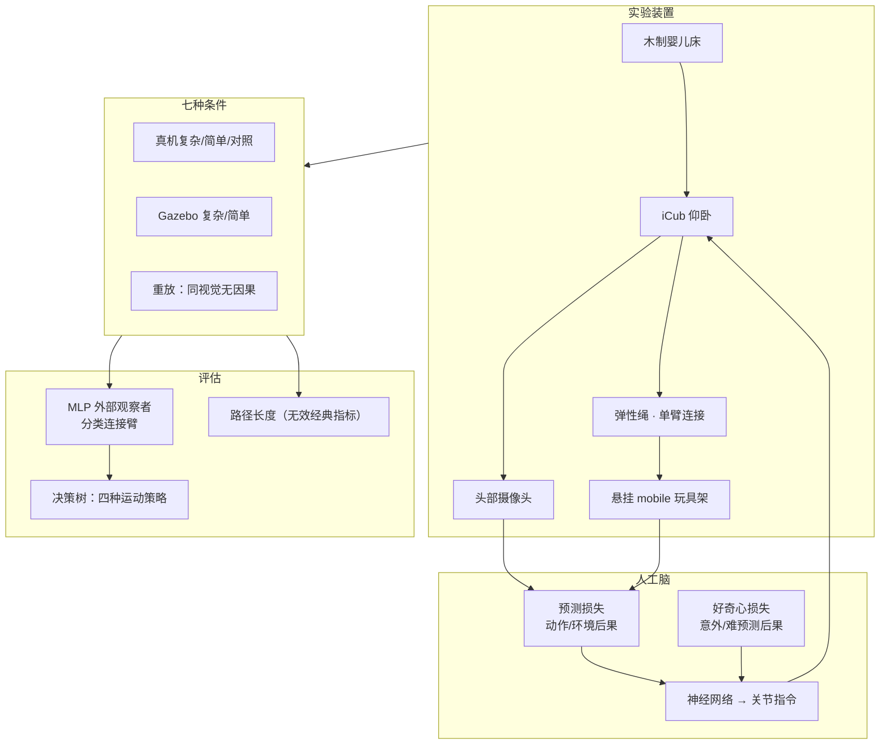
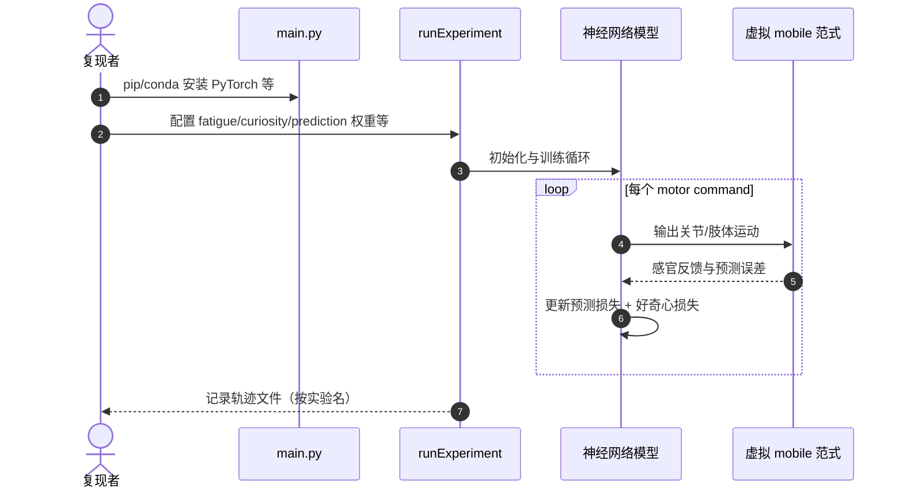

# Robot in a crib：摇篮里的 iCub 与感觉运动偶联学习

**Robot in a crib**（*How a playing robot helps us understand sensorimotor contingency learning*，Josua Spisak / Sergiu Tcaci Popescu / Lukas Rustler / Stefan Wermter / J. Kevin O'Regan / Matej Hoffmann，**Science Robotics 2026**，[DOI:10.1126/scirobotics.aed4106](https://doi.org/10.1126/scirobotics.aed4106)）把发展心理学经典 **mobile paradigm** 搬到 **iCub 真机 + Gazebo 仿真**：机器人不被告知哪只手臂连玩具，仅靠 **预测损失** 与 **好奇心损失** 发现动作–感官因果，并揭示偶联学习是 **多策略行为光谱**，而非单一的「连接肢运动量增加」。

## 一句话定义

**用预测与好奇心联合驱动的神经网络控制躺在摇篮里的 iCub，在七种真机/仿真条件下证明感觉运动偶联可经外部 MLP 观察者检测，但表现为一组探索–利用权衡下的多种运动策略，而非经典「动得更多」单指标。**

## 英文缩写速查

| 缩写 | 英文全称 | 简要说明 |
|------|----------|----------|
| SMC | Sensorimotor Contingency | 感觉运动偶联：动作与感官后果的可学习关联 |
| mobile paradigm | Rovee-Collier mobile paradigm | 婴儿床悬挂玩具连肢体的发展心理学经典范式 |
| MLP | Multilayer Perceptron | 外部观察者：对双臂轨迹分类「哪只手臂被连接」 |
| iCub | — | IIT 儿童尺寸人形研究平台（53 电机，头载相机等） |
| Gazebo | — | 仿真环境；重建复杂/简单/重放条件 |
| CTU FEE | Czech Technical University, Faculty of Electrical Engineering | 布拉格团队牵头真机实验与仿真 |

## 核心信息

| 字段 | 内容 |
|------|------|
| **机构** | 捷克理工大学电气工程学院（CTU FEE）；汉堡大学（University of Hamburg）；巴黎西岱大学（Université Paris Cité）/ CNRS；等 |
| **DOI / 刊** | [10.1126/scirobotics.aed4106](https://doi.org/10.1126/scirobotics.aed4106) / *Science Robotics*（2026-08-26，Vol. 11 Iss. 117） |
| **平台** | iCub + 木制婴儿床 + 弹性绳连单臂 + 悬挂 mobile；头部摄像头 |
| **全文** | **无公开 arXiv**；姊妹仿真论文 [arXiv:2504.17939](https://arxiv.org/abs/2504.17939)（IEEE TCDS 2026） |
| **开源（截至 2026-09-01）** | **部分**：仿真模型 [`mobile-paradigm-model`](https://github.com/ctu-vras/mobile-paradigm-model) **已开源**；真机七条件管线 **未列 GitHub** |

## 为什么重要

- **挑战发展心理学默认指标：** 长期用「连接肢运动量↑」衡量偶联学习；本文在七种条件下 **路径长度无差异**，却仍能 **MLP 检测偶联**——说明应看 **如何动** 而非 **动多少**。
- **发展机器人可解释性：** 同一「人工脑」可消融预测/探索/运动噪声，并把内部损失与外部策略一一对应——比纯婴儿实验更易做机制归因。
- **真机具身超越仿真：** 电机、绳弹性、视觉遮挡与身体姿态进入闭环；复杂真机条件（非确定 mobile）反而比「简单」条件更易被检测（甜蜜点假说）。
- **桥接婴儿年龄差异：** 2 月龄全身探索 vs 4 月龄选择性动连接肢，可用 **高运动预测损失→探索策略 / 低损失→精准利用** 统一解释。
- **与 iCub 认知研究线衔接：** 同团队从 [pyCub 教学仿真](./paper-notebook-learning-with-pycub-a-simulation-and-exercise-fr.md) 到真机 skin/self-touch，本文聚焦 **最早期的动作–世界因果**。

## 方法栈（核心结构）

| 模块 | 角色 |
|------|------|
| **Mobile 装置** | 单臂弹性绳连悬挂玩具架；头相机感知玩具运动 |
| **人工脑** | 神经网络输出关节指令；**预测损失**（自运动/环境）+ **好奇心损失**（意外后果） |
| **七种条件** | 真机复杂/简单/对照 + 仿真复杂/简单 + 重放复杂/简单（断开因果、保留视觉） |
| **外部观察者** | MLP 对双臂轨迹序列分类连接臂；准确率 >50% 为偶联检测证据 |
| **行为分析** | 路径长度、决策树策略聚类、内部损失–策略关联树 |
| **消融（新闻/姊妹篇）** | 关闭预测、探索或运动噪声会破坏经典婴儿样行为（仿真线） |

### 流程总览

## 评测与主要结果

| 指标 | 发现 |
|------|------|
| **MLP 连接臂分类** | 真机复杂 **65±4%**、仿真复杂 **67±3%** 显著；简单真机 **53±4%** 不显著；对照/重放 ~50% |
| **路径长度** | 所有条件连接/非连接臂 **无实质差异** → 「动得更多」指标 **失效** |
| **策略光谱** | 复杂条件四种策略覆盖 **~87%** 样本：精准小动利用 vs 大范围探索等 |
| **内部机制** | 低预测/好奇心损失 → **有效运动**；高运动预测损失 → **探索运动** |
| **难度甜蜜点** | 复杂条件最易检测；过简（仿真直接映射）或过难（真机泡沫管占满视场）均削弱可检测性 |

## 结论

**本文表明感觉运动偶联学习是探索–利用动态权衡下的一组策略，而非「连接肢运动量单调增加」的单一路径；对婴儿范式解读与自主发现式机器人设计都应采用多指标、多策略框架。**

- **读婴儿实验：** 不要只用连接肢运动量；应结合空间分布、动作幅度与个体策略聚类（MLP/决策树可作为定量工具）。
- **读机器人：** 指定「最大化运动量」不足以教会偶联；应设计 **预测 + 好奇心（或内在动机）** 让系统自己发现「在哪动、怎么动有效」。
- **读指标：** 外部观察者（MLP）可在无先验行为假设下检测偶联；比单一运动统计更稳健。
- **读难度：** 环境可预测性存在 **甜蜜点**——过易抑制探索线索，过难淹没偶联信号。
- **读复现：** 仿真机制可先跑 [`mobile-paradigm-model`](https://github.com/ctu-vras/mobile-paradigm-model)；真机四策略与 MLP 数字需 **Science Robotics 正文**（无 arXiv）。
- **读发展：** 2 vs 4 月龄婴儿差异可理解为运动控制成熟度驱动的 **探索→利用** 转变，不必诉诸额外模块。
- **局限：** 单机器人平台、特定 mobile 几何；MLP 观察者本身需训练数据；因果 claim 依赖条件设计（重放对照是关键）。

## 源码运行时序图

官方公开代码仅覆盖 **仿真计算模型**（姊妹篇 arXiv:2504.17939），入口 [`ctu-vras/mobile-paradigm-model`](https://github.com/ctu-vras/mobile-paradigm-model)。**真机 iCub 七条件闭环未开源**。

真机 Science Robotics 实验的 YARP/iCub 驱动与 MLP 观察者 **不适用** 上述仓库；装置参考 [CTU 媒体包](https://drive.google.com/drive/folders/1ZbdNLyJZWgOXK1fqgMFGd1VkknGU69H5?usp=sharing)。

## 工程实践

| 步骤 | 建议 |
|------|------|
| **1. 读机制** | 先读 CTU 新闻 + 本文；需要公式/ablation 细节时读 [arXiv:2504.17939](https://arxiv.org/abs/2504.17939) |
| **2. 跑仿真** | `git clone https://github.com/ctu-vras/mobile-paradigm-model`；Python 3.9 + PyTorch；`python main.py` |
| **3. 调损失权重** | 对照 `runExperiment` 中 fatigue/curiosity/prediction 比例，观察连接肢偏好与 extinction burst（仿真） |
| **4. 真机预期** | 需 iCub + 婴儿床装置 + 头载视觉；**无官方开源栈**（截至 2026-09-01） |
| **5. 评估设计** | 若复现论文指标：实现 MLP 轨迹观察者 + 重放对照条件，避免只统计路径长度 |

## 局限与风险

- **全文获取：** Science Robotics 付费墙；**无 arXiv 预印本**——二手解读（新闻/科普）不可替代正文细节。
- **开源边界：** 仿真模型开源 ≠ 真机实验可复现；Gazebo 场景与 MLP 训练未发布。
- **外推：** 婴儿认知不能等同于显式损失函数；机器人结论为 **计算机制假说** 而非神经科学定论。
- **平台依赖：** 结果绑定 iCub 运动学、绳弹性与相机视场；换平台策略光谱可能不同。

## 与其他工作对比

| 维度 | 本文（真机 iCub 七条件） | 经典婴儿 mobile paradigm 研究 | 姊妹仿真篇（[arXiv:2504.17939](https://arxiv.org/abs/2504.17939)，TCDS） | 好奇心驱动 [RL](../methods/reinforcement-learning.md) |
|------|------------------------|---------------------------|--------------------------------------------------|--------------------------------|
| 被试/本体 | iCub 真机 + 弹性绳 + 视觉遮挡 | 人类婴儿 | 纯计算模型 | 任意仿真智能体 |
| 偶联判据 | **MLP 外部观察者**（复杂条件 65±4%） | 连接肢运动量 | 同框架，可做完整消融 | 任务回报 |
| 「动得更多」是否成立 | **不成立**（路径长度各条件无实质差异） | 长期作为默认指标 | — | — |
| 可做的机制归因 | 内部损失 ↔ 四种策略关联 | 只能观察行为 | **消融预测/探索/噪声** | 奖励项消融 |
| 具身因素 | 电机、绳弹性、视场进入闭环 | 天然具身 | **被抽象掉** | 通常无 |
| 可复现性 | 真机栈未开源 | N/A | **代码已开源** | 依实现 |

- **三者是同一主张的三个证据层**：仿真篇给机制消融，本文给真机具身证据，婴儿研究给被解释的现象；本文的增量恰恰是**仿真里不存在的那部分**（绳弹性、视场遮挡带来的难度甜蜜点）。
- **与内在动机 RL 的差别在目的**：好奇心在 RL 里是提升样本效率的手段，在本文里是**被检验的发展假说**——因此评价标准不是回报曲线，而是能否复现婴儿的年龄差异与策略光谱。
- **不可横比的部分**：65±4% 的 MLP 准确率绑定本文的装置几何与轨迹表示，换平台或换观察者结构即失去参照意义（见「局限与风险」）。

## 关联页面

- [ergoCub / iCub 系硬件–控制共设计](./paper-ergocub-shared-embodied-intelligence.md)
- [Learning with pyCub（iCub Python 仿真教学）](./paper-notebook-learning-with-pycub-a-simulation-and-exercise-fr.md)
- [强化学习](../methods/reinforcement-learning.md)（探索–利用与内在动机对照）
- [Generalized Value Functions](../concepts/generalized-value-functions.md)（无监督 sensorimotor 预测学习脉络）

## 参考来源

- [Robot in a crib（Science Robotics 2026）](../../sources/papers/robot_in_crib_sensorimotor_contingency_scirobotics_2026.md)
- [CTU FEE 新闻与媒体包](../../sources/sites/ctu-fee-robot-in-crib-scirobotics-2026.md)
- [mobile-paradigm-model 仿真代码](../../sources/repos/ctu-vras-mobile-paradigm-model.md)

## 推荐继续阅读

- [Science Robotics 正式论文](https://doi.org/10.1126/scirobotics.aed4106)
- [A computational model of infant sensorimotor exploration in the mobile paradigm（arXiv:2504.17939）](https://arxiv.org/abs/2504.17939)
- [CTU FEE 新闻稿（英文）](https://fel.cvut.cz/en/what-s-on/news/84994-how-does-a-child-learn-that-it-can-change-the-world-around-it-a-humanoid-robot-offers-new-answers)
