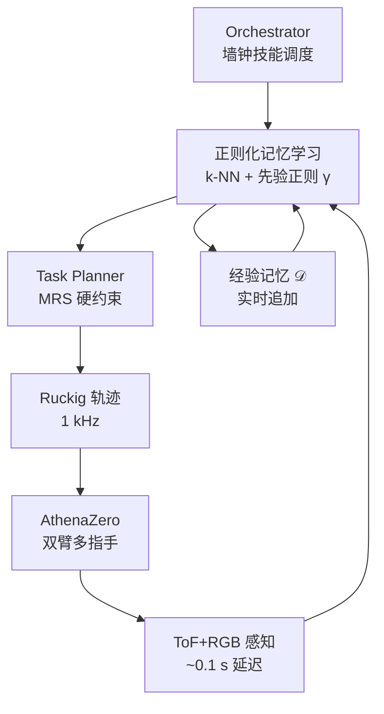

# Robot Juggling：分钟级真机动态操作学习

**Robot Juggling**（*Rapid On-Robot Learning for Dynamic Manipulation Skills: Robot Juggling*，[arXiv:2608.26800](https://arxiv.org/abs/2608.26800)）由 **RAI Institute / CMU**（Lee / Wang / Atkeson / Rizzi / Rojas）提出：在 **AthenaZero** 双臂多指手上，用 **正则化记忆学习** 把不完美先验与真机经验融合，并用 **互达集（MRS）** 约束任务级规划，使机器人在 **不到 5 分钟** 真机交互内学会五种经典 **三球抛接** 花样。

> **落地状态：** 截至 2026-09-05 **无官方代码/数据**；方法以 arXiv 与补充视频为准。硬件背景见 [RAI AthenaZero 博客](https://rai-inst.com/resources/blog/bimanual-robot-for-dynamic-manipulation/)。

## 一句话定义

**先验模型连一轮抛接都做不到，但它的一阶信息仍能让机器人在真机几分钟内，通过记忆 + 安全互达集，学会五种三球花样。**

## 英文缩写速查

| 缩写 | 英文全称 | 简要说明 |
|------|----------|----------|
| MRS | Mutually Reachable Set | 离线预计算互达集；保证连续抛/接不进入不可延续关节态 |
| k-NN | k-Nearest Neighbors | 在 \((x,y)\) 空间检索相似抛球经验 |
| RBF | Radial Basis Function | 对邻居赋权的局部核；带宽 \(h_x,h_y\) 固定 |
| ROS2 | Robot Operating System 2 | 全栈异步多节点实现（Humble） |
| ToF | Time of Flight | Helios2 深度相机，与 RGB 同步 30 Hz |
| BC | Behavior Cloning | 非本文路线；对照为无先验的纯记忆学习需随机探索初始化 |

## 为什么重要

- **重定义「先验有没有用」：** 零样本完全失败 ≠ 先验无用；**一阶梯度正则** 让学习从第一次抛球就能开始，不必随机探索垫数据。
- **真机分钟级样本效率：** cascade 平均 **53 s** 物理交互到稳定五周期；比杯式 open-loop RL（500 attempts）与桨板 closed-loop 经典系统少一个数量级尝试。
- **闭环技能可组合：** 抛球技能条件于入态 \(x\)（接球位 + 落点估计），tennis 的经验可迁移到 cascade / half-shower，而不是每条 open-loop 轨迹单独学。
- **安全与性能不互斥：** MRS 让 **89%** 无约束规划解（会撞限位）被排除，同时仍能在高速动态动作边界练习。
- **多指手 + onboard 视觉：** 相对桨/杯专用末端，证明 **接触不可预测** 时仍可用经验覆盖模型误差。

## 核心信息

| 项 | 内容 |
|----|------|
| **机构** | 机器人与人工智能研究所（RAI Institute）；卡内基梅隆大学（CMU） |
| **平台** | AthenaZero：1-DoF 躯干 + 双 7-DoF 臂 + 双 6-DoF 欠驱动三指手；低惯量准直驱 |
| **感知** | Lucid Helios2 ToF + Triton RGB（30 Hz）；球 3D 跟踪延迟 ~0.1 s |
| **控制** | ROS2 Humble；Ruckig 1 kHz 轨迹；逆动力学跟踪 |
| **学习** | 正则化记忆学习；\(\gamma=0.001\)；抛球实时写记忆、接球不学 |
| **评测** | 五种三球花样 + 花样间切换；连续抛次数 / 落点分布 / 安全性消融 |
| **开源** | **确认未开源**（截至 2026-09-05：arXiv 与 RAI 博客均未列代码） |

## 核心原理

### 方法栈

| 模块 | 机制 |
|------|------|
| Orchestrator | 墙钟调度 throw/catch 技能序列；维持抛接相位 |
| 技能参数 | type（throw/catch）、object ID、task identifier、duration |
| 正则化记忆学习 | k-NN 经验 + RBF 权重 → 局部线性模型；Frobenius 正则拉向先验 \(f_0\) |
| 先验 \(f_0\) | 抛球：恒等映射 \(y=u\)（命令落点）；零样本连 1 cycle 都失败 |
| Task planner | 把命令 \(u\) 映射到关节过渡态；**硬约束 MRS** \(\mathbf{M}\mathbf{s}_f\leq\mathbf{m}\) |
| 低层轨迹 | Ruckig 最小时间 jerk 轨迹；1 kHz 参考 |
| 感知 | 异步跟踪各球；throw 完成后才请求对应 ball ID 跟踪 |

状态 \(x=(p_{\mathrm{catch}}^-,p_{\mathrm{land}}^-)\)，命令 \(u=p_{\mathrm{land}}^u\)，观测 \(y=p_{\mathrm{land}}\)。每次抛球后 \((x_i,u_i,y_i)\) 立即入记忆 \(\mathcal{D}\)，影响后续抛球。

### 流程总览

## 源码运行时序图

**不适用**（截至 2026-09-05：arXiv 与 RAI 博客均未列 GitHub / 数据集 / 可运行实现）。

## 工程实践

| 项 | 建议 / 论文设定 |
|----|----------------|
| 正则 \(\gamma\) | 全实验 \(\gamma=0.001\)；过大学习慢，过小方差大 |
| 接球策略 | catch 前 0.1 s 停止视觉重规划；平衡估计精度与到位时间 |
| 侧抛花样 | shower/box 飞行时间 < 感知延迟 → 接球 **开环定点**；靠学习提高抛球精度 |
| 物体 | 130 g 软豆袋；低反弹、高耗能接触，减轻预测难度 |
| 安全 | **必须** 用 MRS 或等价互达约束；单步可行 ≠ 序列可行 |
| 部署读法 | 需要低惯量/柔顺臂 + 快速手指；工业高减速比臂难直接迁移 |
| 复现边界 | **无公开代码**；ROS2 多节点架构与 Ruckig 为自述栈 |

## 实验与评测

- **五种花样：** cascade、tennis、half-shower、shower、box；含花样间切换。
- **cascade：** 平均 **7** 次 reset 到五周期；五次 trial 均在第 8 次前学会并连续成功 3 次；含 reset 总墙钟约 **5 min**。
- **多花样序列：** tennis→half-shower→cascade 平均 **75 s** 物理交互；后两种各需 **2–3** 次额外 run。
- **shower/box：** 约 **30 s / 60 s** 到平台；落点分布收敛但成功率低于 cascade 类（开环接球限制）。
- **MRS 消融：** 7578 次 planner 查询中，无 MRS 时 **89.0%** 解 unsafe；有 MRS **100%** safe。
- **与 Table 1 对照：** 多指手 closed-loop + 实时正则记忆；**7–10** 次物理体验 vs 杯式 open-loop 500 次或桨板无学习。

## 结论

**动态接触丰富任务不必等完美 sim2real 先验；分钟级真机记忆学习 + 安全互达集，能让多指手在 onboard 视觉下学会多种抛接花样。**

1. **先验价值看梯度不看零样本** — \(f_0\) 预测全错仍可正则局部模型，避免无探索初始化。
2. **学习要嵌进闭环技能** — 状态条件化让经验跨花样复用；open-loop 序列难共享。
3. **安全集是高频练习前提** — MRS 排除「这一步可行、下一步撞限位」的 **89%** 坏解。
4. **感知延迟塑造任务难度** — 侧抛短飞行 → 开环接球成为瓶颈，不是学习器 alone 能修完的。
5. **硬件共设计** — 低惯量 AthenaZero 与柔顺球降低接触不确定性，但仍需在线适应日间漂移。
6. **样本效率量级** — 53 s 级物理交互值得与数据采集/预训练路线（如 [SPD](./paper-spd.md) 75 h 仿真）对照选型。
7. **工程边界：** **未开源**；当「真机快速适应 + 安全动态操作」坐标，不当现成抛接栈。

## 与其他工作对比

| 对照 | 差异读法 |
|------|----------|
| [SPD](./paper-spd.md) | 仿真 VR 大规模预训练 + 短真机微调；本文无预训练数据，靠分钟级在线记忆 |
| Ploeger & Peters（杯式） | 同样正则记忆思想；本文 **闭环技能** + 抛接进行中实时学习 |
| Schaal & Atkeson（devil sticking） | 经典记忆学习；本文加 **先验正则 + MRS** 与多指多花样 |
| [SMPC-to-RL](./paper-smpc2rl-loco-manipulation.md) | 同 RAI；仿真专家 + 稀疏 RL 全身推物 vs 原地抛接任务级适应 |
| [TeleDexter](./paper-teledexter.md) | 真机 co-tracking 采数训策略；本文无遥操作数据集，纯自举经验 |
| 桨/杯专用末端 | 接触可预测 → 可无学习；多指手必须学接触与释放 |

## 局限与风险

- **shower/box 成功率平台：** 短飞行 + 感知延迟迫使开环接球，难达 cascade 级确定性。
- **人工 reset：** 掉球需人捡回；物理交互时间不含 reset，墙钟更长。
- **定制硬件：** AthenaZero 低惯量栈实验室复制成本高。
- **单任务族：** 抛接技能分解清晰；装配等长程任务子目标未必好定义。
- **未开源：** 无法验证 ROS2 节点图、MRS 构造与感知管线细节。

## 关联页面

- [Manipulation](../tasks/manipulation.md) — 动态操作任务族
- [Contact-Rich Manipulation](../concepts/contact-rich-manipulation.md) — 间歇接触 + 力/时序敏感
- [Sim2Real](../concepts/sim2real.md) — 先验不完美时的真机适应，而非 zero-shot 部署
- [Model Predictive Control](../methods/model-predictive-control.md) — 任务级规划与安全约束
- [Sumo](../methods/sumo.md) — 同研究所动态全身操作另一路线
- [SMPC-to-RL](./paper-smpc2rl-loco-manipulation.md) — RAI 稀疏奖励 loco-manip
- [SPD](./paper-spd.md) — 仿真预训练灵巧手对照
- [TeleDexter](./paper-teledexter.md) — 多指动态操作另一采数/控制路线

## 参考来源

- [Robot Juggling 论文归档](../../sources/papers/robot_juggling_arxiv_2608_26800.md)
- [RAI AthenaZero 博客归档](../../sources/sites/rai-athenazero-blog.md)
- arXiv：<https://arxiv.org/abs/2608.26800>
- RAI 博客：<https://rai-inst.com/resources/blog/bimanual-robot-for-dynamic-manipulation/>

## 推荐继续阅读

- arXiv HTML：<https://arxiv.org/html/2608.26800v1> — 全文、MRS 构造与补充视频
- Movie 1 / S1–S4（论文链）— 五种花样与实时学习曲线
