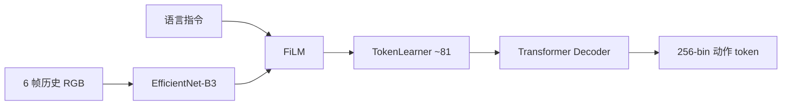
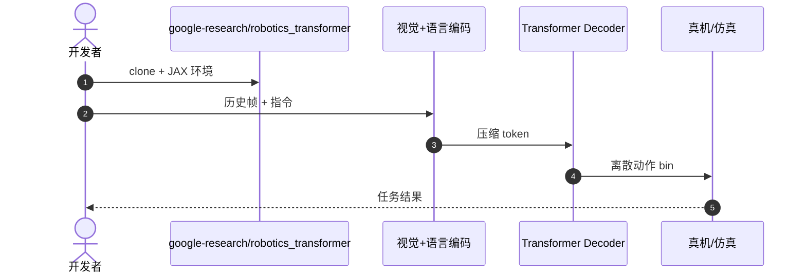

# RT-1：规模化真机控制的 Robotics Transformer

**RT-1**（*RT-1: Robotics Transformer for Real-World Control at Scale*，[arXiv:2212.06817](https://arxiv.org/abs/2212.06817)，[代码](https://github.com/google-research/robotics_transformer)）由 **谷歌 DeepMind** 提出：在约 **130k** 真实演示、**700+** 任务上训练单一 Transformer，把语言指令与历史图像映射为离散动作 token。

## 一句话定义

**先证明 Transformer 能在大规模真机数据上做端到端操作，再谈 VLM 迁移。**

## 英文缩写速查

| 缩写 | 英文全称 | 简要说明 |
|------|----------|----------|
| RT | Robotics Transformer | 本系列操作策略族 |
| FiLM | Feature-wise Linear Modulation | 用语言调制视觉特征 |
| VLA | Vision-Language-Action | 后续由 [RT-2](./paper-rt-2.md) 命名的范式 |
| BC | Behavior Cloning | 本工作的训练范式 |

## 为什么重要

- 纳入 [VLA/WM 阅读路线](../../sources/blogs/wechat_embodied_ai_lab_vla_wm_reading_roadmap_2026-09-02.md) 的奠基篇。
- **历史帧** 对操作至关重要：单帧策略在时序任务上明显不足。
- TokenLearner 把视觉 token 从数千压到约 **81**，使 Transformer 可训练。
- **已开源** JAX 实现，是读 [RT-2](./paper-rt-2.md) / [OpenVLA](./paper-openvla.md) 前的架构对照。

## 核心信息

| 项 | 内容 |
|----|------|
| **机构** | 谷歌 DeepMind（Google DeepMind） |
| **数据** | ~130k 演示，700+ 任务 |
| **视觉** | EfficientNet-B3 + TokenLearner |
| **动作** | 各维 256 离散 bin，自回归 |
| **开源** | **已开源** [google-research/robotics_transformer](https://github.com/google-research/robotics_transformer) |

### 流程总览

## 评测

- 大规模厨房类真机多任务：强调 **数据规模 + 简单架构** 优于小数据复杂模块。
- 消融重点是历史上下文与 token 压缩，而非更重的视觉骨干。
- 具体成功率表以 [原文](https://arxiv.org/abs/2212.06817) 为准。

## 结论

**RT-1 把「规模化真机 BC + Transformer」做成可复现基线，VLA 的动作离散化接口从这里开始。**

- 历史图像是操作策略的一等输入，不是可选增强
- Token 压缩是算力门槛，不是精度装饰
- 离散动作 bin 把连续控制变成语言模型可解的序列问题
- 读后续 VLA 时先对照：有没有历史、如何压视觉 token、动作是否仍是 bin
- 官方仓可跑推理；训练规模仍依赖内部数据管线

## 源码运行时序图

## 局限与风险

- **数据封闭：** 公开仓不等于复现 130k 真机数据规模。
- **离散化：** 精细力控/高频连续动作不是本架构强项，见 [π₀](./paper-pi0.md)。
- **与 RT-2 分界：** 本页无互联网 VLM 知识迁移。

## 与其他工作对比

| 工作 | 相对本页 |
|------|----------|
| [RT-2](./paper-rt-2.md) | 同一动作接口，换成预训练 VLM 骨干 |
| [OpenVLA](./paper-openvla.md) | 开源 7B 复现路线 |
| [Octo](./paper-octo.md) | 更灵活的读出头与多模态输入 |

## 关联页面

- [RT-2](./paper-rt-2.md)
- [RT 系列方法页](../methods/robotics-transformer-rt-series.md)
- [VLA](../methods/vla.md)
- [VLA/WM 14 篇路线](../overview/vla-wm-reading-roadmap-14-papers-technology-map.md)

## 推荐继续阅读

- [arXiv:2212.06817](https://arxiv.org/abs/2212.06817)
- [google-research/robotics_transformer](https://github.com/google-research/robotics_transformer)

## 参考来源

- [rt_1_arxiv_2212_06817](../../sources/papers/rt_1_arxiv_2212_06817.md)
- [具身智能研究室 VLA/WM 阅读路线](../../sources/blogs/wechat_embodied_ai_lab_vla_wm_reading_roadmap_2026-09-02.md)
- [google-research-robotics-transformer](../../sources/repos/google-research-robotics-transformer.md)
