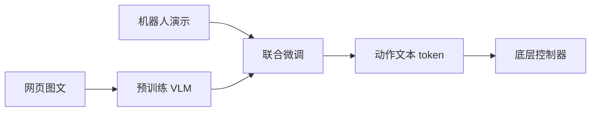

# RT-2：用 VLM 把网页知识迁到机器人控制

**RT-2**（*RT-2: Vision-Language-Action Models Transfer Web Knowledge to Robotic Control*，[arXiv:2307.15818](https://arxiv.org/abs/2307.15818)）由 **谷歌 DeepMind** 提出：把机器人动作写成 **文本 token**，直接微调 PaLI-X / PaLM-E 等预训练 VLM，使互联网视觉–语言知识进入物理控制。这是 **VLA 这一命名** 的来源工作。

## 一句话定义

**VLA = 把连续动作离散成语言模型能说的词，再与网页图文数据一起微调。**

## 英文缩写速查

| 缩写 | 英文全称 | 简要说明 |
|------|----------|----------|
| VLA | Vision-Language-Action | 本工作确立的范式名 |
| VLM | Vision-Language Model | 预训练视觉–语言骨干 |
| Co-training | Joint robot + VQA training | 防止灾难性遗忘的联合训练 |
| BC | Behavior Cloning | 机器人数据侧的监督 |

## 为什么重要

- 纳入 [VLA/WM 阅读路线](../../sources/blogs/wechat_embodied_ai_lab_vla_wm_reading_roadmap_2026-09-02.md) 的命名篇。
- 相对 [RT-1](./paper-rt-1.md)：不只是更大 Transformer，而是 **借用网页语义**（未见物体、符号推理）。
- 动作文本化是后续 [OpenVLA](./paper-openvla.md) 自回归动作 token 的直接祖先。
- **官方训练未开源**：读本页是为范式，不是为复现权重。

## 核心信息

| 项 | 内容 |
|----|------|
| **机构** | 谷歌 DeepMind（Google DeepMind） |
| **骨干** | PaLI-X / PaLM-E 等预训练 VLM |
| **动作** | 文本 token（离散数字串） |
| **训练** | 机器人数据 + 视觉–语言数据 co-training |
| **开源** | **官方完整训练未开源**；推理仅有社区实现 |

### 流程总览

## 评测

- 泛化到训练未见物体、可用推理链（易碎 → 减小夹持力）。
- 相对纯 BC / RT-1，语义泛化是主卖点。
- 量化表以 [原文](https://arxiv.org/abs/2307.15818) 为准。

## 结论

**RT-2 把「VLM 会说话」变成「VLM 会发动作」；工程上真正可跑的开源对照是 OpenVLA，不是本页。**

- 动作离散化是把控制问题改写成 next-token 的桥梁
- co-training 是保留语义、避免只记机器人数据的关键
- 推理链展示的是语义迁移，不是新的力控算法
- 闭源训练意味着不能用本页当复现清单
- 读 [OpenVLA](./paper-openvla.md) 时对照：同样是动作 token，但数据与权重公开

## 源码运行时序图

**不适用。** 截至 2026-09-02：官方未发布完整训练/推理仓库；社区 fork 不能当作官方入口。

## 局限与风险

- **不可复现训练：** 无官方 GitHub 训练仓。
- **离散动作：** 精细连续控制仍受 bin 分辨率限制。
- **闭源规模：** 论文数字不可直接外推到开源 7B 模型。

## 与其他工作对比

| 工作 | 相对本页 |
|------|----------|
| [RT-1](./paper-rt-1.md) | 无网页 VLM，纯机器人 Transformer |
| [OpenVLA](./paper-openvla.md) | 开源近似实现（7B vs 论文中更大闭源模型） |
| [π₀](./paper-pi0.md) | 连续流匹配动作头，不再走动作文本 |

## 关联页面

- [RT-1](./paper-rt-1.md)
- [OpenVLA](./paper-openvla.md)
- [VLA](../methods/vla.md)
- [RT 系列方法页](../methods/robotics-transformer-rt-series.md)
- [VLA/WM 14 篇路线](../overview/vla-wm-reading-roadmap-14-papers-technology-map.md)

## 推荐继续阅读

- [arXiv:2307.15818](https://arxiv.org/abs/2307.15818)

## 参考来源

- [rt_2_arxiv_2307_15818](../../sources/papers/rt_2_arxiv_2307_15818.md)
- [具身智能研究室 VLA/WM 阅读路线](../../sources/blogs/wechat_embodied_ai_lab_vla_wm_reading_roadmap_2026-09-02.md)
