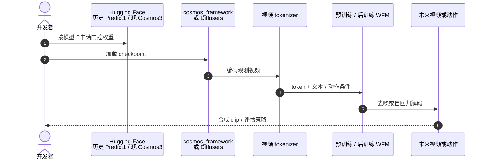

# Cosmos World Foundation Model Platform for Physical AI

**Cosmos World Foundation Model Platform for Physical AI**（[arXiv:2501.03575](https://arxiv.org/abs/2501.03575)，NVIDIA，2025）是 Cosmos **第一代** 平台论文：把世界基础模型（WFM）定义为 Physical AI 的「世界数字孪生」，并给出视频策展、扩散 / 自回归预训练、tokenizer、后训练示例与 guardrail。Awesome World Models 列表坐标仍为 **第 018/571**、分组 **111 General Simulation Platforms**；本页已按一手 PDF 升格，不再停留在清单 Highlights。

## 一句话定义

**先用大规模视频把 WFM 训成世界通才，再在目标机器人 / 驾驶环境上后训练成专才——用数字世界代替真机探索。**

## 英文缩写速查

| 缩写 | 英文全称 | 简要说明 |
|------|----------|----------|
| WFM | World Foundation Model | 可后训练的通用世界模型 \(\mathcal{W}(x_{0:t}, c_t)\to\hat{x}_{t+1}\) |
| VLM | Vision-Language Model | 为 clip 写字幕、并参与过滤 |
| AR | Autoregressive | 离散 token 上按序生成的预训练路线 |
| DM | Diffusion Model | 连续 token 上逐步去噪的预训练路线 |
| MPC | Model Predictive Control | 论文列出的 WFM 用途之一：在想象里滚动作 |
| SDG | Synthetic Data Generation | 条件 WFM 生成深度 / 语义等再用于 Sim2Real |

## 为什么重要

- 把「Physical AI 数据难规模化」写成平台问题，而不是又一篇视频生成论文：探索动作会损坏真机，所以先要世界孪生。
- 给出可复述的预训练–后训练配方，后续 [Predict2.5](./paper-sa-2511-00062-world-simulation-with-video-foundation-models-fo.md) 与 [Cosmos 3](./cosmos-3.md) 都沿这条轴加流量匹配、全模态与 serving。
- 明确 WFM 的五种用法（评估 / 初始化 / 配奖励训练 / 规划 / 合成数据），方便和 [Newton](./newton-physics.md) 的解析仿真对照。

## 核心信息

| 项 | 内容 |
|----|------|
| **机构** | 英伟达（NVIDIA） |
| **Awesome 坐标** | 018/571 · 111 General Simulation Platforms |
| **数据** | ~2000 万小时源视频 → ~1 亿条 2–60 秒 clip；每 256 帧 VLM 字幕 |
| **预训练** | Transformer 扩散 WFM（连续 token）+ Transformer 自回归 WFM（离散 token） |
| **后训练示例** | 相机位姿条件、机器人 video–action、自动驾驶 |
| **开源** | 论文发布时：NVIDIA Open Model License，入口 Cosmos-Predict1。2026-09 主线在 [NVIDIA/cosmos](https://github.com/NVIDIA/cosmos)（Cosmos 3） |

## 核心原理

WFM \(\mathcal{W}\) 根据过去观测 \(x_{0:t}\)（RGB 视频）与当前扰动 \(c_t\)（动作、随机扰动或文本等）预测 \(\hat{x}_{t+1}\)。

预训练用多样视频让模型接触真实世界物理；后训练用目标环境的 prompt–视频对做成 specialist，数据量可以小得多。Tokenizer 被写成类视频编解码器：既要压 token 数，又要保住视觉内容。Guardrail 分 pre-Guard（拦输入）与 post-Guard（拦输出）。

### 流程总览

## 源码运行时序图

第一代入口是 Cosmos-Predict1（NVIDIA Open Model License）。2026-09-05 官方主仓 [NVIDIA/cosmos](https://github.com/NVIDIA/cosmos) 与 [cosmos-framework](https://github.com/NVIDIA/cosmos-framework) 面向 **Cosmos 3**；复现本文化应用 1.0 历史权重，新产品应走 3.0 cookbook。

## 工程实践

| 项 | 要点 |
|----|------|
| 论文主张的用途 | 策略评估、策略初始化、配奖励的策略训练、规划 / MPC、条件合成数据 |
| 今日入口 | 平台总览见 [nvidia-cosmos](./nvidia-cosmos.md)；不要把 Predict1 README 当当前产品 |
| 与解析仿真 | 需要接触与守恒律时用 [Newton](./newton-physics.md)；本平台输出是视频世界 |

## 评测与指标

本平台文以方法与系统叙述为主，定量榜单留给后续代际（Predict2.5 的 PAI-Bench、Cosmos 3 的 Artificial Analysis / RoboArena）。读者应记住的是 **数据与配方**：2000 万小时 → 1 亿 clip、双路线预训练、三类后训练，而不是某一 VBench 分数。

## 与其他工作对比

| 对比轴 | Cosmos 1.0 | [Predict2.5](./paper-sa-2511-00062-world-simulation-with-video-foundation-models-fo.md) | [Cosmos 3](./cosmos-3.md) |
|--------|------------|----------------------------------------------------------------------------------------|---------------------------|
| 生成范式 | 扩散 + 自回归分模型 | 单网 flow matching | MoT：AR Reasoner + 扩散 Generator |
| 模态 | 视频为主，文本条件 | 文本 / 图像 / 视频世界 | 文本 / 图像 / 视频 / 音频 / 动作 |
| 控制翻译 | 后文 Transfer1 | Transfer2.5 ControlNet | Generator transfer cookbook |
| 维护 | 历史入口 | 有限维护，引导迁移 | **当前主线** |

Awesome 策展索引仍指向本文件名；深度内容以本页与一手 PDF 为准。

## 结论

**Cosmos 1.0 真正留下的是「WFM = 可后训练的世界孪生」与五类用法，而不是某一版视频质量分数。**

1. **先问用途再选代际** — 只要视频世界与后训练配方，读本页；要 PAI-Bench / Transfer 控制图，读 2.5；要动作 / 音频 / serving，读 Cosmos 3。
2. **数据管线是平台资产** — 切 clip、字幕、tokenizer、guardrail 比单次 checkpoint 更长久。
3. **后训练数据可以少** — 前提是预训练已经见过足够物理视觉。
4. **开源入口已搬家** — 论文写 Predict1；2026-09 可跑主线是 NVIDIA/cosmos。
5. **不能替代 Newton** — 本 WFM 预测像素未来，不保证接触力或动量守恒。

## 局限与风险

- 论文自己说 WFM 远未解决；1.0 画质与指令对齐被 2.5 / 3.0 明确超越。
- 把 Awesome Highlights 当完整方法证明会漏掉 tokenizer / guardrail / 五类用法。
- 权重许可与仓名随代际变化，复现须核对模型卡。

## 关联页面

- [NVIDIA Cosmos 平台](./nvidia-cosmos.md)
- [Cosmos 3](./cosmos-3.md)
- [Predict2.5 / Transfer2.5](./paper-sa-2511-00062-world-simulation-with-video-foundation-models-fo.md)
- [Newton Physics](./newton-physics.md)
- [Awesome World Models](./awesome-world-models.md)
- [Awesome World Models 技术地图](../overview/sun-awesome-wm-technology-map.md)
- [Generative World Models](../methods/generative-world-models.md)
- [Video-as-Simulation](../concepts/video-as-simulation.md)
- [Sim2Real](../concepts/sim2real.md)
- [Cosmos Transfer](./cosmos-transfer.md) — 1.0 条件翻译后继
- [Transfer1 论文](./paper-cosmos-transfer1.md)

## 参考来源

- [Cosmos 1.0 一手摘录](../../sources/papers/cosmos_wfm_arxiv_2501_03575.md)
- [Awesome 策展摘录](../../sources/papers/sun_awesome_wm_2501_03575_cosmos-world-foundation-model-platform-f.md)
- [NVIDIA Cosmos 产品页](../../sources/sites/nvidia-cosmos.md)
- [NVIDIA/cosmos 仓库](../../sources/repos/nvidia_cosmos.md)

## 推荐继续阅读

- [arXiv:2501.03575](https://arxiv.org/abs/2501.03575)
- [NVIDIA Cosmos 产品页](https://www.nvidia.com/en-us/ai/cosmos/)
- [Awesome World Models 仓库](https://github.com/sun254667/awesome-world-models)
