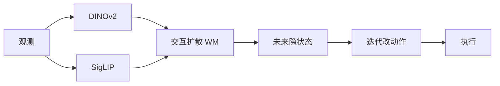
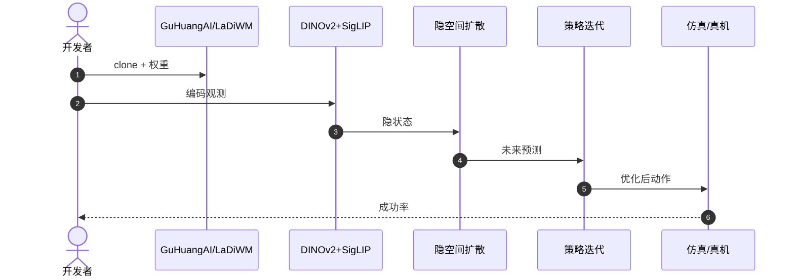

# LaDi-WM：隐空间扩散世界模型做预测式操作

**LaDi-WM**（*A Latent Diffusion-based World Model for Predictive Manipulation*，[arXiv:2505.11528](https://arxiv.org/abs/2505.11528)，[项目页](https://guhuangai.github.io/LaDiWM.github.io/)，[代码](https://github.com/GuHuangAI/LaDiWM)）由 **国防科技大学 / 北京大学 / 深圳大学** 提出（CoRL 2025）：在 **DINOv2 + SigLIP** 隐空间做交互扩散动力学，用世界模型未来预测多次引导策略。Awesome World Models **第 306/571**（812 Manipulation）索引级节点在此升格为阅读主线详情。

## 一句话定义

**在隐空间预测接触后果，再迭代改动作——比像素级未来视频更适合操作闭环。**

## 英文缩写速查

| 缩写 | 英文全称 | 简要说明 |
|------|----------|----------|
| WM | World Model | 环境前向预测 |
| VLA | Vision-Language-Action | 可接本 WM 作预测模块 |
| MBRL | Model-Based RL | 用预测优化策略 |
| SSL | Self-Supervised Learning | 双塔表征来源 |

## 为什么重要

- 纳入 [VLA/WM 阅读路线](../../sources/blogs/wechat_embodied_ai_lab_vla_wm_reading_roadmap_2026-09-02.md) 的「世界模型服务 VLA」第一篇。
- 视觉塔与 [OpenVLA](./paper-openvla.md) 同构，便于当 VLA 的预测插件。
- 文内口径：少量轨迹（约 10 条）可达约 **68.7%** 成功率；跨数据集（LIBERO → CALVIN）零样本迁移显著。
- **已开源** `GuHuangAI/LaDiWM`（2026-09-02 核查）。

## 核心信息

| 项 | 内容 |
|----|------|
| **机构** | 国防科技大学；北京大学；深圳大学 |
| **表征** | DINOv2（几何）+ SigLIP（语义）双塔隐空间 |
| **动力学** | 交互扩散，联合几何–语义 |
| **策略** | WM 预测引导，迭代降动作熵 |
| **开源** | **已开源** [GuHuangAI/LaDiWM](https://github.com/GuHuangAI/LaDiWM) |

### 流程总览

## 评测

- 世界模型跨数据集泛化常优于纯策略模型（文内 LIBERO → CALVIN）。
- 少数据操作成功率约 68.7%（10 条轨迹口径，以原文表为准）。
- Awesome 清单不替代原文数字。

## 结论

**VLA 缺「下一步会怎样」时，优先隐空间 WM，而不是再训一个像素视频模型。**

- 双塔与 OpenVLA 对齐，集成成本低于换骨干
- 交互扩散学的是联合动力学，不是两套独立预测
- 迭代优化降低动作熵，适合接触不确定场景
- 少轨迹价值来自 WM 泛化，不是更大 BC
- 复现走 LaDiWM README，清单 Highlights 只是入口

## 源码运行时序图

## 局限与风险

- **隐空间不可视：** 调试比视频 WM 更依赖下游任务指标。
- **接触物理：** 隐特征不等于可解释力。
- **清单滞后：** 旧 Awesome 条目未写清开源，以本页 2026-09-02 核查为准。

## 与其他工作对比

| 工作 | 相对本页 |
|------|----------|
| [OpenVLA](./paper-openvla.md) | 反应式策略；本页补预测 |
| [DreamDojo](./paper-hrl-stack-35-dreamdojo.md) | 人类视频规模预训练 |
| [RISE](./paper-sa-2602-11075-rise-self-improving-robot-policy-with-compositio.md) | 想象 RL 闭环 |

## 关联页面

- [VLA/WM 14 篇路线](../overview/vla-wm-reading-roadmap-14-papers-technology-map.md)
- [Awesome World Models](../entities/awesome-world-models.md)
- [生成式世界模型](../methods/generative-world-models.md)
- [OpenVLA](./paper-openvla.md)
- [Manipulation](../tasks/manipulation.md)

## 推荐继续阅读

- [项目页](https://guhuangai.github.io/LaDiWM.github.io/)
- [arXiv:2505.11528](https://arxiv.org/abs/2505.11528)

## 参考来源

- [sun_awesome_wm_2505_11528](../../sources/papers/sun_awesome_wm_2505_11528_ladi-wm-a-latent-diffusion-based-world-m.md)
- [具身智能研究室 VLA/WM 阅读路线](../../sources/blogs/wechat_embodied_ai_lab_vla_wm_reading_roadmap_2026-09-02.md)
- [guhuangai-ladiwm](../../sources/repos/guhuangai-ladiwm.md)
- [sun_awesome_wm_catalog](../../sources/papers/sun_awesome_wm_catalog.md)
