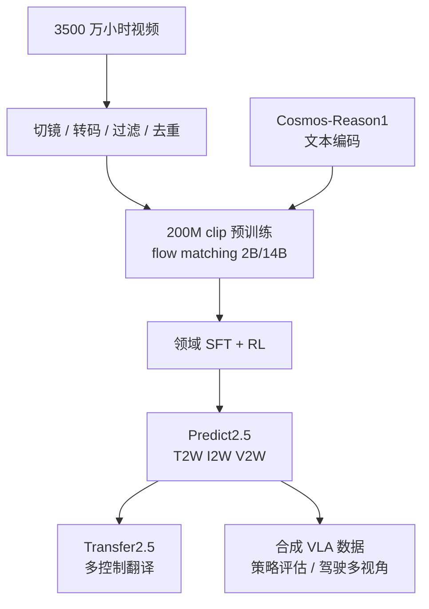
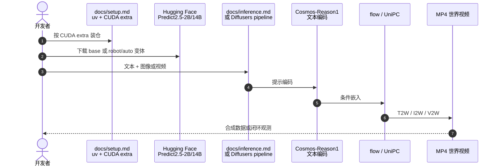

# World Simulation with Video Foundation Models for Physical AI

**World Simulation with Video Foundation Models for Physical AI**（[arXiv:2511.00062](https://arxiv.org/abs/2511.00062)，NVIDIA）发布 **Cosmos-Predict2.5** 与 **Cosmos-Transfer2.5**：用 flow matching 把 Text2World / Image2World / Video2World 收进单网，以 [Cosmos-Reason1](https://github.com/nvidia-cosmos/cosmos-reason1) 替换 T5 文本编码，并给出 ControlNet 式 Sim2Real / Real2Real 翻译。Awesome-Real2Sim2Real 坐标仍为 **第 023/063**、分组 **24 Foundation Model-enhanced Sim2Real**；本页已按一手 PDF 与官方仓升格。

## 一句话定义

**2.5 代视频 WFM：一张 flow 网做三种世界生成，再用更小的 Transfer 把仿真或真机视频译成可控照片级世界。**

## 英文缩写速查

| 缩写 | 英文全称 | 简要说明 |
|------|----------|----------|
| T2W | Text-to-World | 文本条件世界生成 |
| I2W | Image-to-World | 图像条件续写 |
| V2W | Video-to-World | 视频条件未来预测 |
| PAI-Bench | Physical AI Bench | 论文主榜：Domain + Quality 平均 |
| MFU | Model FLOPs Utilization | 4096×H100 上的训练效率 |
| RNDS | Relative Normalized Dover Score | Transfer 长程画质衰减曲线 |
| VLA | Vision-Language-Action | DreamGen 等下游合成数据用法 |
| DMD2 | Distribution Matching Distillation 2 | 仓内蒸馏配方 |

## 为什么重要

- 相对 [Cosmos 1.0](./paper-sa-2501-03575-cosmos-world-foundation-model-platform-for-physi.md)：过滤更狠（存活约 4% vs 30%）、三任务合一、Reason1 文本编码 + RL 后训练。
- 给出可引用的 Physical AI 生成榜：PAI-Bench 上 2B/14B 与更大的 Wan2.2-27B-A14B 同级，I2W 还更高。
- Transfer2.5-2B 比 Transfer1-7B **小 3.5×** 仍提高控制遵循与画质——这是 Sim2Real 合成数据的工程卖点。
- 2026-09 官方 README 已写 **迁移 Cosmos 3**：本页服务复现与旧骨干（如 mimic-video / MotionWAM），新产品不要从本仓起步。

## 核心信息

| 项 | 内容 |
|----|------|
| **机构** | 英伟达（NVIDIA） |
| **Awesome 坐标** | 023/063 · 24 Foundation Model-enhanced Sim2Real |
| **预训练数据** | 3500 万小时原始视频（1.0 为 2000 万）→ 60 亿+ clip → **2 亿** 可训练 clip |
| **规模** | Predict2.5 **2B / 14B**；Transfer2.5-2B |
| **开源** | **已开源**：代码 Apache-2.0，权重 NVIDIA Open Model License；[predict2.5](https://github.com/nvidia-cosmos/cosmos-predict2.5)、[transfer2.5](https://github.com/nvidia-cosmos/cosmos-transfer2.5) |
| **维护** | Predict2.5 仓 **有限维护**，新功能聚焦 [NVIDIA/cosmos](https://github.com/NVIDIA/cosmos) |

公开变体还包括 `auto/multiview`（7 摄驾驶）、`robot/action-cond`、`robot/multiview-agibot`、`robot/policy`（Libero / RoboCasa）以及 14B `robot/gr00tdream-gr1`。

## 核心原理

三点相对 Predict1 的改进：(1) 升级过滤并人工策展 Physical AI 后训练数据；(2) 简化架构，三任务单网；(3) model merging + 新 RL 后训练，文本编码器改为 Reason1（解码器式 Physical AI VLM）。

Transfer2.5 是建立在 Predict2.5 上的 ControlNet 家族：边、模糊、分割、深度、驾驶 world-scenario map、机器人多视角等。论文强调长程翻译与闭环仿真。

### 流程总览

## 源码运行时序图

官方推理入口在 [nvidia-cosmos/cosmos-predict2.5](https://github.com/nvidia-cosmos/cosmos-predict2.5) 的 `docs/inference.md`（及 action-cond / multiview 分册）；Diffusers 路径为 `Cosmos2_5_PredictBasePipeline`。

后训练：`docs/post-training.md` 与 cosmos-cookbook；动作条件见 `docs/inference_robot_action_cond.md`。

## 工程实践

| 项 | 要点 |
|----|------|
| 安装 | 仓内 `docs/setup.md`；Diffusers 另见 `docs/diffusers_inference.md` |
| 选权重 | 通用世界用 2B/14B post-trained；驾驶用 auto/multiview；操纵用 action-cond 或 policy |
| Transfer | 另仓 [cosmos-transfer2.5](./cosmos-transfer.md)；控制规格走 JSON `controlnet_specs`；配方见 [Cookbook](./cosmos-cookbook.md) |
| 训练效率 | 论文：4096×H100、720p/93 帧，2B MFU 36.49%（CP=2），14B 33.08%（CP=8） |
| 新产品 | **改走** [Cosmos 3](./cosmos-3.md) + cosmos-framework |

## 评测与指标

PAI-Bench Predict：Overall = (Domain + Quality) / 2。Domain 覆盖 av / common / human / industry / misc / physics / robotics；Quality 改编自 VBench 的 8 个 T2V/I2V 指标。

| 设定 | 模型 | Domain | Quality | Overall |
|------|------|-------:|--------:|--------:|
| T2W | Predict2.5-2B post-train | 0.804 | 0.732 | **0.768** |
| T2W | Predict2.5-14B post-train | 0.803 | 0.732 | **0.768** |
| T2W | Wan2.2-27B-A14B | 0.810 | 0.728 | 0.769 |
| I2W | Predict2.5-2B/14B post-train | 0.840 / 0.838 | 0.779 / 0.781 | **0.810** |
| I2W | Wan2.2-27B-A14B | 0.841 | 0.772 | 0.806 |

人类偏好（论文图）：2B 相对 Wan2.2-5B 为 30.0% vs 26.2%，与 Wan2.1-14B 接近（33.0% vs 34.8%）；14B post-train vs Wan2.1-14B 为 **48.6% vs 31.8%**，与 Wan2.2-27B-A14B 接近（38.1% vs 35.9%）。

Transfer：PAIBench-Transfer（600 视频）上 Transfer2.5-2B 在控制遵循与画质上超过 Transfer1-7B。驾驶多视角 RDS-HQ-HL：FVD/FID 最高约 **2.3×** 改善。DreamGen / GR1：后训练 14B 在未见物体与环境指令跟随上超过 Hunyuan、CogVideoX、WAN 2.1。

## 与其他工作对比

| 对比轴 | Predict2.5 | [Cosmos 1.0](./paper-sa-2501-03575-cosmos-world-foundation-model-platform-for-physi.md) | [Cosmos 3](./cosmos-3.md) | Wan2.2-27B-A14B |
|--------|------------|----------------------------------------------------------------------------------------|---------------------------|-----------------|
| 任务形态 | 单网 T2W/I2W/V2W | 扩散 / AR 分模型 | 全模态 MoT + 动作 / 音频 | 通用视频生成 |
| PAI-Bench I2W Overall | **0.810** | 未报此榜 | 平台换榜（Artificial Analysis 等） | 0.806 |
| 开源维护 | 有限维护 | 历史 | **当前主线** | 独立生态 |
| 机器人条件 | action-cond / policy 变体 | 后训练示例 | 原生 embodiment 动作维 | 非 Physical AI 专用 |

站内下游：[mimic-video](../methods/mimic-video.md)、MotionWAM、NavWAM、OSCAR 等仍常钉 Predict2 / 2.5 骨干。

## 结论

**2.5 代的硬贡献是「单网 flow WFM + 更小的 Transfer」，PAI-Bench 说明小很多的 2B 已能打到 27B 级开源视频模型；但它不再是官方主线。**

1. **I2W Overall 0.810** 是读这篇时最有用的生成分数；T2W 与 Wan2.2-27B 持平。
2. **人类偏好随参数放大** — 自动 Overall 上 2B≈14B，人评则 14B 明显赢 Wan2.1-14B。
3. **Transfer 卖的是体积与控制** — 3.5× 更小仍更好，适合把 [Newton](./newton-physics.md) / Isaac 视频译成照片级数据。
4. **数据比 1.0 更狠** — 3500 万小时、4% 存活、200M clip；复制管线成本远高于下载权重。
5. **新产品用 Cosmos 3** — 本仓 README 已写停更；只为复现或旧 VAM 骨干保留。

## 局限与风险

- 视频 WFM 仍会幻觉物理；闭环策略评估不能代替真机。
- 权重门控 + Guardrail 依赖；蒸馏配方是演示级，README 写明非生产复现。
- 与 Cosmos 3 的榜单不可直接横比（PAI-Bench vs Artificial Analysis / RoboArena）。

## 关联页面

- [NVIDIA Cosmos 平台](./nvidia-cosmos.md)
- [Cosmos 3](./cosmos-3.md)
- [Cosmos 1.0 WFM 平台](./paper-sa-2501-03575-cosmos-world-foundation-model-platform-for-physi.md)
- [Newton Physics](./newton-physics.md)
- [Awesome-Real2Sim2Real](./awesome-real2sim2real.md)
- [Awesome-Real2Sim2Real 技术地图](../overview/sun-awesome-r2s2r-technology-map.md)
- [Generative World Models](../methods/generative-world-models.md)
- [mimic-video](../methods/mimic-video.md)
- [Sim2Real](../concepts/sim2real.md)
- [Manipulation](../tasks/manipulation.md)
- [Cosmos Transfer](./cosmos-transfer.md) — 1 / 2.5 工程族
- [Transfer1 论文](./paper-cosmos-transfer1.md)
- [Cosmos Cookbook](./cosmos-cookbook.md)

## 参考来源

- [Predict2.5 一手摘录](../../sources/papers/cosmos_predict25_arxiv_2511_00062.md)
- [cosmos-predict2.5 仓库](../../sources/repos/nvidia_cosmos_predict25.md)
- [Awesome-Real2Sim2Real 策展摘录](../../sources/papers/sun_awesome_r2s2r_2511_00062_world-simulation-with-video-foundation-m.md)
- [NVIDIA Cosmos 产品页](../../sources/sites/nvidia-cosmos.md)
- [cosmos-transfer2.5 仓库](../../sources/repos/nvidia_cosmos_transfer25.md)
- [Cookbook 站点](../../sources/sites/cosmos-cookbook.md)

## 推荐继续阅读

- [arXiv:2511.00062](https://arxiv.org/abs/2511.00062)
- [GitHub: cosmos-predict2.5](https://github.com/nvidia-cosmos/cosmos-predict2.5)
- [GitHub: cosmos-transfer2.5](https://github.com/nvidia-cosmos/cosmos-transfer2.5)
- [GitHub: NVIDIA/cosmos](https://github.com/NVIDIA/cosmos) — 继任主线
