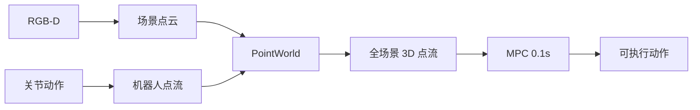
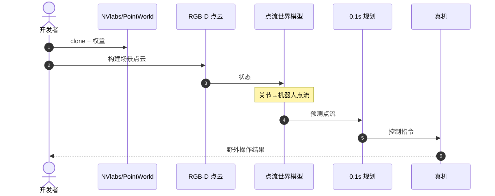

# PointWorld：用 3D 点流做野外操作世界模型

**PointWorld**（*Scaling 3D World Models for In-The-Wild Robotic Manipulation*，[arXiv:2601.03782](https://arxiv.org/abs/2601.03782)，[项目页](https://point-world.github.io/)，[代码](https://github.com/NVlabs/PointWorld)）由 **NVIDIA / Stanford** 提出（CVPR 2026 Highlight）：把关节动作变成机器人点流，与 RGB-D 场景点云统一建模，预测全场景 3D 点流。Awesome **第 324/571**（812 Manipulation）在此升格。

## 一句话定义

**跨本体世界模型用点怎么动，而不是用某台机器人的关节角怎么动。**

## 英文缩写速查

| 缩写 | 英文全称 | 简要说明 |
|------|----------|----------|
| WM | World Model | 3D 前向预测 |
| MPC | Model Predictive Control | 约 0.1 s 规划 |
| RGB-D | Color + Depth | 场景点云来源 |
| VLA | Vision-Language-Action | 可用点流作中间表示 |

## 为什么重要

- 纳入 [VLA/WM 阅读路线](../../sources/blogs/wechat_embodied_ai_lab_vla_wm_reading_roadmap_2026-09-02.md) 的 3D 跨本体篇。
- 减少对特定 action representation 的绑定。
- 文内口径：约 **200 万** 条轨迹规模化；推理约 **0.1 s** 可做 MPC。
- **已开源** `NVlabs/PointWorld`（清单原未标代码，2026-09-02 补查）。

## 核心信息

| 项 | 内容 |
|----|------|
| **机构** | 英伟达；斯坦福大学 |
| **状态** | RGB-D 场景点云 + 机器人点流 |
| **动作** | 关节 → 机器人点流（统一表示） |
| **规划** | MPC，约 0.1 s |
| **开源** | **已开源** [NVlabs/PointWorld](https://github.com/NVlabs/PointWorld) |

### 流程总览

## 评测

- 野外操作与跨本体是主设定，不是桌面仿真单任务。
- 规模数字（约 200 万轨迹）以原文为准。
- 与 RGB 视频 WM 对照：几何一致性更好解释跨本体。

## 结论

**要跨本体预测接触后果，3D 点流比 RGB 视频更接近「同一个物理世界」。**

- 统一状态与动作表示，减少关节空间绑定
- MPC 实时性说明 3D WM 可以进控制环，不只是生成 demo
- 200 万轨迹验证可扩展性，不等于随便换本体零成本
- 未来可作「点流中间层 → 机器人适配器 → 关节」
- 复现走 NVlabs/PointWorld，不要停在 Awesome 无代码标注

## 源码运行时序图

## 局限与风险

- **深度质量：** 野外 RGB-D 噪声直接进点云。
- **适配器仍要：** 点流不是现成关节指令。
- **算力：** 大规模 3D 训练/推理成本高。

## 与其他工作对比

| 工作 | 相对本页 |
|------|----------|
| [DreamDojo](./paper-hrl-stack-35-dreamdojo.md) | 人视频 2D/隐空间，非点流 |
| [LaDi-WM](./paper-sa-2505-11528-ladi-wm-a-latent-diffusion-based-world-model-for.md) | 图像隐空间扩散 |
| [CLAP 跨本体地图](../overview/clap-cross-embodiment-vla-wm-9-papers-technology-map.md) | 视频跨本体对照 |

## 关联页面

- [VLA/WM 14 篇路线](../overview/vla-wm-reading-roadmap-14-papers-technology-map.md)
- [Awesome World Models](../entities/awesome-world-models.md)
- [DreamDojo](./paper-hrl-stack-35-dreamdojo.md)
- [生成式世界模型](../methods/generative-world-models.md)
- [Manipulation](../tasks/manipulation.md)

## 推荐继续阅读

- [项目页](https://point-world.github.io/)
- [arXiv:2601.03782](https://arxiv.org/abs/2601.03782)

## 参考来源

- [sun_awesome_wm_2601_03782](../../sources/papers/sun_awesome_wm_2601_03782_pointworld.md)
- [具身智能研究室 VLA/WM 阅读路线](../../sources/blogs/wechat_embodied_ai_lab_vla_wm_reading_roadmap_2026-09-02.md)
- [nvlabs-pointworld](../../sources/repos/nvlabs-pointworld.md)
- [sun_awesome_wm_catalog](../../sources/papers/sun_awesome_wm_catalog.md)
