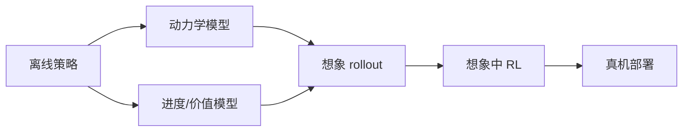
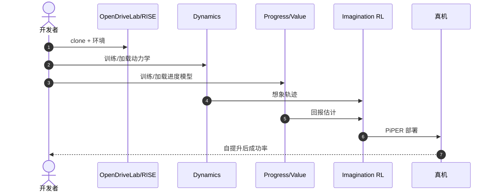

# RISE：组合式世界模型里的自提升策略

**RISE**（*Self-Improving Robot Policy with Compositional World Model*，[arXiv:2602.11075](https://arxiv.org/abs/2602.11075)，[项目页](https://opendrivelab.com/RISE/)，[代码](https://github.com/OpenDriveLab/RISE)）由 **OpenDriveLab** 提出（RSS 2026）：把真实世界 RL 换成在 **组合式世界模型** 中的想象强化学习，再经 PiPER 一类路径落到真机。Awesome **第 224/571**（63 World Models for VLA Training & Evaluation）在此升格。

> **同名警告：** 不是酷哇 / 上交 / 河海的驾驶论文 [RISE：自适应想象调度](./paper-rise-adaptive-imagination-wam.md)（arXiv:2608.20430，`COOWAI/RISE`）。本页是操作域想象 RL。

## 一句话定义

**动力学与价值拆开建 WM，在想象里做 RL，少烧真机小时。**

## 英文缩写速查

| 缩写 | 英文全称 | 简要说明 |
|------|----------|----------|
| WM | World Model | 可滚动的环境模型 |
| MBRL | Model-Based RL | 在想象中更新策略 |
| VLA | Vision-Language-Action | 可被本闭环后训练的策略族 |
| PiPER | 部署管线名（文内） | 想象训练 → 真机 |

## 为什么重要

- 纳入 [VLA/WM 阅读路线](../../sources/blogs/wechat_embodied_ai_lab_vla_wm_reading_roadmap_2026-09-02.md) 的 WM+RL 工程篇。
- 提供 **offline policy → online RL → real robot** 可复现代码链。
- 组合式拆分比端到端「又预测又打分」更稳。
- **已开源** `OpenDriveLab/RISE`。清单旧项目页 `kai0-rl` **不是** 本仓库入口。

## 核心信息

| 项 | 内容 |
|----|------|
| **机构** | OpenDriveLab |
| **模块** | Dynamics + Progress/Value + Imagination RL |
| **部署** | 想象训练后上真机 |
| **开源** | **已开源** [OpenDriveLab/RISE](https://github.com/OpenDriveLab/RISE) |
| **项目页** | [opendrivelab.com/RISE](https://opendrivelab.com/RISE/) |

### 流程总览

## 评测

- 强调硬件交互成本下降：rollout 主要在 WM 内。
- 具体成功率以 [原文](https://arxiv.org/abs/2602.11075) 为准。
- Awesome Highlights 未搬运数值。

## 结论

**要「策略自己变强」，先有可滚动的动力学和单独的进度估计，再在想象里 RL。**

- 组合式比一个大网同时预测与打分更稳
- 想象 RL 替代的是真机交互次数，不是仿真标定
- 完整代码链比单篇方法图更有工程价值
- 可接「重定向数据 → WM → 自提升」路线
- 复现以 RISE 仓 README 为准，勿打开旧 kai0-rl 链接当官方页

## 源码运行时序图

## 局限与风险

- **模型偏差：** 想象乐观会在真机上崩。
- **项目页曾被清单误标** 为 kai0-rl。
- **不是 VLA 本体：** 是 WM+RL 后训练框架。

## 与其他工作对比

| 工作 | 相对本页 |
|------|----------|
| [LaDi-WM](./paper-sa-2505-11528-ladi-wm-a-latent-diffusion-based-world-model-for.md) | 预测引导，非完整想象 RL 圈 |
| [DreamDojo](./paper-hrl-stack-35-dreamdojo.md) | 人视频预训练 WM |
| [Model-based RL](../methods/model-based-rl.md) | 方法总览 |

## 关联页面

- [VLA/WM 14 篇路线](../overview/vla-wm-reading-roadmap-14-papers-technology-map.md)
- [Awesome World Models](../entities/awesome-world-models.md)
- [Model-based RL](../methods/model-based-rl.md)
- [Manipulation](../tasks/manipulation.md)
- [酷哇 RISE（驾驶 WAM 自适应想象）](./paper-rise-adaptive-imagination-wam.md) — **同名不同文**（arXiv:2608.20430）

## 推荐继续阅读

- [项目页](https://opendrivelab.com/RISE/)
- [arXiv:2602.11075](https://arxiv.org/abs/2602.11075)

## 参考来源

- [sun_awesome_wm_2602_11075](../../sources/papers/sun_awesome_wm_2602_11075_rise-self-improving-robot-policy-with-co.md)
- [具身智能研究室 VLA/WM 阅读路线](../../sources/blogs/wechat_embodied_ai_lab_vla_wm_reading_roadmap_2026-09-02.md)
- [opendrivelab-rise](../../sources/repos/opendrivelab-rise.md)
- [sun_awesome_wm_catalog](../../sources/papers/sun_awesome_wm_catalog.md)
