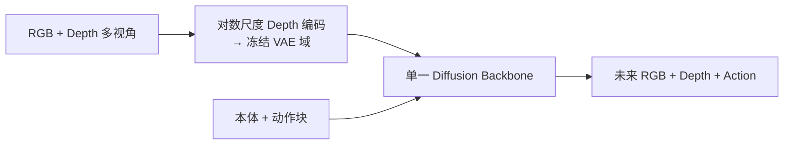

# SA-WAM：几何感知的 World Action Model

**SA-WAM**（*Spatially Aware World Action Model via Geometric Latent Diffusion*，[arXiv:2609.02531](https://arxiv.org/abs/2609.02531)，[项目页](https://jlopetegui98.github.io/projects/sa_wam.html)）由 **Inria / ENS / CNRS / PSL** 提出：将预训练视频扩散模型改造为在 **单一 diffusion backbone** 中联合预测 **action、RGB 与 depth**，用 **对数尺度 depth 编码** 把无界深度映射到冻结 **VAE tokenizer** 的有界输入域，从而 **无需 3D-specific fine-tuning** 即可引入几何信息。

## 一句话定义

**WAM 要成为机器人底座，必须把 3D 几何放进预测闭环，而不是只盯 RGB 未来帧。**

## 英文缩写速查

| 缩写 | 英文全称 | 简要说明 |
|------|----------|----------|
| WAM | World Action Model | 联合预测未来观测与动作的世界动作模型 |
| SA-WAM | Spatially Aware WAM | 本文方法 |
| VAE | Variational Autoencoder | 冻结视频 tokenizer 编码器 |
| LIBERO | LIBERO Benchmark | 操作仿真基准套件 |

## 为什么重要

- 纳入 [八篇盘点](../../sources/blogs/wechat_embodied_station_8_papers_open_source_2026-09-03.md) 的「3D-aware 世界动作模型」支线。
- **50 demo/task** 即在 RoboCasa 达 **76.6%** 平均成功率，训练数据远少于多数基线。
- UR5 真机 **随机环境** 完成度 **77.5%** vs Cosmos-Policy **48.8%**。
- 分析世界模型预测质量与 rollout 成功率相关性，为 WAM 改进提供诊断轴。

## 核心信息

| 项 | 内容 |
|----|------|
| **机构** | Inria、École normale supérieure、CNRS、PSL Research University |
| **输入** | 多视角 RGB + 对齐 depth + 本体 + 语言 |
| **开源** | **待发布**（项目页无 GitHub，截至 2026-09-03） |

### 流程总览

## 评测

| 基准 | SA-WAM | 强基线（文内） |
|------|--------|----------------|
| RoboCasa Avg.（50 demo/task） | **76.6%** | Cosmos-Policy 67.1%；GR00T-N1.5 64.1% |
| LIBERO-Plus Avg.（零样本） | **86.6%** | π₀.₅ 84.6%；Cosmos-Policy 81.4% |
| UR5 Clean / Randomized | **90.0% / 77.5%** | Cosmos-Policy 75.0% / 48.8% |

Depth 归一化消融：对数尺度比线性高 **5.2** 点策略成功率。

## 结论

**在冻结视频先验上注入 depth latent，可同时拉升仿真 SOTA 与真机抗干扰能力。**

1. **对数 depth 编码是关键** — 近场精度与远场动态范围兼顾。
2. **单骨干三模态** — action/RGB/depth 共享扩散，避免多模型割裂。
3. **数据效率** — 50 demo/task 即超多数千 demo 基线。
4. **随机环境增益大** — depth 提供 RGB 难提供的空间消歧。
5. **代码待发布** — 复现入口待项目页更新。

## 源码运行时序图

**不适用** — 截至 **2026-09-03** 无可运行官方代码。

## 局限与风险

- **仓库未公开** — 训练与推理栈不可复现。
- **深度质量依赖** — 真机 RGB-D 噪声与标定误差会传导到 latent。
- **与通用 VLA 关系** — 本文聚焦 WAM 范式，不等同于端到端 VLA 替代。

## 与其他工作对比

| 对照 | 差异读法 |
|------|----------|
| RGB-only WAM / Cosmos-Policy | 缺 3D 几何；SA-WAM 显式 depth 通道 |
| 纯深度策略微调 | SA-WAM 复用冻结 VAE，保留互联网视频先验 |
| [World Action Models](../concepts/world-action-models.md) | 本文是 WAM 家族中 **几何感知** 代表 |

## 关联页面

- [World Action Models](../concepts/world-action-models.md)
- [生成式世界模型](../methods/generative-world-models.md)
- [Manipulation](../tasks/manipulation.md)
- [GIFT](./paper-gift-intermediate-feature-training.md) — 中间特征结构监督，可接 WAM-Fast/IDM

## 参考来源

- [sa_wam_arxiv_2609_02531](../../sources/papers/sa_wam_arxiv_2609_02531.md)
- [sa-wam 项目页](../../sources/sites/sa-wam.md)
- [具身智能小站 2026-09-03 八篇盘点](../../sources/blogs/wechat_embodied_station_8_papers_open_source_2026-09-03.md)

## 推荐继续阅读

- [arXiv:2609.02531](https://arxiv.org/abs/2609.02531)
- [SA-WAM 项目页](https://jlopetegui98.github.io/projects/sa_wam.html)
