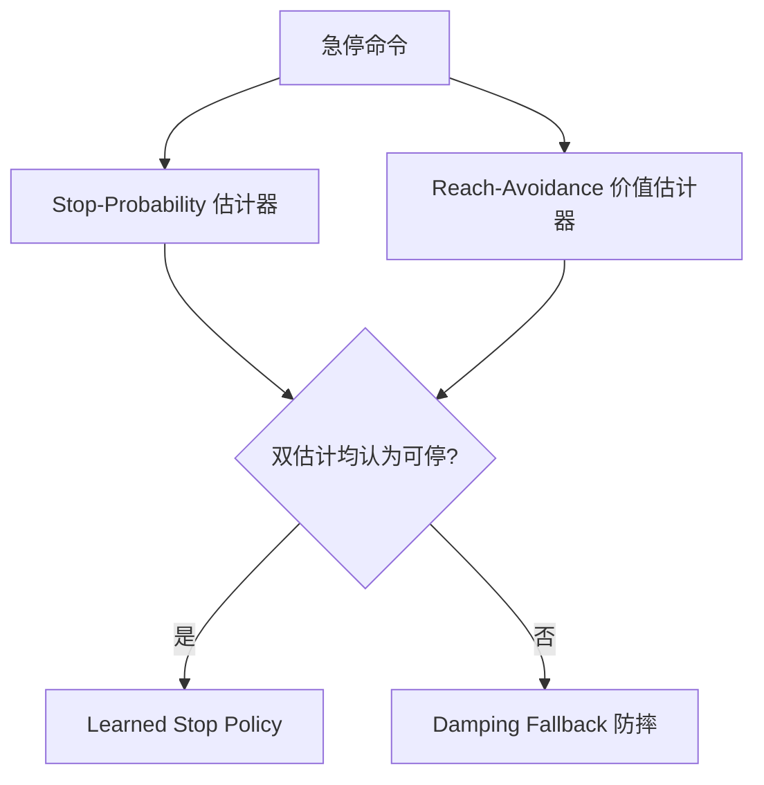

# Safe-Stop：人形机器人可学习安全停止

**Safe-Stop**（*Humanoid Safe Stop via Learned Stoppability Value*，[arXiv:2609.02358](https://arxiv.org/abs/2609.02358)，[项目页](https://junfeng-long.github.io/safestop/)）由 **加州大学伯克利（UC Berkeley）**、**卡内基梅隆大学（CMU）**、**斯坦福大学（Stanford）** 等提出：将 **紧急停止** 建模为 **reach-avoid** 问题，用 **learned stop policy** 配合两个互补 **stoppability estimators**——仅当两者均认为停止可行时才提交停止，否则切换到 **damping fallback** 防摔策略。

## 一句话定义

**急停不是固定反射动作，而是「当前状态是否还能安全停下」的可恢复性判断。**

## 英文缩写速查

| 缩写 | 英文全称 | 简要说明 |
|------|----------|----------|
| HJ | Hamilton-Jacobi |  reach-avoid 价值备份方程 |
| OOD | Out-of-Distribution | 分布外运动状态 |
| WBC | Whole-Body Control | 全身控制 |
| G1 | Unitree G1 | 论文真机验证平台 |

## 为什么重要

- 纳入 [八篇盘点](../../sources/blogs/wechat_embodied_station_8_papers_open_source_2026-09-03.md) 的「人形安全停止」支线；与 [WM-LOCO](./paper-wm-loco.md) / [FOCUS](./paper-focus-foot-observation-confidence.md) 并列阅读时见 [三篇坐标](../overview/g1-foothold-safe-stop-focus-technology-map.md)（**本页保持唯一 arXiv:2609.02358 详情节点**）。
- 传统急停执行 **固定动作**，不判断从当前姿态是否真能安全停下。
- **任务无关**：stop policy 与估计器不依赖急停前行为策略，可跨上游任务迁移。
- Unitree G1：**96.4%** OOD 停止成功，**3.89%** unsafe-approval。

## 核心信息

| 项 | 内容 |
|----|------|
| **机构** | UC Berkeley、CMU、Stanford 等 |
| **平台** | Unitree G1（仿真+真机） |
| **开源** | **待发布**（项目页无 GitHub，2026-09-04 再核仍无） |

### 流程总览

## 评测

- **难度评分**：reach-avoidance 峰值价值与运动片段可恢复性一致排序（仿真与真机 30 次重复）。
- **OOD 迁移**：stop policy 可迁移到未见运动状态；高速段性能下降揭示物理边界而非二元安全。
- **双条件窗口**：过滤「初看可停、随即失控」的假阳性批准。

## 结论

**人形急停应先问可停止性，再选停止或防摔策略。**

1. **双估计器互补** — 经验停止行为 vs 物理可恢复信号。
2. **短窗口一致性** — 降低不稳定假阳性批准。
3. **跨任务迁移** — 与上游行为策略解耦。
4. **G1 真机验证** — 96.4% OOD 停止成功率有工程意义。
5. **代码待发布** — 训练与部署栈未公开。

## 源码运行时序图

**不适用** — 截至 **2026-09-04** 无可运行官方代码。

## 局限与风险

- **高速边界** — 极高激活速度下停止可行性自然下降。
- **平台特定** — 主要证据来自 G1；其他人形需重训/校准。
- **与任务规划分离** — 只管急停，不解决日常运动质量。

## 与其他工作对比

| 对照 | 差异读法 |
|------|----------|
| 固定急停反射 | 不判断状态可恢复性 |
| 纯 RL 摔倒恢复 | Safe-Stop 聚焦 **停止决策门控** |
| [Whole-Body Control](../concepts/whole-body-control.md) | WBC 管常态跟踪；Safe-Stop 管异常停止 |

## 关联页面

- [Humanoid Locomotion](../tasks/humanoid-locomotion.md)
- [Whole-Body Control](../concepts/whole-body-control.md)
- [开源系统可靠性 8 篇地图](../overview/open-source-system-reliability-8-papers-technology-map.md)
- [WM-LOCO](./paper-wm-loco.md) — 同平台 G1 视觉落脚；不管急停
- [FOCUS](./paper-focus-foot-observation-confidence.md) — 本体里程计可靠度；平台为 A3 Ultra
- [Fail-Passive Gap](./paper-fail-passive-gap.md) — 认证层急停与「站住保持平衡」缺口
- [三篇阅读坐标](../overview/g1-foothold-safe-stop-focus-technology-map.md)

## 参考来源

- [safe_stop_humanoid_arxiv_2609_02358](../../sources/papers/safe_stop_humanoid_arxiv_2609_02358.md)
- [safestop 项目页](../../sources/sites/safestop.md)
- [具身智能小站 2026-09-03 八篇盘点](../../sources/blogs/wechat_embodied_station_8_papers_open_source_2026-09-03.md)

## 推荐继续阅读

- [arXiv:2609.02358](https://arxiv.org/abs/2609.02358)
- [Safe-Stop 项目页](https://junfeng-long.github.io/safestop/)
