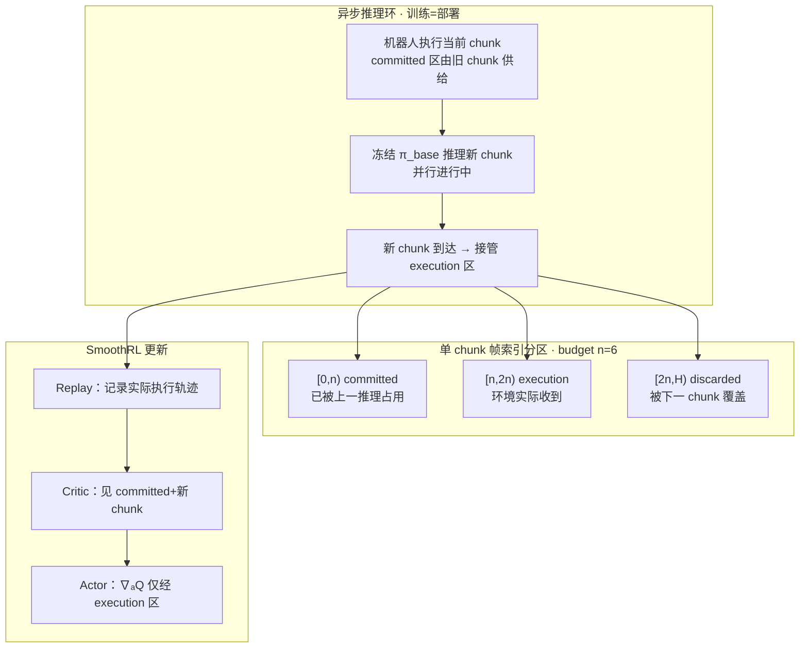

# SmoothRL：异步执行下的 VLA 在线强化学习

**SmoothRL**（*Online Reinforcement Learning During Asynchronous Execution*，[arXiv:2608.29768](https://arxiv.org/abs/2608.29768)，[项目页](https://www.astribot.com/research/SmoothRL) 于 **2026-09-04 再核已上线**）由 **星尘智能（Astribot）** 提出：在 **冻结 π₀.₅ VLA** 之上，于 **与部署相同的异步 action-chunk 推理环** 内做 **value-gradient 在线 RL**——把每个 chunk 按帧划为 **committed / execution / discarded**，**仅对实际执行的 execution region 回传 \(\nabla_a Q\)**，使优化动力学与真机轨迹一致，并在 **Astribot S1** 上把三类高精度/高动态任务成功率从 **8–39% 拉到 83–94%**（约 250 rollout episodes）。

## 一句话定义

**在线 RL 不能假装推理是瞬时的——在异步 chunk 部署里，只有机器人真正执行的那几帧才配吃价值梯度，训练环还必须用同一套重叠推理时间表采数据。**

## 英文缩写速查

| 缩写 | 英文全称 | 简要说明 |
|------|----------|----------|
| VLA | Vision-Language-Action | 冻结 base：π₀.₅，三相机 + 本体 |
| RL | Reinforcement Learning | 在线 off-policy actor–critic |
| Q | Action-Value Function | Critic；chunk-skip TD backup |
| RTC | Real-Time Chunking | base policy 用 TT-RTC 保 latency budget |
| TD | Temporal Difference | Critic 拟合 chunk 级 Bellman 目标 |
| BC | Behavior Cloning | 执行区对人类干预 chunk 的回归损失 |
| REDQ | Randomized Ensembled Double Q-learning | 本文 critic 集成，随机子集取 min |
| WAM | World-Action Model | 与 VLA 并列的通才策略族（论文背景） |

## 为什么重要

- **部署现实：** 大 VLA 推理 100–300 ms+；**异步 chunk** 已成默认，但 **同步假设的在线 RL** 会优化「从未执行」的动作，梯度污染。
- **与 ARLI 正交：** [ARLI](./paper-arli.md) 用中间动作/观测恢复马尔可夫性并 **DSRL 舵噪声**；SmoothRL 走 **raw action 上的 \(\nabla_a Q\)**，可直接微调残差头或端到端策略。
- **与 GR-RL 对比：** 潜空间噪声 RL 受冻结解码器表达力上限；SmoothRL 在 **原始动作空间** 优化，人类干预可作 BC 目标 + TD 转移。
- **样本效率：** 每任务约 **250** 真机 rollout episodes（加 50 ep 冻结 base 预热 buffer）即显著超越 SFT 基线。
- **产业坐标：** 深蓝「六条路线」把 RL 读成 **VLA 的最后一毫米后训练**（文举 RL Token）；SmoothRL 是同一位置上 **同时满足 online + async + value-gradient** 的真机实例，见 [六条路线的窟窿](../queries/embodied-six-routes-holes.md)。

## 核心信息

| 项 | 内容 |
|----|------|
| **机构** | 星尘智能（Astribot Team） |
| **作者** | Guang Gao\*、Yuxuan Nong\*、Baifu Huang；Project Lead：Jianan Wang |
| **平台** | Astribot S1（25 DoF 移动双臂）；π₀.₅ 微调 base |
| **时序** | 控制 30 Hz；推理 5 Hz；**n=6** 帧 latency budget；chunk **H=32** |
| **可训部分** | 冻结 base + 3×512 MLP actor/critic 修正 **20 维臂动作** |
| **开源** | **确认未开源**（项目页 2026-09-04 已上线，仅视频/曲线；无仓库，截至 **2026-09-04**） |

## 流程总览

## 核心原理

### 1. 三区划分与梯度截断

- **Committed \([0,d)\)：** 本 chunk 推理期间，环境仍执行 **上一 chunk** 的动作；当前 chunk 这些帧 **永不生效**。
- **Execution \([d,d+c)\)：** 本 chunk 作为最新输出被 **原样执行** 的窗口；**唯一应对环境负责的区域**。
- **Discarded：** 下一 chunk 提前到达后被替换的尾部。
- **Latency budget：** 估计推理上界 \(n\)，固定调度使 \(d=c=n\)；execution 恒为 **[n,2n)**，消除随机边界。

### 2. Critic 仍见 committed 的原因

- Chunk-skip TD 要条件于 **产生区间奖励的动作序列** 才无偏。
- 在飞 chunk 是 **并发决策** 的状态一部分，需写进 \(Q\) 的输入。

### 3. 冻结 base + 残差 actor

- Base 输出参考 chunk \(\bar{a}\) 与 RL token \(z=E(\pi_{base})\)（骨架沿用 RLT，arXiv:2604.23073）。
- Actor 在 **raw 动作空间** 输出修正；**人类残差干预** 与策略输出同空间，可直接入 buffer + BC。
- Actor 损失（式 5）：\(-Q\) + BC MSE + **速度 / 加速度 / jerk** 平滑惩罚（可执行集 \(\mathcal{E}\) 的松弛）。

### 4. 训练日程

- 先 **50 ep** 仅滚 frozen base 填 buffer；再接入 actor/critic。
- 稀疏终端奖励（操作员判定）；**G=5** critic 更新/ep，**D=5** actor 延迟；correction bound **0.05**；batch 256；REDQ 风格 critic 集成。

### 项目页三大机制（与 §3 对齐）

| 页内名称 | 论文对应 |
|----------|----------|
| 执行区梯度更新 | \(\nabla_a Q\) 只穿 \([n,2n)\) |
| 完整时序价值建模 | critic 吃 committed + execution |
| 轨迹连续性约束 | 平滑项 + 以 committed 为衔接条件 |

## 源码运行时序图

**不适用** — 截至 2026-09-04 **无公开仓库**（项目页已上线，仅演示视频与曲线）。若开源，预期路径：π₀.₅ + TT-RTC 异步部署环 → 50 ep base rollout 预热 → 在线采集（含残差干预）→ 仅 execution 区 actor/critic 更新 → S1 三任务评测 checkpoint。

## 工程实践

| 项 | 建议 |
|----|------|
| Budget \(n\) | 由 **推理频率 × 控制频率** 定（本文 5 Hz/30 Hz → n=6） |
| 微调幅度 | correction bound 0.05：base 已接近成功，只需小修 |
| 网络 | 3×512 MLP + LayerNorm；更新被 rollout 吞吐卡住，小头才跟得上真机 |
| 干预 | 动态任务优先 **残差干预** 而非 VR 全接管（远距投掷 80% vs 30%） |
| 演示量 | SFT：开箱/笔帽各 1500 demo，投掷 500（投掷遥操作本身 ~50% 成功率） |
| 学习曲线 | 开箱可能在 150 ep **暂时低于** base（20%），探索后 250 ep 达 90% |
| 对照 | 与 [ARLI](./paper-arli.md) 比：本文要 **value-gradient 穿执行动作**；ARLI 改状态+噪声舵 |
| 复现 | 等待 Astribot 发布异步训练环与 π₀.₅ 接口 |

## 实验与评测

**平台：** S1，三相机 224²；31-dim chunk（臂/躯干笛卡尔 delta + 夹爪/头）；RL 改 20 维臂。

**三任务：**

| 任务 | 难点 | 配置数 |
|------|------|--------|
| Dynamic tossing | 连续挥摆 + 释放速度；chunk 边界停顿致命 | 3×6=18 |
| Pen capping | 双臂相对位姿 **~5 mm** 公差 | 4×3=12 |
| Box opening | **~1 mm** 刀宽对 2–3 mm 胶带缝 | 10 |

**成功率（Table 1；项目页曲线同一组数）：**

| Task | Base (0 ep) | 150 | 200 | 250 |
|------|------------|-----|-----|-----|
| Tossing | 39% | 72% | 83% | **94%** |
| Pen cap | 8% | 67% | 75% | **83%** |
| Box open | 30% | 20% | 40% | **90%** |

**运动质量：** 投掷 rollout 末端 RMS 加速度 **−52%**、jerk **−47%**（相对表述见论文 Fig.1）。

**Base 失败模式：** 系统性位姿/速度偏差（非随机）；RL 把失败从「大错」收成「毫米级近失」。

## 项目页演示视频

**CDN：** `https://astribot-website-shenzhen.oss-cn-shenzhen.aliyuncs.com/media/smoothrl/`

页内「微调前后」：左=冻结基策略失败，右=SmoothRL 成功；每任务 3 段，同环境条件。全量 URL 见 [站点归档](../../sources/sites/astribot-smoothrl.md)。

| 类别 | 文件 |
|------|------|
| Hero | `hero.mp4`（约 12 MB） |
| 动态抛投 | `dynamic-tossing/01.mp4`–`03.mp4` |
| 笔帽合盖 | `pen-capping/01.mp4`–`03.mp4` |
| 纸箱拆封 | `box-opening/01.mp4`–`03.mp4` |

## 结论

**异步 VLA 部署与在线 value-gradient RL 可以同时成立，关键是让目标函数只看见机器人真正执行过的 chunk 片段，并在训练里复现同一异步时间表。**

1. **问题定义** — 同步 RL 与异步部署是 **不同 MDP**；不能靠部署时 stitch  alone 解决。
2. **梯度截断** — execution region 是 value-gradient 异步 RL 的核心机制，不是实现细节。
3. **Raw action** — 使人类干预、并发状态增广与残差修正 **同一套接口**。
4. **样本量** — ~250 ep 在线交互即可把 SFT 基线推到 **80–94%** 量级（任务依赖）。
5. **动态任务** — 投掷类对 chunk 连续性最敏感，最能体现 SmoothRL + 残差干预价值。
6. **对照** — 相对 [ARLI](./paper-arli.md)（延迟感知 DSRL）与 GR-RL（潜空间），本文是 **少数同时满足 online + async + value-gradient** 的路线。
7. **开源** — 项目页已上线（视频/曲线），仍无训练代码；复现待官方发布。

## 与其他工作对比

| 对照 | 差异读法 |
|------|----------|
| [ARLI](./paper-arli.md) | 中间动作/观测 + **DSRL 噪声舵**；本文 **raw action 上 \(\nabla_a Q\)** |
| GR-RL / 潜空间 RL | 优化冻结解码器内的噪声；改进受 **先验表达力** 上限 |
| RLT / EXPO-FT 等同步在线 RL | 假设推理瞬时；本文 **训练=部署异步环** |
| Offline χ₀ / RECAP | 离线 chunk RL + 异步 **仅推理**；不学执行区梯度 |
| Chunk stitching / blending | 保连续但不改策略参数；本文 **在线微调**（§5 讨论把 blending 写进目标的代价） |
| [Lumo-2](./lumo-2.md) / [Philia](./philia.md) | 同机构通才策略与助手运行时；本文是 **已有 VLA 的异步在线后训练** |

## 局限与风险

- **实例绑定：** 当前结果绑定 π₀.₅ + S1 + 特定 RTC；换 base 或推理栈需重定 \(n\)。
- **稀疏奖励：** 全靠操作员终端标注；扩展任务成本高。
- **Latency budget 保守：** 为确定边界可能 **故意等待** 更快完成的推理，牺牲部分观测新鲜度；超时则交接失稳（§5）。
- **仅臂维微调 + 0.05 邻域：** 躯干/头 frozen；残差表达力受 base 表征与修正半径限制（§5）。
- **未开源：** 异步训练环与干预 UI 不可复现。

## 关联页面

- [ARLI](./paper-arli.md) — 异步 VLA 的另一条 RL 后训练路线
- [VLA](../methods/vla.md) — 通才策略背景
- [Action chunking](../methods/action-chunking.md) — chunk 级 MDP 与部署
- [VLA deployment guide](../queries/vla-deployment-guide.md) — 部署权衡
- [WAM realtime async](./paper-wam-realtime-async.md) — 异步执行相关文献
- [Manipulation](../tasks/manipulation.md) — 真机操作任务语境
- [Lumo-2](./lumo-2.md) — 同机构 latent WAM
- [Philia](./philia.md) — 同机构多机助手运行时
- [六条路线的窟窿](../queries/embodied-six-routes-holes.md) — RL 作为 VLA 后训练的产业坐标

## 参考来源

- [SmoothRL 论文归档](../../sources/papers/smoothrl_arxiv_2608_29768.md)
- [Astribot SmoothRL 站点归档](../../sources/sites/astribot-smoothrl.md)
- [深蓝：六条技术路线的窟窿](../../sources/blogs/wechat_shenlan_embodied_six_routes_holes_2026-09-04.md)

## 推荐继续阅读

- [Astribot SmoothRL 项目页](https://www.astribot.com/en/research/SmoothRL) — hero / 对比视频 / 交互曲线
- [arXiv:2608.29768 HTML](https://arxiv.org/html/2608.29768) — §3 chunk 分区与 Algorithm 1
- [ARLI 项目页](https://async-rl-intermediate-information.github.io/) — 延迟感知 RL 对照
