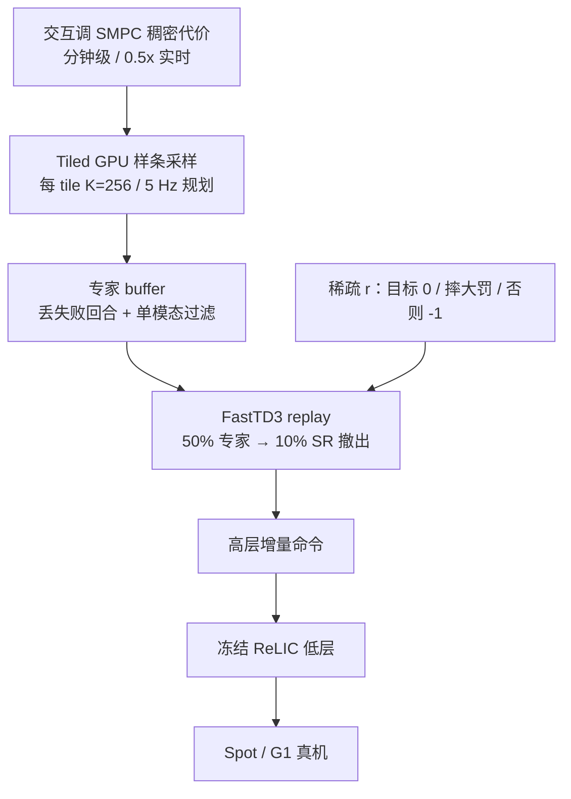

# SMPC-to-RL：稀疏奖励全身 Loco-Manipulation

**SMPC-to-RL**（*Learning Loco-Manipulation From SMPC Demonstrations With Sparse Offline-to-Online RL*，[arXiv:2608.12063](https://arxiv.org/abs/2608.12063)，[项目页](https://pages.rai-inst.com/smpc2rl/)）由 **RAI Institute / 慕尼黑工业大学 / 苏黎世联邦理工**（Schuck / Sorokin / Manni / Ta / Schoellig / Hutter / Le Cleac'h / Brüdigam）提出：把 **采样 MPC 只放在仿真里当专家数据机**，再用 **纯稀疏任务奖励** 做 offline-to-online 离策略 RL。高层策略接冻结的 **ReLIC** 低层全身稳定，在带臂 **Spot** 与 **Unitree G1** 上部署推、扶、滚等接触任务。

## 一句话定义

**别手调稠密奖励：用分钟级可调的仿真 SMPC 解决探索，让 FastTD3 只优化「到没到、摔没摔」。**

## 英文缩写速查

| 缩写 | 英文全称 | 简要说明 |
|------|----------|----------|
| SMPC | Sampling-based Model Predictive Control | 本文的仿真专家：样条采样轨迹 + warm-start，不部署到真机 |
| FastTD3 | Fast Twin Delayed DDPG | 大规模并行 off-policy 配方；本文改 replay 混合与有界 critic |
| ReLIC | RAI low-level whole-body controller | 冻结的低层机动策略，跟踪基座速度与臂关节并保平衡 |
| O2O | Offline-to-Online RL | 先用专家转移垫 critic，成功率过 ~10% 后撤出转纯在线 |
| G1 | Unitree G1 Humanoid | 双足真机平台；本文任务为推箱 |
| Spot | Boston Dynamics Spot | 带臂四足；reach / 推箱 / 扶胎 / 滚胎 |

## 为什么重要

- **奖励 shaping 才是 loco-manip 的墙：** 带臂四足滚重胎必须边踩边推，改一项稠密项就要再训一轮。SMPC 在 RTX 5090 上约 **0.5× 实时**，代价可以交互改。
- **和同实验室 [Sumo](../methods/sumo.md) 方向相反：** Sumo 是部署期 **MPC-over-RL**（在线 CEM）；本文把 SMPC **离线教书**，上真机的是神经网络 + 冻结低层。
- **稀疏目标让策略超过教师：** 没有 shaping 偏置后，任务时间可快 **>50%**，时长方差降 **11–45%**。这是「局部流形上的更优」，不是另起一套接触模式。
- **开源边界：** 截至 **2026-08-17** 项目页仍无 GitHub。[judo](../../sources/repos/judo.md) 是通用采样 MPC 工具箱，不是本管线。

## 核心信息

| 字段 | 内容 |
|------|------|
| 作者 | Martin Schuck, Maks Sorokin, Simone Manni, Duy Ta, Angela P. Schoellig, Marco Hutter, Simon Le Cleac'h, Jan Brüdigam |
| 机构 | RAI Institute；慕尼黑工业大学（TUM）；苏黎世联邦理工（ETH Zürich） |
| 出处 | arXiv:2608.12063（2026-08-12）；Under submission |
| 平台 | 带臂 Spot；Unitree G1 |
| 栈 | MuJoCo Warp + [mjlab](./mjlab.md)；改版 FastTD3；低层 ReLIC |
| 开源（截至 2026-08-17） | **确认未开源**：项目页与 PDF 未列官方仓；judo 仅为对照工具箱 |

## 方法与核心结构

| 模块 | 作用 |
|------|------|
| **高层 \(a_{\mathrm{high}}\)** | 增量 \([\Delta v_{\mathrm{cmd}},\Delta q_{\mathrm{cmd}}^{\mathrm{arm}},\Delta h_{\mathrm{cmd}},\Delta p_{\mathrm{cmd}}]\)；Spot 不命令身高/俯仰 |
| **低层 ReLIC** | 冻结；出 \(q_{\mathrm{target}}=[q_{\mathrm{legs}},q_{\mathrm{arm}}]\)，腿保平衡、臂跟命令 |
| **稀疏 \(r\)** | 到目标 0；摔倒 \(-2/(1-\gamma)\)（\(\gamma=0.99\)）；否则 \(-1\)；实现再乘 0.01 |
| **Replay 混合** | 早期 50% 专家转移；成功率过 \(\eta=0.1\) 后撤出 |
| **有界 critic** | 末层 `tanh` 后仿射到稀疏回报的理论 min/max，抗过估计 |
| **SMPC 采数** | 样条控制点 + tiled GPU；约 1M 样本/小时；最难任务 ~4M / 4 GPU 小时 |

稀疏奖励把「宁可慢慢耗着也不摔」写进尺度：无穷地给 \(-1\) 的折现和是 \(-1/(1-\gamma)\)，摔倒一次罚两倍，避免学成自杀捷径。

### 流程总览

数据采与部署共用同一分层接口，所以专家和 RL 可以换同一套低层。

### SMPC 专家怎么采（附录 C）

不必上 MPPI：随机采样 + 上一次 elite 的 time-shift warm-start 就够。动作用 \(N_c=10\) 个样条控制点插到地平线 \(T=50\)（50 Hz），每次只提交 \(N_e=10\) 步，等价 **5 Hz 规划、50 Hz 动作块**。每 tile 把 checkpoint 状态广播到 \(K=256\) 条并行 rollout，按折扣 SMPC 代价选 elite，再把 committed 步（稀疏奖励标签）写入专家 buffer。失败回合丢弃。这解释了「稠密代价只活在仿真教师里、RL 始终只见稀疏 \(r\)」。

## 源码运行时序图

**不适用**（截至 2026-08-17）：项目页与论文未提供训练/部署仓；[judo](../../sources/repos/judo.md) 不能复现本文 tiled 采数 + FastTD3 + ReLIC 栈。放出后应补：SMPC tile → 专家 buffer → FastTD3 混合 replay → 导出高层策略 → 真机接 ReLIC。

## 工程实践

| 项 | 建议 / 论文设定 |
|----|----------------|
| **何时用** | 新 loco-manip 技能，稠密奖励调不动；平台非人形、遥操作贵 |
| **何时不用** | 已经有高质量单模态演示；或必须在线改任务代价（那是 Sumo） |
| **先做单模态** | 多模态 SMPC（踢/肩推/踩胎）会让 uni-modal 策略学崩，哪怕演示成功率更高 |
| **数据量** | 导航可以很少；滚胎级协调按 **百万到四百万** 转移量级估 |
| **撤出时机** | ~10% 经验成功率后停灌专家；留太久几乎所有任务变差 |
| **专家比例** | 默认 50%；滚胎低于 50% 会塌，更高比例在撤出后仍更稳 |
| **动作** | 用增量而不是绝对目标，才能在动作空间限加速 |
| **训练配方** | buffer \(2^{24}\)、batch 8192、每步 8 次梯度；G1 略加大动作正则与 critic lr |
| **Sim2Real** | 物体质量/尺寸/摩擦 DR；actor 噪声观测、critic 真状态 |
| **真机** | Spot 机外推理 + WiFi；G1 机载；OptiTrack + 本体传感。箱 1.2 kg / 胎 **14.3 kg** |

## 实验与评测

| 设定 | 结果读法 |
|------|----------|
| 五任务仿真 | 近 100% SR，5 seed 方差小；**无专家数据则完全学不会** |
| 相对 SMPC 教师 | 任务时间 consistently 更快；部分 **>50%**；时长 SD **−11–45%** |
| 数据量消融 | 简单任务不敏感；最难任务约 **4M** 才收敛 |
| 质量消融 | 少采样环境多数任务仍稳；滚胎掉点 |
| 多模态 | 多模态演示 SR 更高也会把 uni-modal actor 训崩 |
| 专家比例 / 撤出 | 滚胎对比例敏感；阈值 >10–25% 或永不撤出 → 几乎全任务变慢 |
| 有界 critic | 激进 critic lr 下避免尖峰掉点，把可用超参区间拉宽 |
| 真机 | Spot 四任务 + G1 推箱均可部署；无平台专用奖励 |

## 结论

**这篇把「MPC 好调、RL 跑得快」拆成数据生产与策略优化两段，而不是再做一套在线 MPC-over-RL。**

1. **真影响：探索由 SMPC 包办** — 稀疏 RL 从零在高维连续动作里摸不到目标；50% 专家 replay 是开关，不是锦上添花。
2. **真影响：稀疏目标可超过教师** — 没有 shaping 偏置后，策略在演示流形附近走得更快、更稳。
3. **真影响：单模态过滤 + 按时撤出** — 规划器天生多模态；专家数据过了 ~10% SR 就变成分布外噪声。
4. **次要代价：局部最优** — 别指望学出和 SMPC 完全分叉的接触策略。
5. **部署读法：** 增量动作 + 冻结低层，才能把「稀疏策略偏猛」按回可上真机的加速度盒。
6. **工程读法：无代码** — 今日只能读表、看项目页视频；judo 解决不了复现。

## 与其他工作对比

| 对照 | 差异读法 |
|------|----------|
| [Sumo](../methods/sumo.md) | 同实验室、同 Spot/G1 轮胎叙事；Sumo **在线 CEM**，本文 **离线教书** |
| [MPC-RL](./paper-mpc-rl-humanoid-locomotion-manipulation.md) | 训练期质心 MPC 当地标奖励；本文 SMPC 当 **轨迹数据** 而非奖励 |
| [15 分钟人形行走](./paper-notebook-learning-sim-to-real-humanoid-locomotion-in-15-m.md) | FastTD3/FastSAC 配方来源；本文把它接到稀疏 loco-manip 而不是速度跟踪 |
| [Online vs Offline RL](../comparisons/online-vs-offline-rl.md) | 本文是仿真里的 O2O：专家数据只负责冷启动，性能上限来自在线稀疏目标 |
| [MPC vs RL](../comparisons/mpc-vs-rl.md) | 选型页的混合轴又多一条：**MPC 只负责生成离线专家** |

## 局限与风险

- 低层冻结，不能为任务级扰动力矩自适应。
- 状态基部署；户外/非结构要视觉蒸馏。
- 超参（网络、学习率）仍影响结果；有界 critic 只是把可用超参区间拉宽。
- **无官方实现**，不能把项目页视频或 judo 安装当成可部署包。

## 关联页面

- [Loco-Manipulation](../tasks/loco-manipulation.md) — 任务主线；本文是稀疏 RL × SMPC 数据机
- [Sumo](../methods/sumo.md) — RAI 反向层级对照
- [MPC vs RL](../comparisons/mpc-vs-rl.md) — 混合架构选型
- [Online vs Offline RL](../comparisons/online-vs-offline-rl.md) — O2O 混合轴
- [15 分钟人形行走（FastTD3）](./paper-notebook-learning-sim-to-real-humanoid-locomotion-in-15-m.md) — off-policy 配方
- [MPC-RL](./paper-mpc-rl-humanoid-locomotion-manipulation.md) — 训练期 MPC 指导的另一条轴
- [Unitree G1](./unitree-g1.md) — 双足真机
- [mjlab](./mjlab.md) — 训练与采数共用的 GPU 仿真栈
- [Sim2Real](../concepts/sim2real.md) — DR 与非对称 critic
- [Model Predictive Control](../methods/model-predictive-control.md) — SMPC 作为专家而非部署控制器

## 参考来源

- [smpc2rl_arxiv_2608_12063.md](../../sources/papers/smpc2rl_arxiv_2608_12063.md)
- [项目页归档](../../sources/sites/rai-inst-smpc2rl.md)
- [judo 对照仓](../../sources/repos/judo.md) — **不是**本文官方实现
- [具身智能小站 10 篇盘点（2026-08-19）](../../sources/blogs/wechat_embodied_station_world_model_exec_10_papers_2026-08-19.md)
- Schuck et al. — <https://arxiv.org/abs/2608.12063>
- 项目页 — <https://pages.rai-inst.com/smpc2rl/>

## 推荐继续阅读

- 项目页方法与消融 tab — <https://pages.rai-inst.com/smpc2rl/>
- Sumo（同实验室 MPC-over-RL）— <https://rai-institute.github.io/sumo/>
- judo 采样 MPC 工具箱（**不是**本文官方仓）— <https://github.com/rai-opensource/judo>
- Seo et al., *Learning Sim-to-Real Humanoid Locomotion in 15 Minutes* — <https://arxiv.org/abs/2512.01996>
