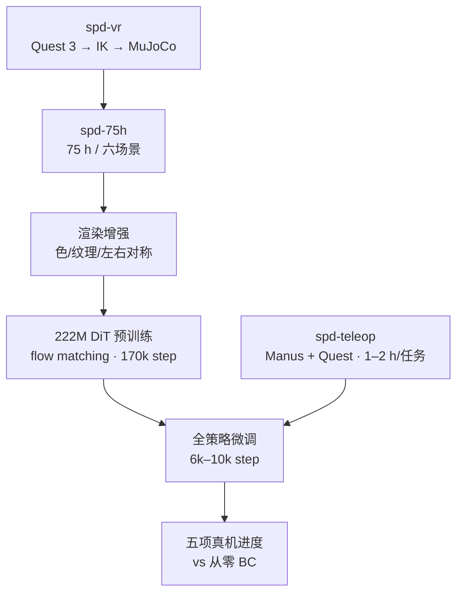

# SPD：在仿真里预训练视觉灵巧操作

**SPD**（*Simulation Pre-training for Dexterity*；论文 *Pre-training Visual Dexterity in Simulation*，[arXiv:2608.15917](https://arxiv.org/abs/2608.15917)，[项目页](https://spd.bot/)，[PDF](https://spd.bot/assets/paper.pdf)；CoRL 2026）由**斯坦福大学 / MIT / Scale AI**提出：把灵巧手预训练数据全部放到仿真 VR 遥操作里采，再用少量真机演示微调。作者要回答的不是「仿真 RL 能否 zero-shot 上真机」，而是 **仿真里的 on-embodiment 演示能不能当灵巧手的可规模化预训练源**。

> **落地状态：** arXiv 已挂 **2608.15917**；论文宣称释放 **spd-75h / spd-vr / 六套场景**，项目页仍 **无 GitHub / Hugging Face**。读法以方法与真机进度表为准，不当可复现训练栈。

## 一句话定义

**戴 VR 头显在仿真里直接操控目标双臂灵巧手，一周攒 75 小时演示做扩散策略预训练；真机每任务再采 1–2 小时，微调后放盘子、挂杯子、玩叠叠乐都比从零行为克隆更强。**

## 英文缩写速查

| 缩写 | 英文全称 | 简要说明 |
|------|----------|----------|
| SPD | Simulation Pre-training for Dexterity | 本文仿真预训练框架总称 |
| BC | Behavior Cloning | 同架构从零真机演示的对照基线 |
| DiT | Diffusion Transformer | 以 Transformer 为骨干的扩散动作头 |
| IK | Inverse Kinematics | 头显/手套关键点到臂与手指关节的映射 |
| DoF | Degrees of Freedom | 本文真机双臂双手合计 56 维动作 |
| KV | Key–Value cache | 滑窗注意力在部署时滚成固定长度缓存 |
| VR | Virtual Reality | 仿真采集用 Quest 3 WebXR 客户端 |

## 为什么重要

- **灵巧手数据瓶颈换坐标：** 夹爪预训练已经把微调变便宜；多指手卡在真机遥操作吞吐、UMI 难覆盖全部手指、人视频 off-embodiment。SPD 证明 **仿真 on-embodiment 演示** 可以当预训练源，而不必先堆真机小时。
- **规模数字可读：** 5 名操作员、约一周、**75 小时 / ~1,930 条**；真机每任务只需 **1–2 小时**。这是「缺数据」问题上少有的可对照吞吐。
- **部署取舍清楚：** 不是 zero-shot sim2real，而是 **仿真预训练 + 真机全策略微调**；视觉外观、接触动力学、任务策略都靠短微调对齐。
- **给 chunk 设计一条真机证据：** 单帧短 chunk 会抖崩；**32 步历史 + 8 步 chunk** 才同时拿到时序一致与接触反应，且从此配置预训练收益最大（+18 进度点）。

## 核心信息

| 项 | 内容 |
|----|------|
| **机构** | 斯坦福大学（Stanford）；麻省理工（MIT）；Scale AI（采集 spd-75h） |
| **会议** | CoRL 2026；[arXiv:2608.15917](https://arxiv.org/abs/2608.15917) |
| **平台** | 两台升级 YAM Pro + 各 22-DoF Sharpa Wave；三台 RealSense D405（顶 + 双腕） |
| **仿真** | MuJoCo 480 Hz；Quest 3 WebXR 仅渲染/报手姿；IK（mink）60 Hz |
| **数据** | spd-75h：六场景、约 1,930 ep / 75 h；真机微调 44–121 min/任务 |
| **栈** | 222M 扩散 Transformer；冻结 DINOv3 ViT-B/16；flow matching；Muon |
| **开源** | **宣称将开源 / 待核实**（截至 2026-09-05 项目页未列代码或数据 URL） |

## 核心原理

### 方法栈

| 阶段 | 组件 | 机制 |
|------|------|------|
| 仿真采集 spd-vr | Quest 3 手跟踪 → IK | 腕姿 + 指尖驱动目标双臂双手；接触物理仿真；臂半透明减遮挡 |
| 数据 spd-75h | 开放结局多任务 | reset 随机化物体、物理与初始位姿；滤掉长时间无接触；Madrona 批量渲染 |
| 增强 | 视觉 + 对称 | 分割掩膜改物体色/桌布；左右臂交换并镜像图像、本体与动作 |
| 预训练 | 因果滑窗 DiT | 历史 256 步；并行去噪全部 chunk；无语言条件 |
| 真机采集 spd-teleop | Manus + Quest 手柄 | 对齐仿真 IK；手套比头显手跟踪更能扛遮挡与远距 |
| 微调 | 全策略 FT | 每任务 6k–10k step，继承预训练超参 |

动作空间是 **56 维关节**（双臂 + 双手）。观测是三相机 RGB + 本体；图像每 8 步进一次，每相机 4 个 pooled token。训练时本体与动作加 \(\sigma=0.03\) 高斯噪声，减轻历史条件化的分布偏移。推理：rolling KV cache 对齐 32 步窗；chunk 边界用 10 步 Euler 积分流 ODE，输出下 8 个动作，闭环 30 Hz。

### 流程总览

## 源码运行时序图

**不适用**（截至 2026-09-05：项目页与 arXiv 均未列 GitHub / 数据集 / 权重；论文宣称释放 spd-vr 与 spd-75h，按「宣称 / 待核实」处理，不可按官方入口复现训练栈）。

## 工程实践

| 项 | 建议 / 论文设定 |
|----|----------------|
| 仿真步进 | 480 Hz `implicitfast`；控制/串流/记录 60 Hz；训练网格 30 Hz |
| 采集交互 | 三键脚踏（checkpoint / pause / revert）；接触中禁止 checkpoint，保证回退到无接触态 |
| 渲染 | 224×168；保留实例分割供物体着色与背景替换 |
| 真机手腕 | Quest 手柄相对增量 + mink 差分 IK（4 次 QP）；>8 cm 跳跃做插值 |
| 真机手指 | Manus 25 点/手 → 掌心仿射标定 → 固定基座手仿真 mocap IK → 22 关节 |
| 臂伺服 | 关节 PD + MuJoCo 重力补偿（手当负载）；CAN 250 Hz |
| 预训练 | batch 64；lr \(10^{-3}\) 恒定；weight decay 0.1；EMA 半衰期 20 step |
| 部署读法 | 需要与仿真对齐的真机遥操作栈；**不是** 零样本视觉策略 |
| 复现边界 | **无公开代码/数据 URL**；硬件是定制 YAM Pro 减速比 + Sharpa Wave |

## 实验与评测

- **协议：** 每 checkpoint 每任务 20 trials，物体初位随机；按阶段量规计分后除以满分得进度（附录 Table 3）。
- **五项任务：** 放盘子（抬起+入架）、挂马克杯（抬起+交接+挂钩）、Jenga（推出+对侧抽出+放顶）、叠杯金字塔、瓶子扔进箱。
- **主结果：** 同架构、同真机数据下，SPD 预训练在五项上都比从零 BC 更常走到后续阶段，平均进度更高；flow-matching 训练损失起点与收敛都更低。
- **选用配置 w=32, c=8 进度 %：** plates 80.6 vs 66.9；mugs 93.3 vs 80.0；jenga 85.0 vs 65.0；cups 55.6 vs 35.0；bottles 68.8 vs 47.5。
- **消融：** 单帧 + 8 步 chunk 多项归零；单帧 + 32 步（π0 风格）明显弱于带历史的短 chunk；带历史时预训练收益 **+18 点**，其余变体 **≤3 点**。

## 结论

**灵巧手缺的不是「再一个真机遥操作系统」，而是可规模化的 on-embodiment 预训练源；仿真 VR 演示能把这项成本从真机小时挪到操作员周，再用 1–2 小时真机微调补外观与接触。**

1. **仿真遥操作是预训练源，不是替代真机微调** — 五项任务仍要任务级真机演示；收益是样本效率，不是 zero-shot。
2. **on-embodiment 比人视频更省重定向** — 采集时已经在目标手与相机布置上，避免接触点与驱动差异。
3. **吞吐数字可对照** — 5 人一周 75 h 仿真 vs 每任务 1–2 h 真机；这是选型时该记住的量级。
4. **历史条件化是短 chunk 的前提** — 没有 32 步窗，8 步 chunk 会抖崩；有历史后短计划反而最强。
5. **预训练收益集中在「历史+短 chunk」** — 其它 (w,c) 组合几乎吃不到仿真先验（≤3 点）。
6. **接触参数必须「像真的」** — 质量/摩擦差太远，操作员会在仿真里学到迁不走的策略。
7. **工程边界：** 定制 56-DoF 栈 + **代码数据待发布**；当方法坐标，不当现成训练配方。

## 与其他工作对比

| 对照 | 差异读法 |
|------|----------|
| [EgoScale](../methods/egoscale.md) | 人视频规模化 + 重定向到 Sharpa 关节；SPD 直接在目标本体上采动作标签，规模小两个数量级但无 embodiment gap |
| [TeleDexter](./paper-teledexter.md) | 真机 co-tracking「小脑」采接触丰富示范；SPD 把大规模阶段放进仿真，真机只做短微调 |
| π0 / [π0.5](./paper-pi05-open-world-vla.md) | 单帧 + 约 1 s chunk + 语言条件；SPD 无语言、靠 8 s 历史，并证明该 π0 风格在灵巧接触上明显弱于历史+短 chunk |
| [Why Action Chunking Improves BC](./paper-why-action-chunking-improves-bc.md) | 同届 CoRL：chunk 收益主因常是延迟条件化；SPD 补一条 **接触丰富真机** 上「历史才能缩短 chunk」的证据 |
| UMI / DexUMI | 无机器人手持接口，难覆盖多指全部 DoF；SPD 用仿真保住 on-embodiment |
| 仿真 RL sim2real（Dexterity / Dextreme 等） | 单技能 RL + 域随机化 zero-shot；SPD 是多任务演示预训练 + 真机 BC 微调 |

## 局限与风险

- **仿真保真是硬门槛：** 接触调不好，演示会编码迁不走的策略；作者把这列为第一局限。
- **评测物体接近仿真：** 五项任务物体「相似但不相同」，不能当成开放世界泛化。
- **无语言、场景覆盖窄：** 不能当通用 VLA；条件全靠近期 sensorimotor 历史。
- **硬件定制：** YAM 减速比改装 + Sharpa Wave 过热对策，实验室复制成本高。
- **开源未落地：** 论文承诺与项目页链接不一致；入库后应复查 spd.bot 是否补了 GitHub / 数据集。

## 关联页面

- [Teleoperation](../tasks/teleoperation.md) — 仿真 VR 采数 vs 真机遥操作系统表
- [灵巧操作数据采集指南](../queries/dexterous-data-collection-guide.md) — 把 SPD 收成「仿真 VR 示教可规模化」通道
- [Diffusion Policy](../methods/diffusion-policy.md) — 扩散动作头；本文是带历史的 DiT + flow matching
- [Action Chunking](../methods/action-chunking.md) — 历史窗与短 chunk 的真机取舍
- [Behavior Cloning](../methods/behavior-cloning.md) / [Imitation Learning](../methods/imitation-learning.md) — 从零 BC 对照
- [EgoScale](../methods/egoscale.md) — 人视频预训练对照
- [Sim2Real](../concepts/sim2real.md) — 预训练迁移，而非零样本策略迁移
- [数据手套 vs 视觉遥操作](../comparisons/data-gloves-vs-vision-teleop.md) — 仿真用头显手跟踪、真机改 Manus
- [TeleDexter](./paper-teledexter.md) — 同系 Sharpa Wave 的真机采数路线
- [Why Action Chunking Improves BC](./paper-why-action-chunking-improves-bc.md) — chunk 机制对照
- [π₀](../methods/π0-policy.md) / [π0.5](./paper-pi05-open-world-vla.md) — 单帧长 chunk VLA 对照

## 参考来源

- [SPD 论文归档](../../sources/papers/spd_corl_2026.md)
- [spd.bot 项目页归档](../../sources/sites/spd-bot.md)
- arXiv：<https://arxiv.org/abs/2608.15917>
- 项目页：<https://spd.bot/>
- PDF：<https://spd.bot/assets/paper.pdf>

## 推荐继续阅读

- arXiv：<https://arxiv.org/abs/2608.15917> — 全文与附录（spd-vr / spd-75h 细节）
- 项目页与 PDF：<https://spd.bot/> — 五项真机 rollout 与 (w,c) 消融图
- ABC 遥操作基础设施（致谢来源）：<https://abc.bot/>
