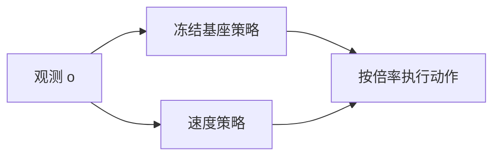
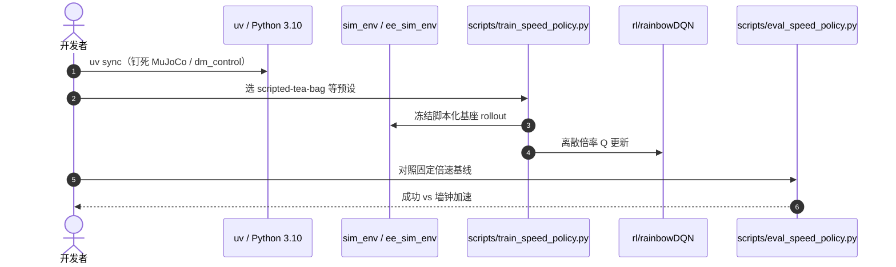

# SpeedTuning：给冻结模仿策略加一层速度倍率

**SpeedTuning**（*Speeding Up Policy Execution with Lightweight Reinforcement Learning*；[arXiv:2608.09138](https://arxiv.org/abs/2608.09138)，[项目页](https://daivdyuan.github.io/speed-tuning/)，[代码](https://github.com/DaivdYuan/SpeedTuning)）由 **斯坦福大学** 提出（ICRA 2025）：模仿策略的执行速度常被示教者和采集硬件钉死，全局固定倍速又会在接触关键帧掉成功率。

## 一句话定义

**基座策略继续出动作，另学一个轻量速度策略只选倍率——安全阶段加速、精细交互减速，不必重采示教。**

## 英文缩写速查

| 缩写 | 英文全称 | 简要说明 |
|------|----------|----------|
| SpeedTuning | Speeding Up Policy Execution with Lightweight RL | 本文框架：速度作为独立控制维 |
| IL | Imitation Learning | 被冻结的基座策略来源 |
| DQN | Deep Q-Network | 仿真复现用 Rainbow DQN 选离散倍率 |
| ACT | Action Chunking with Transformers | 仓内提供真机集成钩子 |
| EEF | End-Effector | 速度倍率作用在执行时间轴上 |

## 为什么重要

- 部署抱怨「策略太慢」时，第一反应常是重训或插值；二者都会动到已经调好的接触时序。
- 把速度从动作里拆出来，才能在倒、抛、取这类「有的阶段必须慢」的任务上做非均匀加速。
- 仿真复现仓把脚本化基座 + 速度 RL 做成可跑环，适合先验证接口再接真机 ACT。

## 核心信息

| 项 | 内容 |
|----|------|
| **机构** | 斯坦福大学（Stanford） |
| **会议** | ICRA 2025 |
| **开源** | **已开源**（MIT 仿真复现；真机数据不随仓） |

## 核心原理

### 方法栈

冻结基座 \(\pi_{\text{base}}(o)\to a\)。速度策略 \(\pi_{\text{speed}}(o)\to s\) 在离散倍率集合上选 \(s\)，把动作块按 \(s\) 压缩或拉伸执行。仿真复现用 Rainbow DQN；奖励同时惩罚超时与物理上不可行的加速度。茶包任务示意：抓取附近约 2×，丢弃过渡段约 4×。

### 流程总览

## 源码运行时序图

官方仿真仓 [DaivdYuan/SpeedTuning](https://github.com/DaivdYuan/SpeedTuning)（归档见 [sources/repos/speedtuning.md](../../sources/repos/speedtuning.md)）：

- **最短复现：** 按 README 装环境 → `python scripts/train_speed_policy.py` → `python scripts/eval_speed_policy.py`。
- **真机：** `act_integration.py` 只是钩子，不替代论文真机数据。

## 工程实践

| 项 | 建议 |
|----|------|
| 先拆接口 | 确认基座动作是 chunk / 轨迹后再乘倍率，不要在关节空间乱插值 |
| 关键帧 | 用任务进度或接触事件当「必须降速」的特征，而不是全局 2× |
| 对照 | 必须报固定插值基线；只报相对原速没有信息量 |
| 加速度 | 仿真里把电机加速度限写进奖励，否则学出不可执行的跳变 |

## 实验与评测

论文在倒、抛、取等动态/精细任务上报告 **超过 2.4×** 速度提升，并相对原策略与固定倍速插值保持足够成功率。项目页茶包曲线显示策略会在抓取标记处主动降速。仿真仓提供 pick-and-place、insertion、tea-bag 三套脚本化任务及随机位姿变体。

## 与其他工作对比

相对「重训更快的 IL 策略」：本文不改基座分布，只改时钟。相对 [Action Chunking](../methods/action-chunking.md)：chunk 解决的是时序相关，SpeedTuning 解决的是 **同一轨迹的播放速率**。相对 [V-Simba](./paper-v-simba.md)：后者改视觉 RL 网络结构抬样本效率，本文改执行层时钟。

## 结论

**模仿策略要加速，优先把速度当成可学习的独立控制维，而不是重采数据或全局插值。**

1. **冻结基座** — 已经调好的接触策略不要为了快而重训。
2. **非均匀倍率** — 关键交互降速、过渡段加速，才是 2.4× 的来源。
3. **必须对照固定插值** — 否则看不出 RL 速度头的增量。
4. **仿真仓可跑** — 先用脚本化任务验证接口，再接 ACT。
5. **真机数据未随仓** — 复现论文数字仍依赖作者硬件设置。

## 局限与风险

- 速度头无法修复基座本身的错误抓取；只会让错误发生得更快。
- 离散倍率网格过粗时，精细插入仍可能被「最近的慢档」绑死。
- 仿真接触与真机摩擦不同，加速度奖励需要按实机重标。

## 关联页面

- [模仿学习](../methods/imitation-learning.md)
- [强化学习](../methods/reinforcement-learning.md)
- [Action Chunking](../methods/action-chunking.md)
- [SHRIMP](./paper-shrimp.md) — 执行前在仿真里改计划，对照执行时改时钟
- [V-Simba](./paper-v-simba.md) — 同批视觉/架构向 RL
- [ParcelStow](./paper-parcelstow.md) — 对照：不学倍率，只评模仿是否保留专家跨速度性能

## 参考来源

- [SpeedTuning 论文摘录](../../sources/papers/speedtuning_arxiv_2608_09138.md)
- [项目页归档](../../sources/sites/speed-tuning-github-io.md)
- [仿真仓归档](../../sources/repos/speedtuning.md)
- [具身智能小站 9 篇盘点（2026-08-17）](../../sources/blogs/wechat_embodied_station_9_papers_2026-08-17.md)
- [arXiv:2608.09138](https://arxiv.org/abs/2608.09138)

## 推荐继续阅读

- [SpeedTuning 项目页](https://daivdyuan.github.io/speed-tuning/)
- [DaivdYuan/SpeedTuning](https://github.com/DaivdYuan/SpeedTuning)
